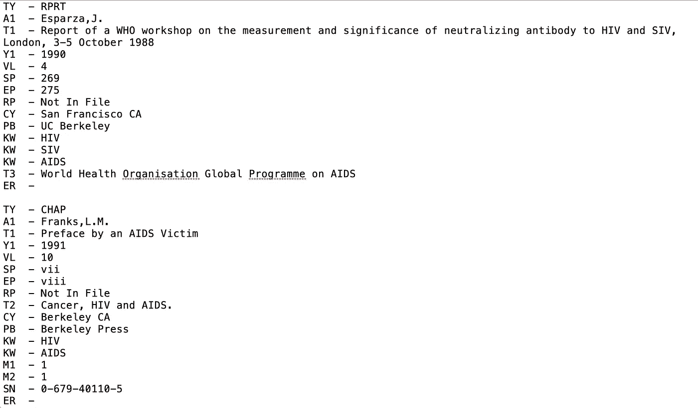
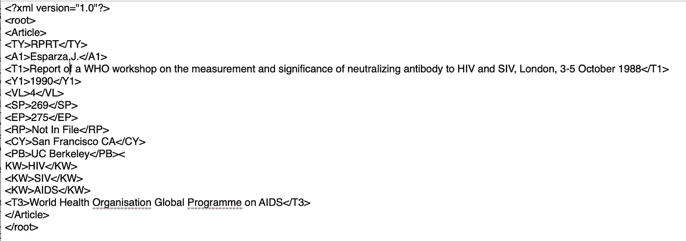

# Base R 脚本练习:将 RIS 文件转换为格式良好的 XML 文档。

> 原文：<https://towardsdatascience.com/base-r-scripting-excercise-converting-a-ris-file-to-a-well-formed-xml-document-ddda70a96b3?source=collection_archive---------24----------------------->

# 介绍

这篇文章的目的是分享我遇到的一个脚本问题。我没有太多应对这类挑战的经验，所以我认为这是一个分享和寻求反馈的好机会。

## **挑战**

编写一个脚本，将任何。RIS 文件转换成格式良好的 XML 文档。

*   包括假设和详细注释。
*   该脚本不得有任何基础语言之外的依赖。
*   该脚本应该能够防止意外误用。
*   每条记录都应该放在一个文章标签中。

虽然我知道其他语言可能更适合这些类型的过程，但我还是选择用 R 编写脚本来探索这个过程。

# 第一部分-理解。RIS 和。XML 格式

## RIS(研究信息系统)

ris 文件格式是一种标记格式，是为标准化书目信息而创建的。例如，生命科学和生物医学信息的免费书目数据库 MEDLINE 使用 ris 格式进行引用。

让我们看看它是什么样子的:



如你所见，基本结构是:每一行包含一个标记和一个用“-”分隔的值。每个 RIS 记录以“TY”标签(引用类型)开始，以 ER 标签(引用结束)结束。[这里有更多关于 ris 格式的信息。](https://en.wikipedia.org/wiki/RIS_(file_format))

**XML(扩展标记语言)**

XML 本质上就像任何其他标记语言(HTML)一样，通过使用 <tags></tags> 来注释文档。然而，XML 是可扩展的，这意味着用户可以创建他/她自己的标签(也就是说，你可以用<blog title="">代替</blog>

# )。这显示了 XML 的主要优势。标签可以更好地描述它们所包含的信息。当试图做除了在 web 浏览器中显示该信息之外的任何事情时，这是有利的。由于其简单性和标准化，XML 在数据交换和存储方面也很流行。这里有更多关于 XML 的内容。

让我们快速看一个例子:



现在让我们来看看格式约束，这样我就可以确保文件的格式正确。这些是主要的限制因素:

*   XML 文档可以以 XML 声明开始(即)
*   任何特殊字符(“<> &”)都不能出现，除非是在执行其角色时。
*   开始标签、结束标签被正确地嵌套
*   标记名区分大小写；开始标记和结束标记必须完全匹配。
*   标记名不能包含任何字符！"#$%&'()*+,/;<=>？@[\]^`{|}~，也不是空格字符，不能以“-”、“”开头或一个数字。
*   单个根元素包含所有其他元素。

更多关于结构良好的 XML 文档[和约束](https://en.wikipedia.org/wiki/XML)的信息。

# 第二部分-剧本

**假设:**
RIS 文件遵循标准 RIS 标签格式，包括:

*   每张 RIS 唱片都以“唱片结束”标签结尾:“呃-”
*   每个 RIS 标签和值由“-”分隔
*   每个 RIS 标签和值都在各自的行上

```
# naming function and function argumentsris2xml <- function(x = "", root = "root_element", save = FALSE, file_name = "new_file"){# read lines
  ris2 <- readLines(x, encoding = "UTF-8")# seperating articles
  df <- data.frame(article = NA, ris = ris2, stringsAsFactors = FALSE)
  end_of_records <- rev(grep(pattern = '^ER  -', ris2))
  article = length(end_of_records)
  for(i in end_of_records){
    df$article[1:i] <- article
    article = article - 1
  }# removing ER lines and empty Lines
  df <- df[-end_of_records,]
  df <- df[grep(pattern = '\\S', df$ris ),]# splitting tags and values
  split <- strsplit(df$ris, split = "  -")
  df$tags <- sapply(split, "[[", 1)
  df$values <- sapply(split, "[[", 2)# trim any extra white space
  df$tags <- trimws(df$tags, which = "both")
  df$values <- trimws(df$values, which = "both")

# xml special character restraints
  df$values <- gsub('<', '&lt;', df$values)
  df$values <- gsub('>', '&gt;', df$values)
  df$values <- gsub('&', '&amp;', df$values)
  df$values <- gsub("'", '&apos;', df$values)
  df$values <- gsub('"', '&quot;', df$values)######## Function for finishing steps after tag constraints #########
  finish <- function(){
    # putting values in tags
    for(i in 1:nrow(df)){
      df$tagged[i] <- paste0('<', df$tags[i], '>', df$value[i], '</', df$tags[i], '>', collapse = "" )
    }# adding article tags and I2E tag
    document <- data.frame(article= unique(df$article), body = NA)# article tags
    for(i in document$article){
      vect <- unlist(df[df$article == i, "tagged"])
      temp <-  paste0(vect, collapse = "")
      document[document$article == i, "body"] <- paste0("<Article>", temp, '</Article>', collapse = "")
    }# adding root tag & xml tag
    body <- paste0(document$body, collapse = "")
    document_final <- paste0('<?xml version="1.0"?>','<', root, '>',body,'</', root ,'>', collapse = "")

    # return xml document
    return(document_final)
    # save file if user chose to
    if(save == TRUE){
      write(document_final, file = paste0(file_name, ".xml"))
    }
  }
######################################################################
# Enforcing XML tag constraints#finding invalid tags
invalid <- grep("[\\[\\!\"#\\$%&'\\(\\)\\*\\+,/;<=>\\?@\\[\\\\\\]\\^`\\{\\|\\}~]|(^\\d)|(^-)|(^\\.)", df$tags, perl = TRUE)# if there are invalid tags: print warning and print the invalid tags

if(length(invalid) > 0){
    print('WARNING: there may be invalid tag names. please check to make sure the tags follow the xml constraints')
    print("The following tags are invalid: ")
    print(df$tags[invalid])# give the user the option to re-write the tags
    re_write <- readline(prompt = "to re-write these tags please do so in order and seperated by a comma: ")
    re_write <- unlist(strsplit(x = re_write, split = ","))
    re_write <- trimws(re_write, which = "both")# check user inputs for validity
    re_invalid <- grep("[\\[\\!\"#\\$%&'\\(\\)\\*\\+,/;<=>\\?@\\[\\\\\\]\\^`\\{\\|\\}~]|(^\\d)|(^-)|(^\\.)", re_write, perl = TRUE)# make sure the number of inputs match & inputs meet contsraints before finishing script
    if((length(re_write) == length(invalid)) & (length(re_invalid) == 0)){
      df[invalid, "tags"] <- re_write
    # constraints are met so finish script
    finish()
    # if contsraints not met, print error and exit.
    }else{
        print("Error: re-writing tags not valid. Please try function again")
    }
  }else{
  # constraints are met so finish script
  finish()
  }}
```

## 参数:

*   x = " ":要转换的文件
*   root = "root_element ":将保存文档其余部分的根标签
*   save = FALSE : T/F 如果用户想要保存转换后的文件。
*   file_name = "new_file ":保存转换后文件的文件名。

## 结论

仅此而已。至于测试，我通过一些 xml 验证器运行输出文件，并在 R 中使用一些 XML 解析器来确保格式正确。我已经能想到我还可以增加几个步骤，比如在继续之前检查 RIS 的文件以确保它符合假设。我知道这个脚本远非完美，但这是一种我从未有过的用 R 工作的有趣方式。我喜欢听想法！感谢阅读。