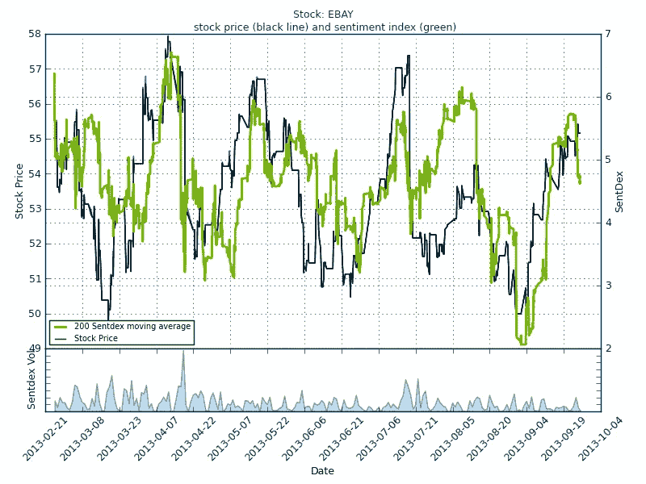
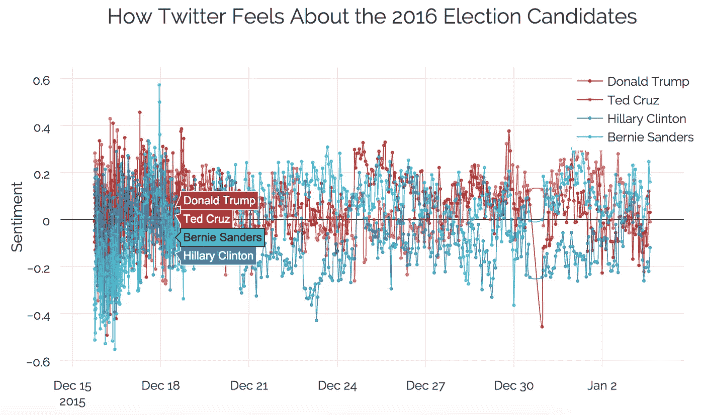
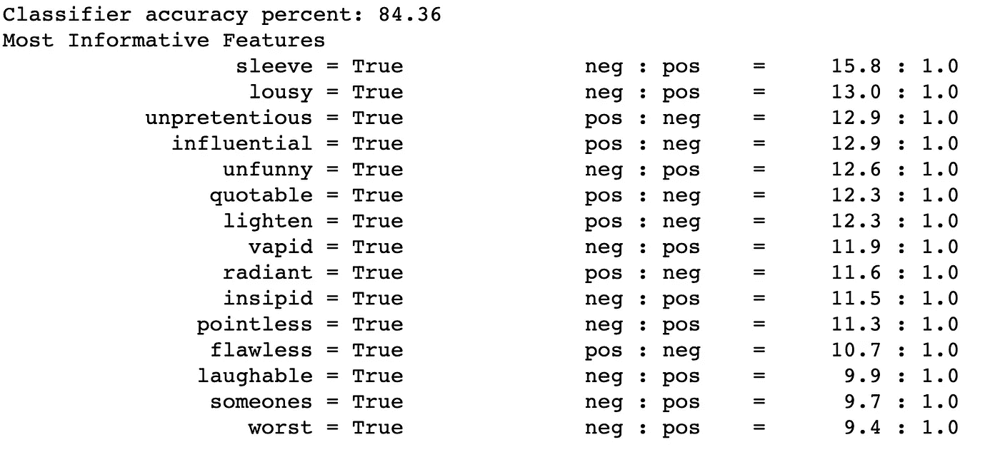
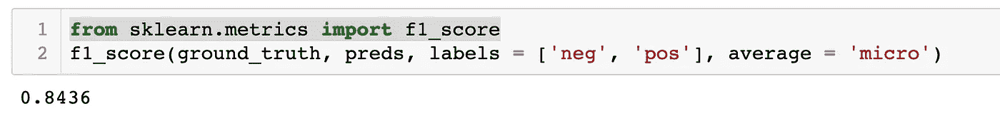
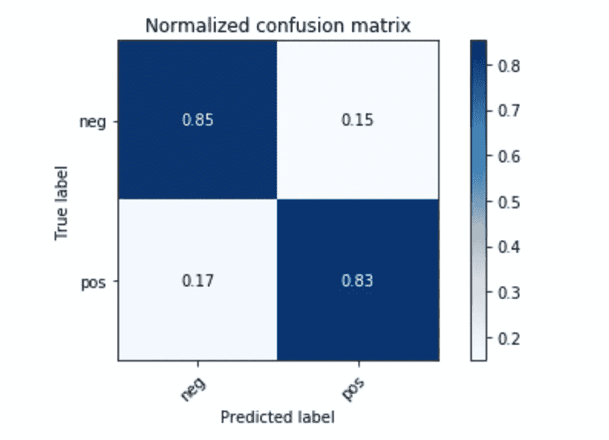
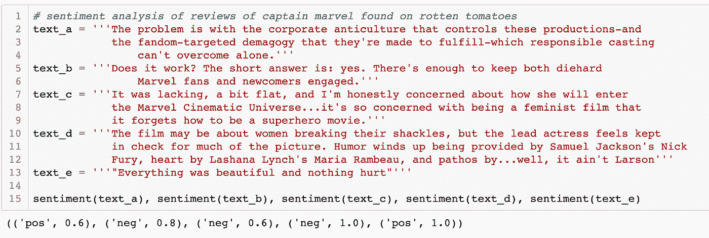

# 使用 NLTK 的基本情感分析

> 原文：<https://towardsdatascience.com/basic-binary-sentiment-analysis-using-nltk-c94ba17ae386?source=collection_archive---------1----------------------->

> "你最不满意的顾客是你最大的学习来源."—比尔·盖茨

那么客户怎么说呢？

在今天的背景下，事实证明很多。社交媒体打开了顾客意见的闸门，现在顾客意见大量自由流动，供企业分析。今天，使用机器学习的公司能够以文本或音频的形式提取这些意见，然后以前所未有的规模分析它们背后的情绪。情感分析，观点挖掘，随你怎么说，如果你有产品/服务要卖，你就需要在上面。

当以电子方式捕捉时，客户情绪——超越事实的表达，传达情绪、观点和情感——具有巨大的商业价值。我们谈论的是客户、潜在客户、患者、投票者和意见领袖的声音。”——[*塞思·格里姆斯*](http://breakthroughanalysis.com/2012/09/10/typesofsentimentanalysis/)

从媒体上的用户评论到分析股票价格，情感分析已经成为几乎所有行业中无处不在的工具。例如，下图显示了易贝的股价走势，情绪指数是基于对提到易贝的推文的分析而创建的。



*Figure 1:* [*eBay Stock Prices Vs. Sentdex Moving Average*](http://sentdex.com/how-accurate-is-sentiment-analysis-for-stocks/)

## 什么是情感分析？

Techopedia 对情感分析的定义如下:

> 情感分析是一种数据挖掘类型，通过自然语言处理(NLP)、计算语言学和文本分析来测量人们的意见倾向，这些技术用于从网络中提取和分析主观信息——主要是社交媒体和类似的来源。所分析的数据量化了公众对某些产品、人物或想法的情绪或反应，并揭示了信息的上下文极性。情感分析也称为意见挖掘。

有两种广泛的情感分析方法。

纯统计数据:

这类算法将文本视为单词包(BOW)，其中单词的顺序和上下文被忽略。原始文本被过滤掉，只剩下被认为带有感情色彩的词。对于这个博客，我将尝试这种方法。这种模型没有利用对特定语言的理解，而仅仅使用统计测量来对文本进行分类。

统计学和语言学的结合:

这些算法试图结合语法原则、各种自然语言处理技术和统计数据来训练机器真正“理解”语言。

基于分析生成的输出类型，情感分析也可以大致分为两类。

分类/极性——那段文字是“积极的”、“中性的”还是“消极的？”在这个过程中，你试图给一段文字贴上积极或消极或中性的标签。

> *标量/程度* — *给出一个预定义等级的分数，范围从高度肯定到高度否定。例如，下图显示了基于各种选举候选人推文的情绪分析。在这种情况下，情绪是以标量形式来测量的。*



Figure 2: [*How Twitter Feels about The 2016 Election Candidates*](https://moderndata.plot.ly/elections-analysis-in-r-python-and-ggplot2-9-charts-from-4-countries/)

在我的数据科学训练营期间，我尝试使用 [NLTK](https://www.nltk.org/) 库构建一个基本的情绪分析工具。我找到了一个漂亮的 youtube 教程，并按照列出的步骤学习如何进行基本的情绪分析。虽然该教程侧重于分析 Twitter 情绪，但我想看看我能否将电影评论分为正面或负面。我发现了一个包含 25000 条 IMDB 评论的[标签数据集](http://ai.stanford.edu/~amaas/data/sentiment/)。txt 文件分为两个文件夹，用于负面和正面评论。

## 流程:

我在我的 Jupyter 笔记本上导入了以下库，并从它们各自的文件夹中读取了正面和负面的评论。

**制作单词包(BOW):** 对于我们的单词包(BOW)，从技术上来说，我们可以包含所有独特的单词。然而，在我们的分析中包括所有独特的单词在计算上可能是昂贵的，甚至是不必要的。例如，评论中女演员的名字不会给出关于评论情绪的任何信息。所以，我们需要变得聪明，选择信息最丰富的单词。

对于这个小范围的项目，也是在教程的指导下，我只从特征中选择了形容词，基于这样一个假设，即形容词是积极和消极情绪的高度信息。对于每一篇评论，我都去掉了标点符号，标记了字符串，去掉了停用词。请查看我的另一个[博客](/testing-the-waters-with-nltk-3600574f891c)，了解如何使用 NLTK 执行这些基本的预处理任务。

接下来，为了获得所有形容词的列表，我执行了[词类](https://pythonprogramming.net/part-of-speech-tagging-nltk-tutorial/)(在上面提到的我的博客中也讨论过)标记，并创建了我们的 BOW 或在这种情况下的形容词包。我称这个列表为“所有单词”,它还需要另一轮过滤。

接下来，为了挑选信息最丰富的形容词，我使用 nltk 创建了 all_words 中单词的频率分布。FreqDist()方法。我列出了所有单词中出现频率最高的 5000 个形容词。至此，all_words 已经准备好作为我们最后的弓了。

**为每个评论创建特征:**对于每个评论，我创建了一个元组。元组的第一个元素是一个字典，其中的关键字是 BOW 的 5000 个单词中的每一个，如果该单词出现在评论中，则每个关键字的值为 True，否则为 False。第二个元素是该标签的标签，“pos”表示正面评价，“neg”表示负面评价。

```
#example of a tuple feature set for a given review
({'great': True, 'excellent': False, 'horrible': False}, 'pos') 
```

然后，我将元组列表(从这里开始称为 feature_set)分成训练集(20，000)和测试集(5，000)

**有趣的部分:机器学习！！！**

既然我已经准备好了我的特性、训练和测试集，我的下一步就是尝试一个普通的基础模型。对于我的基本模型，我使用了 NLTK 的[朴素贝叶斯分类器模块。该模型的准确率为 84.36%。这对于一个基本模型来说是非常好的，考虑到训练数据的规模，这并不奇怪。右图显示了未归一化和归一化预测的混淆矩阵。](https://www.nltk.org/_modules/nltk/classify/naivebayes.html)



上图(左图)显示了该模型中 15 个最具信息性的特征。与它们相关的比率显示了每一个相应的单词在一类文本中出现的频率比其他单词多多少。这些比率被称为**似然比。例如,“糟糕”这个词在负面评价中出现的几率是正面评价的 13 倍。**

为了进一步评估该模型，我使用 sci-kit learn 计算了 f1_score，并创建了一个混淆矩阵。f1 _ 得分为 84.36%。归一化混淆矩阵显示，该模型正确预测了 83%的正面评论和 85%的负面评论。



接下来，我尝试在训练集上训练其他分类算法，以找到得分最高的模型。我用了，多项式朴素贝叶斯，伯努利朴素贝叶斯，逻辑回归，随机梯度下降和支持向量分类器。NLTK 有一个名为 SklearnClassifier 的内置 Scikit 学习模块。这个 SklearnClassifer 可以继承通过 Scikit Learn 导入的任何模型的属性。您所要做的就是使用特定的 Scikit 学习模块作为参数来启动 NLTK SkleanClassifier。

不同车型的 f1 分数如下所示。他们的表现多少有些相似。然而，这两个朴素贝叶斯模型表现稍好。

MNB: 0.845，BNB: 0.8447999，对数规:0.835，新币:0.8024，SVC: 0.7808

**最后一步:建立一个集合模型**

接下来，我想看看所有这些模型的预测能力是否结合在一起，也就是说，我们能否达到更好的分数？合乎逻辑的下一步是建立一个集合模型。集合模型结合了上述每个模型对每个评论的预测(投票),并使用多数投票作为最终预测。

为了避免不得不重新训练模型(因为每个模型需要大约 8 到 12 分钟来训练)，我使用 [pickle](https://pythonprogramming.net/python-pickle-module-save-objects-serialization/) 存储了所有的模型。Pickle 是一个非常有用的 python 模块，它允许您在关闭内核之前保留可能需要很长时间创建的 python 对象。

为了构建集成模型，我构建了用分类器列表初始化的 EnsembleClassifier 类。重要的是，使用奇数个分类器作为集成的一部分，以避免出现平局。该类有两个主要的方法， *classify* :返回预测的标签， *confidence* :返回预测的置信度。这个度的衡量方法是(获胜票数)/总票数。

接下来，我使用 pickle 加载了所有的模型，初始化了一个集合模型对象，并将测试集中的特性列表输入到模型中。如下所示的集合模型的 f1 分数是 85%。比我们之前使用原始朴素贝叶斯模型获得的最高 f1 分数 84.5%略有增加。

同样的类也可以用来对一个评论进行实时分类。下面的函数接收单个评论，为该评论创建一个特征集，然后使用集成方法给出一个预测。输出为您提供了一个标签以及对该标签的信任度。

为了证明这一点，我从烂番茄中收集了一些关于惊奇队长的评论。我有意选取了两个不那么极端的评论和两个非常极端的评论来观察模型的表现。结果证明这个模型做得很好！该模型对不太对立的评论 text_a 和 text_c 不太确定，但是以高得多的置信度识别出对立的 text_b 和 text_d。



就是这样！

你可以在我的 [GitHub](https://github.com/samiramunir/Simple-Sentiment-Analysis-using-NLTK) 库和我用作指南的原始[网页](https://pythonprogramming.net/text-classification-nltk-tutorial/)中找到这个项目的示例代码。在我的 Github 中，我已经包含了一个 live_classifier.py 文件和我训练过的模型作为 pickled 文件。一旦你克隆了回购，你就可以直接在你的终端上运行这个 live_classifier.py 文件，然后使用情感()函数对你在网上找到的任何评论进行分类。更好的是，自己补复习！

我现在对探测文本中的讽刺或挖苦感兴趣。讽刺是微妙的，甚至人类也很难理解。仅仅是为了它，我引用了我最喜欢的作家库尔特·冯内古特的一句话来测试集合模型，他以讽刺作品而闻名。事情是这样的:

> “一切都很美好，没有任何伤害”——库尔特·冯内古特

如果我之前没有提到他的工作性质，我猜大多数人会认为这句话有积极的意义。然而，考虑到引用的上下文，人们可能会认为这个引用有更深的损失情绪。我的非常简单的情绪分析模型将该报价标注为 100%肯定*。*这并不奇怪，因为该模型一开始就没有被训练识别讽刺。

我想以下面这段关于情感分析的细微差别及其可靠性的引言来结束我的演讲。

> 情感分析会 100%准确或接近准确吗？

*可能不会，但这并不意味着是一件坏事。这并不是因为人们不够聪明，无法最终制造出真正理解语言的计算机。相反，这真的是不可能的，因为很少 80%的人同意文本的情感。——*[http://sentdex.com/sentiment-analysis/](http://sentdex.com/sentiment-analysis/)

*来源:*

报价 1—[http://breakthrough analysis . com/2012/09/10/typesofsentimental analysis/](http://breakthroughanalysis.com/2012/09/10/typesofsentimentanalysis/)

*图 1— Ebay 股票价格—*[http://send ex . com/how-accurate-is-sensition-analysis-for-stocks/](http://sentdex.com/how-accurate-is-sentiment-analysis-for-stocks/)

*图 2——推特对 2016 年大选候选人的感受——*[*https://modern data . plot . ly/elections-analysis-in-r-python-and-gg plot 2-9-charts-from-4-countries/*](https://moderndata.plot.ly/elections-analysis-in-r-python-and-ggplot2-9-charts-from-4-countries/)

*灵感—*[*https://python programming . net/情操-分析-模块-nltk-教程/*](https://pythonprogramming.net/sentiment-analysis-module-nltk-tutorial/)