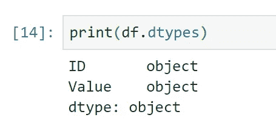

# 每个数据分析师都应该知道的使用 Python 的基本数据分析技术，第二部分。

> 原文：<https://towardsdatascience.com/basic-data-analysis-techniques-every-data-analyst-should-know-part-ii-412e28af849d?source=collection_archive---------13----------------------->

## [基本分析技巧](https://towardsdatascience.com/tagged/basic-analysis-techniques)

## 迈向经验丰富的分析师的第一步


这是*基础数据分析技术系列的后续，每个数据分析师都应该知道。对于那些还没有读过第一部分的人，可以在这里找到它。*

在第一部分中，我们介绍了初级数据分析师应该掌握的第一套技术，我们回顾了这些技术:基本过滤、多条件过滤、聚合和连接。

在这一部分中，我们将在第一部分的基础上，引入一组新的技术:

1.  转换数据类型
2.  透视数据
3.  创建条件列
4.  多功能聚合

我们将再次使用两个 Python 库进行分析，它们是:`[**pandas**](http://pandas.pydata.org/pandas-docs/stable/)` & `[**numpy**](https://docs.scipy.org/doc/numpy/reference/)**.**` 如果您还没有安装这两个包，请使用下面的代码来安装它们:

**蟒蛇:**

```
**conda install -c anaconda numpy****conda install -c anaconda pandas**
```

**PIP:**

```
**pip install pandas****pip install numpy**
```

# 熊猫简介 *dtypes* 。

pandas 中的每一列(系列)都有一个分配给它的*类型*，这是指存储在该列中的数据类型。

熊猫最基本的类型如下:

*   **对象**，即文本数据，通常被称为`**string.**`
*   **浮点数**，是具有小数精度的数(分数)，通常称为浮点数。
*   **整数**，均为整数。

为什么在每一列中使用正确的类型至关重要？因为它将定义您可以对数据执行哪些操作。

例如，每当一个列被定义为`**string**`时，您就不能对它们执行计算。例如，我们可以创建一个 pandas DataFrame，它有一个包含数字的 *values* 列，但是作为 *object* dtype。

如果我们用下面的代码检查这个数据帧的数据类型:

`**print(df.types)**`

我们得到以下输出:



dtypes

正如我们所看到的，我们的*值*列位于字符串形式的*对象 dtype* 中。因此，如果我们试图对这些值进行计算，我们将得到一个错误或错误的输出:

例如，取这些值的平方:

```
**df[‘Value’] ** 2**
```

会给出一个*类型错误:*


乘以 2 不会产生错误，但会给出错误的输出:


它不会引发错误的原因是，在 Python 中，我们可以通过相乘来连接字符串:


# 1.转换数据类型

因此，为了防止这些错误或错误的输出，我们必须将列的类型转换为正确的类型。在熊猫身上，我们有`[**Series.astype**](https://pandas.pydata.org/pandas-docs/stable/reference/api/pandas.Series.astype.html)`的方法。

此方法将您要转换成的 dtype 作为参数:

```
**df[‘Value’].astype(int)**
```

将该列转换为`**int32**`:


**重要提示:**这不是*【原地】*。所以我们没有覆盖数据帧中的原始列。为此，我们需要以下代码:

```
**df[‘Value’] = df[‘Value’].astype(int)**
```

如果我们再次检查数据帧的数据类型，我们可以看到转换正确进行:


## **1.1 转换日期时间**

datetime 的转换不同于 pandas 中的其他 dtypes，因为您有许多不同的格式来存储日期:

*   29–04–2019，格式:日-月-年
*   29/04/2019 18:23:09，格式:日/月/年时:分:秒
*   04–29–2019，格式:年-月-日

这些只是许多可能性中的几种，还有一些格式会变得相当复杂。我们不会在这些系列中讨论这些，但是我们会在我的另一个系列中讨论，这个系列叫做*用 Python 处理时间序列*，它将很快出版。

在 pandas 中，有几种方法可以将对象类型转换为日期时间，现在我们来看两种最常用的方法:

*   `[**pandas.to_datetime**](https://pandas.pydata.org/pandas-docs/stable/reference/api/pandas.to_datetime.html)`
*   `[**Series.astype**](https://pandas.pydata.org/pandas-docs/stable/reference/api/pandas.Series.astype.html)`

在我们深入一些例子之前，我们必须首先用一个 datetime 列扩展我们的数据帧，我们可以用一个表示日期的字符串列表来做到这一点:

```
**df[‘Date’] = [‘2019–04–23’, ‘2019–04–24’, ‘2019–04–25’, ‘2019–04–26’]**
```

这给了我们下面的数据框架:

如果我们看看`**print(df.dtypes)**`的产量。我们看到我们的`**Date**`列是对象类型(字符串)。


## 方法 1: pd.to_datetime

`**to_datetime**`函数接受一列作为输入，所以在我们的例子中是`**df['Date']**`。总代码如下所示:


## 方法 2: Series.astype

在前面的例子中，我们使用了`**astype**`将字符串转换成整数。这次我们想要的是 numpy 模块中的日期时间类型`**datetime64[ns]**`，在这里可以找到[。](https://docs.scipy.org/doc/numpy-1.13.0/reference/arrays.datetime.html)所以我们可以将它传递给我们的`**astype**`方法，并将我们的字符串转换成日期时间:


# 2.透视数据

有时，需要创建特定的概视图，并以特定的方式汇总数据，以便提高可读性，此外，由于数据是聚合的，因此更容易看到有价值的信息。

旋转是上述场景中经常使用的技术之一。它使您能够聚合数据，同时转换数据，以便索引和列被原始数据帧中两列的分类数据所替换。


source: [pandas docs](https://pandas.pydata.org/pandas-docs/stable/reference/api/pandas.pivot_table.html)

说够了，让我们在熊猫身上试试这个方法。首先，我们需要一个新的数据框架，这是我们自己创造的:

正如我们在数据框架中看到的，每个公司的每个部门都重复了三次，同样也重复了三次。我们可以在熊猫身上用`[**pivot_table**](https://pandas.pydata.org/pandas-docs/stable/reference/api/pandas.pivot_table.html)`的方法汇总这个数据。

该方法采用了许多参数，您可以在文档中找到这些参数，但是现在我们将研究其中的三个参数:

*   **索引:**要设置为索引的列
*   **列:**对于每个唯一值，将被转换为新的**列的列。**
*   **值:**哪一列将是每个单元格中的值。

因此，在我们的示例中，它将如下所示:


# **3。创建条件列**

处理数据时，可能需要根据表中已有的列向表中添加更多信息。这些列被称为*条件列*，因为它们的信息依赖于其他列。

如果我们看一下关于公司和部门规模的表格:


我们可能想要区分大的*部门和小的*部门，并在名为 *size_indicator 的新列中对其进行定义。*

现在我们把大部门的门槛定在 100。因此，如果我们用 [*伪代码*](https://en.wikipedia.org/wiki/Pseudocode) 写出我们的逻辑，它将如下所示:

```
**if Employee >= 100, then "Big"
else "Small"** 
```

在 Python 中，我们可以以多种方式应用这种逻辑，我们将看看两种最常用的方法:

*   numpy 在哪
*   列表理解

## 3.1 带有 *numpy.where* 的条件列

因为我们要使用 numpy 模块，所以我们必须首先导入这个模块:

```
**import numpy as np**
```

在 numpy 中有一个`**.where**`方法，工作方式如下:

```
**np.where(condition, value if true, value if false)**
```

所以在我们的例子中我们必须传递下面的方法:

*   条件:`**df['Employees'] >= 100**`
*   值为真:`**"Big"**`
*   假值:`**"Small"**`

因此，这将导致以下结果:


## 3.2 列表理解的条件列

列表理解是一种方法，与创建列表时使用和 *if 循环*的*相比，这种方法可以显著提高代码速度。*

and if 循环示例:


相同的列表创建，但是具有列表理解:


回到我们的数据，我们可以对 list comprehension 应用相同的逻辑来创建我们的 *Size_indicator* 列:


# 4.多功能聚合

在第一部分的[中，我们已经用熊猫的 *groupby* 函数查看了聚合数据。我们能够在应用 groupby 时应用单个函数，例如组的`max`或`mean`。](/basic-data-analysis-techniques-every-data-analyst-should-know-using-python-4de80ab52396)

在 pandas 中，当应用 groupby 来创建更广泛的概览时，您必须能够应用多种功能。

这可以通过使用 [*聚合*](https://pandas.pydata.org/pandas-docs/version/0.23/generated/pandas.core.groupby.DataFrameGroupBy.agg.html) 方法来实现。我们可以向该方法传递一个字典，其中包含我们想要应用的列名和函数:


如上所述，我们按*公司*分组，取*员工*的*总和*和*平均值*以及*尺码指标的*计数*。*

**这就是第二部分的**:*每个数据分析师都应该知道的使用 Python 的基本数据分析技术。*

你可以在我的 GitHub 上以 Jupyter 笔记本的形式找到这篇文章的代码:[链接](https://github.com/ErfPy/MediumArticles)

对于任何问题或其他讨论，请随时评论！

期待第三部分，在那里我们会看到一些新的技术！