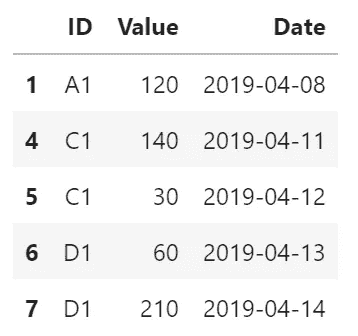
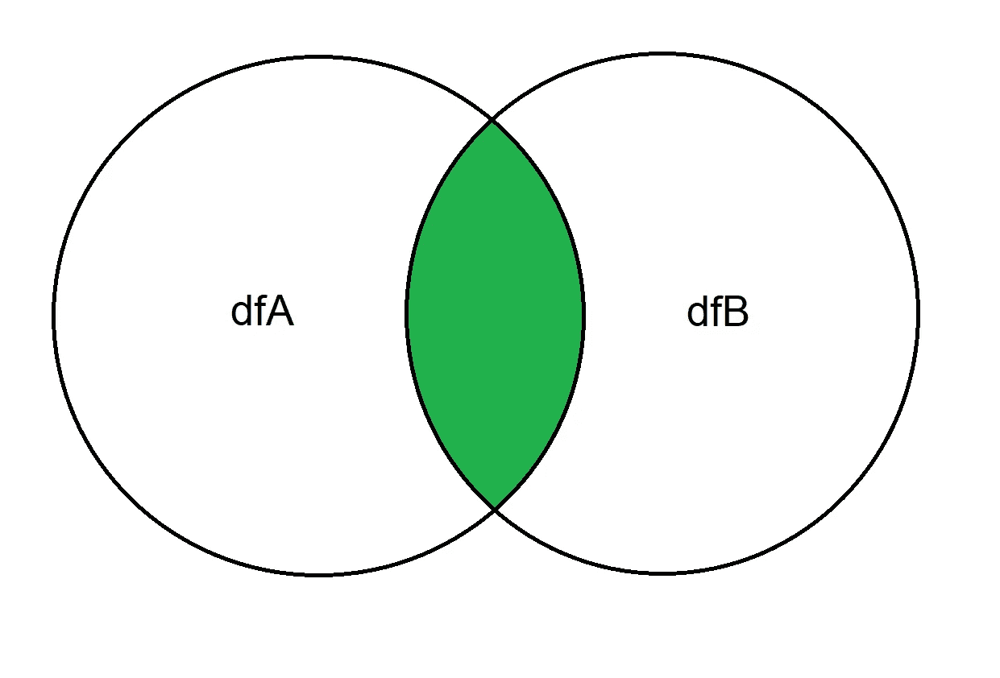

# 每个数据分析师都应该知道的基本数据分析技术，使用 Python。

> 原文：<https://towardsdatascience.com/basic-data-analysis-techniques-every-data-analyst-should-know-using-python-4de80ab52396?source=collection_archive---------10----------------------->

## [基本分析技巧](https://towardsdatascience.com/tagged/basic-analysis-techniques)

## 迈向经验丰富的分析师的第一步


在我作为数据分析师的日常工作中，我会看到各种各样的数据和来自客户的各种各样的分析请求。我注意到的是，你在大多数项目中需要的某些基本技术，与你正在从事的项目类型无关。我相信每个数据分析师/科学家都应该对这些技术有很好的理解。因此，本文的目标是带领读者了解这些技术，并在基础层面上解释这些技术。

这些是我们将浏览和讨论的主题:

1.  基本过滤
2.  多条件过滤
3.  聚合
4.  连接

对于我们的分析，我们将利用 Python 中的`[**pandas**](https://pandas.pydata.org/)`库。因此，如果您还没有安装这个库，请在您的命令提示符下使用以下代码之一来安装 pandas:

```
# If you use Anaconda, type the following in anaconda prompt
conda install -c anaconda pandas# If you use pip, type the following in command prompt
pip install pandas
```

此外，我假设你已经对 Python 和 pandas 库有了基本的了解。但是不要担心，如果你还没有接触到上述任何一个，我们将从头到尾检查一遍。


# 我们的数据集

为了能够通过提到的技术，我们需要数据。我们可以导入一个`**csv**`文件或者一个`**excel**`文件，但是现在我们保持简单，仅仅创建一个关于熊猫的小数据集。

下面的代码将生成一个[熊猫数据帧](https://pandas.pydata.org/pandas-docs/stable/reference/api/pandas.DataFrame.html):

这给了我们下面的数据框架:


DataFrame 1

从上面可以看出，它包含 ID、值和日期。

# 1.基本过滤

现在我们加载了 pandas 模块并创建了一个数据集，我们可以从第一项技术开始。当您想要基于列中的值获得数据的子集时，我们讨论的是*过滤*数据。

在熊猫身上，我们有多种方法做到这一点，现在我们来看看最常见的几种:

1.  使用带方括号`**[]**`的[布尔索引](https://pandas.pydata.org/pandas-docs/stable/user_guide/indexing.html)
2.  通过`**.loc**`使用布尔索引

所以用方括号***过滤如下:***

***pandas 中过滤背后的逻辑是将条件传递给方括号中的数据帧:***

```
*df[condition]*
```

***并给出了以下输出:***

******

***Filtering with square brackets***

***用**过滤。loc** 看起来非常相似:***

***正如预期的那样，它给出了相同的输出，因为我们应用了相同的滤波器***

******

***Filtering with .loc***

***首选用哪个？对于基本过滤器，正如我们在上面看到的，没有区别或偏好，它归结为你喜欢什么代码语法明智。但是当你想对你的数据进行更高级的选择时，`**.loc**`提供了更复杂的选择和切片。但现在不用担心这个。***

# ***2.带条件过滤***

***我们应用了我们的第一个过滤器，它非常简单。但是，假设您想要应用一个具有多个条件的过滤器。我们如何在熊猫身上做到这一点？为此，我们研究了 Python 操作符。***

*****2.1*&*运算符** 例如，您要过滤所有`**ID**`等于 C1、`**Value**`大于 100 的行。***

***为了应用这个过滤器，我们必须用`**&**`操作符链接两个条件。看起来像下面这样:***

***并将返回以下输出:***

******

***Filtering with and operator***

***正如预期的那样，我们返回了一行，因为只有这一行符合我们在过滤器中设置的条件。***

*****2.2 |操作符*****

***Python 中的`**|**`运算符代表`**or**`，如果满足其中一个条件就会返回`**True**`。***

***我们可以通过应用以下过滤器来显示这一点:给我们所有`**date**`晚于 2019–04–10**或** `**Value**` 大于 100 的行。***

***在 Python 代码中，这将如下所示:***

***并将返回以下输出:***

******

***Filtering with or operator***

***正如所料，返回的所有行的值都大于 100 **或**的日期在 2019-04-10 之后。***

# ***3.协议***

***有时需要聚合数据，以便创建特定的概视图或进行一些计算。在熊猫中，我们用`**groupby**` 来表示这一点。***

***那么 groupby 到底是什么？如果我们引用熊猫文献的话:***

> ***“分组依据”指的是涉及以下一个或多个步骤的过程:
> ***根据某些标准将数据分成组**。
> ***将**功能独立应用于每组。
> ***将**结果组合成一个数据结构。***

***因此，基本上它是根据一些指标对你的数据进行分组，使你能够对这些分组采取一些行动。***

*****3.1 Groupby #1:获取总和**
让我们来看一个例子。假设我们想根据`**ID**`得到每组的总数`**value**`。这就像 Python 代码中的以下内容:***

***这将为我们提供以下输出:***

******

***Aggregation with sum***

***如果我们再看一下数据帧，我们会发现这是正确的:***

******

***Original dataframe***

***例如，ID A1 的总值是`**100 + 120 = 220**` ，这是正确的。***

*****3.2 Groupby #2:获取最高日期*****

***熊猫提供了一个大范围的功能，您可以在使用 groupby 后在您的组上使用。再来看一个。例如，我们可以通过使用`.max()`函数获得每组的最高日期。***

***看起来会像这样:***

***并且会给我们以下输出:***

******

***Aggregation with max date***

# ***4.连接***

***连接是基于一个公共列以并排的方式组合两个数据帧。大多数时候这些列被称为`**key columns**`。***

***术语`**join**`源于数据库语言 SQL，之所以需要它是因为 SQL 数据库的数据建模大部分是通过使用关系建模来完成的。***

***连接有很多种类型，您的输出将基于您执行的连接类型。因为这是入门教程，我们就看最常见的:`**inner join**`。在本系列的后面部分，我们将研究更复杂的连接。***

****内连接*来源于`**venn diagrams**`，代表两个集合的*内*(交集)部分。因此，当我们将它转换成我们的数据时，一个内部连接返回出现在两个数据帧中的行。***

******

*****4.1 我们的数据集*****

***因为我们想要合并两个数据帧，所以我们将创建新数据。这两个假想数据集代表客户主表和订单表。***

***使用以下代码，我们创建了两个新的数据帧:***

***它们看起来如下:***

******

***dfA: Customers master***

******

***dfB: Orders***

***因此，我们可以对这些新数据进行的一个逻辑分析是，获取 orders 表中每个订单旁边的客户的姓名和城市。这是一个典型的`**join**`问题，按行匹配两个数据帧，并用更多的列丰富数据。在这种情况下，我们的键列是`**Customer_ID**`。***

***在熊猫中，我们使用`[**merge**](https://pandas.pydata.org/pandas-docs/stable/user_guide/merging.html)` 的方法进行接合。我们将向该方法传递以下参数:***

1.  ***您要连接哪个数据框架(dfA，dfB)。***
2.  ***什么是关键列(Customer_ID)。***
3.  ***要执行的联接类型(内部)。***

***我们可以在 merge 方法中使用比上面列出的更多的参数，但是现在这些已经足够了。***

***在 pandas 中，我们要执行的合并看起来像下面这样:***

***并且输出如我们所料，在每个对应的`**customer_ID**` **旁边添加了 name 和 city 列。*****

******

***Inner join***

*****这就是本部分的**:每个数据分析师都应该知道的基本数据分析技术，使用 Python。***

***你可以在我的 GitHub 上以 Jupyter 笔记本的形式找到这篇文章的代码:[链接](https://github.com/ErfPy/MediumArticles)***

***如果这篇文章对你有用，请考虑给这篇文章点个赞，并与朋友和/或同事分享。***

***对于任何问题或其他讨论，请随时发表评论。***

***在这里找到第二部分[，我们在这里进行了更深入的探讨。](/basic-data-analysis-techniques-every-data-analyst-should-know-part-ii-412e28af849d)***