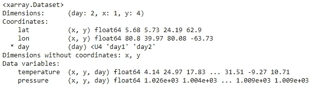

# xarray 的基本数据结构

> 原文：<https://towardsdatascience.com/basic-data-structures-of-xarray-80bab8094efa?source=collection_archive---------3----------------------->


Photo by [Faris Mohammed](https://unsplash.com/@pkmfaris?utm_source=unsplash&utm_medium=referral&utm_content=creditCopyText) on [Unsplash](https://unsplash.com/search/photos/array?utm_source=unsplash&utm_medium=referral&utm_content=creditCopyText)

Xarray 是一个 python 包，用于处理带标签的多维数组，包括高级分析和可视化功能。Xarray 深受熊猫的启发，在内部使用熊猫。虽然 pandas 是处理表格数据的一个很好的工具，但是当数据维数较高时，它可能会变得有些笨拙。Pandas 的主要数据结构是 Series(用于一维数据)和 DataFrame(用于二维数据)。它曾经有面板(用于三维数据)，但在版本 0.25.0 中删除了[。](https://pandas.pydata.org/pandas-docs/stable/reference/panel.html)

假设读者熟悉熊猫，如果你不知道熊猫是什么，你应该在 xarray 之前查看一下。

## 为什么我应该使用 ND 数组？

在许多科学领域，需要将一个数据点映射到各种属性(称为坐标)，例如，您希望将某个温度测量值映射到纬度、经度、高度和时间。这是 4 维！

在 python 中，使用 ND 数组的基本包是 [NumPy](https://numpy.org/) 。Xarray 有一些内置特性，使得使用 ND 数组比 NumPy 更容易:

*   xarray 不使用轴标签，而是使用命名维度，这使得选择数据和对维度应用操作变得容易。
*   NumPy 数组只能有一种数据类型，而 xarray 可以在 ND 数组中保存异构数据。这也使得 NaN 操作更容易。
*   使用`obj.attrs`跟踪对象上的任意元数据。

## 数据结构

Xarray 有两种数据结构:

*   数据数组—用于单个数据变量
*   数据集—多个数据数组(数据变量)的容器

根据 [CF 惯例](http://cfconventions.org/)，在**数据变量**和**坐标**之间有区别。Xarray 遵循这些约定，但是它主要是语义性的，您不必遵循它。我是这样看的:一个*数据变量*是感兴趣的*数据*，一个*坐标*是*描述感兴趣的*数据的标签。例如，纬度、经度和时间是坐标，而温度是数据变量。这是因为我们对测量温度感兴趣，其余的都是描述测量结果(数据点)。在 [xarray 文档](http://xarray.pydata.org/en/stable/data-structures.html#dataset)中，他们说:

> 坐标表示常量/固定量/独立量，不同于属于数据的变化量/测量量/相关量。

O 凯，来看看一些代码吧！

```
# customary imports
import numpy as np
import pandas as pd
import xarray as xr
```

首先，我们将创建一些玩具温度数据来玩:

我们生成了一个随机温度值的数组，以及坐标纬度和经度(二维)的数组。首先，让我们看看如何在 pandas 中表示这些数据:

```
df = pd.DataFrame({"temperature":temperature, "lat":lat, "lon":lon})
df
```


Output of the above cell

我们将从这些数据中创建一个 *DataArray* ，让我们来看看四种方法:

*   来自熊猫系列
*   来自一个熊猫的数据框架
*   使用 DataArray 构造函数
*   使用带有投影坐标的 DataArray 构造函数

## 从序列创建数据数组

我们将创建一个熊猫系列，然后是一个数据数组。由于我们希望在数据中表示两个维度，因此我们将创建一个具有两级多索引的序列:

```
idx = pd.MultiIndex.from_arrays(arrays=[lat,lon], names=["lat","lon"])s = pd.Series(data=temperature, index=idx)
s# use from_series method
da = xr.DataArray.from_series(s)
da
```


Output of the above cell

这是数据数组打印出来的样子。

## 从数据帧创建数据数组

我们可以为 DataArray 构造函数提供一个熊猫数据帧。它会将数据框的索引视为第一维，将列视为第二维。如果索引或列有多个级别，xarray 将创建嵌套维度。

由于我们希望纬度和经度作为我们的维度，实现这一点的最聪明的方法是使用纬度作为索引，经度作为列来透视我们的数据框:

```
df_pv = df.pivot(index="lat", columns="lon")# drop first level of columns as it's not necessary
df_pv = df_pv.droplevel(0, axis=1)df_pv
```


Output of the above cell

数据透视后，我们可以通过为 DataArray 构造函数提供透视数据框来轻松创建 DataArray:

```
da = xr.DataArray(data=df_pv)
da
```


Output of the above cell

## 使用构造函数创建 DataArray

我们已经看到了从 pandas 对象创建 DataArray 的两种方法。现在，让我们看看如何手动创建数据数组。因为我们希望在数据中表示二维，所以数据应该以二维数组的形式出现，这样我们就可以将它直接传递给 DataArray 构造函数。

我们将使用透视数据框中的数据，然后我们需要明确指定坐标和维度:


Output of the above cell

这里需要注意的重要一点是，坐标数组必须是一维的，并且具有它们所代表的维度的长度。我们有一个(4，4)形状的数据数组，所以我们为构造函数提供了两个坐标数组。每个都是一维的，长度为 4。

## 使用带有投影坐标的构造函数创建 DataArray

我们将检查用投影坐标创建 DataArray 的最后一种方法。它们在某些情况下可能是有用的，但是它们有一个缺点，即坐标没有明确的可解释性。使用它们的最大的*优势*是我们可以传递给 DataArray 构造函数相同形状的数组，用于数据和坐标，而不必考虑旋转我们的数据。

在我们的例子中，我们有温度数据，我们有两个维度:纬度和经度，所以我们可以在一个任意形状的(不需要旋转)的**二维数组中表示我们的数据，然后为构造函数提供两个相同形状的坐标数组来表示纬度和经度:**

下面，请注意在 DataArray 构造函数中指定坐标的方式。这是一个字典，它的键是坐标的名称，它的值是元组，它们的第一项是维度列表，第二项是坐标值。

```
da = xr.DataArray(data=temperature,
                  coords={"lat": (["x","y"], lat),
                          "lon": (["x","y"], lon)},
                  dims=["x","y"])da
```


Output of the above cell

注意它说 x 和 y 是没有坐标的维度。还要注意，lat 和 lon 旁边没有星号，因为它们是[无量纲坐标](https://xarray.pydata.org/en/stable/data-structures.html#coordinates)。

# 三维

现在让我们创建另一个维度！让我们创建 2 天的温度数据，不是 1 天而是 2 天！

像以前一样，每天我们都需要一个二维(纬度和经度)温度值数组。为了表示 2 天的数据，我们希望将每日数组堆叠在一起，形成一个三维数组:

现在，我们将数据传递给 DataArray 构造函数，并使用投影坐标:

```
da = xr.DataArray(data=temperature_3d,
                  coords={"lat": (["x","y"], lat),
                          "lon": (["x","y"], lon), 
                          "day": ["day1","day2"]},
                  dims=["x","y","day"])da
```


Output of the above cell

我们也可以使用一个具有 3 级多索引的 pandas 系列来创建同样的东西。要创建一个系列，我们需要将数据扁平化，这意味着使其一维化:

```
# make data 1-dimensional
temperature_1d = temperature_3d.flatten("F")
lat = lat.flatten()
lon = lon.flatten()day = ["day1","day2"]
```

现在，我们将创建一个具有 3 级多索引的系列:


Output of the above cell

最后，我们将使用 from_series 方法创建一个 DataArray:

```
da = xr.DataArray.from_series(s)
da
```


Output of the above cell

# 资料组

到目前为止，我们只处理了温度数据。让我们添加压力数据:

现在我们将创建一个*数据集*(不是一个数据数组)，以温度和压力作为*数据变量。*对于投影坐标， *data_vars* 参数和 *coords* 参数都需要一个类似于 DataArray 的 *coords* 参数的字典:



Output of the above cell

我们还可以为每个*数据变量*创建一个*数据数组*，然后从*数据数组创建一个*数据集*。*让我们使用 from_series 方法为温度和压力创建两个数据数组，就像我们对三维情况所做的那样:

现在，我们将使用这两个数据数组创建一个数据集:

```
ds = xr.Dataset(data_vars={"temperature": da_temperature, "pressure": da_pressure})ds
```


## 结论

这是对 xarray 数据结构的快速介绍。xarray 还有更多的功能，比如索引、选择和分析数据。我不会在这里涉及这些，因为我想保持这个教程简单。我鼓励你看一看 xarray docs，并尝试使用它。希望这篇文章对你有用！