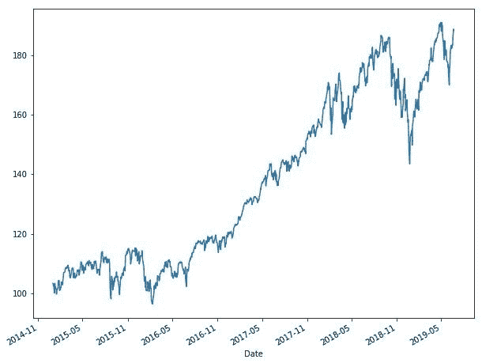
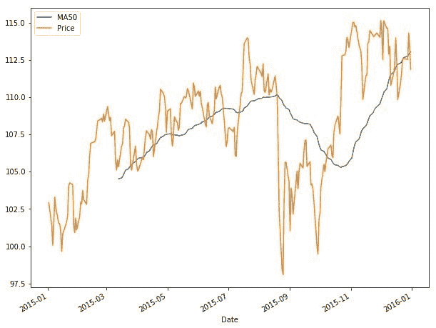
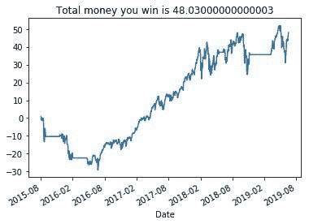

# ETF 的基本数据争论和可视化

> 原文：<https://towardsdatascience.com/basic-data-wrangling-visualization-with-an-etf-75329180cc70?source=collection_archive---------18----------------------->


# 概观

正如前一篇文章所承诺的，我们最终会完成一些编码示例。在选择一个与你分享的话题时，我实际上是从进行深度工作中抽出 10 分钟的休息时间得到的灵感——这是一种来自[加州新港](https://amzn.to/2NavzsO)*【1 }*的生产力技巧。对于那些需要复习的人来说，深入的工作是:

> ***一种在不受干扰的环境中进行的工作，这种工作可以集中你的注意力，创造出其他人很难复制的更大价值。***

我个人会努力 40-50 分钟，然后需要 10-15 分钟的休息。其中一次休息时，我的同事们在谈论市场和比特币。boom——这是本文的下一个主题。今天，我们将讨论一些基本的时序数据争论和 Python 中的可视化。然后我们会用均线交易策略来结束它。

现在只是为了记录，我不是说这个策略是好的或任何东西，但只是想告诉你在一些数据操作和可视化之后你能做什么。管理方面的问题解决了，让我们开始吧！

# 时间序列和数据争论的术语

学习新事物时，我总是喜欢从头开始。这样，我们都在同一页上，以后可以构建更复杂的模型。基本上，我宁愿解释得多一点也不愿意解释得不够多。就我个人而言，我总是讨厌被弄糊涂，当有人做了一个巨大的逻辑跳跃。

> 时间序列的定义:时间序列是一种在一段时间内获取的数据类型，已知数据点彼此相关*【2】*。时间序列的例子包括股票价格、马丘比丘的每日温度、小海龟跑进海洋的速度等。
> 
> 数据角力的定义:数据角力是将原始数据转化为更干净的数据，使模型更好的过程*【3】*。例如，你从 Twitter 上获得大量的 tweet 数据。将原始文本数据放在机器学习 NLP 模型中不会有太好的效果。但是如果你删除不必要的单词，清理特殊字符，为输入和输出构建数据，等等。，那么你就可能有一个像样的模型，可以预测或分类。

# 基本时序数据争论和可视化

在 Python 中，标准的做法是首先导入包，然后为它们指定快捷方式以节省时间。比如熊猫从现在开始就要叫 pd 了。

```
import pandas as pd
import matplotlib.pyplot as plt
%matplotlib inline
```

现在，让我们将 NASDAQ etf 从 csv 导入到一个 dataframe 中(就像 Excel 中的工作表一样)*【4】*。

```
qqq = pd.DataFrame.from_csv(‘QQQ Historical Data.csv’)print(qqq.head())
```

检查数据是什么样的总是好的，这样你就对你正在分析的东西有了更好的感觉。以下是股票和 etf 数据的常见格式:

```
Price    Open    High     Low    Vol. Change %
Date                                                       
2014-12-31  103.25  104.50  104.91  103.10  24.37M   -1.03%
2015-01-02  102.94  103.76  104.20  102.44  31.31M   -0.30%
2015-01-05  101.43  102.49  102.61  101.14  36.52M   -1.47%
2015-01-06  100.07  101.58  101.75   99.62  66.21M   -1.34%
2015-01-07  101.36  100.73  101.60  100.48  37.58M    1.29%print(qqq.shape)
```

shape 命令向我们显示了数据帧中的行数和列数，按此顺序排列。

```
(1127, 6)print(qqq.describe())
```

Describe 向我们显示了一般的汇总统计数据。

```
Open        High         Low       Price
count  506.000000  506.000000  506.000000  506.000000
mean   102.880198  103.857688  101.770731  102.864565
std     17.100460   17.089441   17.049718   17.081374
min     74.040000   74.830000   72.000000   74.050000
25%     86.740000   87.715000   85.620000   86.730000
50%    105.260000  106.300000  104.040000  105.075000
75%    117.812500  118.677500  116.722500  117.745000
max    133.500000  133.500000  132.220000  133.280000
```

***loc vs . iloc***

好了，这里有一个小命令总是让我困惑，当我第一次开始学习 Python 的时候。当我们使用 loc 时，它得到一个带标签的行，而 iloc 得到一个带索引的数据点。以下是每种方法的示例:

```
print(qqq_2015.loc[‘2015–03–16’])Price        106.7
Open        105.73
High        106.74
Low         105.62
Vol.        25.67M
Change %     1.29%
Name: 2015-03-16 00:00:00, dtype: objectprint(qqq.iloc[0, 0])103.25
```

以下是如何获取特定时间序列的示例代码，在本例中是 QQQ etf 的 2015 年全年。

```
qqq_2015 = qqq.loc[‘2015–01–01’:’2015–12–31']
```

python 中的绘图非常简单。您可以告诉它您想要的绘图大小、要绘制的时间序列以及何时显示，如下所示:

```
plt.figure(figsize=(10, 8))
qqq[‘Price’].plot()
plt.show()
```



要在 dataframe 中创建一个新列，可以使用与创建新变量类似的模式。下面我们将创建一个获取差价和每日回报的新专栏。做这两件事的目的是看我们的交易策略一天能赚多少或亏多少。

```
qqq[‘PriceDiff’] = qqq[‘Price’].shift(-1) — qqq[‘Price’]qqq[‘Return’] = qqq[‘PriceDiff’] /qqq[‘Price’]
```

交易策略的另一部分是告诉算法价格的方向。有了这个形态，策略就能知道 ETF 或股票是涨还是跌。由此，我们可以告诉策略下一步该做什么——即交易价格上涨(多头)或下跌(空头)。

```
qqq[‘Direction’] = [1 if qqq[‘PriceDiff’].loc[ei] > 0 else 0 for ei in qqq.index ]print(‘Price difference on {} is {}. direction is {}’.format(‘2015–01–05’, qqq[‘PriceDiff’].loc[‘2015–01–05’], qqq[‘Direction’].loc[‘2015–01–05’]))
```

做均线策略的最后一个要素是做均线，可以用。滚动()和。平均值()。在这里，我们将使用 50 移动平均线，它显示了过去 50 天的平均收盘价。下面是带有情节的代码:

```
qqq[‘ma50’] = qqq[‘Price’].rolling(50).mean()
plt.figure(figsize=(10, 8))
qqq[‘ma50’].loc[‘2015–01–01’:’2015–12–31'].plot(label=’MA50')
qqq[‘Price’].loc[‘2015–01–01’:’2015–12–31'].plot(label=’Price’)
plt.legend()
plt.show()
```



# 建立移动平均线交易策略

我们拥有交易策略的所有要素。从上面的代码添加，我们可以制定一个 50 简单移动平均线(SMA)和 100 简单移动平均线(SMA)的交叉策略。一旦 50 日均线超过 100 日均线，我们将交易 etf 将走高。一旦 50 日均线跌破 100 日均线，我们将关闭我们的多头或根本不交易。

```
qqq[‘MA50’] = qqq[‘Price’].rolling(50).mean()
qqq[‘MA100’] = qqq[‘Price’].rolling(100).mean()
qqq = qqq.dropna()
```

下面的代码设置了我们购买的股票数量，并允许我们绘制交易期间的回报图:

```
qqq[‘Shares’] = [1 if qqq.loc[ei, ‘MA50’]>qqq.loc[ei, ‘MA100’] else 0 for ei in qqq.index]qqq[‘Close1’] = qqq[‘Price’].shift(-1)
qqq[‘Profit’] = [qqq.loc[ei, ‘Close1’] — qqq.loc[ei, ‘Price’] if qqq.loc[ei, ‘Shares’]==1 else 0 for ei in qqq.index]
qqq[‘Profit’].plot()
plt.axhline(y=0, color=’red’)
```


第一次看到这个，很难判断我们是否盈利。另一种方式来看待它是从我们的股票交易中获得的价格。cumsum()代码—创建一个新列并绘制它:

```
qqq[‘wealth’] = qqq[‘Profit’].cumsum()qqq[‘we alth’].plot()
plt.title(‘Total money you win is {}’.format(qqq.loc[qqq.index[-2], ‘wealth’]))
```



上面的图显示了我们从交易 1 份 QQQ etf 中获得了多少钱，因此我们交易 1 份获得了 48.03 美元(43.12%的总回报)。43.12%的回报率并不差，但与同期仅买入并持有 etf 而不交易相比(总回报率为 68.57%)，这有点糟糕。

# 结论

恭喜你，你刚刚经历了一些数据争论，可视化，并建立了一个移动平均线交易策略！


*图片取自随机的 YouTube 个人资料【5】*

当你坐下来想想你学了些什么，那真的很多。您学习了如何从 CSV 导入数据，制作数据框架，查看行，查看数据点，创建新列，一些统计函数，并绘制出简单的移动平均线交易策略。我知道我在数据科学方面比在财务方面解释得更多。如果有什么不清楚的，在下面评论或者给我发消息！

在以后的文章中，我们将结合数据科学的商业思想，进行更多的编码演练。

特别感谢万博士，我修改了他的一个课程的想法，以构建本文*【6】*。

*免责声明:本文陈述的所有内容均为我个人观点，不代表任何雇主。投资有很大的风险。在做出任何投资决定之前，请咨询您的财务专家。最后，这篇文章包含附属链接，谢谢你的支持。*

[1] C .纽波特，[深度工作:在纷乱的世界中专注成功的规则](https://amzn.to/2NavzsO) (2016)，大中央出版社

[2] NIST，时间序列分析导论，[https://www . ITL . NIST . gov/div 898/handbook/PMC/section 4/pm C4 . htm](https://www.itl.nist.gov/div898/handbook/pmc/section4/pmc4.htm)

[3] Trifacta，什么是数据角力？，[https://www.trifacta.com/data-wrangling/](https://www.trifacta.com/data-wrangling/)

www.investing.com，景顺 QQQ 信托历史数据，[https://www . investing . com/ETFs/power shares-QQ QQ-Historical-Data](https://www.investing.com/etfs/powershares-qqqq-historical-data)

[5]https://www.youtube.com/channel/UCkAqayQ4Q8XD6CwWSxD6DbA 的 TT·克尔，YouTube 个人资料，

[6] X .万，构建简单交易策略，[https://www . coursera . org/learn/python-statistics-financial-analysis](https://www.coursera.org/learn/python-statistics-financial-analysis)