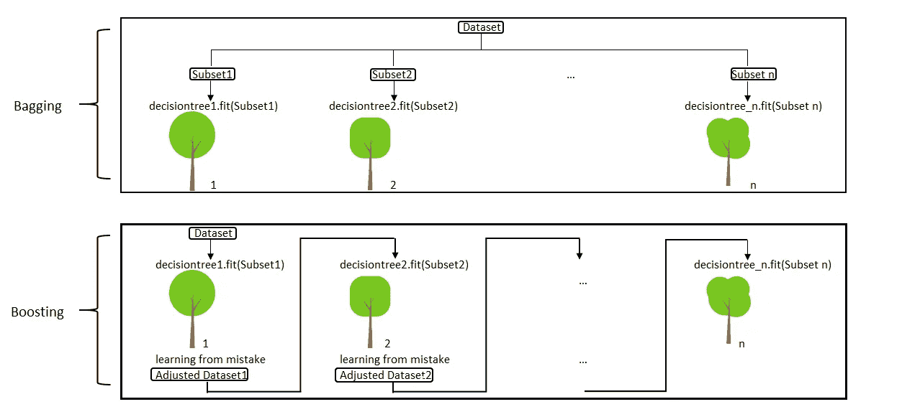
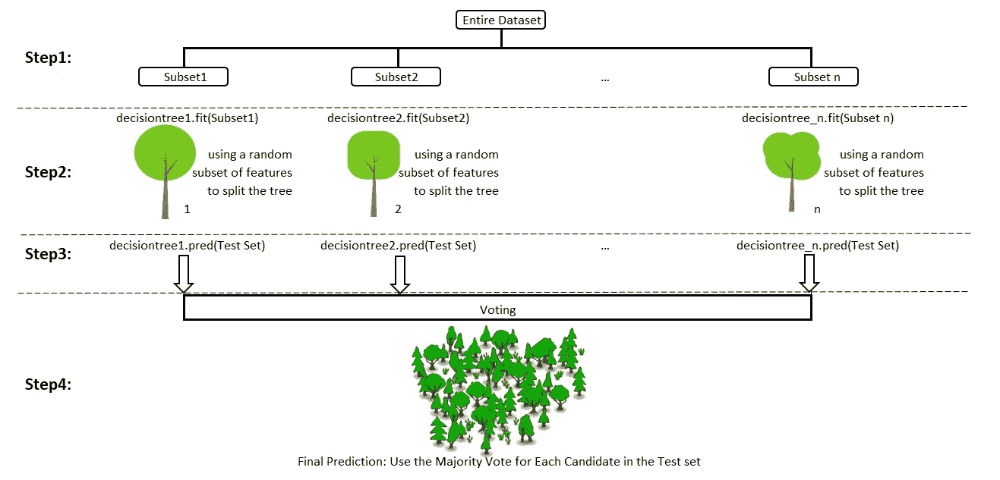
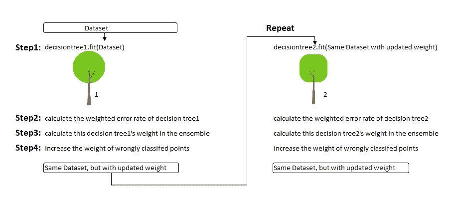
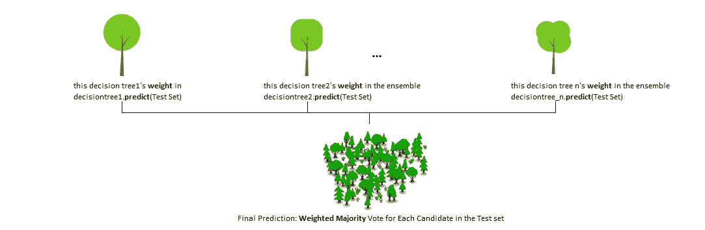
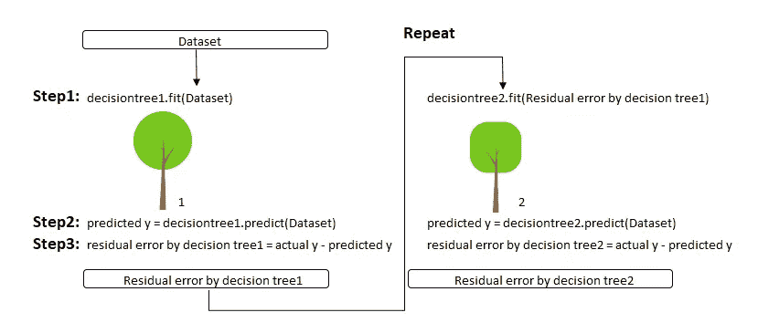
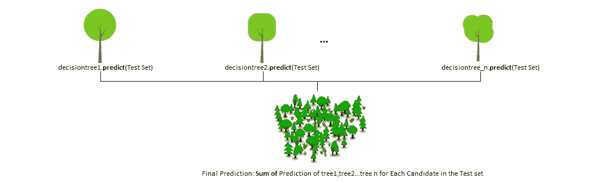

# 基本集成学习(随机森林，AdaBoost，梯度推进)-一步一步解释

> 原文：<https://towardsdatascience.com/basic-ensemble-learning-random-forest-adaboost-gradient-boosting-step-by-step-explained-95d49d1e2725?source=collection_archive---------0----------------------->

## 前三种基于树的集成学习算法的逐步解释。


Photo by [kazuend](https://unsplash.com/@kazuend?utm_source=medium&utm_medium=referral) on [Unsplash](https://unsplash.com?utm_source=medium&utm_medium=referral)

我们都这样做。在我们做出任何重大决定之前，我们会询问人们的意见，比如我们的朋友、家人，甚至我们的狗/猫，以防止我们有偏见😕或者不理智😍。

模型也是这样。单个模型遭受偏差或方差是很常见的，**这就是为什么我们需要集成学习**。

E nsemble 学习，一般来说，是一种基于许多不同模型进行预测的模型。通过组合单独的模型，集合模型趋向于更加灵活🤸‍♀️(偏差较小)和 data-sensitive🧘‍♀️(方差较小)。

两种最流行的集成方法是**打包**和**助推**。

*   **装袋:**并行训练一堆个体模型。每个模型由数据的随机子集训练
*   **Boosting:** 按顺序训练一堆个体模型。每个单独的模型都从前一个模型所犯的错误中学习。



有了对什么是集成学习的基本了解，让我们来种一些“树”🎄。

以下内容将逐步解释随机森林、AdaBoost 和梯度增强，以及它们在 Python Sklearn 中的实现。

# 随机森林

andom forest 是一个集合模型，使用 bagging 作为集合方法，决策树作为个体模型。

让我们仔细看看**这个魔法🔮的随机性**:



步骤 1: **从训练集中选择 n 个(例如 1000 个)随机子集**

第二步:**训练 n 个(例如 1000 个)决策树**

*   一个随机子集用于训练一个决策树
*   每个决策树的最佳分割基于随机的特征子集(例如，总共 10 个特征，从 10 个特征中随机选择 5 个进行分割)

步骤 3: **每棵单独的树独立地预测**测试集中的记录/候选者。

第四步:**进行最终预测**

对于测试集中的每个候选人，随机森林使用具有**多数票**的类(例如猫或狗)作为该候选人的最终预测。

当然，我们的 1000 棵树就是这里的议会。

# 自适应增强

AdaBoost 是一个增强集成模型，特别适合决策树。Boosting 模型的关键是从以前的错误中学习，例如错误分类数据点。

通过增加错误分类数据点的权重，daBoost 从错误中学习。

让我们举例说明**AdaBoost 如何适应**。



步骤 0: **初始化数据点的权重**。如果训练集有 100 个数据点，那么每个点的初始权重应该是 1/100 = 0.01。

第一步:**训练**决策树

第二步:**计算决策树的加权错误率(e)** 。**加权误差率(e)** 是指所有预测中有多少是错误的，你可以根据数据点的权重来区别对待错误的预测。**权重**、**越高，在(e)的计算过程中，相应的误差将被加权**。

步骤 3: **计算该决策树在集合中的权重**

这棵树的权重=学习率* log( (1 — e) / e)

*   树的加权错误率越高，😫在随后的投票中，给予该树的决策权越少
*   树的加权错误率越低，😃在以后的投票中，该树将被给予更高的决策权

步骤 4: **更新错误分类点的权重**

每个数据点的权重=

*   如果模型得到的数据点正确，重量保持不变
*   如果模型得到的这个数据点是错误的，那么这个点的新权重=旧权重* np.exp(这棵树的权重)

注意:树的权重越高(该树执行的越准确)，该树的误分类数据点将获得越多的提升(重要性)。在所有错误分类的点被更新之后，数据点的权重被归一化。

第五步:**重复**第一步(直到达到我们设定的训练树的数量)

第六步:**进行最终预测**

AdaBoost 通过将(每棵树的)权重相加乘以(每棵树的)预测来进行新的预测。显然，权重越高的树对最终决策的影响力越大。



# 梯度推进

梯度推进是另一种推进模式。记住，推进模型的关键是从以前的错误中学习。

radient Boosting 直接从错误——残差中学习，而不是更新数据点的权重。

下面举例说明**梯度提升是如何学习的。**



步骤 1: T **雨**决策树

步骤 2: **应用**刚刚训练好的决策树进行预测

第三步:**计算**该决策树的残差，将残差保存为新的 y

第四步:**重复**第一步(直到达到我们设定的训练树数)

第五步:**进行最终预测**

梯度推进通过简单地将(所有树的)预测相加来进行新的预测。



# **Python sk learn 中的实现**

下面是 Python Sklearn 中上述三种方法的简单实现。

```
**# Load Library** from sklearn.datasets import make_moons
from sklearn.metrics import accuracy_score
from sklearn.model_selection import train_test_split
from sklearn.tree import DecisionTreeClassifier
from sklearn.ensemble import RandomForestClassifier,AdaBoostClassifier,GradientBoostingClassifier**# Step1: Create data set**
X, y = make_moons(n_samples=10000, noise=.5, random_state=0)**# Step2: Split the training test set**
X_train, X_test, y_train, y_test = train_test_split(X, y, test_size=0.2, random_state=42)**# Step 3: Fit a Decision Tree model as comparison**
clf = DecisionTreeClassifier()
clf.fit(X_train, y_train)
y_pred = clf.predict(X_test)
accuracy_score(y_test, y_pred)**OUTPUT: 0.756****# Step 4: Fit a Random Forest model, " compared to "Decision Tree model, accuracy go up by 5%** clf = RandomForestClassifier(n_estimators=100, max_features="auto",random_state=0)
clf.fit(X_train, y_train)
y_pred = clf.predict(X_test)
accuracy_score(y_test, y_pred)**OUTPUT: 0.797****# Step 5: Fit a AdaBoost model, " compared to "Decision Tree model, accuracy go up by 10%**
clf = AdaBoostClassifier(n_estimators=100)
clf.fit(X_train, y_train)
y_pred = clf.predict(X_test)
accuracy_score(y_test, y_pred)**OUTPUT:0.833****# Step 6: Fit a Gradient Boosting model, " compared to "Decision Tree model, accuracy go up by 10%** clf = GradientBoostingClassifier(n_estimators=100)
clf.fit(X_train, y_train)
y_pred = clf.predict(X_test)
accuracy_score(y_test, y_pred)**OUTPUT:0.834*****Note: Parameter - n_estimators stands for how many tree we want to grow***
```

总的来说，集成学习是非常强大的，不仅可以用于分类问题，也可以用于回归。在这篇博客中，我只使用决策树作为集成方法中的个体模型，但是其他的个体模型(线性模型，SVM 等。)也可以应用在打包或增强集合中，以获得更好的性能。

这个博客的代码也可以在我的 GitHub 链接中找到。

请在下面留下任何评论、问题或建议。谢谢大家！