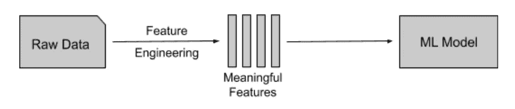
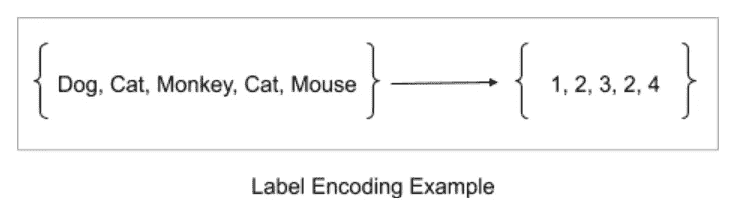
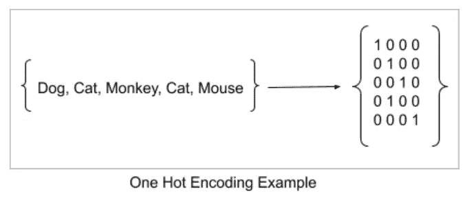

# 实现更高效机器学习的基本特征工程

> 原文：<https://towardsdatascience.com/basic-feature-engineering-to-reach-more-efficient-machine-learning-6294022e17a5?source=collection_archive---------11----------------------->

Photo by [Lenny Kuhne](https://unsplash.com/@lennykuhne?utm_source=unsplash&utm_medium=referral&utm_content=creditCopyText) on [Unsplash](https://unsplash.com/collections/42387389/holtryd?utm_source=unsplash&utm_medium=referral&utm_content=creditCopyText)

如果我问你一个问题，比如机器学习难吗，你可能会说是的。但是机器学习并不是一件难事。因为您可能需要的每一个算法都是预先实现的，并以包的形式提供(主要在 python 库中)。您可以导入您想要的任何库，然后开始构建模型。但是几乎所有这些算法都是对数值数据或二进制数据进行操作的。所以你不能直接输入一个特征集就指望算法能起作用。尤其是当数据集中有非数字数据时，机器学习模型不会像预期的那样工作，并且准确率非常低。**我们必须清理这些非数字数据，提取有用的数字嵌入**。清洁不仅如此。我们必须处理缺失值、共线特征、零重要特征等等。但这还不够。我们必须从清理后的特征中为机器学习模型导出更有意义的特征。您可以在本文后面找到这些主题的更多细节。所有这些都被称为特征工程。特征工程是机器学习中最重要也是最困难的任务。

# 处理非数字数据

首先，您必须将非数字特征转换成数字格式。有两种类型的字符串数据，即分类数据和连续数据。

# 分类特征

分类数据/特征是具有有限数量标签或类别的变量。根据性质，**分类数据可以分为序数数据和名词性数据**。当值有自然顺序时，属性就是序数属性。例如，功能关键级别可以是低、中或高，并且有一定的顺序。当我们不能推导出任何类别之间的顺序或关系时，它被称为一个名义特征。例如，一个国家的省或区没有顺序。然而，这是一个分类属性，因为一个国家有固定数量的省或区。

将分类数据转换成数字格式的流行技术很少。**即使对于像决策树和随机森林这样可以处理分类数据的算法，编码也是有意义的**。

## 1.标签编码

标签编码将非数字标签转换为数字标签。对于有序分类数据来说，这种编码类型**更好，如果数据集中的分类要素数量巨大，您可能会经常使用标签编码。因为像热编码这样的编码技术会导致高内存消耗。您可以轻松地从 python scikit 学习库中导入标签编码器。但是，标签编码会使 ml 模型误解数据中存在某种排序。为了克服这个问题，我们可以使用一热编码。**

## 2.一个热编码

在一个热编码中，我们为分类属性的每个类创建虚拟列。对于每个伪属性，类的存在表示为 1，不存在表示为 0。所以这些数字用 1 和 0 来表示。我们使用一个热编码**和名义数据**。您可以很容易地从 python scikit 学习库中导入一个 hot 编码器。

## 3.二进制编码

在二进制编码中，首先将类转换成数字格式，然后再转换成相应的二进制字符串。然后，二进制数字被分成单独的列。

## 4.张量流特征列

特征列将输入数据与您的机器学习模型联系起来。Tensorflow 提供了一个包含**九个函数的模块来处理特征列**。下面列出了这些功能。从 tensorflow 官方文档中可以找到很好的解释([点此](https://www.tensorflow.org/guide/feature_columns))。

*   数字列
*   桶形塔
*   分类标识列
*   分类词汇栏(词汇文件)
*   分类词汇栏(词汇列表)
*   散列列
*   交叉柱
*   指示器列
*   嵌入柱

# 连续特征

在数学中，如果一个变量可以取最小值和最大值之间的任何值，那么它被称为连续变量。同样的事情也适用于这里。但是，**如果变量没有最小值和最大值，那么我们可能会遇到麻烦，因为变量可能会为机器学习模型**创建稀疏特征。稀疏特征对机器学习模型没有任何意义，在我看来，最好是摆脱它们。但问题是**从数据集中删除特征会降低 ml 算法的准确性**。因此，我们应该尽一切可能将该特性转化为有用的格式。如果没有选项，那么最好放弃该功能，因为它使机器学习模型比使用它更准确。

在某些情况下，我们也许能够从字符串数据中导出更有用的数字特征。例如，考虑一个带有 ip 地址的特性列。作为一个特性，ip 地址是字符串数据。我们可以通过将 ip 地址分成四个二进制八位数并应用简单的数学运算来将其转换成整数。这个整数数据可以被输入到一个 ml 模型中，并期望它能很好地工作。但是我们可以通过从 ip 获取经度和纬度来获得一个更有用的特性。您可以使用免费的 API 或数据库或任何其他技术来将 ip 转换为相关坐标。在我看来，我们或许可以通过获取地理位置坐标，而不是简单地将 ip 转换为整数，来为机器学习模型导出更有意义的特征。

正如您可能理解的那样，处理连续变量是一项有点困难的任务。然而，有一些流行的技术来处理连续变量。下面列出的只是其中的一些，你可能会发现更多的技巧。

## 1.变量宁滨

宁滨将连续的数字变量分组。基本上，这样做是为了发现难以识别的变量模式。例如，年龄列表可以根据取值范围划分为多个区间。然而，最重要的是箱子的大小。你可以根据你的假设决定一个最佳的箱子大小。

## 2.正常化

规范化用于将数字列的值更改为通用的比例。在数学中，你可能会发现正态分布的数据很容易阅读和解释。许多机器学习算法假设其数据点呈正态分布。特别是在 K-means 这样的聚类技术中，归一化非常有帮助。一种常用的归一化技术是获取 z 值。

## 3.理解业务逻辑

在某些情况下，数据本身并不能说明任何模式。但是通过理解业务逻辑或领域可以帮助你找出更有意义的特性。这就是为什么**你可能经常在一个机器学习小组**中找到一个或多个领域专家。他们非常了解业务领域及其运作方式，能够从现有特征中创造出更有意义的特征，从而为机器学习模型衍生出可识别的模式。这种技术不仅适用于连续数据，也适用于其他类型的数据。

# 特征选择

在处理完非数字特征之后，你必须进行特征选择。特征选择是选择属性的过程，这些属性可以使 ml 模型更加精确，并消除不相关的属性。下面列出了一些最常见的特征选择技术。

## 1.缺失值处理

当我们收集真实世界的数据时，可能会有缺失值。这导致数据集的列中包含缺失值。缺失值可能导致机器学习模型识别数据点之间的错误模式，并给出错误和不太准确的预测。通过将数据集读取为 pandas 数据框，您可以很容易地发现数据集是否有缺失值。熊猫图书馆有很多内置的方法来轻松处理 csv 数据。下面列出了一些处理缺失值的技巧。

## 一.删除

这是处理缺失值的最基本的方法。基本思想是删除任何缺失值超过指定阈值的列。然而，删除列将减少机器学习模型的特征数量，并导致模型不太准确。在我看来，保留数据比删除数据更好。

## 二。使用回填或前填

该方法将为缺失值分别传播下一个或上一个值。但是，如果下一个或上一个值也是 NaN 或不可用，则 NaN 值将保持不变。

## 三。常量值插补

该方法将使用一个全局常量来填充所有缺失的值。当尝试和预测缺失值没有意义时，可以使用常量值插补。主要的缺点是 ml 模型的性能会下降。

## 四。均值、中值和众数插补

我们可以用列的平均值或中值来填充缺失值，而不是用单个常数来填充缺失值。这种方法单独处理每个变量，忽略与其他变量的任何关系。

## 动词 （verb 的缩写）使用预测模型

有时，我们使用机器学习模型通过识别属性之间的关系来预测缺失值。通过考虑上述技术，**这是一种更加有效的填补缺失值的方法。但是准确性完全取决于你的预测模型有多好**。

## 2.共线特征

共线特征是高度依赖于另一个特征的特征。由于高方差和较低的模型可解释性，共线特征导致综合性能下降。基于特定的相关系数来识别相关水平**。我们移除相关系数大于指定阈值的特征。但是，我们应该从两个相关的特征中只移除一个特征，因为移除特征会降低机器学习模型的准确性。有两个著名的系数，**皮尔逊相关系数和斯皮尔曼相关系数**。这两者都可以从 scipy python 库中导入。皮尔逊相关可用于具有线性关系的连续变量。Spearman 相关可用于具有非线性关系的变量或有序分类变量。我们可以使用 python seaborn 热图轻松地可视化变量之间的相关性。**

## 3.零/低重要特性

零重要和低重要特征对于机器学习模型没有任何意义。可以使用梯度推进机器学习模型(GBM)来计算特征的重要性。您可以移除不太重要的特征，因为它们对于 ml 模型进行预测并不重要。然而，**这种方法只适用于有非确定性标记数据的监督模型，如果我们要使用基于树的方法进行预测**。但更重要的是，你应该试着从这些特性中衍生出新的有意义的特性。可能存在这样的情况，即使特征本身不太重要，也有可能导出更有意义的特征。

## 4.单一独特价值特征

这里，我们删除了在整个数据集中具有单一唯一值的列，因为机器学习模型无法从这些列中得出任何结论。

# 结论

我简要描述了一些流行的基本特征工程技术，包括处理非数字数据和特征选择技术。使用 python scikit learn 库和 pandas 库可以轻松实现上述所有技术。但是特征工程是一个非常广泛的话题，还有更多的内容要涵盖。特征工程中最重要的技术之一是**从现有特征**中派生出更有意义的新特征。几乎所有机器学习模型的成功都取决于**我们如何向我们的模型**呈现数据。我们可以通过获取现有特征之间的比率、取平均值或中值、交叉特征等来导出新特征。例如，如果我们正在为一个分类问题进行特征工程，新的特征应该以一种模型可以容易地区分数据点之间的聚类的方式出现。

最后但同样重要的是，有许多方法可以实现自动化特征工程。**自动化特征工程旨在从现有特征中自动创建许多候选特征**。从这些生成的特征中，我们可以选择最好的来训练我们的模型。Featuretools 是一个用于自动化特征工程的开源 python 框架。