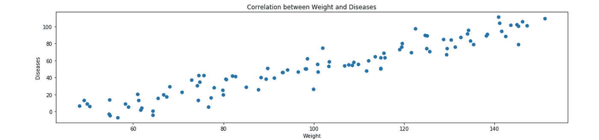
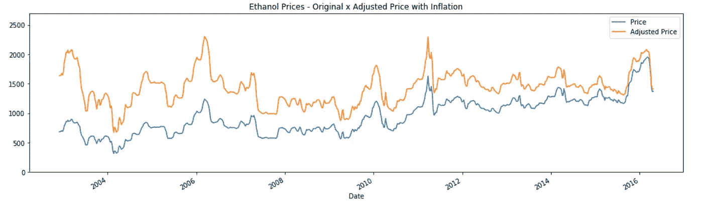

# 创建时间序列预测的基本原则

> 原文：<https://towardsdatascience.com/basic-principles-to-create-a-time-series-forecast-6ae002d177a4?source=collection_archive---------3----------------------->

## 解释创建*时间序列预测*的基本步骤。


Photo by [Adrian Schwarz](https://unsplash.com/photos/XS7q-baZrmE?utm_source=unsplash&utm_medium=referral&utm_content=creditCopyText) on [Unsplash](https://unsplash.com/?utm_source=unsplash&utm_medium=referral&utm_content=creditCopyText)

我们被随处可见的模式所包围，人们可以注意到与天气有关的四季模式；指交通流量的高峰时间模式；在你的心跳中，在股票市场的股票中，也在某些产品的销售周期中。

分析时间序列数据对于检查这些模式和创建未来预测非常有用。创建这些预测有几种方法，在这篇文章中，我将介绍最基本和传统的方法。

所有代码都是用 Python 写的，另外，任何附加信息都可以在我的 [Github](https://nbviewer.jupyter.org/github/leandrovrabelo/tsmodels/blob/master/notebooks/english/Basic%20Principles%20for%20Time%20Series%20Forecasting.ipynb) 上看到。

那么让我们开始评论分析*时间序列*的初始条件:

# 平稳序列

平稳时间序列的统计特性，如均值、方差和自相关，在一段时间内相对恒定。因此，非平稳序列是其统计特性随时间而变化的序列。

在开始任何预测建模之前，有必要验证这些统计属性是否恒定，我将在下面解释这些要点:

*   常数平均值
*   恒定方差
*   自相关的

# 常数平均值

平稳序列有一个相对恒定的平均值，没有看涨或看跌趋势。有一个恒定的平均值，周围有小的变化，更容易推断未来。

在有些情况下，方差相对于平均值较小，使用它来预测未来可能是一个很好的指标，下面的图表显示了相对恒定的平均值与方差之间的关系:


在这种情况下，如果序列不是稳定的，对未来的预测将是无效的，因为平均值周围的变化会显著偏离，如下图所示:


在上面的图表中，很明显有一个看涨的趋势，均值在逐渐上升。在这种情况下，如果用平均值来预测未来，误差会很大，因为预测价格总是低于实际价格。

# 恒定方差

当序列具有恒定的方差时，我们对相对于平均值的标准方差有一个概念，当方差不恒定时(如下图),预测在某些时期可能会有较大的误差，这些时期将是不可预测的，预计方差将随着时间的推移保持不变，包括在未来。


为了减少方差影响，可以应用对数变换。在这种情况下，也可以使用指数变换，如 Box-Cox 方法，或使用通货膨胀调整。

# 自相关序列

当两个变量在一段时间内相对于标准偏差具有相似的变化时，你可以说这些变量是相关的，例如，当体重随着心脏疾病而增加时，体重越大，心脏问题的发生率就越高。在这种情况下，相关性为正，图表看起来如下所示:



负相关的一个例子是:对工作安全措施的投资越大，与工作相关的事故就越少。

以下是几个具有相关级别的散点图示例:


source: [wikipedia](https://upload.wikimedia.org/wikipedia/commons/d/d4/Correlation_examples2.svg)

当主题为**自相关**时，表示某些之前的时段与当前时段存在相关性，具有这种相关性的时段被命名为*，例如，在一个每小时都有测量值的序列中，今天 12:00 的温度与 24 小时前 12:00 的温度非常相似。如果你比较这 24 宫时间范围内的温度变化，将会有一个自相关，在这种情况下，我们将有一个与第 24 宫时间范围的自相关。*

*自相关是用单个变量创建预测的条件，因为如果没有相关性，就不能使用过去的值来预测未来，当有多个变量时，就可以验证因变量和自变量的滞后之间是否存在相关性。*

*如果一个序列不具有自相关性，那么它就是一个具有随机和不可预测序列的序列，进行预测的最佳方法通常是使用前一天的值。下面我会用更详细的图表和解释。*

*从这里我将分析 Esalq 的每周含水乙醇价格(这是在巴西谈判含水乙醇的价格参考)，数据可以在这里下载。*

*价格以每立方米巴西雷亚尔(BRL/m3)为单位。*

*在开始任何分析之前，让我们在训练和测试集上分割数据*

# *在培训和测试的基础上划分数据*

*当我们要创建时间序列预测模型时，将数据分成两部分至关重要:*

***训练集**:这些数据将是定义模型系数/参数的主要依据；*

***测试集**:这些数据将被分离出来，不会被模型看到，以测试模型是否工作(一般情况下，这些值与一个向前移动的方法进行比较，最后测量平均误差)。*

*测试集的大小通常约为总样本的 20%,尽管该百分比取决于您拥有的样本大小以及您希望提前多长时间进行预测。理想情况下，测试集应该至少与所需的最大预测范围一样大。*

*与其他预测方法不同，例如不受时间影响的分类和回归，在时间序列中我们不能用来自数据任何部分的随机样本来划分训练和测试数据，我们必须遵循序列的时间标准，其中训练数据应该总是在测试数据之前。*

*在这个 Esalq 含水价格的例子中，我们有 856 周，我们将使用前 700 周作为训练集，最后 156 周(3 年~ 18%)作为测试集:*

**

*从现在开始，我们将只使用训练集来进行研究，测试集将只用于验证我们将做出的预测。*

*每个时间序列都可以分解成 3 个部分:**趋势、季节性**和**残差**，这是从序列中去除前两个部分后剩余的部分，低于这些部分的分离:*

**

*很明显，该系列呈上升趋势，峰值出现在每年的年末和年初，最小值出现在 4 月和 9 月(巴西中南部甘蔗压榨开始)。*

*然而，它表明使用统计测试来确认序列是否是平稳的，我们将使用两个测试:T4 迪基-富勒测试和 KPSS 测试。*

*首先，我们将使用 Dickey-Fuller 检验，我将使用基数为 5%的 P 值，也就是说，如果 P 值低于这 5%,这意味着该序列在统计上是平稳的。*

*此外，还有模型的**统计测试**，其中这些值可以与 1%、5%和 10%的**临界值**进行比较，如果统计测试低于某个选定的临界值，序列将是稳定的:*

**

*在这种情况下，Dickey-Fuller 检验表明序列不是平稳的(P 值 36%和临界值 5%小于统计检验)。*

*现在，我们将使用 KPSS 检验来分析该序列，与迪基-富勒检验不同，KPSS 检验已经假设该序列是平稳的，只有当 P 值小于 5%或统计检验小于某个值时才不会是平稳的:*

**

*KPSS 检验证实了迪基-富勒检验，也表明序列不是平稳的，因为 P 值为 1%，统计检验高于任何临界值。*

*接下来，我将演示将数列转化为平稳数列的方法。*

# *将该系列转变为静止的*

# *区别*

*差分用于移除趋势信号并减少方差，它只是周期 **T** 的值与前一周期 **T-1** 的值的差。*

*为了更容易理解，下面我们只得到乙醇价格的一小部分，以便更好地可视化，请注意，从 2005 年 5 月到 2006 年 5 月中旬，价格开始上涨，这些价格每周上涨，累积起来形成一个上升趋势，在这种情况下，我们有一个非平稳序列。*

**

*在进行第一次微分时(如下图)，我们移除了系列的累积效应，仅显示了整个系列中期间 **T** 相对于期间 **T-1** 的变化，因此，如果 3 天前的价格是 BRL 800.00，并更改为 BRL 850.00，微分的值将是 BRL 50.00，如果今天的值是 BRL 860.00，则差值将是-BRL 10.00。*

**

*通常只需要一次微分就可以将一个数列转化为平稳数列，但是如果有必要，可以进行第二次微分，在这种情况下，将对第一次微分的值进行微分(很少有超过两次微分的情况)。*

*使用相同的例子，为了进行第二次微分，我们必须对 **T** 减去 **T-1** 进行微分:BRL 2.9—BRL 5.5 =—BRL 2.6，以此类推。*

**

*让我们做一下 Dickey-fuller 检验，看看这个级数在第一次微分时是否是平稳的:*

**

*在这种情况下，我们确认序列是平稳的，P 值为零，当我们比较统计测试的值时，它远低于临界值。*

*在下一个示例中，我们将尝试使用通货膨胀调整将序列转换为平稳序列。*

# *通货膨胀调整*

*价格是相对于交易时间而言的，2002 年乙醇的价格是 BRL 680.00，如果这种产品的价格在今天以这个价格交易，肯定会有许多工厂关闭，因为这是一个非常低的价格。*

*为了使系列平稳，我将使用 IPCA 指数(巴西 [CPI 指数](https://en.wikipedia.org/wiki/Consumer_price_index))根据当前值调整整个系列，该指数从培训期结束(2016 年 4 月)一直累积到研究开始，数据来源在[巴西地理统计局](https://agenciadenoticias.ibge.gov.br/agencia-detalhe-de-midia.html?view=mediaibge&catid=2102&id=2807)网站上。*

**

*现在让我们看看级数是如何变得，以及它是否变得平稳。*

**

*可以看出，上升趋势已经消失，只剩下季节性振荡，迪基-富勒测试也证实了该系列现在是平稳的。*

*出于好奇，请看下图，图中显示了相对于原始系列的通货膨胀调整后的价格。*

**

# *减少方差*

# *对数*

*对数通常用于将具有指数增长值的序列转换为更具线性增长的序列，在本例中，我们将使用自然对数(NL)，其中底数为 2.718，这种对数广泛用于经济模型中。*

*转换为 NL 的值的差异大约等于原始系列值的百分比变化，这是减少不同价格系列差异的有效基础，请参见下面的示例:*

```
*If we have a product that had a price increase in 2000 and went from BRL 50.00 to 52.50, some years later (2019) the price was already BRL 100.00 and changed to BRL 105.00, the absolute difference between prices is BRL 2.50 and BRL 5.00 respectively, however the percentage difference of both is 5%.*
```

*当我们在这些价格中使用 LN 时，我们得到:NL (52，50)-NL(50，00) = 3，96–3，912 = 0，048 或 4.8%，以同样的方式在第二个价格序列中使用 LN，我们得到:NL(105)-NL(100)= 4.654–4.605 = 0.049 或 4.9%。*

*在这个例子中，我们可以通过将几乎所有东西放在同一个基础上来减少值的变化。*

*下面同一个例子:*

*Result: **The percentage variation of the first example is 4.9 and the second is 4.9***

*下表比较了 X 的百分比变化值与 NL (X)的变化值:*

**

*[Source](http://people.duke.edu/~rnau/411log.htm)*

*让我们绘制原始序列和 NL 变换序列之间的对比图:*

**

# *Box-Cox 变换(幂变换)*

*BOX COX 变换也是一种变换级数的方法，λ(λ)值是用于变换级数的参数。*

*简而言之，该函数是几个指数变换函数的结合点，在这里我们搜索变换级数的最佳λ值，使其具有更接近正态高斯分布的分布。使用此变换的一个条件是序列只有正值，公式为:*

**

*下面，我将绘制原始序列及其分布，然后绘制具有最佳λ值的变换序列及其新分布，为了找到λ值，我们将使用库 [Scipy](https://docs.scipy.org/doc/scipy/reference/generated/scipy.stats.boxcox.html) 的函数 **boxcox** ，它生成变换序列和理想λ:*

**

*下面是一个交互式图表，您可以在其中更改 lambda 值并检查图表中的更改:*

**

*此工具通常用于提高模型的性能，因为它使模型更符合正态分布，请记住，在完成模型的预测后，您必须返回到原始基数，根据下面的公式对变换进行反演:*

**

# *寻找相关的滞后*

*要想预测，单变量序列必须具有自相关性，也就是说，当前周期必须基于更早的周期进行解释(一个**滞后**)。*

*由于该系列具有周周期，1 年大约是 52 周，我将使用显示 60 个滞后周期的自相关函数来验证当前周期与这些滞后的相关性。*

**

*分析上面的自相关图表，似乎所有的滞后都可以用于创建对未来事件的预测，因为它们具有接近 1 的正相关性，并且它们也在置信区间之外，但是该特征是非平稳序列。*

*另一个非常重要的功能是部分自相关功能，其中先前滞后对当前周期的影响被移除，并且仅在当前周期上被分析的滞后的影响被保留，例如:第四个滞后的部分自相关将移除第一、第二和第三个滞后的影响。*

*在部分自相关图下面:*

**

*可以看出，几乎没有滞后对当前周期产生影响，但是如前所述，没有微分的序列不是稳定的，我们现在将绘制这两个函数与具有一个微分的序列的关系，以了解其工作原理:*

**

*自相关图发生了显著变化，表明该序列仅在第一个滞后期具有显著相关性，在第 26 个月(半年)左右具有负相关的季节性效应。*

*要创建预测，我们必须注意一个关于寻找相关滞后的极其重要的细节，这种相关性背后有一个原因是很重要的，因为如果没有逻辑原因，这可能只是一个机会，当您包含更多数据时，这种相关性可能会消失。*

*另一个要点是，自相关和部分自相关图对异常值非常敏感，因此分析时间序列本身并与两个自相关图进行比较非常重要。*

*在这个例子中，第一个滞后与当前周期具有高相关性，因为前一周的价格历史上没有显著变化，在相同的情况下，第 26 个滞后呈现负相关性，表明与当前周期相反的趋势，这可能是由于一年中供应和需求的不同周期。*

*由于通货膨胀调整后的序列已经稳定，我们将使用它来创建我们的预测，在调整后的序列的自相关和部分自相关图下方:*

**

*我们将只使用前两个滞后作为自回归序列的预测值。*

*要了解更多信息，杜克大学教授罗伯特·瑙的[网站](http://people.duke.edu/~rnau/411home.htm)是与该主题相关最好的网站之一。*

# *评估模型的指标*

*为了分析预测值是否接近当前值，必须测量误差，这种情况下的误差(或残差)基本上是 Yreal YpredYreal Ypred。*

*评估训练数据中的错误以验证模型是否具有良好的断言性，并通过检查测试数据中的错误(模型“看不到”的数据)来验证模型。*

*当您将训练数据与测试数据进行比较时，检查错误对于验证您的模型是过拟合还是欠拟合非常重要。*

*以下是用于评估时序模型的关键指标:*

# *平均预测误差—(偏差)*

*它只不过是被评估系列误差的平均值，值可以是正的也可以是负的。这一指标表明模型倾向于做出高于真实值(负误差)或低于真实值(正误差)的预测，因此也可以说**平均预测误差**是模型的偏差。*

# *平均绝对误差*

*这个度量非常类似于上面提到的预测的平均误差，唯一的区别是将负值误差转换为正值，然后计算平均值。*

*此指标广泛用于时间序列，因为在某些情况下，负误差可以抵消正误差，从而表明模型是准确的，但在 MAE 的情况下，这种情况不会发生，因为此指标显示了预测值与实际值的差距，无论是高于还是低于实际值，请参见下面的情况:*

*Result: **The error of each model value looks like this: [-4 -2 0 2 4]
The MFE error was 0.0, the MAE error was 2.4***

# *MSE——均方误差*

*该指标对较大的误差给予更大的权重，因为每个误差值都是平方的，然后计算平均值。因此，该指标对异常值非常敏感，并对具有更大误差的预测给予很大权重。*

*与 MAE 和 MFE 不同，MSE 值采用二次单位，而不是模型的单位。*

# *RMSE —均方根误差*

*此指标是 MSE 的平方根，其中误差返回到模型的测量单位(BRL/立方米)，它在时间序列中非常常用，因为它对源于平方过程的较大误差更敏感。*

# *MAPE —平均绝对百分比误差*

*这是另一个有趣的指标，通常用在管理报告中，因为误差是以百分比来衡量的，所以产品 X 的误差可以与产品 y 的误差进行比较。*

*此指标的计算采用误差的绝对值除以当前价格，然后计算平均值:*

**

*让我们创建一个函数，用几个评估指标来评估训练和测试数据的错误:*

# *检查残值*

*根据所选的度量标准创建模型并检查误差值是不够的，您还必须分析残差本身的特征，因为在有些情况下，模型无法捕获做出良好预测所必需的信息，从而导致用于改进预测的信息出现错误。*

*为了验证该残差，我们将检查:*

*   ***当前值与预测值(顺序图)**；*
*   ***残差与预测值(离差图)**:*

*分析此图非常重要，因为在其中我们可以检查模式，这些模式可以告诉我们模型中是否需要一些修改，理想情况是误差沿着预测序列线性分布。*

*   *[**【QQ 剧情】**](https://en.wikipedia.org/wiki/Q%E2%80%93Q_plot) **【残(散图)】**:*

*总结一下，这张图显示了残差在理论上的分布，遵循高斯分布，而实际上是如何分布的。*

*   ***残差自相关(顺序图):***

*其中不应有超出置信界限的值，或者模型将信息排除在模型之外。*

*我们需要创建另一个函数来绘制这些图形:*

# *最基本的预测方法*

*从现在开始，我们将创建一些含水乙醇的价格预测模型，下面是我们将为每个模型遵循的步骤:*

*   *根据训练数据创建预测，然后根据测试数据进行验证；*
*   *根据上述指标检查每个模型的误差；*
*   *用剩余比较值绘制模型。*

*让我们看看模特们:*

# *天真的方法:*

*进行预测的最简单方法是使用前期的值，这是在某些情况下可以做到的最佳方法，与其他预测方法相比，这种方法的误差较低。*

*一般来说，这种方法不能很好地预测未来的许多时期，因为相对于实际值，误差往往会增加。*

*许多人也使用这种方法作为基线，试图改进更复杂的模型。*

*下面我们将使用训练和测试数据进行模拟:*

**

*QQ 图显示，存在一些比理论上应该的更大的(上下)残差，这些是所谓的异常值，并且在第一、第六和第七滞后中仍然存在显著的自相关，这可以用于改进模型。*

*同样，我们现在将在测试数据中进行预测。预测系列的第一个值将是训练数据的最后一个值，然后这些值将由测试的当前值逐步更新，依此类推:*

**

*RMSE 和梅误差与训练数据相似，QQ 图的残差更符合理论上的情况，这可能是由于与训练数据相比样本值较少。*

*在比较残差与预测值的图表中，注意到当价格增加时，误差的绝对值有增加的趋势，也许对数调整会减少这种误差扩大，最终确定残差相关图表明仍有改进的空间，因为在第一个滞后中有很强的相关性，其中可能会添加基于第一个滞后的回归以改进预测。下一个模型是简单平均值:*

# *简单平均值:*

*另一种进行预测的方法是使用序列平均值，通常这种形式的预测适用于值在平均值附近波动、方差恒定且没有上升或下降趋势的情况，但是也可以使用更好的方法，其中可以使用季节模式进行预测。*

*该模型使用数据开始时的平均值，直到前一个分析周期，并且每天扩展，直到数据结束，最后，趋势是直线，我们现在将比较该模型与第一个模型的误差:*

**

*在测试数据中，我将继续使用从训练数据开始的平均值，并使用将添加到测试数据中的值来扩展平均值:*

**

*简单均值模型未能捕捉到序列的相关信息，这可以从实际与预测图以及相关和残差与预测图中看出。*

# *简单移动平均线:*

*移动平均值是为给定期间(例如 5 天)计算的平均值，并且是移动的，并且总是使用该特定期间进行计算，在这种情况下，我们将总是使用过去 5 天的平均值来预测第二天的值。*

**

*误差低于简单平均值，但仍高于简单模型，低于测试模型:*

**

*与训练数据类似，移动平均线模型优于简单平均线模型，但是它们还没有从简单模型中获益。*

*预测在两个滞后中具有自相关，并且误差相对于预测值具有非常高的方差。*

# *指数移动平均线:*

*上面描述的**简单移动平均**模型具有平等对待最后 X 个观察值并完全忽略所有先前观察值的特性。直觉上，过去的数据应该逐渐被忽略，例如，最近的观察结果理论上应该比第二最近的稍微重要一点，第二最近的应该比第三最近的稍微重要一点，以此类推，**指数移动平均线(EMM)** 模型就是这样做的。*

*由于**α**(α)是一个介于 0 和 1 之间的常数，我们将使用以下公式计算预测值:*

**

*当预测的第一个值是相应的当前值时，其他值将被更新为实际值与前一时段的预测值之差的 **α** 倍。当 **α** 为零时，我们有一个基于第一个预测值的常数，当 **α** 为 1 时，我们有一个采用**简单方法**的模型，因为结果是前一个真实周期的值。*

*下图是几个 **α** 值的图表:*

**

*EMM 预报的平均数据周期为 1 / **α** 。比如当 **α** = 0.5 时，滞后相当于 2 个周期；当 **α** = 0.2 时，滞后 5 个周期；当 **α** = 0.1 时，滞后为 10 个周期，以此类推。*

*在这个模型中，我们将任意使用 0.50 的 **α** ，但是您可以执行*网格搜索*来寻找 **α** ，这减少了训练和验证中的误差，我们将看到它看起来是什么样子:*

**

*该模型的误差类似于移动平均线的误差，但是，我们必须在测试库中验证该模型:*

**

*在验证数据中，迄今为止的误差是我们已经训练的模型中第二好的，但是残差的图形特征与 5 天移动平均模型的图形非常相似。*

# *自回归:*

*自回归模型基本上是具有显著相关滞后的线性回归，其中自相关和偏自相关图表应首先绘制以验证是否有任何相关。*

*以下是训练序列的自相关和偏自相关图表，显示了具有显著相关性的两个滞后的自回归模型的特征:*

**

*下面，我们将基于训练数据创建模型，在获得模型的系数后，我们将它们乘以测试数据所执行的值:*

**

*与我们训练的所有其他模型相比，此模型中的误差最低，现在让我们使用其系数来逐步预测训练数据:*

**

*请注意，在测试数据中，误差没有保持稳定，甚至比**简单模型**更差，请注意，在图表中，预测值几乎总是低于当前值，偏差测量显示实际值比预测值高 BRL 50.19，可能调整训练模型中的一些参数，这种差异会减小。*

*为了改进这些模型，你可以应用一些转换，比如本文中解释的那些，你也可以添加外部变量作为预测源，但是，这是另一篇文章的主题。*

# *最终考虑*

*每个时间序列模型都有自己的特点，应该单独分析，以便我们可以提取尽可能多的信息，做出良好的预测，减少未来的不确定性。*

*检查平稳性、转换数据、在训练数据中创建模型、验证测试数据以及检查残差是创建良好的时间序列预测的关键步骤。*

*另见我关于 [ARIMA 车型](https://www.kaggle.com/leandrovrabelo/climate-change-forecast-sarima-model)的帖子。*

*我希望你喜欢这篇文章，如果你有任何问题或你需要的信息，不要犹豫，通过我的 [LinkedIn](https://www.linkedin.com/in/leandro-rabelo-08722824) 联系我，也可以在这里评论。*