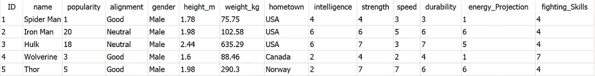

# 基本 SQL 决定:我最喜欢的漫威角色

> 原文：<https://towardsdatascience.com/basic-sql-decides-my-most-preferred-marvel-character-e393fb044397?source=collection_archive---------16----------------------->

[Accredited to Unsplash](https://unsplash.com/photos/7DVmV22nieQ)

> ***P.S*** *致敬斯坦·李(1922–2018)*

## 介绍

作为一个被同龄男孩包围的年轻女孩，我们最喜欢的游戏之一是重演一部超级英雄电影(与其说是重演，不如说是改写)，并选择我想扮演的超级角色。当时，我的选择非常主观，取决于哪个角色在我的记忆中仍然清晰，我的心情如何，以及我认为谁可以“假设”消除我玩伴的角色。

最近在回忆“那些美好的旧时光”时，我开始思考如何才能找出我最喜欢的漫威角色应该是谁。我认为“统计学和 SQL 可以解决这个难题”。

我决定引导我内心的*“歇洛克·福尔摩斯”和*结构来完成这个任务，这就是我想到的。

**项目流程**

*   阐明我的目标
*   找到数据
*   将数据插入数据库并清理数据
*   重新明确我的目标，并想出该用什么方法
*   操作:分析
*   获得结果，总结并思考可以改进的地方

## 客观澄清

这可能是(有争议的)任何分析中最重要的部分，尤其是如果你不想迷失在数据中，无休止地兜圈子。我的主要目的是**用一个足够好的理由，而不是感情或“一时冲动”的时刻，来找出我最喜欢的超级角色应该是谁，也就是说，从统计学上来说**做出选择**。**

## 数据

通过确定一个目标，我对我的数据应该包括什么有了一个清晰的想法:英雄的名字和跨越所有英雄的能力，或者可以使用 z 分数标准化的评级能力。

我决定只关注漫威的角色，因为我更喜欢他们。没有阴影的意图

我终于从一个名为 [Mentrasto](https://gist.github.com/Mentrasto/967148a4b41713977839) 的 Github 概要文件中找到了一个非常结构化的数据，它符合我的清单。这些数据由 26 个超级字符和 14 个特征组成，它们可以分为两类

1.  **个人详细信息**

*   `*ID*` :每个字符的唯一条目号
*   `name`:漫威人物的名字
*   `popularity`:基于排名的每个角色的受欢迎程度
*   `alignment`:区分角色是好(英雄)、坏(反派)还是只是中立
*   `gender`:如果一个角色是男是女
*   `height_m`:字符高度，单位为米
*   `weight_kg`:字符的重量，单位为千克
*   `hometown`:每个字符的起源

**2。能力类别&评级**

*   `intelligence` *:* 智力等级从 1 到 7。 *1 个是哑巴，7 个是天才*
*   `strength`:强度等级从 1 到 7。 *1 个是哑巴，7 个是聪明人*
*   `speed` *:* 从 1 到 7 的速度等级。 *1 傻 7 聪明*
*   `durability` *:* 耐久性等级从 1 到 7。1 个是哑巴，7 个是天才
*   `energy_projection` *:* 能量投射技能等级 1-7。 *1 傻 7 聪明*
*   战斗技能等级从 1 到 7。 *1 傻 7 聪明*

## 数据库存储

第三步是通过创建一个表并插入值来将我的数据存储在数据库中。我决定在这个项目中使用 SQLite，因为它是一个小型数据。

尽管数据源已经准备好被创建为数据库，但是您需要做的只是使用`CREATE TABLE`子句和`INSERT INTO`子句，您就可以开始分析了。这就是我的意思。

要创建表，请使用

或者就我而言

若要插入值，请使用

对我来说

你可以观看这个[视频](https://www.youtube.com/watch?v=Pni6WxHFTUg)来了解如何使用 SQLite 的要点。

我决定使用`SELECT *`子句来看看我的数据在 SQL 中是什么样子

## 重新阐明目标

有这么多计划外的专栏可用，我需要再次澄清我的目标，即**统计出谁是我最喜欢的角色。**

> 这意味着我唯一需要关注的个人信息是名字**。**

因为所有可用的英雄都基于 6 种能力被同等地评级，所以没有必要标准化数据。由于目标更多的是描述性的，而不是推断性的，所以想到的一个常见的趋势测量是**平均值。**

## 操作:分析

我直接进入主要任务，得到每个技能的平均值，计算每个英雄超过每个技能平均值的次数，然后选择最高的次数。

我做了`WITH`子句、集合函数和`CASE`语句。这基本上是一个包含大量`CASE`语句的完整查询。

这总结了我所有的分析。

但是让我带您浏览一下每个查询组件

使用`CASE`语句获得所有能力的平均值

然后合计从新列中得到的分数，使用`ORDER`子句对分数进行排序，并得到最上面的字符。您可以在下面找到用于捕获它的查询

瞧啊。您需要做的就是使用一个`WITH`语句将两个查询组合起来。

**结果呢？**

**胭脂**，x 战警的女成员赢了。

Disclaimer: Originated from [https://www.marvel.com/comics/discover/1018/rogue](https://www.marvel.com/comics/discover/1018/rogue)

老实说，这并没有让我感到惊讶，因为胭脂这个角色可以吸收任何变种人的能力并用它来对付他们，同时让他们虚弱甚至死亡。

> 现在我可以自信地扮演胭脂…任何一天

## **最终想法**

虽然这是一个非常酷的发现，但我意识到了一些事情。

*   这是一个非常小的数据库。一个更大的数据库，有更多的漫威人物和更多的判断能力，可能会得出完全不同的结果。下一步是获取更多的数据。

*请随时从* [*漫威数据库*](https://marvel.fandom.com/wiki/Marvel_Database) 获取更多数据

所使用的代码也可以应用于更大的数据。但是，这将取决于基于大小的优化(查询运行的速度)。

*你可以在我的 Github* [*这里*](https://github.com/anitaokoh/Most-Preferred-Marvel-Character) 查看我的代码

*   所用测量值的选择(*平均值或均值*)可能会受到异常值的影响。下一步是检查定量列中的异常值，如果有的话，使用**中值**度量。

## 奖金

我开玩笑地决定根据他们的身体质量指数(身体质量指数)对所有角色进行分类，因为数据是可用的，并且已经被转换成适当的维度。目的是看有多少人肥胖、超重、健康或瘦。这是我在下面得到的。

同样，我的数据中的所有角色都肥胖也不足为奇，特别是因为这些数据似乎是来自真实的卡通角色的细节，而不是扮演每个角色的人。因此，大多数漫画都是对人类的漫画，带有一些夸张的身体部位。

_____________________________ 结尾 _ _ _ _ _ _ _ _ _ _ _ _ _ _ _ _ _ _ _ _ _ _ _ _ _ _ _ _ _ _ _ _ _

像我一样，任何人都可以学习成为一名数据分析师，如果你想了解我的下一个项目或我学习的最新进展，请随时注册我的 [*简讯*](https://goo.gl/forms/aEbTwhSXRDAUa5tr1)