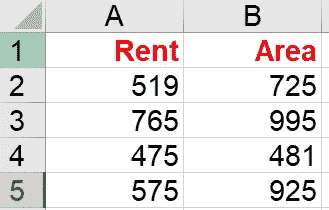
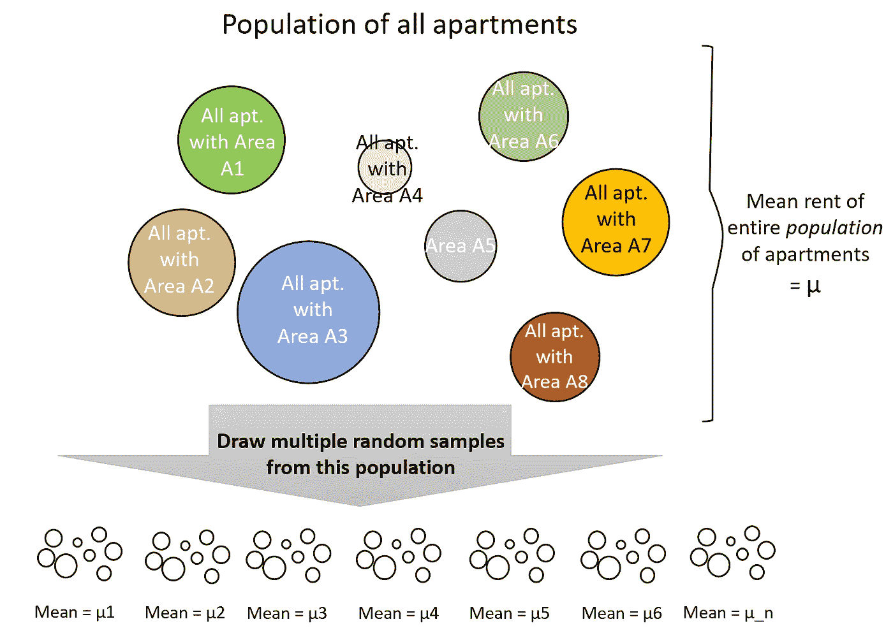
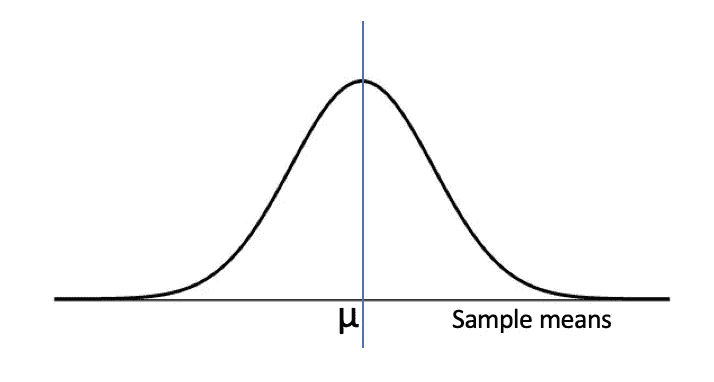

# 每位数据科学家的基本统计数据

> 原文：<https://towardsdatascience.com/basic-statistics-for-every-data-scientist-898ab5116a08?source=collection_archive---------21----------------------->

Photo by [Ruthson Zimmerman](https://unsplash.com/@ruthson_zimmerman?utm_source=medium&utm_medium=referral) on [Unsplash](https://unsplash.com?utm_source=medium&utm_medium=referral)

## 你对自己的估计有多少信心？！

从一个给定的数据集中计算一个变量的平均值可能很容易，但同样难以理解的是从中找出意义。你刚刚计算的平均值，实际上是多少？是人口平均数？但是等等！你只是带了一个代表整个人口的样本。记住，在统计学家的世界里，绝对没有什么是确定的。所以，是的，你刚刚计算的平均值有一些误差。那个错误是什么？回答这个问题需要你知道你想把这个意思解释为什么。

这篇博客将带你详细了解这些概念，并解释样本数据平均值的各种解释方式以及每种情况下的误差。博客中谈到的所有概念最后都以三个要点的形式进行了总结。

我将借助一个数据集来讨论这些概念，这个数据集可以扩展到任何场景中的任何数据集。

Sample Dataset

我们有一份奥斯汀公寓的清单，包括面积和租金。现在，除非我们拥有的数据涵盖了奥斯汀的每一套公寓，否则这将被称为未来的样本。这确实是真实的情况，几乎总是这样，我们只能接触到我们感兴趣的全部人群中的一个样本。

> 群体是每个感兴趣的数据点的集合。随机样本是从总体中随机收集的数据点的子集。

我们的公寓群有一批面积为 A1 的公寓，另一批面积为 A2 的公寓，等等。假设我们能得到的数据是从这个群体中随机抽取的样本，这个群体的平均租金是 1。

# 让我们解释一下样本的意思…

这个样本数据的平均租金可以用两种方式解释。1 是一个很好的估计-

**a)** **奥斯汀公寓全部人口的平均租金**。也就是说，如果你相信你的样本是随机产生的，那么总体均值可以很好地近似为样本均值。

**b)** **从所有奥斯汀公寓**的*人口*中随机选择的公寓。具体来说，如果你碰巧从整个城市中随机挑选了一套公寓，并想进行计算猜测——对其租金进行估计，你最好的选择是你可以获得的样本数据的平均值。

当谈到评估时，一个直接的后续问题是…

# 我们对自己的估计有多少信心？

在继续讨论误差范围和置信区间之前，我们将试图了解 1，2，3…之间的关系。这将有助于理解这个概念。

根据示例数据，假设我们的人口平均值(通常称为真实平均值)是 500 美元(实际上我们不知道，因为我们无法访问整个人口)。很有可能随机抽取的样本的平均值 I(我们可以从现有数据中计算出来)接近 500 美元。但是肯定会有一些随机的样本，在这些样本中你碰巧选择了所有租金高的公寓或者所有租金低的公寓。对于这样的样品，我会远离 500 美元。看起来我们可以有一个 I 的分布。

> 中心极限定理表明，如果观察值足够大，假设样本均值正态分布在真实总体均值附近是安全的。经验法则将“足够大”定义为 n=30。

除了这个正态分布，我们还需要了解另一个分布的特征。

> 单个公寓的租金在样本均值附近的分布不必是正态的。

一旦我们有了数据，我们需要做一些工作来弄清楚这个分布是什么样子的。但是我们知道的是，我们人口中的单个公寓将遵循与我们的随机样本关于样本均值相似的关于人口均值的分布。

牢记这些要点，让我们现在继续前进。

# 计算误差幅度和置信区间

开始时，我们对样本均值有两种解释。我们对这些估计有多少信心？

**a)作为总体均值估计的样本均值:**

从上面讨论的分布中，我们知道这些样本平均值与总体平均值相差多少。

> 误差幅度将是样本均值*总体(非个人公寓租金)*的标准偏差。

但是等等！我们只有一个样本！理论拯救了我们。数学证明-

样本均值的标准偏差=样本点的标准偏差/sqrt(观察值数量)

直觉上，这是有意义的，因为样本均值的标准差必须小于单个公寓的标准差！(随机)样本均值将围绕总体均值杂乱分布，我们可以预期它们非常接近于相同值，因此标准差很小。然而，样本中的单个公寓将表现出更多的变化，导致更高的标准偏差。现在，sqrt(n)的确切因子必须通过数学推导得出。

假设样本均值的标准差为 *x.* 下一个问题是，我们对真实总体均值在这个误差范围内的置信度是多少？

> 利用样本均值正态分布于总体均值的事实，我们可以 68%确信总体均值位于样本均值的 x 范围内。

**b)样本均值作为个人公寓租金的估计值**

既然我们说我们所取的样本是随机的，我们就可以用这个样本分布来近似我们总体的性质。因此，人口中单个公寓租金的标准差将与样本公寓租金的标准差相同(即 *x* ) *。*

> 因此，误差幅度就是租金的样本标准差。

对于实际租金将在这个误差范围内的置信度，如果租金是正态分布的，那么我们可以预期 68%的置信度。但是，由于个人租金关于平均值的分布不一定是正态的，所以需要做一些工作来计算置信区间(这将因每种分布类型而异)。一个简单的方法是计算样本均值 x 范围内的样本租金数，然后除以样本数据点数。

所有信息总结如下—

1.  样本均值是对 *a .总体均值*和 b. *单个数据点的良好估计。*
2.  当使用样本均值作为前者时，我们可以有 68%的把握认为真实均值在我们的误差范围内(使用正态分布的特征)。这里的误差幅度是样本均值分布相对于总体均值的标准偏差。这可以通过使用样本点相对于样本平均值的标准偏差来计算。
3.  当使用样本平均值作为单个数据点的估计值时，样本的标准偏差可用作误差范围。由于单个点关于其平均值的分布不一定是正态分布，置信区间将随手头的每个数据集而变化。

我要感谢托马斯·萨格教授在课堂上讲授这些概念。我尽力通过这个博客来传递我的学习成果。希望这有助于澄清围绕样本均值解释的混乱。如果你有任何问题，请在评论中告诉我！