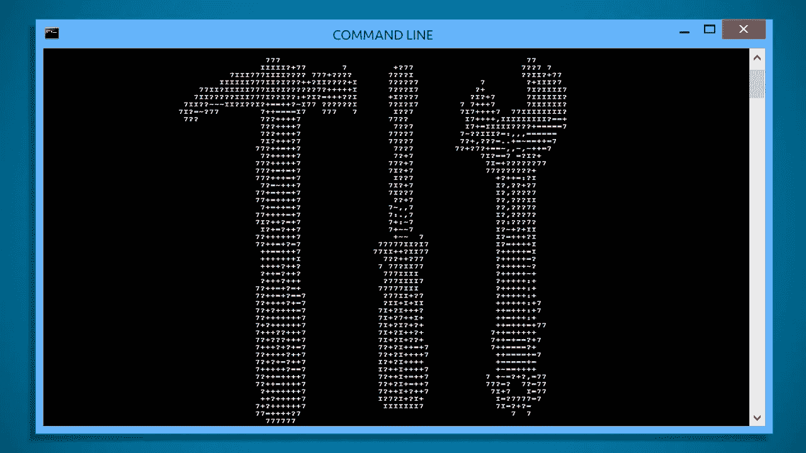
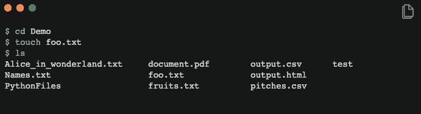

# 初学者 BASH 基础。

> 原文：<https://towardsdatascience.com/basics-of-bash-for-beginners-92e53a4c117a?source=collection_archive---------0----------------------->

## 了解一些最有用的 BASH 命令及其提供的实用程序。



[Source](https://i.kinja-img.com/gawker-media/image/upload/t_original/gjnvguvdl3455rotbwg4.jpg)

> 今天大多数计算机都不是由电力驱动的。相反，它们似乎是由鼠标的“跳动”提供动力的:威廉·肖特

你有没有注意到电影中的超级书呆子黑客如何通过凶猛地键入一些命令并盯着黑色背景的绿色屏幕，轻松地渗透到最安全的银行并抢劫它们？这个人是如何始终如一地获取所有密码，并在任何地方控制隐藏的摄像头，只需在键盘上敲几下。嗯，我不确定电影制作者是怎么得到这个的，但我猜这是他们告诉我们,**命令行**是一个强大的工具，尽管没有授权所有这些黑客攻击和访问！！荒谬。


很多时候，初学者非常习惯于使用基于 GUI 的界面，以至于他们往往会忽略命令行界面(CLI)的功能。当我们需要将大约十万个文件复制到一个文件夹中时，鼠标真的很方便，但是如果要重命名所有这些文件或者根据它们的扩展名将它们分开会怎么样呢？因为图形用户界面是不可编程的，所以我们要花很长时间用命令行来重命名或分隔它们，然而，我们可以用几行代码很快实现这一点。

对于各种开发人员来说，Unix shell 是一个非常强大的工具。本文旨在快速介绍从 UNIX 操作系统开始的基础知识。

# 一种多用户的计算机操作系统

除了基于 WINDOWS 的操作系统，今天的大多数操作系统都是建立在 UNIX 之上的。其中包括许多 Linux 发行版、macOS、iOS、Android 等等。仅仅浏览一下基于 UNIX 的操作系统的系谱就足以突出 UNIX 的重要性，这也是它在业界被广泛采用的原因。事实上，许多数据和计算系统的后端，包括像脸书和谷歌这样的行业巨头，都大量使用 UNIX。


The UNIX Family Tree. Source: [WIkipedia](https://en.wikipedia.org/wiki/File:Unix_history-simple.svg)

## 壳

Shell 是在计算机上运行程序的命令行界面。用户在提示符下键入一串命令，shell 为用户运行程序，然后显示输出。这些命令可以由用户直接输入，也可以从称为 shell 脚本或 shell 程序的文件中读取。

## 外壳类型

UNIX 系统通常提供多种 shell 类型。一些常见的是:


然而，在本文中，我们将仅限于 Bash shell。然而，我们鼓励你阅读和尝试其他 shell，尤其是 **zsh shell** ，因为在最新的 MacOS 中，名为 **Catalina，** zsh 将取代 bash shell。所以现在了解一下是个好主意。

# 末端的

终端是一个用于与外壳交互的程序。它只是 Shell 和运行在其中的其他命令行程序的接口。这类似于网络浏览器是网站的接口。下面是 Mac 上典型终端的样子:


A Typical Mac Terminal

Mac 和 Linux 都有各自版本的终端。Windows 也有一个内置的命令 shell，但是它是基于 MS-DOS 命令行的，而不是基于 UNIX 的。因此，让我们看看如何在 Windows 上安装一个 shell 和一个终端程序，其工作方式与 Mac 和 Linux 上的相同。

## 在 WINDOWS 上安装

*   **Windows Linux 子系统(WSL)**

它是 Windows 10 中新的 Linux 兼容系统。WSL 允许开发人员直接在 Windows 上运行 GNU/Linux 环境——包括大多数命令行工具、实用程序和应用程序，无需修改，没有虚拟机的开销。你可以在这里阅读更多关于它的安装和特性[。](https://docs.microsoft.com/en-us/windows/wsl/about)

*   **Git Bash**

Git Bash 是我们将在本文中使用的东西。从[这里](https://git-scm.com/download/win)下载 Git 到你的 Windows 电脑上，用所有默认设置安装。最后你得到的是一个终端窗口，就像下面这样。


A Windows Git Bash

## 探索终端

每当我们打开终端窗口时，我们都会看到上次登录的凭证和一个 Shell 提示符。每当 shell 准备好接受输入时，就会出现 Shell 提示符。根据发行版的不同，它的外观可能会稍有不同，但大多数情况下，它显示为`username@machinename` 后跟一个$符号。


如果您不想要这些信息，您可以使用 PS1 定制您的 shell 提示符。


终端现在只会在提示符下显示`$`。但是，这只是暂时的，一旦终端关闭，它将恢复到原来的设置。

## 入门指南

为了掌握一些窍门，让我们尝试几个简单的命令:

*   **echo:** 返回您在 shell 提示符下键入的任何内容，类似于 Python 中的`Print`。


*   **日期:**显示当前时间和日期。


*   **日历**:显示当月的日历。


*   **清除端子** : `Ctrl-L` 或`clear`清除端子

# 基本 Bash 命令

bash 命令是 bash 可以独立执行的最小代码单元。这些命令告诉 bash 我们需要它做什么。Bash 通常接受来自用户的单个命令，并在命令执行后返回给用户。

## 工作目录

## 显示当前工作目录

`pwd`代表`print working directory` ，它指向当前工作目录，即 shell 当前正在查看的目录。这也是 shell 命令查找数据文件的默认位置。

目录类似于文件夹，但是在 Shell 中，我们将坚持使用目录这个名称。UNIX 文件层次结构有一个树形结构。为了到达一个特定的文件夹或文件，我们需要遍历这个树结构中的某些路径。路径在斜线(`/`)字符的帮助下分隔上述结构的每个节点。


## 导航目录

像`ls`和`cd` 这样的命令用于导航和组织文件。

## 限位开关（Limit Switch）

`ls`代表一个`list`，它列出了一个目录的内容。通常从查看我们的主目录开始。这意味着如果我们单独打印`ls`，它将总是打印当前目录的内容，在我的例子中是`/Users/parul.`


My Home directory represented in the shell and the GUI interface.

**参数**

当与`ls`命令一起使用时，参数和选项打开一些特殊功能。

*   `**ls** <folder>`:查看特定文件夹的内容。
*   `**ls -a**` **:** 用于列出文件夹中所有隐藏的文件
*   `**ls -l**` **:** 打印出更长更详细的文件列表。`ls -l`也可以与目录名一起使用，列出该特定目录下的文件。
*   `**ls ~**` **:** 波浪号(~)是表示主目录的快捷方式。所以，不管我们进入哪个目录，`ls ~`总是会列出主目录。


## 通配符

shell 还允许我们用星号(*)表示的模式来匹配文件名。它充当通配符来替换给定模式中的任何其他字符。例如，如果我们列出`*.txt`，它将列出所有扩展名为`.txt` 的文件。让我们试着列出所有的。演示文件夹中的 py 文件:

## 激光唱片

`cd`代表`Change Directory`并将活动目录更改为指定的路径。在我们`cd`进入一个目录后，可以用`ls`命令查看那个目录的内容。让我们来看看使用该命令的一些方法:

*   `**cd <Directory>**`:将当前目录切换到所需目录。让我们导航到位于`Demo`目录中的`test`目录，并使用`ls`命令查看其内容。注意，我们也可以使用分号(；)在同一行上写两个命令。


*   `**cd ..**`:返回父目录。
*   `**cd**`:返回主目录

# 组织文件

有一些命令可以让我们在 shell 内部移动、删除、创建和复制文件。

## mkdir

`mkdir`代表`Make directory` ，用于新建一个目录或文件夹。

## 平均变化

`mv`代表`Move`，它将一个或多个文件或目录从一个地方移动到另一个地方。我们需要指定要移动的内容，即源和要移动到的位置，即目的地。

让我们在名为`PythonFiles`的演示文件夹中创建一个新目录，并使用上面的两个命令将所有`.py`文件从演示文件夹移动到其中。


## 触控

`touch`命令用于创建新的空文件。它还用于更改现有文件和目录的时间戳。下面是我们如何在演示文件夹中创建一个名为`foo.txt`的文件。



## 空间

`rm`代表`Remove`，它删除文件或目录。**默认情况下，它不会删除目录，**但是如果在一个目录中用作`rm -r *`，那么该目录中的每个目录和文件都会被删除。

现在让我们删除之前创建的`foo.txt`文件。


## 删除目录

`rmdir`代表`remove directory`，用于从文件系统中删除**空的**目录。让我们删除我们不久前创建的`PythonFiles`文件夹。


注意到../表示父目录。

# 查看文件

这是果壳的另一个方面，超级有用。有些命令可以帮助我们查看文件的内容，这样我们就可以对它们进行操作。

## 猫

`cat`代表`concatenate`，它读取一个文件并输出其内容。它可以读取任意数量的文件，因此得名 concatenate。在我们的演示文件夹中有一些文本文件，让我们使用 cat 来查看它们的内容。


要查看多个文件，请在`cat`命令后输入两个文件名:

```
$ cat Names.txt fruits.txt
```

## 较少的

`cat` 命令在屏幕上显示文件的内容。当文件内容较少时，这没有问题，但当文件很大时，这就成了一个问题。从下面的例子中可以看出，该命令在终端以非常高的速度弹出所有内容，我们无法理解文件的所有内容。幸运的是，有一个叫做`less`的命令可以让我们查看内容，一次一屏。

```
$ less babynames.txt
```


有一些选项可以使用:

`Spacebar`:进入下一个屏幕

`b`:转到上一屏幕

`/`:搜索特定单词

`q`:退出

## 男人

`man`命令显示手册页，这是许多 Linux 和大多数 Unix 操作系统默认内置的用户手册。

`man bash`:显示整本手册

`man <keyword>` eg `man ls`给出关于 ls 命令的信息。


# 管道和过滤器

管道运算符“|”(竖线)是一种将一个命令的输出作为另一个命令的输入发送的方法。

```
command1 | command2
```

当命令将其输出发送到管道时，该输出的接收端是另一个命令，而不是文件。下图显示了`wc`命令如何统计`cat`命令显示的文件内容。


在某种程度上，`wc`是一个接收输入并以某种方式转换这些输入的命令。这样的命令被称为**过滤器**，并且被放置在 Unix 管道之后。

## 过滤

现在让我们看看一些常用的过滤器命令。我们将使用一个名为[**baby names . txt**](https://github.com/eddiezane/Baralicious-336/blob/master/seed_data/babynames.txt)的文件，其中包含大约 1000 个婴儿的名字，以及一个包含一些水果名字的 **fruits.txt** 文件。

*   **grep** 或`global regular expression print`搜索具有给定字符串的行或在给定的输入流中寻找模式。以下命令将读取所有文件，并输出包含单词“Tom”的所有行


但这是一个庞大的列表，我们不可能理解所有这些刚刚在终端爆炸的数据。让我们看看如何使用管道操作符来理解它。

*   **wc** 是的简称`word count.`它读取文件列表并生成一个或多个以下统计数据:换行计数、字数计数和字节计数。让我们将上述`grep`命令的输出输入到`wc`中，以计算包含单词“Tom”的行数


*   **排序**过滤器按字母或数字顺序对行进行排序


`cat`命令首先读取文件`fruits.txt`的内容，然后对其进行排序。

*   uniq 代表`unique`，它给出了输入流中唯一的行数。


需要注意的是`uniq`不能检测重复的条目，除非它们是相邻的。因此，在使用 sort 命令之前，我们已经对文件进行了排序。或者，也可以用`sort -u`代替`uniq`。


管道对于执行一些复杂的任务非常方便，因为几个命令可以放在一个管道中。

# 进一步阅读

命令行工具是对工具箱的一个很好的补充。最初，对于初学者来说，它可能是令人生畏的，但是一旦他们掌握了它的窍门，它真正的优势和好处就可以实现了。这篇文章是让一个开始，只触及表面。网上有大量有用的资源可以用来探索和学习关于 shell 的细节。以下是一些推荐的资源:

*   [Linux 命令行第五版网络版威廉·肖茨](http://linuxcommand.org/tlcl.php)
*   [Bash 初学者指南](http://www.tldp.org/LDP/Bash-Beginners-Guide/html/)
*   [巴什学院](http://www.bash.academy/)