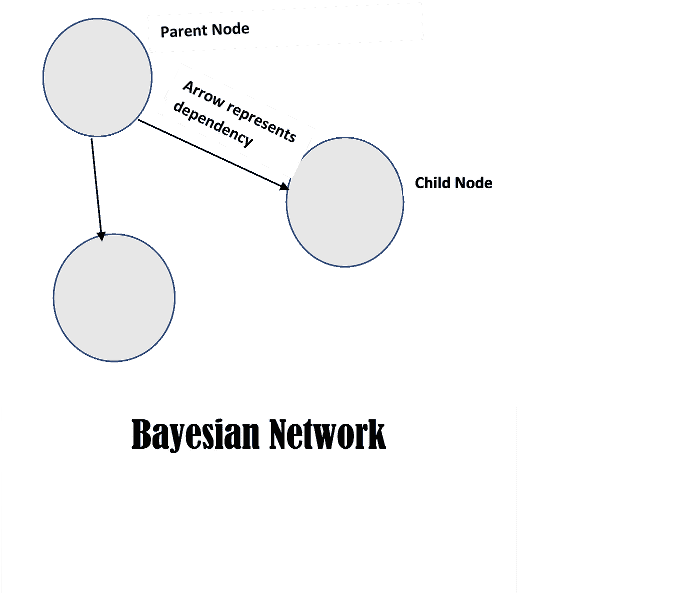
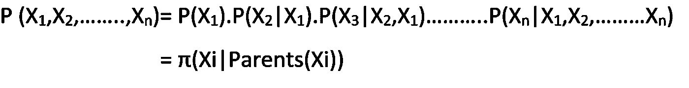
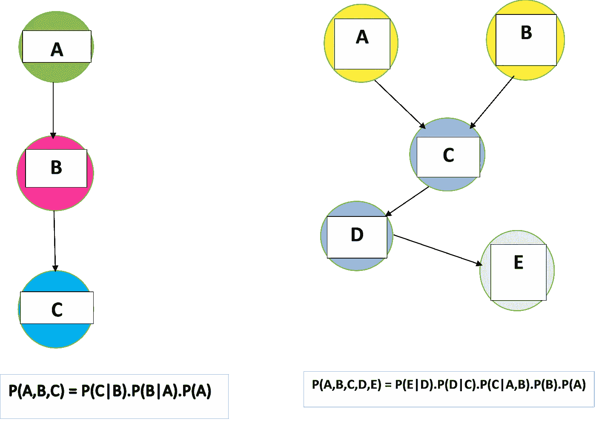
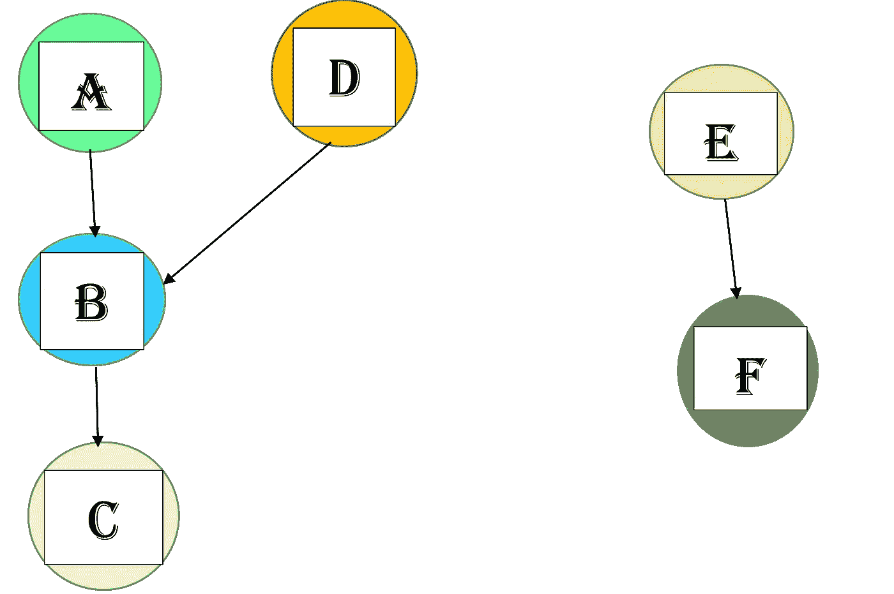
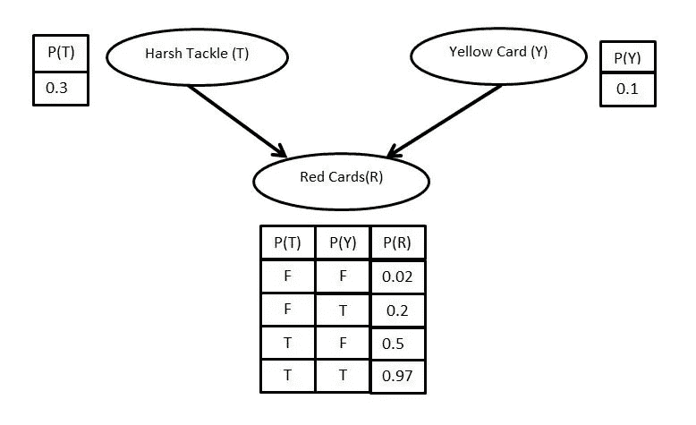

# 贝叶斯网络基础

> 原文：<https://towardsdatascience.com/basics-of-bayesian-network-79435e11ae7b?source=collection_archive---------13----------------------->

# 介绍

贝叶斯网络上的文本数不胜数，但其中大部分都有沉重的数学公式和概念，因此很难理解。在这里，我试图用最少的等式和一个真实世界的例子来尽可能简单地解释这个主题。

## 基本概念

**贝叶斯网络**是一个非常重要的工具，用于理解事件之间的相关性，并为它们分配概率，从而确定一个事件发生的可能性有多大，或者给定另一个事件发生的变化是什么。例如，假设你在学校因为迟到被老师责骂，迟到的原因可能有很多，比如起床晚了，交通堵塞等等。所以在这里，责骂取决于像晚起或交通堵塞这样的事件，也就是说，这些原因对你被责骂有直接影响。这可以有效地用贝叶斯网络来表示，我们很快就会看到。

Fig. 1

让 *{X1，X2，……。有些事情就像被骂，晚起等等。在贝叶斯网络中，它们可以表示为节点。现在，如果一个节点依赖于另一个节点，那么从一个节点到另一个节点画一个箭头/弧线，如图 1 所示。它被解释为子节点的出现受其父节点的出现的影响。所以贝叶斯网络代表一个**有向无环图**。不允许在节点内形成循环模式，所以它是**非循环的**。*

Fig. 2: The Formula for Joint Probability Distribution

现在使用*条件概率*和**链式法则**，我们可以很容易地得到完整的联合分布，即给定所有其他相关事件的最终事件的概率。*(注:如果不确定条件概率和链式法则，就按照这些* [*讲座*](https://youtu.be/HVlXEwVD8dw) *。它们是学习概率和贝叶斯统计的广泛资源。)*从等式中，我们可以看到子节点的概率取决于它的直接父节点。注: **π** 表示产品标志。

使用上述公式，我们可以推导出以下模型的联合概率分布公式。

Fig. 3

因此，使用图 2 中给出的公式，可以很容易地得到上述给定网络的联合概率估计结果。

# 贝叶斯网络模型的真实例子

现在让我们用一个真实世界的例子来结束本教程，以便更好地理解。

Fig. 4

让， **P(A)表示你早上醒来晚的事件。**

P(B)表示你上学迟到的事件。

P(C)表示你被老师责骂的事件。

**P(D)表示路上堵车的事件**

**P(E)表示你父亲每天早上登上公共汽车的事件。**

P(F)表示你父亲就职的事件。

那么你在学校被骂的概率有多大呢？现在，你可以很容易地用公式找到答案。所以最后的结果变成了 **P(C|B)。P(B|A，D)。P(D)。P(A)**

嘿，但是等等！！！P(E)和 P(F)呢？？？它们也存在于模型中。请记住，两个事件，如果没有用弧线直接或间接连接到任何其他节点，则称为独立事件，一个事件的发生不会影响另一个事件的发生。我们可以从模型中有把握地预测出 **P(C|F)** 的值，即你因为你父亲要上任的事件而被骂的概率是 **0** 。

给定父节点，每个节点的概率值以称为**条件概率表(CPT)** 的表格形式表示。下面的例子是 CPT 的代表。

Fig. 5: Conditional Probability Table (**Creator:** Muhammad Nazim Razali)

> 贝叶斯网络在现实世界中有着巨大的应用。给定症状，贝叶斯网络可以预测特定疾病导致症状的概率。此外，通过从两个犯罪现场收集证据，贝叶斯网络可以为调查小组提供关于两个地方的罪犯是否相关的有价值的见解。

一些 MOOCs 探索贝叶斯网络的更多内容:

1.[概率图形模型](https://www.coursera.org/specializations/probabilistic-graphical-models)由*斯坦福大学*

2.[机器学习的贝叶斯方法](https://www.coursera.org/learn/bayesian-methods-in-machine-learning)由*国立研究型大学高等经济学院*

3.[贝叶斯统计:从概念到数据分析](https://www.coursera.org/learn/bayesian-statistics)作者*加州大学圣克鲁斯分校*