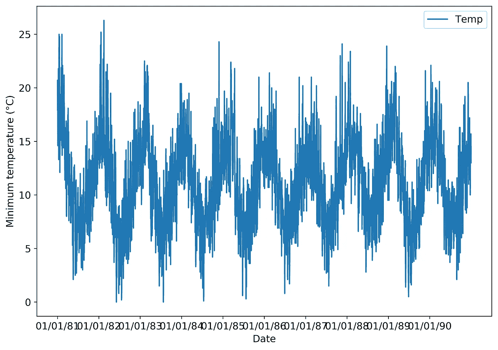
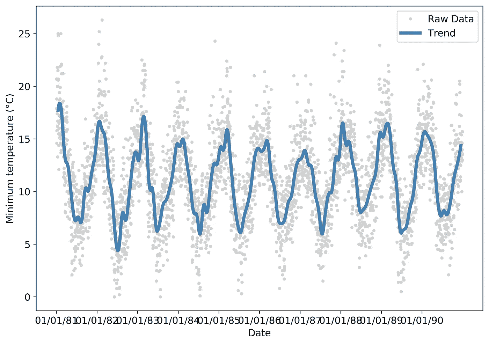
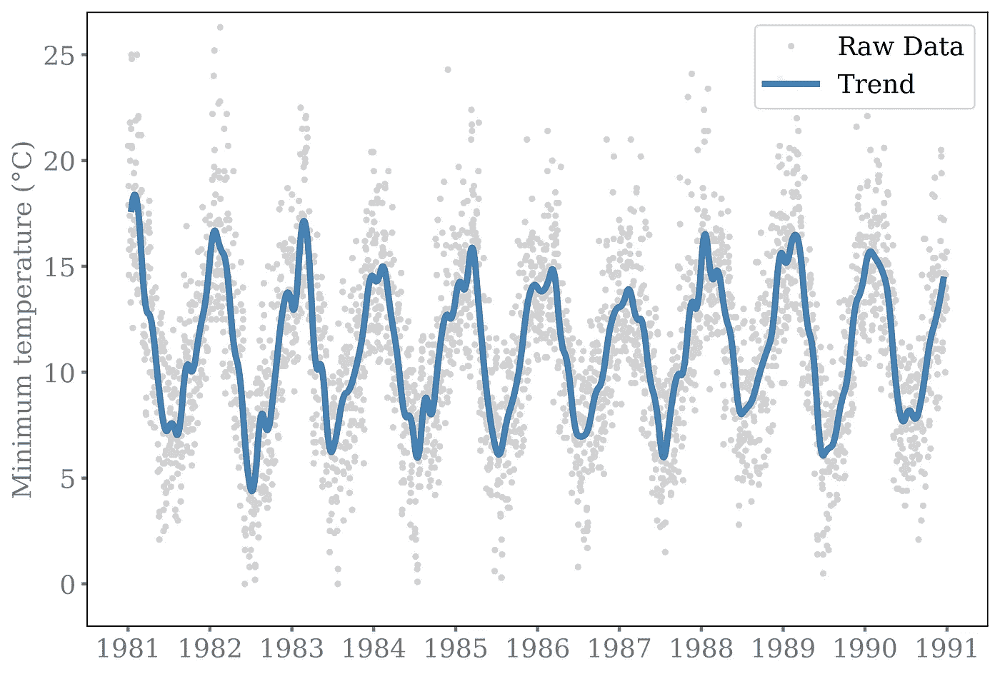
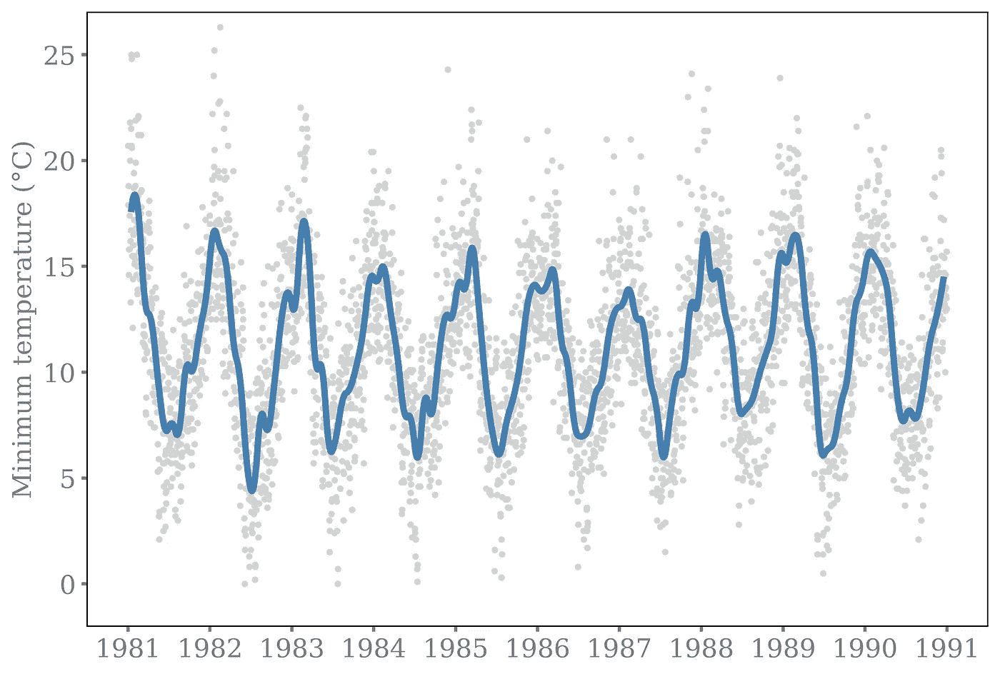
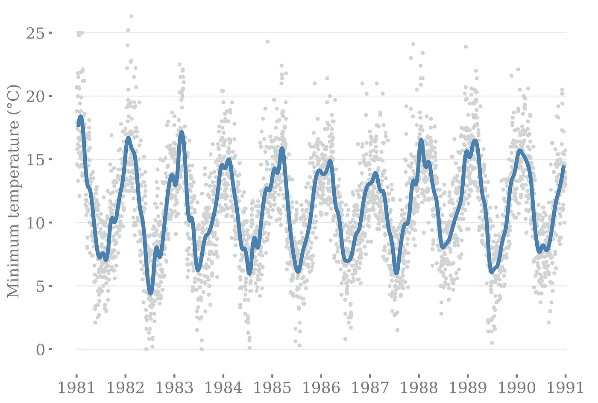

# 图形绘制基础

> 原文：<https://towardsdatascience.com/basics-of-graph-plotting-7eaadd11a8d?source=collection_archive---------21----------------------->

我们大多数数据科学家进入这个行业是因为我们热爱数据(不管这意味着什么？不，我也不知道！).创造易于阅读的情节的能力通常是事后才想到的。大多数职位描述都会提到可视化数据的能力很重要，但我从未在面试或工作中与任何人就可视化的最佳实践进行过合理的对话。鉴于有这么多坏的阴谋，这肯定不是因为我们都是这方面的专家！

花两个月的时间做一些分析，然后让你所有的利益相关者都茫然地看着你的演示，这是没有意义的。虽然创建一个非常复杂的交互式 3d 可视化 make 看起来令人印象深刻，但如果底层图形执行得不好，那么试图用一些 java 代码来改进是相当浪费时间的。有一个著名的表达涉及闪光和一只狗，我不会在这里重复。

对我来说，一个图表应该是极简的，并且在可能的情况下，不言自明。因此，我决定在博客中分享我的观点。我已经包括了我在绘制图表时考虑的一些方法。

# 总则

你的目标是把注意力吸引到重要的部分，而不是用不必要的杂乱分散观察者的注意力。一条太细的线可能不会引起足够的注意，而一个不必要的图例会弄乱情节，没有任何有意义的贡献。不太重要的特征可以变得更淡，这样第一眼就看不出来。颜色应该是直观的:红色代表不好，绿色代表好。一个需要反复问自己的重要问题是*这个像素起了什么作用？*如果你没有一个好的答案，那么删除它。

# 典型的图表

我的起点是 matplotlib 的标准输出，并添加了一些我经常看到的内容。[数据](https://www.kaggle.com/paulbrabban/daily-minimum-temperatures-in-melbourne)是 1981-1990 十年间墨尔本的最低温度，单位为摄氏度，每天有一个数据点。

# 我们想展示什么？

在我们开始做出任何改变之前，我们需要问自己*我们试图描绘的是什么？*我想提请大家注意两个特点。一是强烈的季节性行为，二是每天都有很大的波动。

# 线条样式

先说最根本的，实际数据。不要因为是时间序列数据就假设需要用线。使用线条的主要原因是为了跟踪数据点的顺序，但我们对精确的顺序并不感兴趣，我们只是想表明有很大的波动。线的另一个问题是，大量的注意力被吸引到离群值上，因为离群值与线的长度相关联。这是我的解决方案:

我们现在有两种不同的风格，一种用于原始数据，一种用于趋势。在这种情况下，这真的很有效，因为在我们的图中还有两个我们想要引起注意的特征。粗蓝线非常清楚地显示了温度的周期性和季节性，是该图的主要焦点。每日波动由散点图显示，淡灰点不太明显。

对于趋势线，我计算了每个月的平均温度，然后将其二次插值回每日时间序列。这产生了一个更加美观的流畅的情节。

# 轴文本

轴标签有一些明显的问题，我认为还有一些风格上的问题可以改进:

我将所有的文本放大，并选择将颜色改为灰色，因为我希望数据成为焦点，而不是轴标签。我还认为在 python 中使用衬线字体看起来更专业。

x 轴:x 刻度标签太长，最后重叠了。一个解决方案是旋转日期，但是因为我每年只有一个刻度，所以我不需要日期或月份。给定上下文，我们还可以推断 x 轴指的是日期，而不必明确标记它。

y 轴:我还微妙地改变了界限，使顶部刻度上方和底部刻度下方的空间相等。

称赞那些发现我也把轴的宽度设为 2 而不是标准的 1 的人。非常学究气，但它会有意义的页面。

# 神话；传奇

您的图例有一些可用的格式选项。最重要的和第一个你应该考虑的是*你需要一个吗？*在一个理想的世界里，你的阴谋没有一个是显而易见的，但它并不总是可以避免的，然而它应该是你要考虑的事情列表的顶部。在这种情况下，我认为这是非常明显的，所以我认为添加图片标题是最干净的选择。

Daily temperature measurements are shown by the grey dots with the 30 day mean shown in blue.

可能的话，把图例放在图中，因为它就在附近，你不必去找它。这也使得将数字转换成幻灯片的工作变得容易多了；浮动图例会使图像尺寸变得非常大，不会给幻灯片上的文本留下太多空间。然而，也不要把图例放在图表中真正重要的部分(是的，我已经看过很多次了！！)

# 包围盒

我说的是包围该图并包括 x 轴和 y 轴的黑色矩形。对我来说，它切断了文本的视觉化，因此，切断了叙事，这就是它对你的观众的影响。我是一个相当新的采用者，但你可以让他们看不见！

Daily temperature measurements are shown by the grey dots with the 30 day mean shown in blue.

我还添加了水平线来标记 y 轴上的主要刻度，这样您可以更容易地读取实际值。同样，这些是非常苍白的，首先绘制出来，这样它们就不会压倒眼睛，但是当你需要它们的时候它们就在那里。

还记得我之前改变了小轴刻度的宽度吗？？它们现在没有了主要的 x 轴和 y 轴，所以让它们更占主导地位比被误认为屏幕上的灰尘更有意义。

# 结论

花 5 分钟时间想出如何完善一个情节，抵得上花 5 个小时讨论它的意义。

# 密码

在[github repo](https://github.com/mattcrooksphd/Medium-PlottingBasics)中给出了绘制上述完善图的代码。