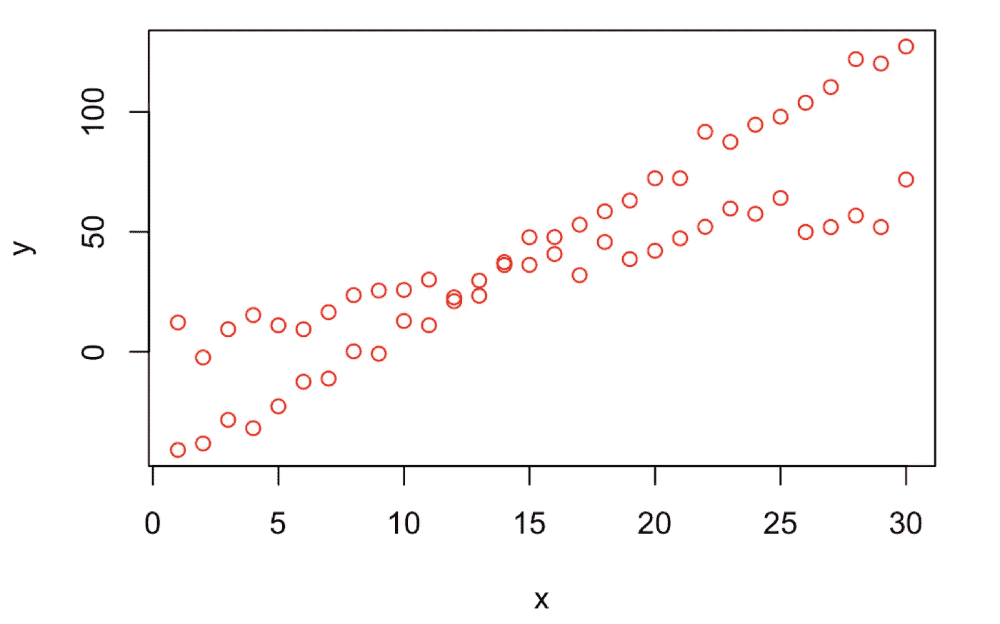
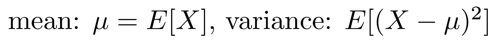
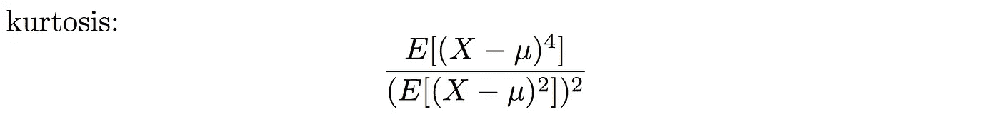

# 独立成分分析基础

> 原文：<https://towardsdatascience.com/basics-of-independent-component-analysis-ad14f683b49b?source=collection_archive---------14----------------------->

# 动机

我们一直在寻找模式，并对数据进行更深入的理解。关于这个数据集，你首先想到的是什么？

如果你的第一个想法是——“那些点看起来太好了”——那么你抓住我了。这不是一个真正的数据集，我花了比我应该产生这些点更多的时间。然而，这不是重点。

你看到了什么？从视觉角度来看，很明显有两个群体有两种线性趋势。这两个组混合在一起成为一个不可区分的点集合。

再来一个:你能把这幅杰作中的两个组件分开，并辨认出画中的人吗？

I’m not religious but this has me thinking…

同样，这对我们来说不应该是个问题。我们可以在精神上分离这两个图像，但是如果有人要求这两个分离的图像，你实际上会怎么做呢？

我们需要一个分离混合数据集的数学框架和算法。

# 定义

在考虑这个数学框架之前，我们先用简单的思路写出来。

1.  我们有不同部分组合的数据。
2.  我们想把它分离成一个更简单的表示。
3.  我们希望尽可能少的混乱。

假设我们有 *m* 个初始点:

我们想分成 *n* 个部分:

我们想找到一个分离初始点的变换。这种变换最简单的形式是一个 *n* 乘 *m* 矩阵 **W** 。

为了确保 *n* 输出被分离，我们可以搜索使分量**尽可能不同于正态分布**的变换。

如果你上过统计学课，那么你可能听说过正态分布(钟形曲线)。所有统计学中最重要的结果之一是中心极限定理，它表明将一组独立的样本(即使来自非正态分布)相加会得到正态分布。

所有组合的不同组或图像形成通常正态分布的混合点的集合。我们希望提取尽可能个别地呈非正态分布的成分。

# 峭度

描述概率分布的两个常用指标是**平均值**和**标准偏差。**它们代表分布的一阶和二阶矩，通常包含了关于平均值和分布的大部分信息。它们被定义为:

我们还可以讨论分布的三阶矩，称为**峰度**。峰度衡量分布的偏斜程度。我们将其定义为:

正态分布的峰度为 0。如果我们将峰度最大化，我们将得到一个尽可能非正态的分布。

# 摘要

在本文中，我们激发了我们分离由多个来源组成的数据的自然能力。从分散的数据集到过滤的图像，这些对于我们的大脑来说很容易分离，但从算法的角度来考虑更有趣。

本着让每个组件尽可能不同的想法，我们可以开始构建一个算法。找出导致具有最大峰态分布的变换。我们可以通过使用梯度下降来更新我们当前的候选，并继续下去，直到我们将原始数据分成不同的部分。

感谢阅读！独立成分分析是一个很好的工具，也是解决一些有趣问题的切入点。我很想听听你的反馈，看看是否有人对这个话题感兴趣——我只是触及了皮毛。