# 经典 CNN 的基础知识

> 原文：<https://towardsdatascience.com/basics-of-the-classic-cnn-a3dce1225add?source=collection_archive---------3----------------------->

## 一个经典的 CNN(卷积神经网络)是如何工作的？

Classic CNN architecture.

卷积神经网络。听起来像是生物学和数学的怪异结合，还有点 CS 的成分，但这些网络是计算机视觉和图像处理领域最有影响力的创新之一。

卷积神经网络是多层感知器(MLP)的正则化版本。它们是基于动物视觉皮层神经元的工作而开发的。

## 计算机对图像的可视化

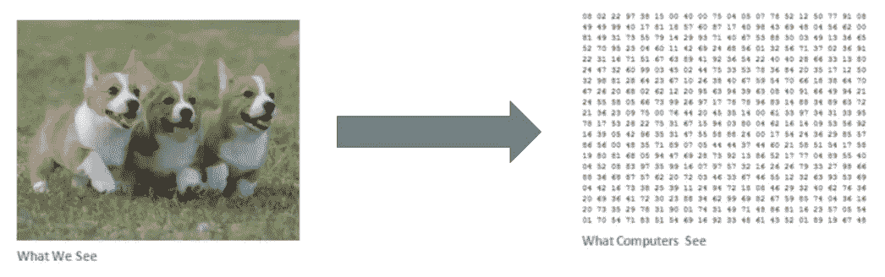

Binary image visualization.

假设我们有一个 JPG 形式的彩色图像，其大小为 480 x 480。代表性的阵列将是 480×480×3。这些数字中的每一个都被赋予一个从 0 到 255 的值，该值描述了该点的像素强度。图像的 RGB 强度值由计算机可视化以进行处理。

## 使用 CNN 的目的:

这个想法是，你给计算机这个数字数组，它将输出描述图像属于某一类的概率的数字(猫 0.80，狗 0.15，鸟 0.05，等等)。).它的工作原理类似于我们的大脑。当我们看一张狗的图片时，如果图片有可识别的特征，如爪子或 4 条腿，我们就可以把它归类为狗。以类似的方式，计算机能够通过寻找边缘和曲线等低级特征来执行图像分类，然后通过一系列卷积层建立更抽象的概念。计算机使用在初始级别获得的低级特征来生成高级特征，如爪子或眼睛，以识别对象。

## 一个经典的 CNN:

经典卷积神经网络的内容:-

1.卷积层。

2.每个卷积层之后的激活操作。

3.池层，尤其是最大池层，以及基于需求的其他层。

4.最后完全连接层。

## 卷积运算
第一层:

**1。卷积层的输入**

将图像调整到最佳大小，并作为输入馈送到卷积层。

让我们把输入看作是像素值的 32×32×3 阵列

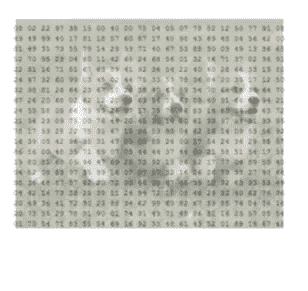

**2。存在滤波器或神经元或内核，其取决于内核大小的维度覆盖输入图像的一些像素。**

设滤波器的核的维数为 5x5x3。

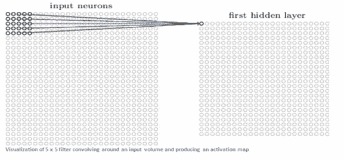

3.内核实际上滑过输入图像，因此它将滤波器中的值与图像的原始像素值相乘(也称为计算**元素级乘法**)。

对乘法求和，为特定感受野生成单个数字，因此为了滑动内核，总共 784 个数字被映射到 28×28 阵列，称为**特征图**。

* *现在，如果我们考虑相同维度的两个内核，那么获得的第一层特征图将是(28×28×2)。

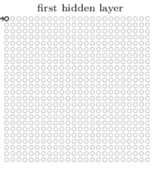

## 高层视角

为了便于理解，让我们取一个大小为(7x7x3)的内核。每个核都被认为是一个特征标识符，因此可以说我们的滤波器是一个曲线检测器。

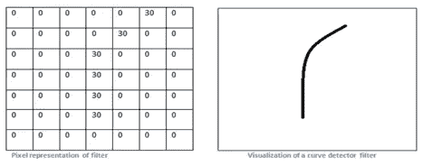

*   **原始图像和图像上内核的可视化。**

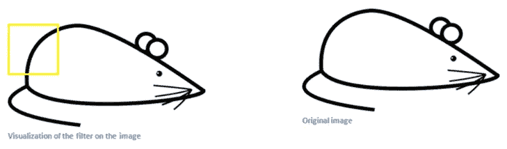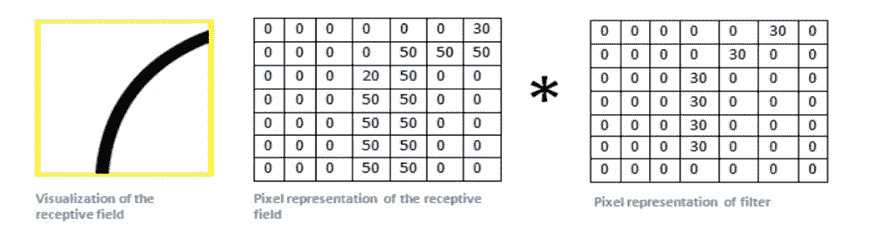

生成的乘积值之和= 4*(50*30)+(20*30) = 6600(大数字)

*   **现在当内核移动到图像的其他部分时。**

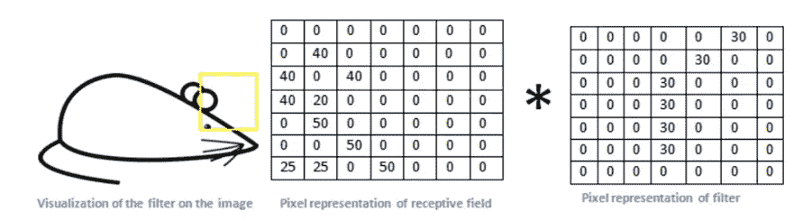

生成的乘积值之和= 0(小数字)。

## 小值和大值的使用。

1.价值低很多！这是因为在图像部分没有任何东西响应曲线检测器滤镜。记住，这个卷积层的输出是一个激活图。因此，在一个滤波器卷积的简单情况下(如果该滤波器是曲线检测器)，激活图将显示图像中最有可能弯曲的区域。

2.在前面的示例中，我们的 26 x 26 x 1 激活图的左上角值(26 是因为 7x7 过滤器而不是 5x5)将是 6600。这个高值意味着输入音量中可能有某种曲线导致过滤器激活。在我们的激活图中，右上角的值将是 0，因为输入体积中没有任何东西导致过滤器激活。这只是一个过滤器。

3.这只是一个过滤器，用来检测向外向右弯曲的线条。我们可以为向左弯曲的线条或直边设置其他过滤器。过滤器越多，激活图的深度就越大，我们拥有的关于输入量的信息就越多。

在图片中，我们可以看到第一个 conv 的过滤器实际可视化的一些例子。训练网络的层。尽管如此，主要论点还是一样的。第一层上的滤波器在输入图像周围进行卷积，并且当它所寻找的特定特征在输入体积中时“激活”(或计算高值)。

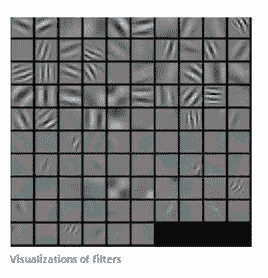

## 顺序 conv。第一层之后的层。

1.当我们穿过另一个 conv。层，第一个 conv 的输出。层成为第二个 conv 的输入。层。

2.然而，当我们谈到第二个 conv 时。层，输入是从第一层产生的激活图。因此，输入的每一层基本上都描述了原始图像中某些低级特征出现的位置。

3.现在，当你在上面应用一组滤镜时(通过第二个 conv)。层)，输出将是表示更高级特征的激活。这些特征的类型可以是半圆(曲线和直边的组合)或正方形(几条直边的组合)。当你通过网络，通过更多的 conv。层，您将获得表示越来越复杂功能的激活图。

4.在网络的末端，你可能会有一些过滤器，当图像中有笔迹时会激活，当看到粉红色物体时会激活，等等。

## 联营业务。
最大池示例。

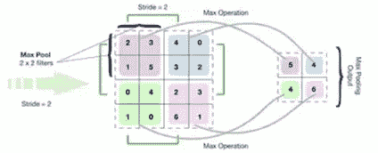

2x2 filters with stride = 2 (maximum value) is considered

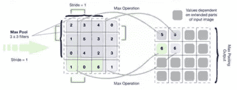

3x3 filters with stride = 1 (maximum value) is considered

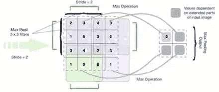

3x3 filters with stride = 2 (maximum value) is considered

## 全连接层。

1.这个完全连接的层的工作方式是，它查看前一层的输出(我们记得它应该代表高级功能的激活图)和类别数量 **N** (数字分类为 10)。

2.例如，如果程序预测某个图像是一只狗，它将在激活图中具有高值，这些激活图表示像爪子或 4 条腿等高级特征。基本上，FC 层会查看哪些高级别要素与某个特定类最相关，并具有特定的权重，这样当您计算权重与前一层之间的乘积时，就可以获得不同类的正确概率。

3.完全连接的层的输出如下[0 .1 .1 .75 0 0 0 0 0 .05]，那么这表示对于数字分类，图像是 1 的概率为 10%,图像是 2 的概率为 10%,图像是 3 的概率为 75%,图像是 9 的概率为 5 %( soft max 方法)。

## 培训。

我们知道内核也称为特征标识符，用于识别特定的特征。而是如何用特定的权重初始化内核，或者过滤器如何知道应该有什么值。

训练的重要一步由此而来。训练过程也被称为反向传播，它被进一步分成 4 个不同的部分或过程。

向前传球

损失函数

向后传球

重量更新

**向前传球:**

对于训练的第一个时期或迭代，第一 conv 的初始核。层用随机值初始化。因此，在第一次迭代之后，输出将是类似于[. 1 . 1 . 1 . 1 . 1 . 1 . 1 . 1]的内容，它不会优先考虑任何类，因为内核没有特定的权重。

**损失函数:**

训练涉及图像以及标签，因此数字 **3** 的标签将是[0 0 0 1 0 0 0 0 0 0 0 0 0 0]，而第一个历元之后的输出非常不同，因此我们将计算损失( **MSE —均方误差**

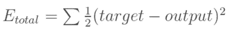

目标是最小化损失，这是微积分中的一个优化问题。它包括尝试调整重量以减少损失。

**向后传球:**

它包括确定哪些重量对损失影响最大，并找到调整它们的方法，以减少损失。使用 dL/dW 计算，其中 L 是损失，W 是相应内核的权重。

**权重更新:**

这是使用以下等式更新内核权重的地方。

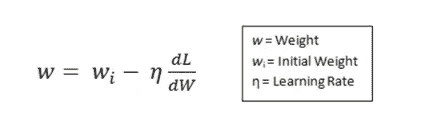

这里的**学习速率**由程序员选择。学习率的值越大，表示优化步长的步长越大，卷积到优化权重的时间越长。

## 测试。

最后，看看我们的 CNN 是否工作，我们有一套不同的图像和标签(不能在训练和测试之间双浸！)并通过 CNN 传递图像。我们将输出与地面实况进行比较，看看我们的网络是否有效！