# 基础知识:使用 Tensorflow 在 Anaconda 中创建虚拟环境

> 原文：<https://towardsdatascience.com/basics-virtual-environment-in-anaconda-with-tensorflow-aecb60fb56ab?source=collection_archive---------18----------------------->

为您的机器和深度学习模型创建一个虚拟环境是保护它们的一个重要的主动步骤。这个隔离的内存空间将允许使用同一个包的不同版本。发生的更新将被严格管理和手动更新。让我们创建一个机器和深度学习虚拟 python 环境设置。

# 蟒蛇

如果您没有 Anaconda，请下载并安装最新版本。否则，继续更新 conda 和目前它里面的所有包。

# 安装 Anaconda

前往[https://anaconda.com/distribution](https://anaconda.com/distribution)。页面中间是基于 Python 版本的安装程序选项。挑选你的毒药，安装在你喜欢的地方。

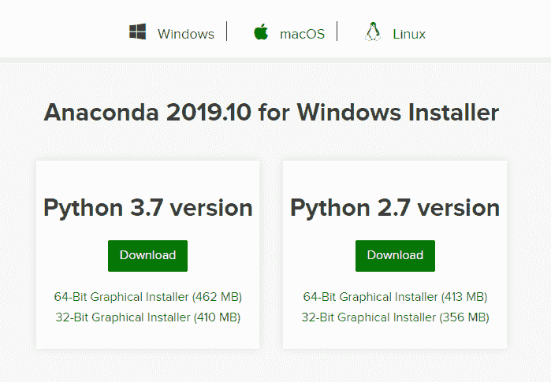

我会推荐安装 Python 3.7。Python 2.7 不再维护。已经“退休”了。

# 更新 Conda

康达是巨蟒之首。它是一个开源的软件包管理系统和环境管理系统，用于安装多个版本的软件包..“就像您应该更新 pip 一样，conda 也经常需要更新。当我们这样做的时候，并且对你的其他项目来说是安全的，我们将在此刻更新 Anaconda 中的所有包。

为此，打开 Anaconda Powershell 提示符。键入以下内容:conda update conda。

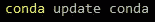

在某些时候，系统会提示您说是或否，以越过不可返回的点。如果你准备好了，按“y”键，让它继续。一旦完成，让我们更新所有当前安装的软件包。使用以下命令:conda update -all。

这将有相同的“是”或“否”提示。

# 第二步:GPU 利用率

这一步绝对是可选的。如果你有一个可以被 NVIDIA 的 cuDNN 和 CUDA 使用的 GPU，那就去用吧。[这里](https://www.geforce.com/hardware/technology/cuda/supported-gpus)是支持 CUDA 的 GPU 列表。

# 库达

[CUDA](https://blogs.nvidia.com/blog/2012/09/10/what-is-cuda-2/) 是一种简化 GPU 利用的计算和编程模型。要下载，请单击[此处](https://developer.nvidia.com/cuda-downloads?target_os=Windows&target_arch=x86_64)并为您的电脑选择合适的选项。

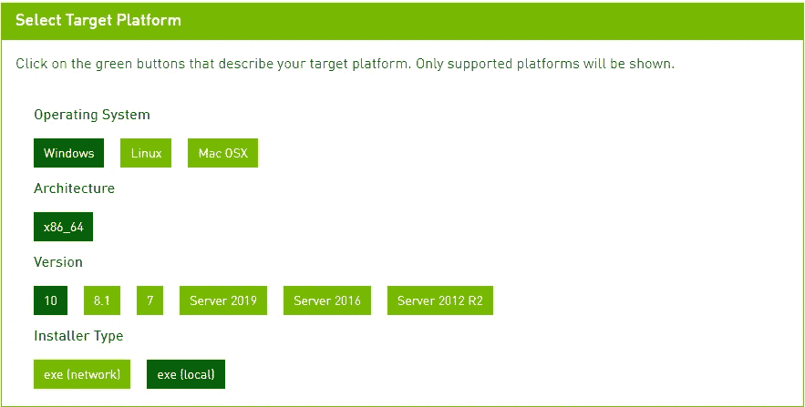

一旦您选择了适当的选项，正确的安装程序将会出现。

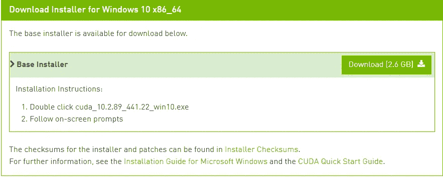

在本文中，10.2.89 版不需要任何补丁。如果您要安装的版本有修补程序，请确保在基本安装程序之后安装这些修补程序。

点击下载按钮并安装 CUDA。这将需要几分钟的时间，但是您可以使用安装程序中的默认选项。

# cuDNN

cuDNN 是 CUDA 深度神经网络库的简称。它类似于最初的 CUDA，但正如其名称所示，它是用于深度神经网络的。

要下载，你需要创建一个 [NVIDIA 的开发者](https://developer.nvidia.com/cudnn)账户。做起来很简单。一旦你创建了一个帐户，继续下载最新版本。下载文件将是一个 zip 文件夹。将它解压缩到计算机的 C:驱动器，然后将其添加到环境路径中。

## 环境路径

通过按 Win + R 打开“运行”窗口。要访问系统属性，您需要打开“sysdm.cpl”。

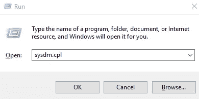

点击“确定”,然后系统属性窗口将会打开。点击“高级”标签，然后点击底部附近的环境标签按钮。在系统变量框下，有一个“新建”按钮，按一下。你可以给这个变量起任何你喜欢的名字，它的值将会是 cudnn 文件夹中 bin 文件夹的路径。

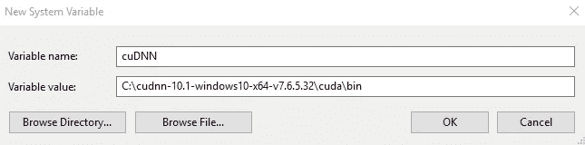

# 步骤 3:创建虚拟环境

要创建虚拟环境，您将使用以下命令结构:conda create-n env _ name pip python = version。因此，env_name 是您将赋予环境的名称，python=version 是您将使用的 python 版本。我们将继续创建一个名为 virtEnv 的环境，版本为 3.7。

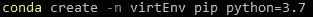

在某个时候，系统会提示您按 y 或 n 继续创建。准备好了就按“y”键。

一旦创建了虚拟环境，我们就可以激活它了！为此，请使用命令 conda activate env_name。在我们的情况下，这将是康达激活 virtEnv。

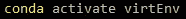

提示符应该从(base)变为(virtEnv)或您为环境命名的任何名称。

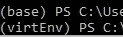

# 步骤 4:安装必要的库

既然虚拟环境已经激活，我们就可以安装库了。这些库可以是项目所需的任何版本。对于这种环境，我们将安装 Tensorflow。因为我们在利用自己的 GPU 优势，所以会安装 Tensorflow 的 GPU 版本。如果您不想要那个版本，就放弃调用的'-gpu '部分。

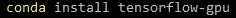

这将安装 Tensorflow 2.0 及其所有依赖项。这可能需要一段时间。

# 步骤 5:检查 Tensorflow 是否已安装

我们快完成了！只差一步了。我们需要检查 Tensorflow 是否安装正确。通过在 Powershell 中键入“python”来打开解释器。当解释器打开时，它将显示您正在使用的 python 版本以及下面的> > >。那是我们将要打字的地方。

第一行我们将使用“导入张量流为 tf”来导入张量流。

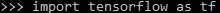

接下来，我们将打印带有' print(tf。__ 版本 _ _)。如果成功，版本号将出现在下面。

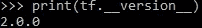

如果一切正常，按 ctrl+z 退出解释器。至此，您已经准备好在新创建的虚拟环境中创建项目了！

# 虚拟

好吧，我们可以解决房间里的大象。还有一个不涉及 Anaconda 的选项。Python 有一个名为 virtualenv 的库，用于为 python 项目创建虚拟环境。根据您使用的 python 版本，您可能需要也可能不需要安装 virtualenv 库。如果您正在使用 Python 2，那么您将需要使用 pip 来安装 virtualenv，然后创建一个新目录。在 Python 3 中，venv 模块是一个标准库，您只需要创建并激活环境。

# 虚拟环境管理

现在我们有了一个虚拟环境，您可能想要创建更多。在这一点上，它可以成为一个集群…乱七八糟。以下是一些有助于管理虚拟环境和保持头脑清醒的有用命令:

# 虚拟环境命令

**查看您电脑上的环境**:(两者做同样的事情)

*   康达信息-envs
*   康达环境列表

**查看某环境下安装的软件包列表**:

*   **当前未激活的环境** : conda list -n env_name
*   **当前激活的环境** : conda 列表

**查看是否安装了某个包** : (env_name 是您的环境名，package_name 是您查询的包。)

*   conda list -n 环境名称包名称

**启动环境**:

*   conda 激活环境名称

**停止环境**:

*   康达停用

**移除环境**:

*   conda 环境移除-n 环境名称

既然您的工具箱中已经有了虚拟环境技能，现在您可以创建许多不同的项目。都是相互独立的包版本！甚至是那些可以利用神经网络的，你可以在[基础:神经网络](/neural-networks-basics-29cc093b82be)帖子中了解到。

在我们重新学习之前，

