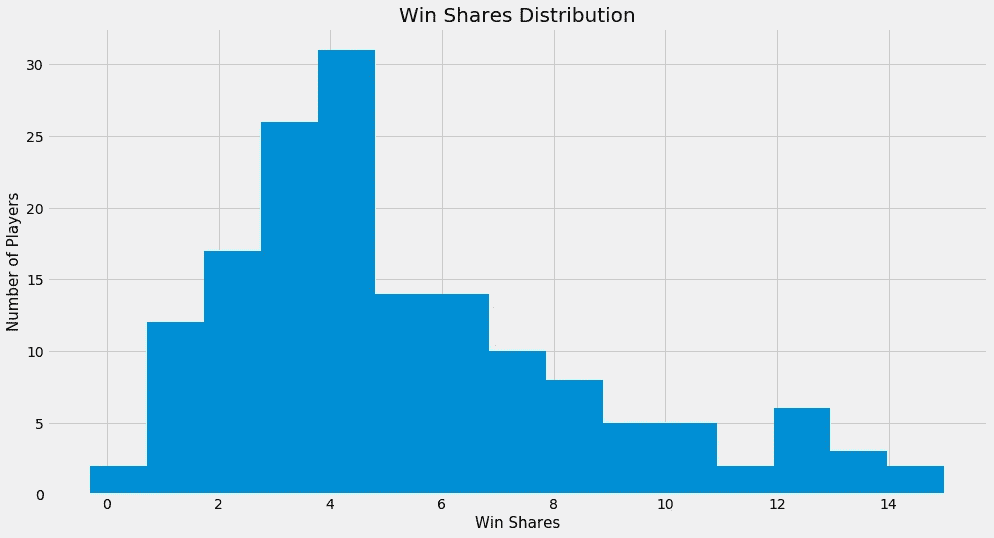
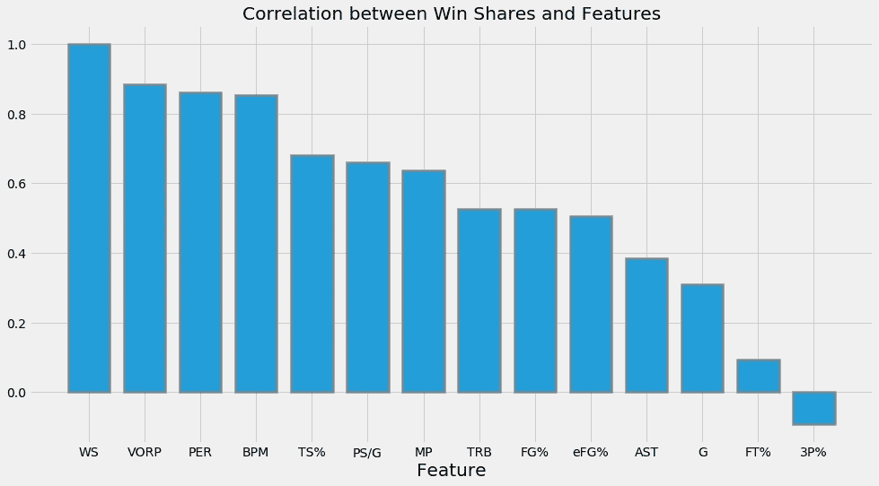
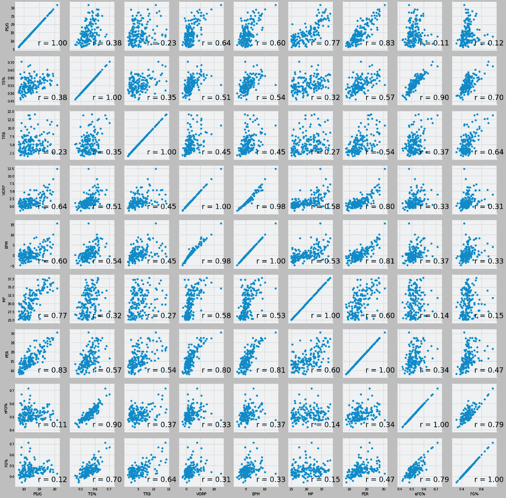
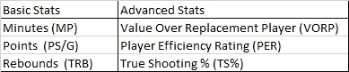
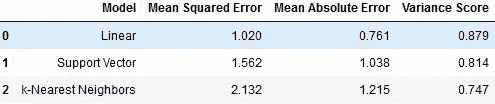
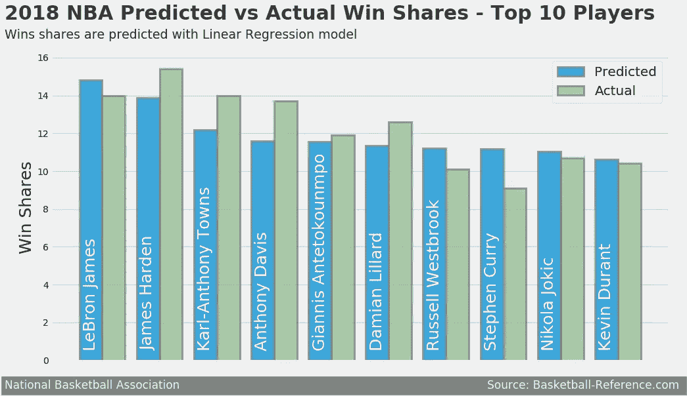
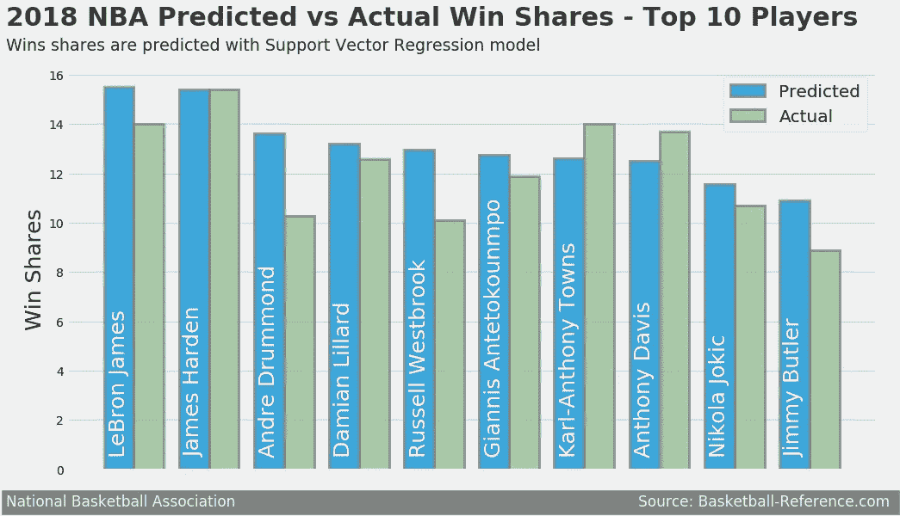
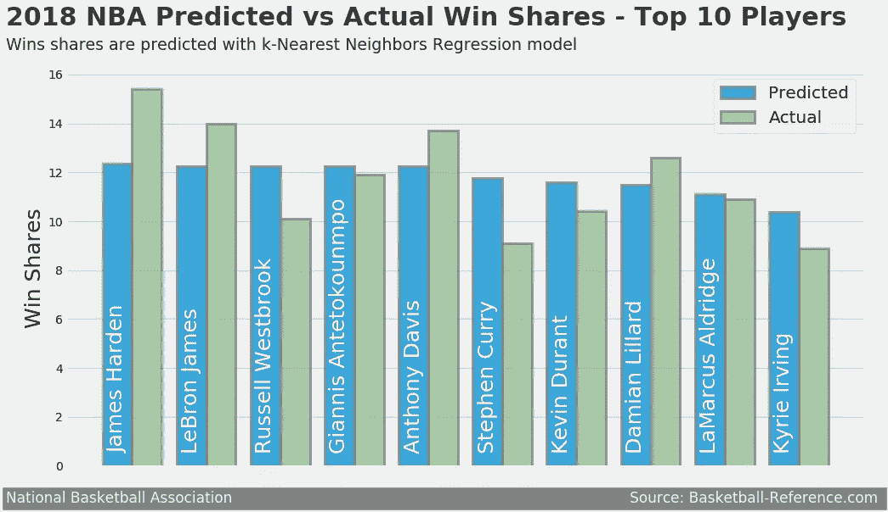

# 篮球分析:预测获胜份额

> 原文：<https://towardsdatascience.com/basketball-analytics-predicting-win-shares-7c155651e7cc?source=collection_archive---------4----------------------->

## 利用机器学习预测 NBA 顶级球员的个人胜率

最近，达里尔·莫雷声称勒布朗詹姆斯是有史以来最伟大的篮球运动员。很明显，差得远了。莫雷是 NBA 休斯顿火箭队的现任总经理。对于所有的棒球迷来说，莫雷是篮球界的比利·比恩。对于所有电影爱好者来说，莫雷就像是布拉德·皮特在《摇钱树》中扮演的篮球运动员。如果你没有理解前面两句话，那么你可能需要做一些[研究](https://en.wikipedia.org/wiki/Daryl_Morey)。简而言之，莫雷是一个巨大的分析家伙。所以，当他谈论勒布朗·詹姆斯的成就时，这意味着在篮球分析学，或*莫雷球*，术语，勒布朗是有史以来最伟大的(试着告诉跳过贝勒斯)。

我从莫雷的言论中得出的最大问题是:他如何衡量哪个球员比下一个更好？是成功吗？影响？效率？(莫雷爱效率胜过比利·比恩爱[上垒百分比](https://www.youtube.com/watch?v=DtumWOsgFXc))。

今天，有很多新的篮球指标被世界各地的球迷和分析师用来比较和衡量球员。例如，有球员效率评级(PER) ，它考虑了成绩，如投篮命中率、罚球、三分球、助攻、篮板、盖帽和抢断，以及负面结果，如投篮不中、失误和个人犯规。

一些先进的篮球指标，如 PER，可以很好地衡量球员在篮球比赛中的效率。但这是否告诉我们，这名球员将为他们的球队带来成功？也许吧。但是，一个玩家被视为成功的唯一方式就是获胜。

赢得股份是一个很好的开始，可以展示一个玩家给他们的团队带来了多大的成功。根据 [Basketball-Reference](https://www.basketball-reference.com/about/ws.html) 的说法，win shares 是一个衡量一名球员在整个赛季中为他的球队赢得比赛次数的指标。从这个角度来看，卡里姆·阿布杜尔·贾巴尔不仅是 win 份额的单赛季领导者，拥有 25.4 个 win 份额，而且是 win 份额的职业生涯领导者，拥有 273.4 个 win 份额。所以，我相信你明白这个衡量标准可能是一个很好的指标，来衡量一个球员对球队的贡献有多大。

**注**:这篇文章使用的所有代码都可以在 GitHub 上找到，整理在这个[笔记本上](https://github.com/osanchez2323/Portfolio/blob/master/Basketball%20Analytics%20-%20Machine%20Learning%20to%20Predict%20Win%20Shares/Basketball%20Analytics%20-%20Using%20Machine%20Learning%20to%20Predict%20Win%20Shares.ipynb)。

# 分析

**目的:我们能使用其他篮球指标预测 NBA 球员的个人胜率吗？**

本次分析使用的数据来自 2016–17 和 2017–2018 NBA 赛季，使用[篮球参考](https://www.basketball-reference.com/)。本质上，我使用 2016-2017 NBA 赛季的数据来创建我们的模型，并从最近一个赛季的统计数据来预测获胜份额。我执行了一个**监督回归**机器学习分析:

*   **受监督的**:该数据包含 win 份额和所有其他篮球指标，用于训练和测试模型
*   **回归**:赢股是一个连续变量

今天，有很多新的篮球指标被世界各地的球迷和分析家用来比较和衡量球员。为了预测获胜份额，我混合使用了基本和高级 NBA 统计数据:

# 探索性数据分析

*   **win 股份的分配最初是什么样子的？**

在继续分析之前，我使用了基本的 EDA 来看看我们的数据能告诉我们什么。首先，我快速浏览了一下 win 份额的分布情况:

马上，我们看到 win 份额的分布向右倾斜。2016-2017 赛季期间，大多数 NBA 球员的胜率不到 5%。这是有意义的，因为只有少数几个被选中的人，大部分是 NBA 全明星，会有很高的胜率。例如，2016-2017 NBA 赛季的 win shares 领先者是詹姆斯·哈登，MVP 亚军，拥有 15 份 win shares。所以，拥有高份额是一种精英身份。

从分布中提取的奇怪数据是 0 win 份额的玩家数量。经过进一步的分析，我发现有很多玩家几乎不玩游戏。虽然这些球员都在 NBA 的名单上，但这并不意味着他们不会对球队和他们自己的个人数据产生重大影响。因此，我更新了数据，只包括那些至少打了 30 场比赛，平均每场比赛至少打 25 分钟的球员。清除数据后，win 份额的分布如下:

现在 0 赢份额的玩家少了很多！win 份额的分布仍然是右偏的，但看起来更接近正态分布。

*   **我选择的所有特征都是赢得份额的良好预测因素吗？**

我使用皮尔森相关系数分析了这个问题，皮尔森相关系数衡量特征和目标(赢得份额)之间的线性相关性。它的值介于-1 和+1 之间，其中接近-1 的值表示负强关系，接近+1 的值表示正强关系:

这一发现令人惊讶！在我最初选择用来预测胜率的 13 个篮球指标中，有 4 个没有足够强的相关性(强=大于 0.5 &小于-0.5)。因此，我从我的模型中排除了这些指标。

我吃惊地看到 3 个百分点(3P%)不仅有微弱的相关性，而且还有负相关性。在今天的 NBA，几乎每个球队和球员都非常依赖 3P，所以我认为 3P%在分析中会起到重要作用。另一个有趣的发现是玩的游戏(G)和赢的份额之间的弱关系。有人会认为，玩家参与的游戏越多，他们赢得的份额就越高。然而，仅仅因为一个玩家参与了一个游戏，并不意味着他们会成功。助攻数(AST)是另一个我认为与 win 份额有密切关系的指标。

*   其余的特征是否高度相关？

对于分析的下一部分，我想看看要素之间是否有很强的相关性，或者多重共线性。[多重共线性](http://www.statisticshowto.com/multicollinearity)通常发生在两个或更多预测变量之间高度相关的时候。请记住，与 win shares 密切相关的功能是好的，但与其他功能密切相关的功能可能没有那么大帮助。这甚至会使我们更难解释我们将要创建的模型。

根据上面的配对图，我发现了这些特性之间的一些问题:

*   **VORP vs BPM:** 有很强的正相关关系(相关系数 0.98)。Box Plus Minus (BPM) 是球员在球场上每 100 次持球对联盟平均水平的贡献。替代球员(VORP)的价值采用 BPM，并将其转化为对团队的贡献。为了计算 VORP，你需要使用 BPM。因此，它们高度相关。
*   **投篮命中率指标:**我们在分析中还剩下三个投篮命中率指标。现场目标百分比(FG%)是完成的现场目标与尝试的现场目标的比率。有效现场目标百分比(eFG%)调整现场目标百分比，以说明三分现场目标算三分，而现场目标只算两分。真实投篮命中率(TS%)通过计算 2 分和 3 分的投篮命中率和罚球来衡量球员的投篮效率。我觉得这些指标密切相关(TS%和 eFG%的相关性为 0.90)。因此，我决定只使用 TS%,因为它与 win 份额的相关性最高。

在研究了这些数据之后，我留下了以下篮球指标作为创建模型的特征:

# 模型选择和测试

由于这是一个监督回归机器学习分析，我创建了三个回归模型:

*   线性回归
*   支持向量回归
*   k 近邻回归

让测试集包含 25%的数据(其余的数据用于训练模型)，下面是模型的结果:

这些模型的明显赢家是:线性回归。线性回归模型具有较低的均方误差(越低越好)、均方误差(越低越好)和较高的方差得分(越高越好)。这并不是说其他两个模型，支持向量和 k 近邻回归，不应该被忽略！他们仍然有非常令人印象深刻的结果，只是没有线性回归模型那么强。

# 预言

如上所述，我使用了 2017-2018 NBA 赛季的所有特征，通过我们的模型来预测获胜份额:

Win Share Predictions Using Linear Regression Model

根据线性回归模型的预测，勒布朗詹姆斯名列榜首！该模型预测他以 14.81 的胜利份额领先 NBA。然而，在现实中，勒布朗(14 胜)排在 2017-2018 赛季 NBA MVP 詹姆斯·哈登(15.4 胜)之后，后者在预测中排名第二。不错的预测！卡尔安东尼唐斯和安东尼·戴维斯在线性回归预测和最近的 NBA 赛季中分别排名第三和第四。

Win Share Predictions Using Support Vector Regression Model

支持向量回归模型有一些不寻常的结果。根据这个模型的预测，勒布朗(15.5 胜)再次名列榜首，哈登紧随其后(15.4 胜)。最令人兴奋的结果是，该模型准确地预测了哈登的获胜份额！他以 15.4 胜份额领跑 2017–2018 NBA 赛季，与预测值相同。安德烈·德拉蒙德在使用线性回归模型预测的 win 份额中未进入前 10 名，但在使用支持向量回归模型预测的 win 份额中排名第 3。唐斯和戴维斯都跌出了预测名单，斯蒂芬·库里和凯文·杜兰特甚至都没有进入前十名。

Win Share Predictions Using k-Nearest Neighbors Regression Model

使用 k-最近邻的 win 份额预测比以前模型的预测少得多。对于这个模型，哈登预测的 win 份额最高，仅为 12.3 win 份额。预测值的另一个奇怪的结果是，勒布朗，拉塞尔·维斯特布鲁克，扬尼斯·阿德托昆博和戴维斯并列 12.24 胜份额！

# 结论

以下是我从这个分析中学到的一些东西:

*   使用平均绝对误差作为衡量标准，我们创建的一个模型能够预测 NBA 球员的个人胜率，误差在 0.761 分以内。
*   替代球员(VORP)的价值是预测获胜份额的最重要因素。3.0%(3P)、比赛场次(G)和助攻(AST)与赢球份额没有太大关系。
*   勒布朗詹姆斯仍然是国王！不完全是，但是他已经 33 岁了，还在生产！

尽管最佳模型在预测 NBA 球员的获胜份额方面做得很好，但我在这个过程中了解到的一些问题可能会在未来的项目中帮助我:

*   更多的数据可能会有所帮助。为了训练模型，我只使用了 2016-17 赛季的数据。我可以使用过去几个赛季的数据，但我希望这些预测是真实的。NBA 已经不是几年前的样子了。就像我在分析中所说的，三分球已经占据了上风。更多的球队是靠投长传。事实上，上个赛季的半决赛球队——金州勇士队、克利夫兰骑士队、休斯顿火箭队和波士顿凯尔特人队——在大多数三分球尝试中都处于领先地位。最初，我害怕包括以前赛季的数据，因为它不会准确预测今天的 NBA。然而，这实际上是有帮助的，因为三分球并没有我想象的那么重要。
*   Stat padding 不一定代表成功。拉塞尔·维斯特布鲁克是[三双、](http://www.sportingcharts.com/dictionary/nba/triple-double.aspx)的王者，当一名球员在三个不同的指标中取得两位数的总成绩时。事实上，他前两个赛季场均三双！在我使用模型做出的所有 win shares 预测中，威斯布鲁克都是前 10 名，但在过去的赛季中，他甚至都不是前 10 名。由于他的统计数据如此之好，他的获胜份额预测比他们应该的要高得多。
*   赢得份额可能不是衡量个人成功的最佳指标。篮球是一项团队运动，衡量个人表现并不容易。詹姆斯·哈登因为他惊人的进攻表现而获得 MVP，但是他的防守呢？[不存在的](https://www.youtube.com/watch?v=KMKavKEKX2Q)。他的队友帮助他弥补了许多防守上的不足。但是如果他们没有呢？或者如果防御策略不合适呢？哈登仍然会产生很大的进攻数据，但如果他的球队缺乏防守，他的胜率就会下降。

总的来说，我了解到，是的，人们可以使用篮球指标来预测胜率。然而，赢球份额可能不是衡量个人成功的一个很好的标准，因为在篮球比赛中，赢球需要整个团队，而不仅仅是一个球员。除非你的勒布朗。加油湖人队！！！

*请随时给予反馈或建设性的批评！:)还有，关注我的个人* [*博客*](http://themodernrant.com) *或者推特*[*@ datao sanch*](https://twitter.com/dataosanch)*。*这篇文章使用的所有代码都可以在 GitHub 上找到，整理在这个[笔记本](https://github.com/osanchez2323/Portfolio/blob/master/Basketball%20Analytics%20-%20Machine%20Learning%20to%20Predict%20Win%20Shares/Basketball%20Analytics%20-%20Using%20Machine%20Learning%20to%20Predict%20Win%20Shares.ipynb)上。