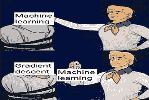
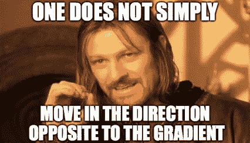
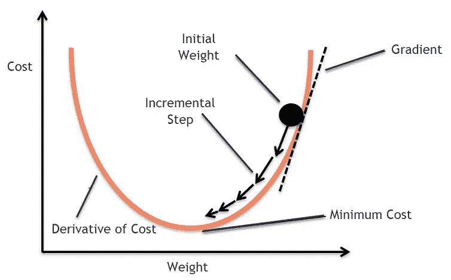
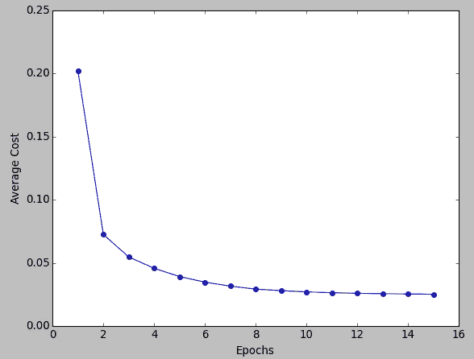
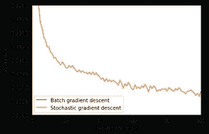
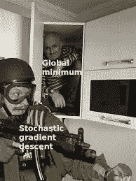
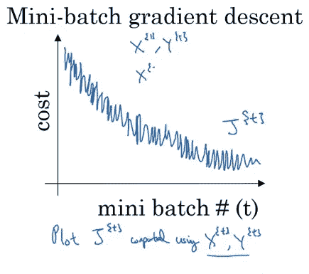

# 批量、小型批量和随机梯度下降

> 原文：<https://towardsdatascience.com/batch-mini-batch-stochastic-gradient-descent-7a62ecba642a?source=collection_archive---------0----------------------->

在这个深度学习的时代，机器已经超过了人类的智力，通过看例子来了解这些机器是如何学习的是很有趣的。当我们说我们正在*训练*模型时，是幕后的梯度下降在训练它。

Machine Learning behind the scenes (Source: [https://me.me/i/machine-learning-gradient-descent-machine-learning-machine-learning-behind-the-ea8fe9fc64054eda89232d7ffc9ba60e](https://me.me/i/machine-learning-gradient-descent-machine-learning-machine-learning-behind-the-ea8fe9fc64054eda89232d7ffc9ba60e))

因此，让我们更深入地研究深度学习模型，看看梯度下降及其兄弟姐妹。

# 梯度下降

这是维基百科对梯度下降的说法

> **梯度下降**是一种[一阶](https://en.wikipedia.org/wiki/Category:First_order_methods) [迭代](https://en.wikipedia.org/wiki/Iterative_algorithm) [优化](https://en.wikipedia.org/wiki/Mathematical_optimization) [算法](https://en.wikipedia.org/wiki/Algorithm)求函数的最小值

这似乎有点复杂，所以让我们分解一下。

梯度下降的目标是最小化给定的函数，在我们的情况下，是神经网络的损失函数。为了实现这个目标，它迭代地执行两个步骤。

Source: [https://hackernoon.com/the-reason-behind-moving-in-the-direction-opposite-to-the-gradient-f9566b95370b](https://hackernoon.com/the-reason-behind-moving-in-the-direction-opposite-to-the-gradient-f9566b95370b)

1.  计算斜率(梯度),即函数在当前点的一阶导数
2.  从当前点向坡度增加的相反方向移动计算出的量

Gradient descent (Source: [https://medium.com/@divakar_239/stochastic-vs-batch-gradient-descent-8820568eada1](https://medium.com/@divakar_239/stochastic-vs-batch-gradient-descent-8820568eada1))

因此，想法是通过神经网络的隐藏层传递训练集，然后通过使用来自训练数据集的训练样本计算梯度来更新层的参数。

这样想吧。假设一个人在山谷的顶端，他想到达谷底。所以他走下斜坡。他根据当前位置决定下一个位置，当他到达他的目标山谷底部时停下来。

有不同的方法可以让那个人(重物)走下斜坡。让我们一个一个的来看看。

# 批量梯度下降

在批量梯度下降中，所有的训练数据都被考虑在内以采取一个单独的步骤。我们取所有训练样本梯度的平均值，然后使用该平均梯度来更新我们的参数。这只是一个时代中梯度下降的一步。

批量梯度下降对于凸的或相对平滑的误差流形是很好的。在这种情况下，我们有点直接走向最优解。

Cost vs Epochs (Source: [https://www.bogotobogo.com/python/scikit-learn/scikit-learn_batch-gradient-descent-versus-stochastic-gradient-descent.php](https://www.bogotobogo.com/python/scikit-learn/scikit-learn_batch-gradient-descent-versus-stochastic-gradient-descent.php))

成本与时期的关系图也非常平滑，因为我们对单个步骤的训练数据的所有梯度进行了平均。随着时间的推移，成本不断降低。

# 随机梯度下降

在批量梯度下降中，我们考虑梯度下降的每一步的所有例子。但是如果我们的数据集非常庞大呢？深度学习模型渴望数据。数据越多，模型越有可能是好的。假设我们的数据集有 500 万个示例，那么仅仅一步，模型就必须计算所有 500 万个示例的梯度。这似乎不是一个有效的方法。为了解决这个问题，我们有随机梯度下降。在随机梯度下降(SGD)中，我们一次只考虑一个例子来进行单步。我们在 SGD 的**一个时期**中执行以下步骤:

1.  举个例子
2.  把它输入神经网络
3.  计算它的梯度
4.  使用我们在步骤 3 中计算的梯度来更新权重
5.  对训练数据集中的所有示例重复步骤 1-4

因为我们一次只考虑一个例子，成本会随着训练例子的变化而波动，而且**不**一定会降低。但是长期来看，你会看到成本随着波动而降低。

Cost vs Epochs in SGD (Source: [https://adventuresinmachinelearning.com/stochastic-gradient-descent/](https://adventuresinmachinelearning.com/stochastic-gradient-descent/))

Source: [https://towardsdatascience.com/optimizers-be-deeps-appetizers-511f3706aa67](/optimizers-be-deeps-appetizers-511f3706aa67)

还因为成本波动很大，它永远不会达到最小值，但会一直围绕着它波动。

SGD 可以用于更大的数据集。当数据集很大时，它收敛得更快，因为它会更频繁地更新参数。

# 小批量梯度下降

我们已经看到批次梯度下降。我们也看到了随机梯度下降。批量梯度下降可用于更平滑的曲线。当数据集很大时，可以使用 SGD。批量梯度下降直接收敛到最小值。对于较大的数据集，SGD 收敛更快。但是，因为在 SGD 中我们一次只使用一个例子，所以我们不能在它上面实现矢量化实现。这可能会降低计算速度。为了解决这个问题，使用了批量梯度下降和 SGD 的混合。

我们既不一次使用所有的数据集，也不一次使用一个例子。我们使用少于实际数据集的一批固定数量的训练样本，称之为小批。这样做有助于我们实现我们看到的前两种变体的优点。因此，在创建了固定大小的小批量后，我们在**一个时期内执行以下步骤:**

1.  挑选一个小批量
2.  把它输入神经网络
3.  计算小批量的平均梯度
4.  使用我们在步骤 3 中计算的平均梯度来更新权重
5.  对我们创建的小批量重复步骤 1-4

就像 SGD 一样，小批量梯度下降中各时期的平均成本会波动，因为我们一次对少量样本进行平均。

Cost vs no of mini-batch (Source: [https://stats.stackexchange.com/questions/310734/why-is-the-mini-batch-gradient-descents-cost-function-graph-noisy](https://stats.stackexchange.com/questions/310734/why-is-the-mini-batch-gradient-descents-cost-function-graph-noisy))

因此，当我们使用小批量梯度下降时，我们会频繁更新我们的参数，并且我们可以使用矢量化实现来加快计算速度。

# 结论

就像这个世界上的其他事物一样，我们看到的所有三种变体都有其优点和缺点。这并不是说一个变体经常被使用。根据情况和问题的背景，每个变体都被统一使用。

> 有问题吗？需要帮助吗？联系我！

[Github](https://github.com/sushantPatrikar)

[个人网站](https://sushantpatrikar.github.io/)

[领英](https://www.linkedin.com/in/sushant-patrikar/)

电子邮件:sushantpatrikarml@gmail.com