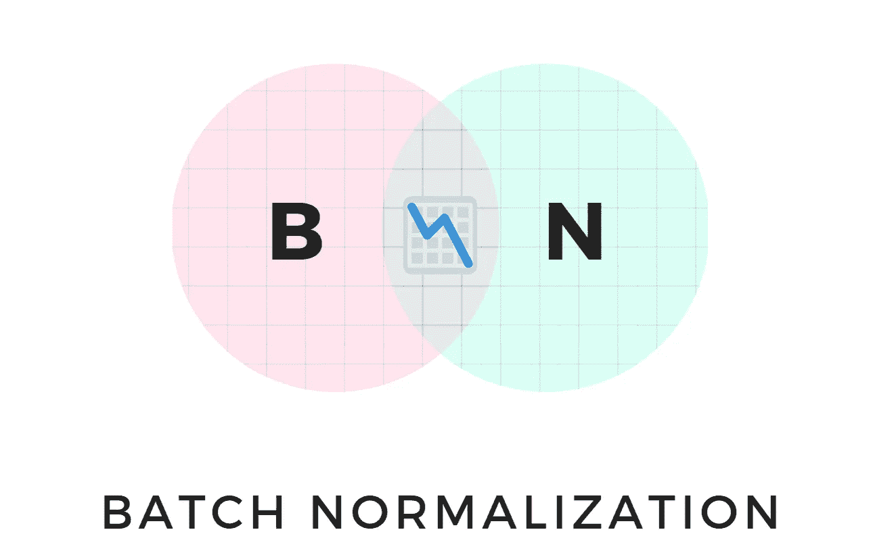
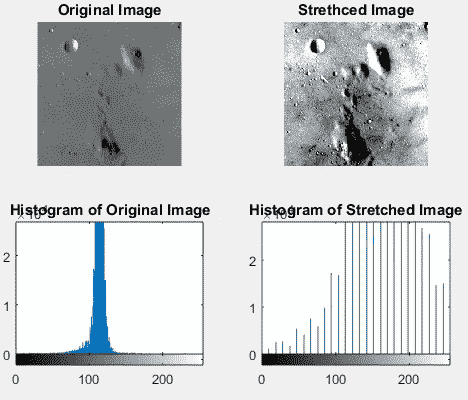
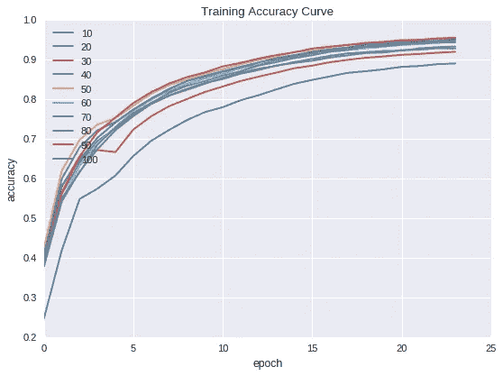
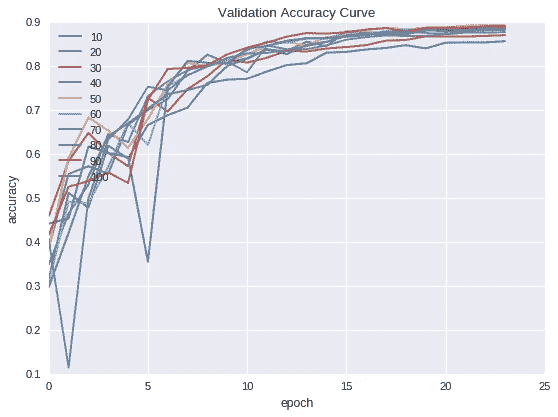
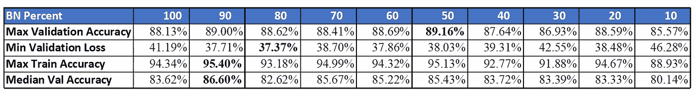
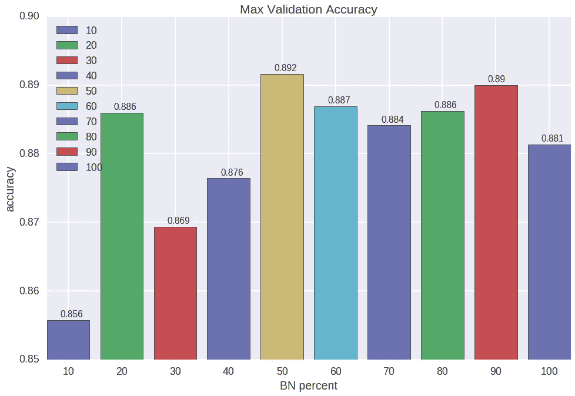

# BatchNormalization 不是一个规范！

> 原文：<https://towardsdatascience.com/batchnormalization-is-not-a-norm-cebfd921dadd?source=collection_archive---------13----------------------->

## 质疑深层神经网络中的基本元素



最近几年，深度神经网络在多个领域，特别是视觉和文本领域，广泛地改善了艺术状态。随着支持深度神经网络的基础设施的进步，研究转向通过使网络更宽更深并提高准确性来最大限度地利用可用硬件。深度神经网络的一个关键方面是批量标准化，它使得在不影响训练速度的情况下更深入变得可行。这使得 BatchNorm 成为 CNN 的重要组成部分。在用于对象识别的大多数当前技术状态的模型中，在网络架构内的卷积层之后有批处理层。但是批量规范化有多重要呢？我们需要对执行的每个卷积进行批量归一化吗？在本文中，我们将尝试回答其中的一些问题。

# 正常化

归一化是一种数据准备技术，用于确保数据一致且具有统一的尺度。在图像中，常用的数据准备技术包括像素归一化和图像归一化。

1.  像素标准化:这是通过将每个像素除以 255 来实现的，因此它们在[0，1]的范围内
2.  图像标准化:这将改变像素强度的范围，以便数据集中的每个图像都利用整个范围的像素值。这通常被称为直方图拉伸或对比度拉伸。从下图可以很容易理解——



Source: [**Nuruzzaman Faruqui**](https://www.nzfaruqui.com/)

上述技术有助于在训练开始前使图像正常化。一旦我们对图像进行卷积，就没有驱动力来限制尺度变化并保持一致。这就需要在每次卷积运算后使用另一种归一化技术。这时，批处理规范化就介入了。它有助于减少内部协变量的变化。

通俗地说，协变量偏移指的是数据集不同部分的不同特征分布。当在网络层内观察到由于激活的分布而导致的相同差异被称为内部协方差偏移。使用 BatchNorm，我们添加了一个归一化步骤，该步骤固定了层输入的均值和方差，通过降低梯度对参数或其初始值比例的依赖性，有助于加快收敛并改善通过网络的梯度流。

在其发明之后，批处理规范化已经在 CNN 中被广泛接受。不过，最近有人声称 BN 在两种情况下表现不佳——批量非常小和 RNN 中的重复连接。除此之外，BN 仍然比其他技术更受青睐，因为它易于管理，并且可以跨所有流行的框架使用。

这在很大程度上证明了在网络架构中使用 BN 的合理性，但是没有研究讨论应该多频繁地添加一个 BN。如果我们看看现有的网络，一个 BN 是在一个 3x3 卷积后添加的。让我们通过一个实验来检验这个理论。

在我的上一篇文章— [Is ReLU ReLUvant](/is-relu-reluvant-52b03bc48daa) 中，我通过进行一个在网络内随机丢弃 ReLU 层并测试准确性的小实验来检查 ReLU 的用法。结果是混杂的——当网络中 10%到 20%的总 ReLUs 被丢弃时，达到了最好的准确性。尽管从那个实验中得出任何结论仍有待商榷，但它确实激励我进行了一个类似的批量标准化实验。

# 实验

让我们从具有完全预激活的 ResNet 块的 ResNet1⁸模型开始。在这个实验中，我们将随机从 100%开始丢弃一些 BN 层，在每个后续实验中丢弃 10%,保持所有其他参数一致。

> *在这个实验中，我们将使用 CIFAR10 数据集*

# 超参数

```
BATCH_SIZE = 512
MOMENTUM = 0.9
WEIGHT_DECAY = 5e-4
LEARNING_RATE = 0.4
EPOCHS = 24
ReLUPercent =100
```

# 图像增强

```
Height and Width shift range = 0.15625,
Rotation range = 12
Random LR Flip
```

# 【计算机】优化程序

使用动量为 0.9、重量衰减为 5e-4 的 SGD。一个周期的学习率策略，在第 5 个时期具有 0.4 的最大 LR，并向后面的时期逐渐下降。

# 体系结构

该模型有 4 个 ResNet 块。与传统的 ResNet1⁸不同，在 ResNet 块的末尾，我们连接输入和残差路径，然后进行逐点卷积，以过滤前面获取的信息。
这个模型有 190 亿层。

# 基准

在 CIFAR10 数据集上，该模型在 Google Colab 上的 24 个历元中给出了约 88%的验证准确率。该模型有大约 27M 个参数。

# 培养



Plot 1: a)Training Accuracy Curve, b) Validation Accuracy Curve

**结果**



Table1: Accuracy Comparision

令人惊讶的是，当 50%的 BN 层被随机丢弃时，获得了最佳的验证准确度。此外，在这种情况下，训练精度稍低，因此，模型更加正则化。对于一个卷积，我们有一个 BN 时的精度比只有一半 BN 层时的精度低 1.03%。令人惊讶的是，当我们仅使用总 BN 的 20%时，最佳精度仍然比使用所有 BN 层时更好。



Plot 2: Max Validation Accuracy

有了这些结果，我们可以部分回答我们的问题

> 在一个网络中，我们需要一个 BN 层吗？
> 是的。如果没有 BN，模型精度会大幅下降。所以我们确实需要一些标准化技术。
> 在每个卷积之后盲目地添加一个 BN 是构建 CNN 架构的正确方式吗？
> 大概不会！
> 还有更好的办法吗？
> 肯定是的！
> 如何决定是否需要添加 BN？
> 网格搜索可以是一种方式，但我想不出任何其他最优方式来决定是否在卷积后添加 BN。虽然从直觉上来说，我们可能需要避免在模型末尾添加 BN 层，以便预测层可以看到更大范围的值。

虽然我们仍然不知道卷积层是否具有 BN 的适当方法，但希望这确实有助于我们理解，在设计深度神经网络时，仍然需要质疑非常基本的元素的使用。

实验可以在这个 [Colab 笔记本](https://colab.research.google.com/drive/1j3BuZaMgbx18uJqD1QHNNsnxCwbJqXbr)里找到。

**感谢您的阅读！请在评论中告诉我你的想法。再次感谢，继续学习！**

[1]:何、、张、向宇、任、、孙、简。(2016).[用于图像识别的深度残差学习](https://arxiv.org/pdf/1512.03385.pdf)。770–778.10.1109/cvpr . 2016.90 .
【2】:克日涅夫斯基，亚历克斯。(2012).[从微小图像中学习多层特征](https://www.cs.toronto.edu/~kriz/learning-features-2009-TR.pdf)。多伦多大学。