# 伯特 vs 乌尔菲特对决

> 原文：<https://towardsdatascience.com/battle-of-the-heavyweights-bert-vs-ulmfit-faceoff-91a582a7c42b?source=collection_archive---------17----------------------->

## 重量级人物之战

## 一个简单的 web 应用程序，用于实时比较两种架构。包括在谷歌应用引擎上部署的完整代码和说明

Photo by [Johann Walter Bantz](https://unsplash.com/@1walter2?utm_source=medium&utm_medium=referral) on [Unsplash](https://unsplash.com?utm_source=medium&utm_medium=referral)

这篇文章是[早先](https://medium.com/dsnet/running-pytorch-transformers-on-custom-datasets-717fd9e10fe2)文章的延续，在那篇文章中我谈到了在自定义数据集上运行拥抱脸的 pytorch-transformers 库。

在本主题中，我们将讨论:

1.  使用 py torch-transformers & ul fit 进行推理
2.  使用 HTML 前端和 flask 后端将其转换为 web 应用程序
3.  使用 SQLAlchemy & Cloud SQL 存储数据
4.  [谷歌应用引擎上的生产部署](https://deployment-247905.appspot.com/)
5.  几个有趣的观察结果

# 背景

当[py torch-transformers](https://github.com/huggingface/pytorch-transformers)发布时，我想试用一下，看看它的性能有多好，使用起来有多方便。因此，我开始着手建立一个 BERT(基础)模型，并在 IMDB 电影评论数据集上进行了微调。我把它包在一个网络应用程序上，任何人都可以玩。然后，我觉得与其他模型进行比较会很有趣，所以我在我的应用程序中加入了 ULMFiT。之所以选择 ULMFiT，是因为我作为 FastAI 的学生已经很长时间了，并且随身带着一个微调过的模型。最后，我决定通过对每个单词进行预测来实现实时性，这提供了一种很酷的方式来查看模型的内部工作方式。

app 部署在这里:[https://deployment-247905.appspot.com/](https://deployment-247905.appspot.com/)

这是当前版本的外观:

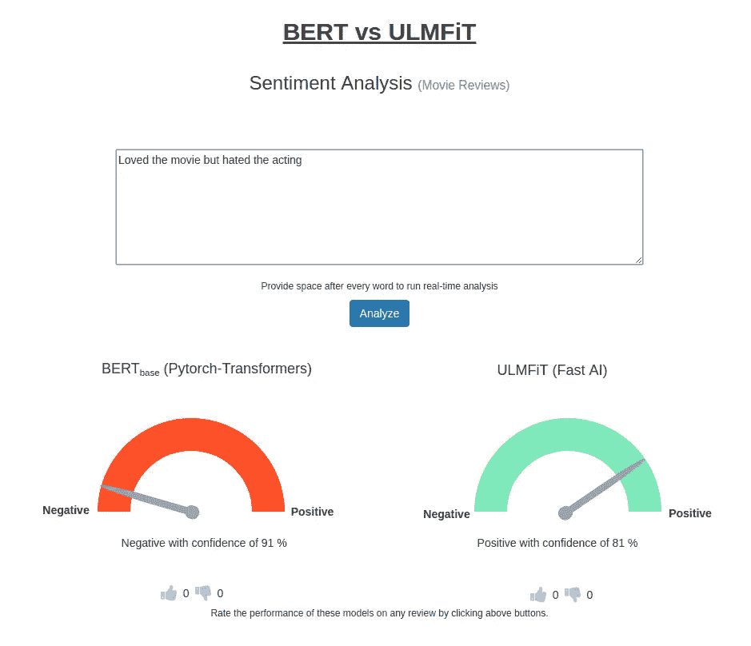

# 密码

所有的代码都存在于这里的[回购](https://github.com/nikhilno1/nlp_projects/tree/master/deployment/imdb-google-app-engine)中。[注意:自述文件将会随着代码的清理/小的重构而更新更多的细节]

下面快速浏览一下目录结构。

├──docker file
├──readme . MD
├──app . YAML
├──main . py
├──model
├──model-fastai
├──requirements . txt
├──static
┤──templates
└──utils _ inference . py

1.  Dockerfile:将应用程序作为 docker 容器运行。此外，我们在谷歌应用引擎(GAE)部署中使用了“灵活”的环境，这需要一个 dockerfile 文件。
2.  app . YAML:GAE 所需的应用程序设置文件
3.  main.py:主 flask 后端代码。文件名应该是 main.py，以便与 GAE 一起使用
4.  模型:包含微调的 BERT(基本)模型文件。想要下载文件，但是库需要增强来处理。我会看看我能不能做到。
5.  model-fastai:只包含 ULMFiT 的 imdb.vocab 文件。其他文件从一个公共的谷歌云存储桶中下载。
6.  requirements . txt:docker file 需要安装的所有包
7.  静态:Web 用户界面所需的 CSS 和 javascript 文件
8.  模板:包含拥有我们的 Web 用户界面的 index.html 文件。
9.  utils_inference.py:为 BERT 模型进行推理所需的实用函数。这些是从 pytorch-transformers 的 utils_ <dataset>中复制的。py 文件，并定制为 IMDB 电影评论数据集运行。</dataset>

# 推理

虽然 pytorch-transformers 使运行预训练模型甚至微调它们变得容易，但我发现在它上面运行推理很困难。因此，我复制了相关的功能，并修改它们以适应我的需要。

在 IMDB 电影评论数据集上微调 BERT 的所有细节可以在我早先的[帖子](https://medium.com/dsnet/running-pytorch-transformers-on-custom-datasets-717fd9e10fe2)中找到。

另一方面，从代码中可以看出，在 ULMFiT 上运行推理非常简单。

推理是通过后端的“/analyze”API 端点公开的，然后调用相关的函数来获得预测并在响应中返回它。

# 前端

前端使用 HTML、CSS 和 Javascript 开发。它使用额外的 jQuery 包来整合标尺、加载按钮和向上/向下滚动功能。为了提供实时交互，使用 AJAX 调用在每个单词后自动触发预测(稍有延迟，以防止在键入句子时触发不必要的事件),从而只更新标尺，而无需重新加载整个页面。

UI 还有一个选项，可以对任何评论的模型性能进行投票。这些信息被保存在一个 SQL 数据库中，这样我们以后就可以分析哪个模型对哪个评论更有效。

我的 UI 技能相当有限，所以代码肯定不是最优雅的，但它完成了工作。

# 后端

后端使用 [FLASK](https://flask.palletsprojects.com/en/1.1.x/) WSGI web 应用框架。它公开了 3 个 API 端点:

/':对于主用户界面

“/analyze”:用于运行预测

/model-feedback ':用于提交对模型性能的反馈。

可以调用后端在调试或生产模式下运行。这是由一个。主应用程序文件夹中的“调试”文件。(即在调试模式下运行创建一个*。调试 apps 文件夹中的*文件)。

[*女服务员*](https://docs.pylonsproject.org/projects/waitress/en/stable/) 用于服务制作版。请注意，按照 Google App Engine 的指示，生产版本需要在端口 8080 上运行。

后端使用*aiohttp*&*asyncio*模块异步下载模型文件。

我们还保存了客户端 IP 地址，以区分有多少不同的 IP 地址访问了该应用程序。因为在 GAE，应用程序位于 nginx 代理之后，所以我们必须使用 *request.access_route[0]* 来检索它。

# 数据存储

后端使用 [SQLAlchemy](https://www.sqlalchemy.org/) 与谷歌的[云 SQL](https://cloud.google.com/sql/docs/mysql/) 实例交互，将模型性能数据保存在 MySQL 数据库中。必须单独提供云 SQL 实例。Google App Engine 实例可以直接访问云 SQL 实例(通过云 SQL 连接名称字段)。请参考[官方](https://cloud.google.com/sql/docs/mysql/)文档，了解实例的配置。

# 部署到生产

因为我从谷歌获得了免费积分，所以我决定把这个应用程序放在它的基础设施上。起初我想部署一个虚拟机实例，但后来我遇到了 GAE，听起来非常完美。

让我们来看一下 *app.yaml* 文件，该文件控制应用程序如何在 GAE 上托管

> 运行时:自定义
> env: flex
> 资源:
> CPU:2
> memory _ GB:4.0
> disk _ size _ GB:20
> readiness _ check:
> app _ start _ time out _ sec:900
> env _ variables:
> CLOUD _ SQL _ CONNECTION _ NAME:deployment-XXXXXX:xxxxxxxx:xxxxxxxx xx
> DB _ USER:xxxxxxxx
> DB _ PASS:XXXXXX
> 
> 运行时:自定义
> 环境:flex

如果您正在部署 docker 容器，那么您需要使用灵活的环境(与标准环境相对)。自从我开始使用 docker 以来，我已经部署了相同的环境，但是我想转移到标准的环境，因为如果没有使用，这些实例可以缩减到 0。

> 资源:
> cpu: 2
> 内存 _gb: 4.0
> 磁盘 _ 大小 _gb: 20

我增加了默认实例的配置，选择了一个双 CPU 实例，内存为 4 GB，磁盘大小为 20 GB。在' *google cloud deploy* '命令失败并且日志抛出“*设备上没有剩余空间*”错误后，我不得不增加磁盘大小。

> 准备就绪 _ 检查:
> app_start_timeout_sec: 900

在我收到“ *google cloud deploy* ”命令失败后，我将应用程序启动超时从默认的 300 秒增加到 900 秒。

> env _ variables:
> CLOUD _ SQL _ CONNECTION _ NAME:deployment-XXXXXX:xxxxxxx:xxxxxxxx
> DB _ USER:xxxxxxx
> DB _ PASS:XXXXXX
> DB _ NAME:xxxxxxx

将数据库凭证传递给后端 python 脚本需要这些设置。理想情况下，我们应该使用“云密钥管理”解决方案(或等效方案)

> beta _ settings:
> cloud _ SQL _ instances:deployment-XXXXXX:xxxxxxx:xxxxxxxx

需要此设置来提供 GAE 和云 SQL 实例之间的连接。

# 有趣的观察

在这一部分，我们将看看我发现的一些有趣的观察结果:

总的来说，ULMFiT 似乎很难处理短句(3-4 个单词)。

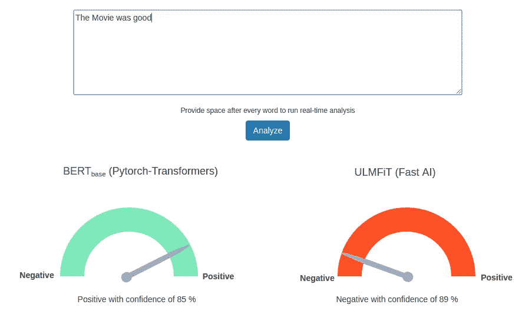

添加“.”最后改变置信度%。

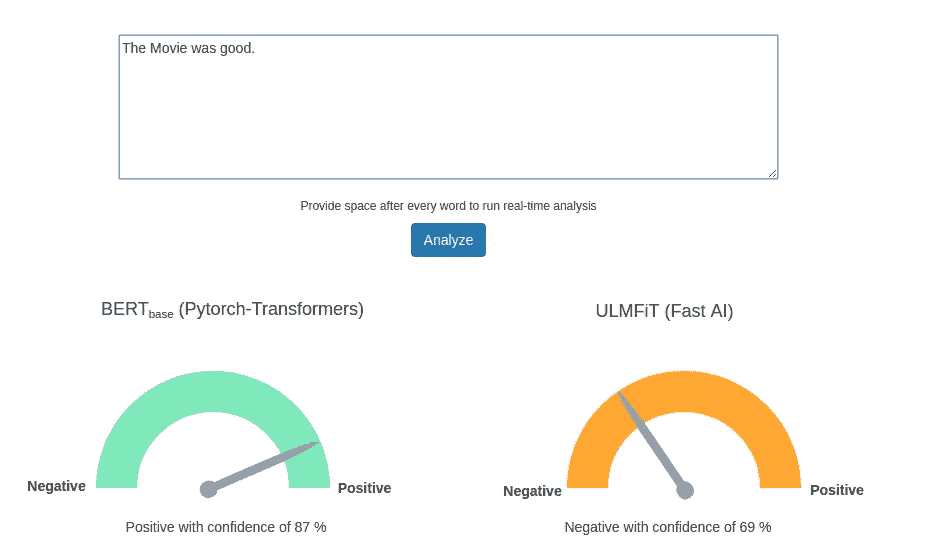

仅仅增加一个额外的单词“It”就改变了对 ULMFiT 的预测。

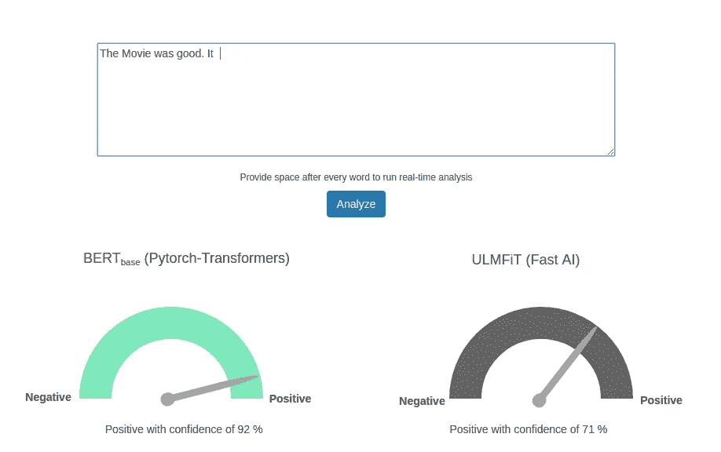

我想这两种情况都有可能。

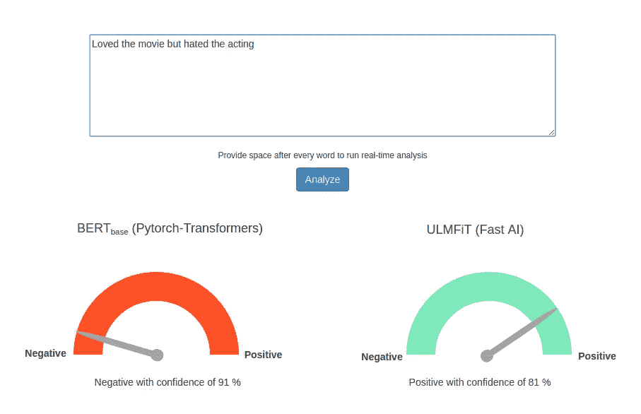

这个也一样。

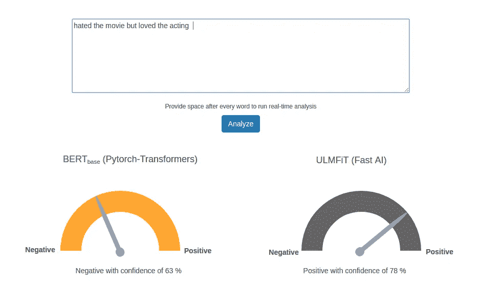

伯特在这里做得更好，因为我认为“高于平均水平”是积极的。

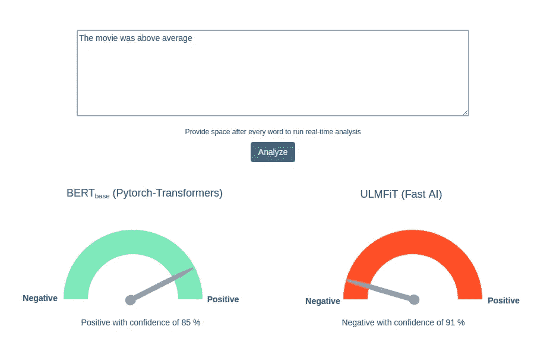

在这种情况下，两者都是正确的，但我们知道 ULMFiT 对于较短的句子偏向于否定。

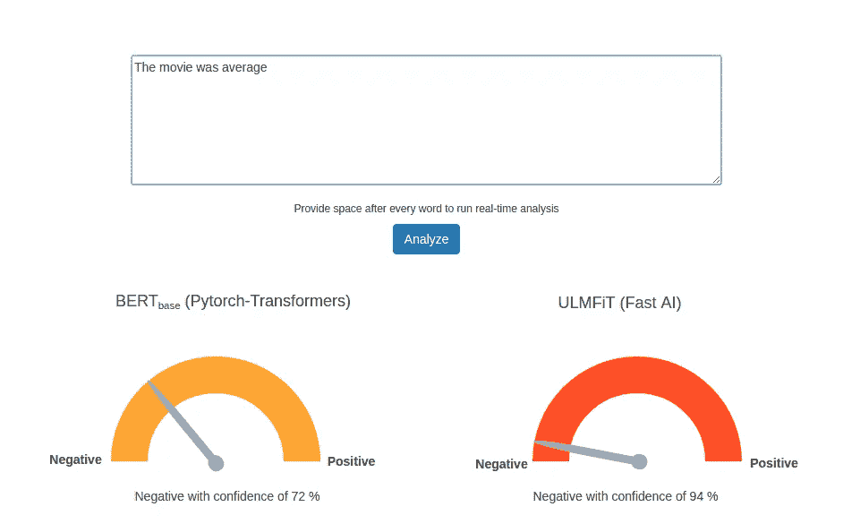

很高兴看到这里的信心越来越强。

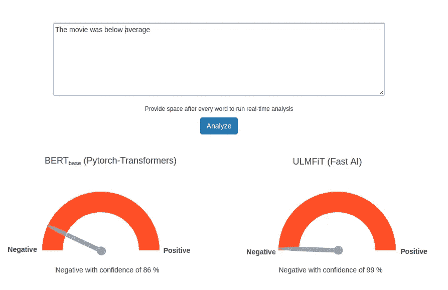

很高兴看到伯特能把这件事做好。但是我们知道“高于平均水平”是负面的。

但它得到的却是负面的。也许是因为刑期较短。

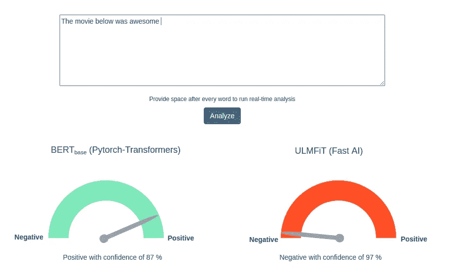

这里都很好。

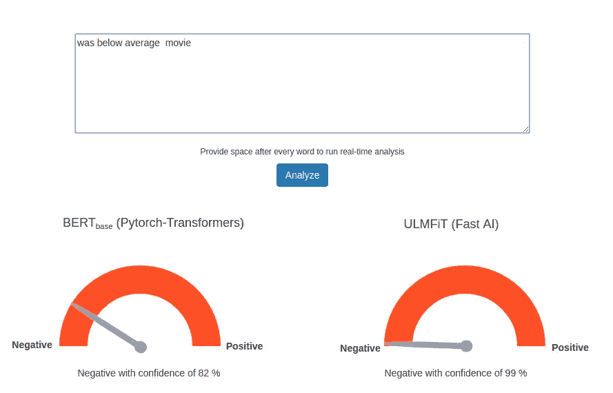

但这是什么？伯特仅仅通过去掉单词“was”就改变了它的预测。发生什么事了？

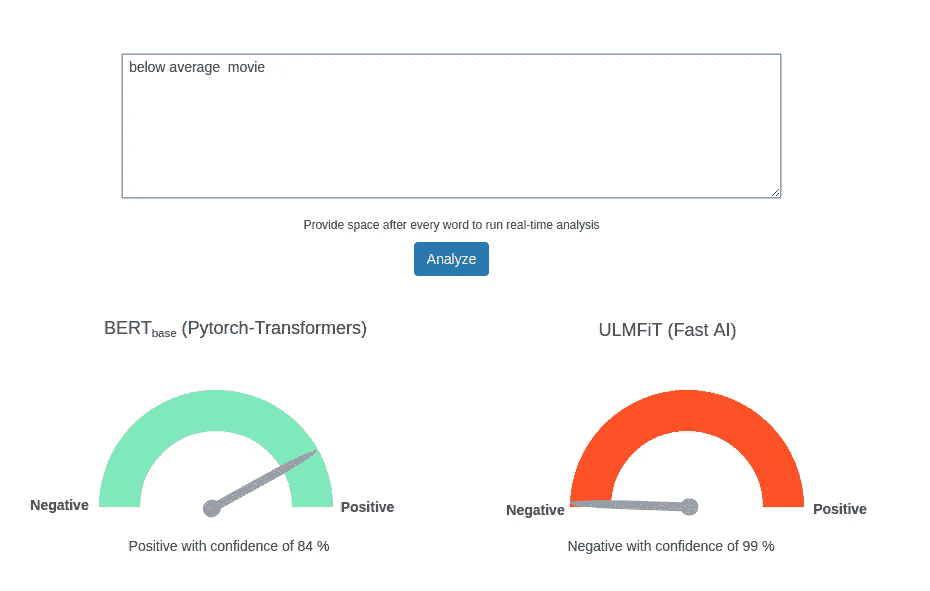

现在这个你会认为是负的，伯特错了，乌尔姆菲特对了。

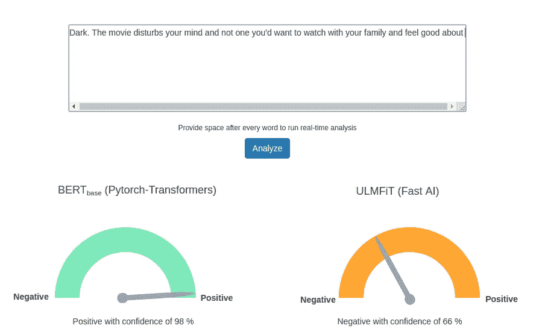

但是如果你去掉“黑暗”这个词，伯特就会改变它的预测。同样，不知道这是如何工作的。

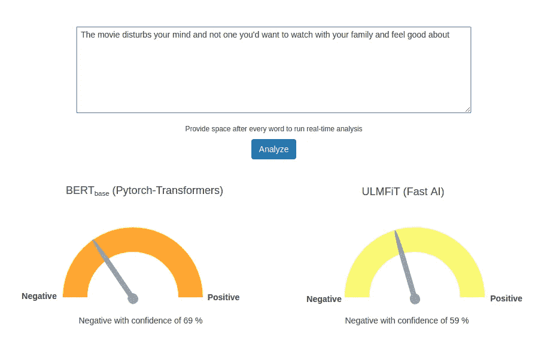

最后，我在 IMDB 上测试了 50 多条真实评论，我可以说这两个模型彼此非常一致，除了这一次 ULMFiT 似乎做出了更好的判断。

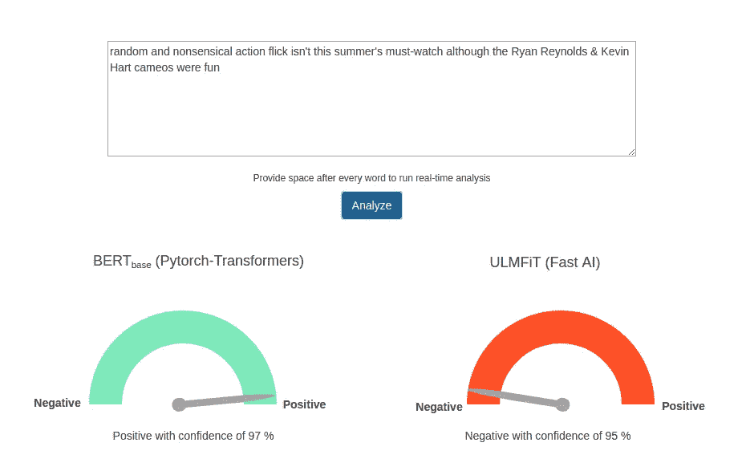

# 结论

虽然上面的例子确实表明 BERT 更擅长理解语言的语义，但是在现实世界中，当有多个句子时，两者之间没有太多选择。

如果更多的用户可以尝试这个应用程序，并提供他们对一种模式比另一种模式更好的情况的反馈，也许我们就可以选出一个赢家。

*快速链接:*[*【https://deployment-247905.appspot.com/】*](https://deployment-247905.appspot.com/)