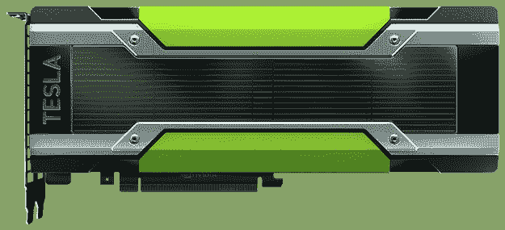
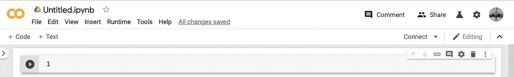
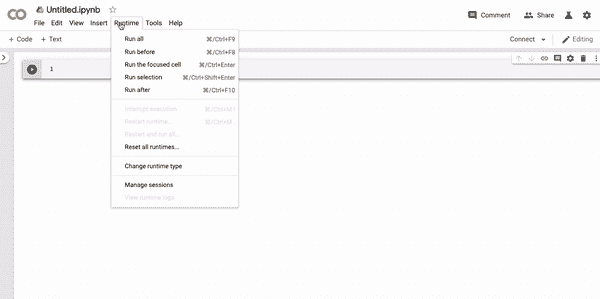
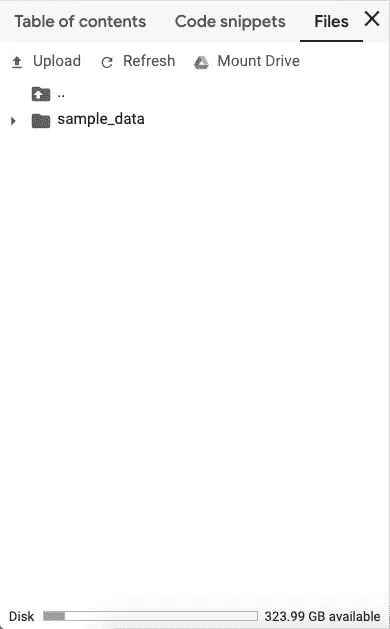

# 用 Google Colab 战胜 GPU 的挫败感

> 原文：<https://towardsdatascience.com/battling-out-the-gpu-frustration-with-google-colab-2fb62ecf276d?source=collection_archive---------9----------------------->

## 轻松开发复杂机器学习模型的平台。



image from [NVIDIA](https://www.nvidia.com/en-gb/data-center/tesla-k80/)

随着机器学习和深度学习模型的数据集规模大幅增加，对 GPU 更快训练模型的需求也在升级。作为数据科学的学生，我们都知道我们受到挑战的笔记本电脑需要多长时间来运行包含数百万条记录的数据集的机器学习或深度学习模型。

一般来说，基本的笔记本电脑和个人电脑需要用户花费大量的时间来将数据拟合到构建的模型中。因此，超调模型的过程会受到这种约束的影响。

这种情况的另一种选择是购买外部 GPU，基本型号的平均价格为 250-300 美元。对于一个学生来说，对于他/她正在努力的大学项目来说，这是一个很大的代价。


GIF from [Giphy](https://giphy.com/gifs/angry-frustrated-L4AQvif7x9fS8/media)

> 我知道这很令人沮丧！！！

多亏了谷歌，学生们可以不再担心这样的情况，因为谷歌在云上提供了一个免费的 GPU 来运行大规模的机器学习项目。

> 本文将带您开始使用 Google Colab，这是一个免费的 GPU 云服务，带有一个基于 Jupyter Notebook 的编辑器。
> 
> 用户可以运行他们的机器学习和深度学习模型，这些模型建立在当前最受欢迎的库上——Keras、Pytorch、Tensorflow 和 OpenCV。
> 
> 首先，你需要一些 Python 和 Jupyter notebook 的知识，以及基本的机器学习概念。

Google Colab 是 Python 流行库的完美工具，如 **Keras** 、 **Tensorflow** 、 **Pytorch** 。您可以创建一个新的 **Python 3** 或 **Python 2** 笔记本，打开存储在各自用于创建笔记本的 google 帐户中的笔记本，并可以从本地计算机上传笔记本。在将我们的数据集上传到平台的情况下，有一个缺点，即当会话重新启动时，数据集会被删除。我们可以将 Google Drive 安装到笔记本上，这是一个很酷的功能，而不是每次打开笔记本时都要上传文件。

# Google Colab 入门

我们可以通过点击下面的链接启动该平台

[](https://colab.research.google.com/notebooks/welcome.ipynb?pli=1) [## 谷歌联合实验室

### 编辑描述

colab.research.google.com](https://colab.research.google.com/notebooks/welcome.ipynb?pli=1) 

一旦你点击链接，你将被要求使用你的谷歌账户登录，你创建的所有笔记本将被自动存储以备将来使用。


*   **示例**选项卡提供了一些代码，为了使用 Google Colab 的大部分功能，必须对这些代码进行适当的检查。
*   **最近的**选项卡提供了您最近创建或处理的几个笔记本。
*   **Google Drive** 选项卡提供所有链接到您的 Google 帐户的笔记本。
*   **Github** 标签让你将你的 Github 账户链接到 google colab。
*   **上传**选项卡提供了从本地计算机上传文件的链接。通过广泛使用该平台，可以了解大多数隐藏的功能。

# 基本布局和功能



image from [Google Colab](https://colab.research.google.com/notebooks/welcome.ipynb?pli=1)

这是创建新笔记本时生成的基本布局。大部分功能与 [Jupyter 笔记本](https://jupyter.org/)相似。双击 Untitled.ipynb 可以更改笔记本的名称 **+Code 和+ Text** 分别用于添加新的 Code 单元格或 markdown 单元格。其他用户可以通过添加他们的 Gmail 地址来共享笔记本，这样每个人都可以在一个地方进行适当的更改。您可以通过点击屏幕右上角的**连接**按钮开始新的会话。

在开始会话之前，最好将运行时类型更改为 GPU(因为这是使用 Google Colab 的主要目的)，可以在**运行时**选项卡中访问它。



Google Colab 是一个非常简单但功能强大的平台，可以运行您的机器学习和深度学习模型，而不必担心 GPU 的能力。如果你习惯在 Jupyter 笔记本上工作，那么这将是小菜一碟。

# 降价

我想强调一下降价，因为它们在开发 Jupyter 笔记本时增加了很多重量。它帮助你通过你的代码讲述一个故事，如果你想成为一名数据科学家，这是必须的。管理主要需要输出，而不是相关的代码，这简化了这个过程。Google Colab 提供了对所写的降价的实时预览，这样你就不必每次都运行单元格来进行微小的修改。


## **上传数据**



该窗口出现在屏幕左侧，并带有一个与之相关的箭头。在这里，你可以从本地计算机上传一个文件或者挂载你的 Google Drive(我会在文章的后半部分解释)。

# 基本命令

# 1.安装你的谷歌硬盘

```
from google.drive import drive 
drive.mount(/content/gdrive)
```

# 2.安装库

```
!pip install keras
```

# 3.克隆 Github 存储库

```
!git clone [https://github.com/pytorch/pytorch](https://github.com/pytorch/pytorch)
```

# 4.运行 Python 脚本

```
!python setup.py
```

# TPU 电力公司

TPU(张量处理单元)是由谷歌开发的，旨在提供高计算能力来训练机器学习和深度学习模型。尽管你可以随意使用 NVIDIA Tesla K80，但 TPU 提供的动力要大得多。根据 Google 的 Colab 文档提供的信息， **A GPU** 提供 **1.8TFlops** 并拥有 **12GB RAM** ，而 **TPU** 提供 **180TFlops** 并提供 **64GB RAM。**


GIF from [Giphy](https://giphy.com/gifs/13RUArdtYSddra/media)

# 结论

Google Colab 是 Jupyter Notebook 运行高计算深度学习和机器学习模型的绝佳替代品。您可以随时与其他开发人员共享您的代码，以便他们可以帮助您优化代码。大多数 python 库都预装了 Google Colab，因此它减轻了安装每个库的负担。和主要功能将是免费的 GPU！！！。

像往常一样，免费产品有一些限制。(无关紧要的限制，但在某些情况下会有所不同)。只能使用**Python 2.7**(2020 年 1 月起弃用)或 **3.6** 作为编程语言，不支持 **R** 。每个用户的 GPU 分配限制为一次 12 小时。使用的 GPU 是 **NVIDIA Tesla K80** ，一旦会话完成，用户可以通过连接到不同的虚拟机来继续使用资源。

我建议你参考[你的 Google Colab 一站式指南](https://medium.com/better-programming/one-stop-guide-to-google-colab-d67c94d30516)，它提供了更多的技巧和窍门，让你对 Google Colab 有更深的了解。

谢谢你。


GIF from [Giphy](https://giphy.com/gifs/hero0fwar-karmawhore-rhyming-g9582DNuQppxC/media)