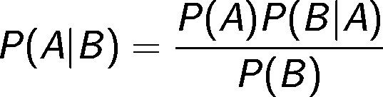
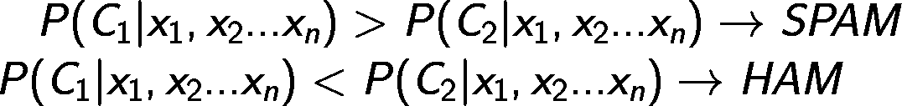
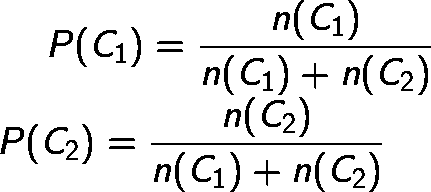
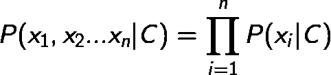

# 基于 Kotlin 的 Android 无张量流贝叶斯文本分类

> 原文：<https://towardsdatascience.com/bayes-text-classification-in-kotlin-for-android-without-tensorflow-d10f1247c23d?source=collection_archive---------20----------------------->

## 📱[移动机器学习](https://equipintelligence.medium.com/list/stories-on-mobile-ml-with-kotlin-and-tf-lite-3ebee822c87b)

## 探索没有 TensorFlow APIs 的纯 Kotlin 中的贝叶斯文本分类。

Photo by [Luca Bravo](https://unsplash.com/@lucabravo?utm_source=medium&utm_medium=referral) on [Unsplash](https://unsplash.com?utm_source=medium&utm_medium=referral)

T [ext 分类](https://monkeylearn.com/text-classification/)由于其能力和广泛的用途，已经成为[自然语言处理](https://www.sas.com/en_in/insights/analytics/what-is-natural-language-processing-nlp.html)中的一项重要任务。我们将学习以非深度学习的方式使用这项技术，而不使用 [TensorFlow](https://www.tensorflow.org) 和神经网络。这个分类器将在 Android 应用程序中工作，所以需要用 Kotlin 或 Java 编写。

# 但是为什么是科特林，为什么不是我们的 TensorFlow 或者 Python？

We aren’t using TensorFlow? Because it’s written in C++, models are constructed in Python and we need to run it in Kotlin!

TensorFlow 和 [TensorFlow Lite](https://www.tensorflow.org/lite) 可以在 Android 上高效地工作(或者有时是在头脑中吹的方式)。类似的算法可以在任何编程语言中创建，如 C、C++甚至[Swift](https://developer.apple.com/swift/)(iOS 原生)，如果它可以在 kot Lin(Android 原生)中创建的话。

> 有时，在平台中本地编码的分类器可以比 TensorFlow 或其 API 执行得更好。此外，我们可以对它的工作和推理有更多的控制流。

# 我们要用哪种机器学习算法？我们到底在创造什么？

> 我们将使用朴素贝叶斯文本分类器对 Kotlin 中的文本进行分类，该分类器最终将在 Android 设备上运行。

Math is coming! Be ready!

谈论[朴素贝叶斯文本分类](https://www.geeksforgeeks.org/naive-bayes-classifiers/)，

朴素贝叶斯文本分类使用[贝叶斯定理](https://brilliant.org/wiki/bayes-theorem/)的力量将文档(文本)分类到某一类。

Bayes Theorem

如果我们根据我们对文本分类的需要来建立等式，那么它将变成这样，

Eq.1

> 在这里，我们将文档表示为 x₂x₁令牌...xₙ和 c 是我们将计算概率的类。分母被省略，在这里可以看到它的[解释](https://stats.stackexchange.com/questions/329382/why-ignore-the-denominator-of-bayes-rule)(因为在这两种情况下(C₁和 C₂)，P( x₁，x₂...xₙ)将保持不变并将作为归一化常数)

我们将计算两个类别的概率，即*垃圾邮件* ( C₁)和*火腿* ( C₂)。概率较高的将是我们的输出。

对于每个类，我们都有一个词汇或一组出现在垃圾邮件或垃圾邮件中的单词，它们将代表我们的类语料库。

# 先说科特林。

If you loved Python earlier!

首先，我们将定义我们的语料库`positiveBagOfWords`和`negativeBagOfWords`，它们分别包含垃圾邮件和火腿词。

现在，我们创建一个名为`Classifier`的新类来处理分类任务。我们需要定义两个常量和一个从给定文本中提取标记的方法(通过删除不必要的单词、标点符号等)。).

> getTokens( document ) =令牌。因此，我们可以将文档 d 转换为一组令牌，如 x₁ ,x₂ … xₙ.

## 寻找概率

首先，我们需要找到 *P( C )* 或者类概率。这无非是两个语料库中有多少单词属于类别 *C* 的概率。

Class probabilities. Eq.2

Calculates Eq.1

接下来，我们需要找到 *P( X | C )* 这是 X 的*概率，假设它属于一个类别 C* 。

在此之前，我们需要一个方法来找到给定文档中的令牌 *xᵢ* 的 *P( xᵢ | C )* 。我们可以用这个方法。

Calculates P( xᵢ | c )

> 其中`class_vocab`是其中一个语料库。它代表 P( xᵢ | C)中的 c。想知道 1 是从哪里来的？这就是拉普拉斯平滑。如果 P( xᵢ | C)是 0，而 xᵢ在我们的语料库中不存在，那么我们所有的 P( X | C)都可能变成 0。加 1 可以解决这个问题。

现在，我们需要将所有的 *P( xᵢ | C )* 相乘，最后乘以 P( C)，这是我们在下面方法中的类概率。

Calculates Eq.1

仅此而已。现在我们需要检查哪个类的可能性更大。

在这个[要诀](https://gist.github.com/shubham0204/c19eb5694bf2c7be3901772726ac5c5e)里可以一目了然的看到完整的代码。

# 还有呢！

# 太长了，有点数学化。结束了！

希望你喜欢科特林的朴素贝叶斯的想法。请在下面的评论区分享您的反馈。

> 这是我的第一篇数学含量很高的文章，所以请原谅我在精度标注上的错误。:-)

快乐的机器学习。