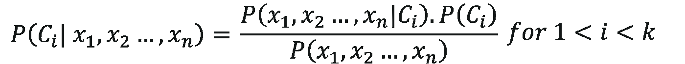
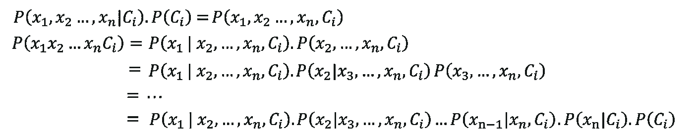
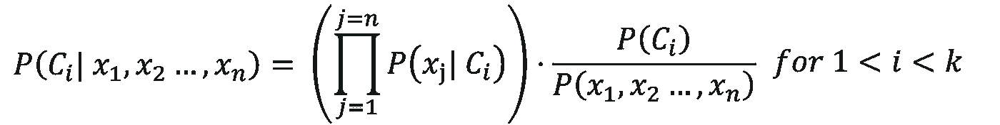
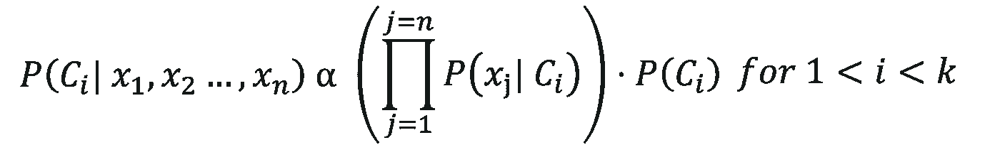
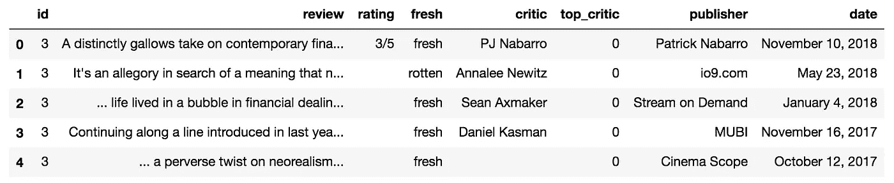

# 贝叶斯定理与电影评论分析

> 原文：<https://towardsdatascience.com/bayes-theorem-and-movie-review-analysis-fffae437a56?source=collection_archive---------27----------------------->

贝叶斯定理是概率论中的一个基本公式。如果你想知道某个事件发生的概率，我们可以使用一些先验知识和贝叶斯定理来进行计算。

## 贝叶斯定理

让我们来看看贝叶斯定理:

```
P(A|B) = (P(B|A) * P(A)) / (P(B))
```

> *后验*，* P(A|B) *:假设事件 B 发生，事件 A 发生的概率**
> 
> **可能性*，* P(B|A) *:给定事件 A 发生，事件 B 发生的概率。***
> 
> ***先验*，* P(A) *:是我们发生的概率。****
> 
> **P(B) *:事件 b 的概率，也改写为* P(B|A) + P(B| Aᶜ) *。***

**关于可能性与概率的一个注记:**

**可能性类似于概率，但不是概率。可能性被认为是给定固定数据的假设。然而，我们常常不知道我们所知道的数据是什么样的样本。因此，可能性 P(B|A)度量了一个*样本*支持这个特定事件的程度。**

## **简单贝叶斯例子**

**假设，1%的人口患有疾病，并且有针对该疾病的医学测试。如果一个人患有这种疾病，该测试预测他们患有这种疾病的准确率为 87%。如果一个人没有患病，该测试正确地测量出 72%的人没有患病。假设一个人接受了测试，并且测试结果呈阳性，那么他患这种疾病的概率是多少？**

```
**# posterior = P(has disease | positive test) 
# likelihood = P(positive test | has disease)
# prior = P(has disease)
# P(positive test) = P(positive test | has disease) * P(has disease) + P(positive test | does not have disease) * P(does not have disease)posterior = (0.87 * 0.01) / (0.87 * 0.01 + (1 - 0.72) * (1 - 0.01))posterior = 0.03**
```

## **院长**

**让我们再多谈谈先验知识。先验是基于我们已经掌握的信息。如果我们对事件的认识改变了呢？假设一项新的研究发现，这种疾病实际上在 3%的人口中流行，而不是 1%。这大大改变了我们的答案，使这种疾病呈阳性结果的概率增加到 8.8%。因此，当我们考虑样本如何反映总体时，当我们有数据集样本时，考虑先验概率是很重要的。**

## **打破朴素贝叶斯**

**前面的例子只考虑了一个特征和目标，现在我们来想想，如果这个疾病有四个不相关的疾病检测结果呢？如果一个人每次测试都得到阳性结果，那么这说明了患这种疾病的可能性有多大。这就是朴素贝叶斯派上用场的地方。**

**之所以称之为朴素贝叶斯，是因为它做出了一个在现实中几乎不可能满足的主要假设，这就是所有特征都是独立的且互不影响的假设。假设独立性的一个例子是球的大小不影响球的颜色。然而，这不是一个伟大的假设，因为大多数篮球(相当大)是橙色的，而大多数高尔夫球(相当小)是白色的。同样，朴素贝叶斯作出这种假设是为了使数学更简单，并使计算机程序在初始分类测试中运行得更快。它可能不会是您使用的最终模型，但它是一个很好的起点。**

**让我们通过一个例子来展示朴素贝叶斯的工作原理。**

**假设我们想计算在给定评论文本的情况下，在腐烂的西红柿上获得“新鲜”分数的概率(在评论文本中，我们计算每个单词出现的次数)。**

1.  **开始配方。给定评论包含 X 个单词，一部电影是 *C=fresh* 的概率是多少？这等于新得分包含这些单词的可能性乘以新得分的概率除以单词的概率。**

****

**2.使用链式法则，我们可以将似然性 *P(X|Ci)* 扩展到每个单词在给定条件下依次减少的似然性:**

****

**3.由于我们天真地认为单词是相互独立的，因此我们可以简化数学。贝叶斯的独立性法则表明，如果 A 和 B 是独立的，那么 *P(A|B) = P(A)* 。我们只需要看|和类前的单词。然后我们将这些可能性相乘。这将等式简化为:**

****

**4.最后，由于我们的分母是不变的，我们来看看比例性:**

****

***“给定该评论文本的电影是新的概率与给定新评论的每个词的可能性乘以新评论的概率的乘积成比例。”***

## **在 Python 中应用朴素贝叶斯**

**这种数学可能有点复杂和冗长，尤其是对于文本分类。幸运的是 *Scikit-learn* 有一个内置的库为我们做数学运算。有几种不同类型的朴素贝叶斯分类器，但我们希望使用多项式贝叶斯分类器，因为它测量离散计数(即电影评论中的字数)。我使用了来自[这个](https://www.kaggle.com/rpnuser8182/rotten-tomatoes) Kaggle 数据集的评论。**

1.  **导入必要的库并将数据存储在数据帧中**

```
**import csv
import pandas as pd
from sklearn.naive_bayes import MultinomialNB
from sklearn.model_selection import train_test_split
from sklearn.feature_extraction.text import CountVectorizer, TfidfTransformerdata = []
with open('reviews.tsv', encoding="utf8", errors='ignore') as tsvfile:
    reader = csv.reader(tsvfile, delimiter='\t')
    for row in reader:
        data.append(row)reviews = pd.DataFrame(data[1:], columns=data[0])**
```

**2.清理数据帧。要做的一些改变是将新鲜和腐烂转换为二进制，并将评论和评分存储在自己的系列中。**

****

**An initial look at the data**

```
**score_dict = {'fresh': 1, 'rotten': 0}
reviews['fresh'] = reviews['fresh'].map(score_dict)X = reviews['review']
y = reviews['fresh']**
```

**3.在 X 轴和 y 轴上执行训练、测试和分割**

```
**X_train, X_test, y_train, y_test = train_test_split(X, y)**
```

**4.创建一个 CountVectorizer 对象，并将其安装在 **X_train** 上。不要使用 X，因为我们希望将 X_train 视为我们拥有的唯一数据。使用 stop_words='english '删除不太重要的单词，如“the”、“and”和“that”然后转换 X_train 和 X_test。**

```
**count_vectorizer = CountVectorizer(stop_words='english')
count_vectorizer.fit(X_train)X_train_counts = count_vectorizer.transform(X_train)
X_test_counts = count_vectorizer.transform(X_test)**
```

**5.创建并调整 TfidfTransformer 对象。这将根据每个单词在文档中出现的频率以及在多少个文档中出现来对其进行加权。如果一个单词在文档中出现很多，那么这个值就会增加，因为它可能是一个重要的单词。但是，如果它出现在很多文档中，则价值会降低，因为这个词可能对整体分类影响不大。变换 X_train 和 X_test。**

```
**tfidf_transformer = TfidfTransformer()
tfidf_transformer.fit(X_train_counts)x_train_tfidf = tfidf_transformer.transform(X_train_counts)
x_test_tfidf = tfidf_transformer.transform(X_test_counts)**
```

**6.在 tfidf 训练数据上创建和训练多项式朴素贝叶斯分类器。**

```
**classifier = MultinomialNB()
classifier.fit(x_train_tfidf, y_train)**
```

**7.执行朴素贝叶斯。这一步为你做了所有的计算！我们可以做两件事:第一是严格计算后验概率，第二是得到最可能的结果。我们可以在我们的测试数据上做到这一点，但为了简单起见，让我们看看我写的一篇评论，应该是 *fresh* 。**

```
**classifier.predict_proba(count_vectorizer.transform(['This is an awesome movie']))# Output: [0.36188785, 0.63811215]classifier.predict(count_vectorizer.transform(['This is an awesome movie']))# Output: [1]**
```

**这个输出意味着这部电影有 0.362 的几率有*烂*分，有 0.638 的几率有*新*。它还预测评论是*新鲜的*。**

**还有一种使用流水线的替代方法，它压缩了计数矢量化、tfidf 转换和分类器步骤。**

```
**from sklearn.pipeline import Pipelinetext_classifier = Pipeline([('count_vectorizer', 
                             CountVectorizer(stop_words='english')),
                            ('tfidf_vectorizer',   
                             TfidfVectorizer()),
                            ('clf', MultinomialNB())])text_classifier.fit(X_train, y_train)text_classifier.predict_proba(['This is an awesome movie'])
text_classifier.predict(['This is an awesome movie'])**
```

## **摘要**

**贝叶斯定理利用先验知识和事件发生的可能性来预测在其他事情发生的情况下特定结果发生的概率。朴素贝叶斯是一种快速而强大的工具，我们可以用它来对信息进行分类，但它主要是一个起点，因为它做出了一些假设，所以要谨慎使用。它主要用于文本分类，因为数据集很大，非常符合独立性原则。关于代码的更多信息，请查看我在 GitHub 上的[库。](https://github.com/kayschulz/rotten_tomatoes_nb)**