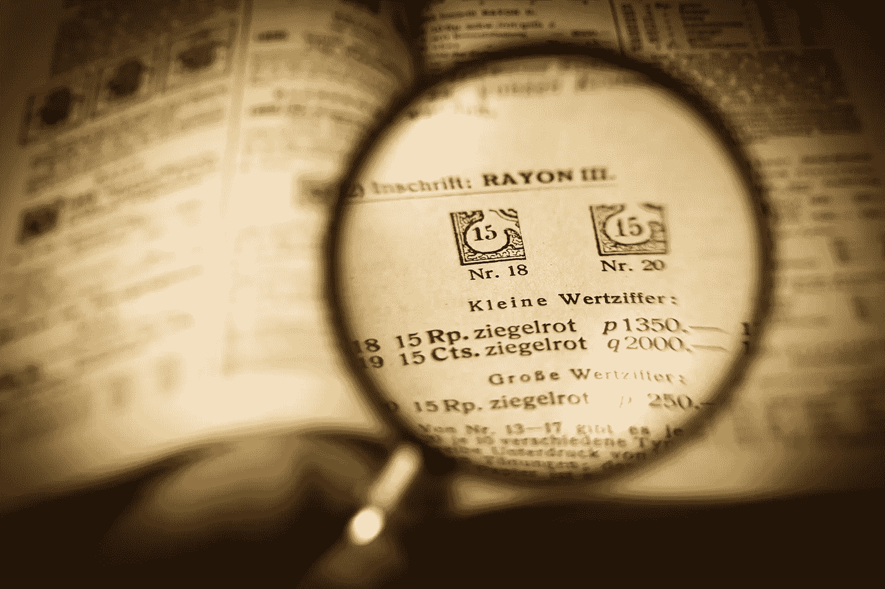
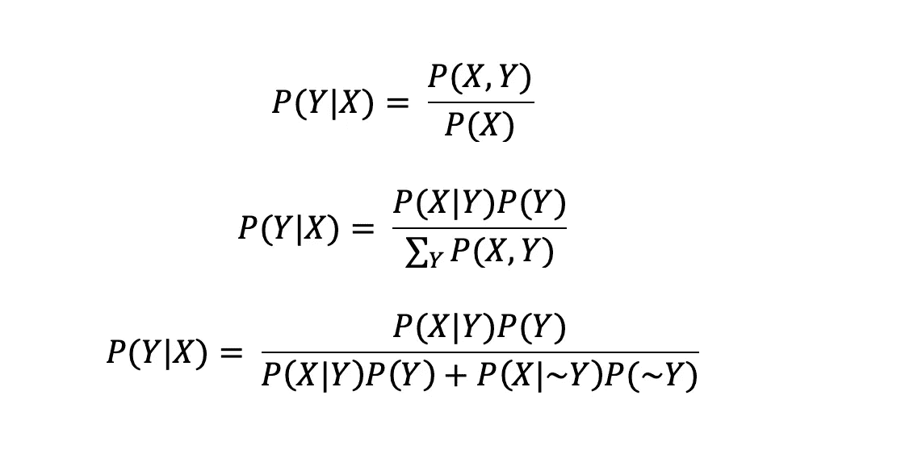
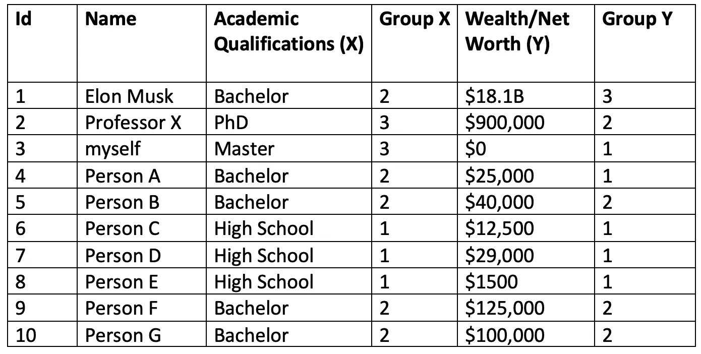
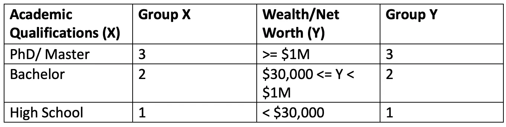
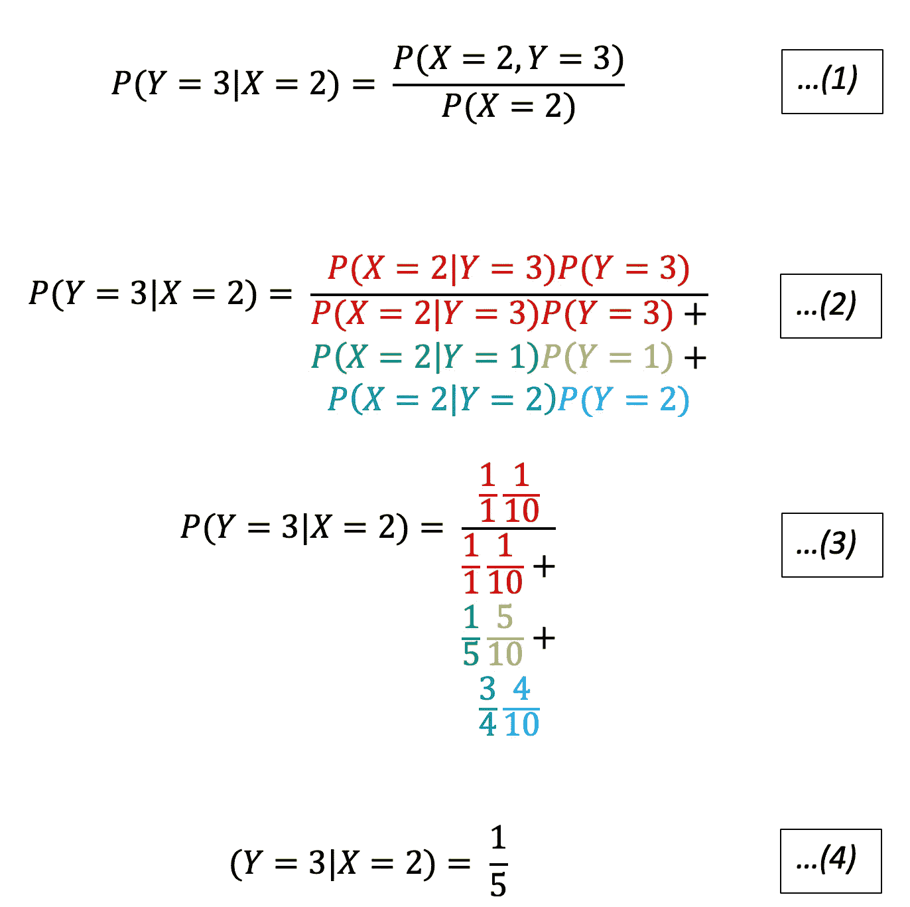

# 贝叶斯定理——一些观点

> 原文：<https://towardsdatascience.com/bayes-theorem-some-perspectives-eeb4421b186e?source=collection_archive---------9----------------------->

## “我听到了，我忘记了。我看见了，我记得。我知道，我理解。”――荀子

最近我在读数学史相关的书籍，这让我想起了一个事实，所有看起来复杂的方程都是从一个小的现实世界的问题开始的。研究小问题的好处是，它可以帮助我们忽略树叶，专注于树干，更重要的是，它允许我们在复杂的理论和现实世界的例子之间来回转换。

在这种信念的激励下，我开始将这种策略应用于一个我很久以前就已经学会但我并不十分直观地熟悉并能够快速应用于我在现实世界中遇到的任何情况的定理——贝叶斯定理。正如您所知，贝叶斯定理在数据分析和统计中非常有名，是许多机器学习模型和算法的基础。

我将调查一些小例子，并在下面的部分中尝试给你一些定理的直观解释。虽然下面的讨论对于有统计学背景的人来说可能很熟悉，但我觉得如果你从来没有花时间真正思考和工作，要有一个深刻和直观的理解是很不容易的。为了最大限度地利用这一点，建议您随身携带一支笔和纸，并按照计算结果进行操作。计算非常简单，但是自己写下来可以利用你的肌肉记忆，保证给你留下深刻的印象。

## 这个问题

首先，我们需要有我们感兴趣的问题，并收集一些数据进行分析。这里会用到一个简单的例子，但是数学是如此的通用，当然你可以把它应用到任何你想要的问题上！

这里我要考察的问题是学历和一个人的财富之间的关系。我感兴趣的一个问题是，如果一个人获得了学士学位，他/她变得富有的可能性有多大？当然，这并不意味着两者之间的因果关系，而只是一个给另一个的可能性。

## 设置

显然，为了应用这个定理，我们需要定义随机变量和符号。设一个人的财富是随机变量 **Y** 学历是随机变量 **X** 。Y 取 Y 的赋值的概率写成 P(Y=y)或 P(Y)，Y 取 Y 以外的赋值的概率是 P(Y=~y)或 P(~y)。对于 x 也是一样。

贝叶斯定理被定义为

## 数据收集和处理

让我们开始收集数据吧！我脑子里马上就能想出一些人。下表显示了它们的相关数据。

Data of the friends I know. Numbers are made up. Ohh...yeah, Elon is my friend, he always talk to me (in youtube) but I am not sure if he also treats me as friend :(

为了简化，我根据以下规则将数据分类。

你可能会注意到我收集数据方式的一些问题。请参见**部分对数据**的讨论。我们将暂时忽略这些问题，因为我们主要想对贝叶斯定理有一些直观的理解。

## 应用贝叶斯定理

我感兴趣的问题是:鉴于我获得了学士学位，成为超级富豪的概率有多大？形式上我是问 P(Y=3|X=2)。根据贝叶斯定理，等于联合概率 P(X=2，Y=3)除以边际概率 P(X = 2)*……(1)*。我们可以进一步把分子分为 P(X=2|Y=3)*P(Y=3)，分母分为 P(X = 2 | Y = 3)* P(Y = 3)+P(X = 2 | Y = 2)* P(Y = 2)+P(X = 2 | Y = 1)* P(Y = 1)*……(2)*。

现在，我们可以**直接查找数据来确定每个组件的值。**例如，为了找出 P(X=2|Y=1)，我们首先统计 Y=1 的记录数，在本例中为 5。我们还需要记录 X=2 和 Y=1 的行数，在本例中是 1。所以 P(X=2|Y=1)是 1/5。要计算 P(Y=1)，我们只需要统计所有记录中 Y=1 的记录数，也就是 5/10。我们重复这些步骤来确定所有元素的值，从而得到 *…(3)* 的结果。

## 一些观察和解释

*   **划分条件:**观察到分母 P(X=2)被划分为 P(X = 2 |**Y = 3**)* P(**Y = 3**)+P(X = 2 |**Y = 2**)* P(**Y = 2**)+P(X = 2 |**Y = 1**)* P(**Y = 1**)。这是什么意思？意思是**X = 2 的世界被分成 Y** 的不同设定。观察到，例如 P(X=2|Y=3)*P(Y=3) = P(X=2，Y=3)。现在可以看到 P(X=2)分为{P(X=2， **Y=1** )、P(X=2， **Y=2** )、P(X=2， **Y=3** )}。求和{P(X=2， **Y=1** )、P(X=2， **Y=2** )、P(X=2， **Y=3** )}得出 P(X=2)。**用文字来说，持有学士学位的人的世界分为{(持有学士学位并很穷的人)，(持有学士学位并拥有中等财富的人)，(持有学士学位并超级富有的人)}。忽视富人的状况会让你回到拥有学士学位的人的世界。**
*   **分子也构成分母的一部分:**观察到 P(X=2|Y=3)*P(Y=3)在我们把方程改写成… *(2)* 时同时出现在分子和分母中。P(X=2|Y=3)*P(Y=3)其实就是 P(X=2，Y=3)。这意味着我们正在测量感兴趣的关节 P(X=2，Y=3)在分母 P(X=2)世界中的比例，它由其他关节组成，这些关节都是 X=2，但具有不同的 Y 赋值。
*   **解读分母中被分割的世界——它们只是比率乘以比例:**以*……(2)…(3)*中带绿色的部分为例(P(X=2|Y=1)*P(Y=1))。P(X=2|Y=1)表示 Y=1 的世界中 X=2 的个数，所以是 1/5(Y=1 的世界中 5 行满足 Y = 1，1 行满足 X=2)。你也可以理解为一个比值:X=2 每 Y=1 的个数。有了这个比例，我们就可以乘以一个适当的比例，P(Y=1)，我们数据的宇宙中 Y=1 的个数。现在这个乘法的结果是 X=2 和 Y=1 的人的总数，是的，这是连接点。我们不仅对 Y (Y=1)的一个设置，而且对 Y (Y=1，Y=2，Y=3)的所有设置都这样做。**换句话说，绿色部分表示我们试图通过每个中等富裕者拥有学士学位的人数与中等富裕者总人数的比率，找出拥有学士学位和中等富裕者的总人数。**

现在你知道分母的组成了。在正常的贝叶斯设置中考虑一下:Y 是我们的模型或信念，X 是我们的数据。分母包括模型世界中数据的**可能性与该模型**的**先验** **概率的比值！我们对所有的模型做这些来得到分母，把我们感兴趣的放在分子中，现在我们得到一个叫做后验概率的比例！**

在上述理解的帮助下，以下部分将讨论贝叶斯定理如何帮助我们理解人类的偏见。

## **人类偏见的来源——忽略其他证据**

在我看来，贝叶斯定理可以给我们一些线索来解释人类的一些偏见。为什么这样我问你:你觉得正常人能区分条件概率 P(Y|X)和联合概率 P(X，Y)的区别吗？大概不会。人类用眼睛作为传感器来接收信息。我们看到的事情，把一起出现的事情联系起来，这就是有效的联合事件(联合概率)。为了找出条件概率，我们将需要做一些进一步的处理，而人类不太可能这样做，尤其是当他们需要使用他们的“快速系统”做出快速反应时[1]。然而，有时对他们来说，不知道联合和条件是不同的并没有什么害处，他们这样做甚至可能是“正当的”。为什么？因为 P(Y|X)是 P(X，Y)的[直接变分](https://www.mathwords.com/d/direct_variation.htm)，所以人们“有理由”用 P(Y|X)来近似 P(X，Y)。然而，在某些情况下，我们做近似计算是要付出代价的。

让我们研究另一个例子。假设我正在一家位于中央商业区的餐馆吃午饭。我的朋友告诉我，在金融公司工作的人被要求穿西装。这实际上是说条件概率 P(穿西装的人|在金融公司工作的人)高，而我们在金融中心附近所以 P(在金融公司工作的人)也相对高。这样，联合概率 P(一个穿西装的人，一个在金融公司工作的人)也相当高。这时，一个穿西装的人进来了，我很自然地问:那个人在金融公司工作的可能性有多大？

你可能会想，很有可能，对吧？但是概率可能没有你想象的那么高。为什么？因为也有很多律师、政府官员和餐馆工作人员在附近工作，他们都被要求穿西装！(等价的，这是在说 P(穿西装的人，在非金融企业工作的人)= P(穿西装的人|在非金融企业工作的人)*P(在非金融企业工作的人)也“高”。所以，仅仅观察一个人穿西装并不能帮助我们确定这个人在哪里工作。**如果我们忽略其他很多人也需要穿西装的反例，我们就很难做出 P(一个在金融行业工作的人|一个穿西装的人)高的判断。**

因此，偏差的来源是我们有时忽略了反例。回忆到 P(y|x) = P(x，y)/(P(x，y)+P(x，~y)。如果反例 P(x，~y)很少见，我们可以放心地忽略它，用 P(x，y)来近似 P(y|x)。但是，**当反例 P(x，~y)也很常见**时，分母变大，P(y|x)变“小”，或者至少没有你最初想象的那么高。

*(练习:假设你爸爸有胡子(而且你很久没见到他了)。假设你在街上遇到的人有胡子，那么这个人是你父亲的可能性有多大？)*

## 人类偏见的来源——忽略先验

假设 Y 是一个教授，X 是一个带书的人。

假设我观察到教授们总是喜欢随身带一本书(P(x|y)高)。我坐在餐馆里。一个人带着一本书进来，他是 P(y|x)教授的概率是多少？

嗯，你可能会认为它很高，因为没有多少人带一本书。这可能是真的，但事实是教授非常罕见，我不太可能正常遇到一个(所以 P(y)很低)！**如果观察到教授的先验概率非常低，那么 P(y|x)的分子也会非常低！**

*(练习:观察到头晕的症状，患听神经瘤(一种罕见的癌症)的概率有多大？)*

## 人类偏见的来源——不知道我们在问什么

这个部分的可选标题可以是:**混淆 P(X|Y)和 P(Y|X)** 或者**知道你的问题**。一开始，我觉得问“如果我有学士学位，我变得富有的可能性有多大”和“一个富人有学士学位的可能性有多大”几乎是一样的。事实上，这可能完全不同。

如果我有学士学位，我变得富有的可能性是 P(Y=3|X=2)。就是富人和学士学位持有者的比例(P(X=2，Y=3)) **在学士学位持有者的世界里** P(X=2)。

另一方面，**富人拥有本科学历的可能性**为 P(X=2|Y=3)。就是有钱人和本科学历持有者的比例(P(X=2，Y=3)) **在有钱人的世界里** P(Y=3)。

两种情况下的分子是相同的(P(X=2，Y=3))，但是分母不同。如果分母的世界是一个大的世界(例如 P(X=2)是大的)，则有可能存在许多可能的反例(例如 P(X=2，Y！=3)都大)，使得兴趣的结果变小(例如 P(Y=3|X=2)变小)。

*(旁注:知道了计算 P(X|Y)或 P(Y|X)都需要 P(X，Y)，你在做推断和预测的时候就知道找到一个联合分布 P(X，Y)的灵活性、重要性和威力了。可以将 P(X，Y)除以 X 求和得到 P(Y)来帮助你计算 P(X|Y)，也可以将 P(X，Y)除以 Y 求和得到 P(X)来帮助你计算 P(Y|X)。当然，P(X，Y)也称为生成模型，很难建模。)*

## 对数据的讨论

我使用的数据收集方法不是随机抽样。如果我关注的人群是所有人，但我只包括我熟悉的人，这就有问题了。这些样本对整个人口来说不够有代表性。

此外，我离散化连续数据(净值)的方式是主观的，可能对结果有很大影响，特别是如果数据集很大的话。

## 这里不讨论的事情

在上面的例子中只使用了两个随机变量，它们都是离散的。这样做是为了让我们专注于主干，并理解贝叶斯定理的计算。然而，当涉及更多随机变量时，还有一些更有趣的情况，在概率图形模型领域更明显，这也是我正在研究的领域。

为简单起见，这里不讨论概率分布模型。贝叶斯统计将概率分布的参数视为随机变量，这一点也没有提到。

## 结论

本文使用了几个简单的现实生活中的例子来介绍贝叶斯定理的概念和计算，并了解为什么会出现一些人类偏见。我希望这篇文章能为你明确这个方程，让你对这个重要的定理有更深的理解！

感谢您的时间，我很想知道您的想法:)

## 参考

[1]丹尼尔，K. (2011 年)。思考，忽快忽慢。*美国纽约艾伦巷*。

[2]布利兹泰因，J. K .，&黄，J. (2014 年)。*概率介绍*。查普曼和霍尔/CRC。