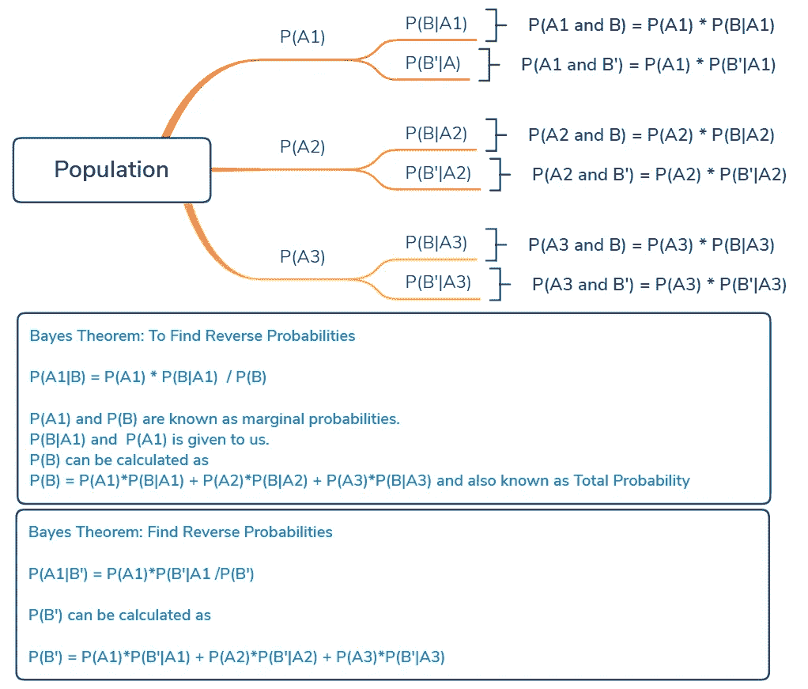
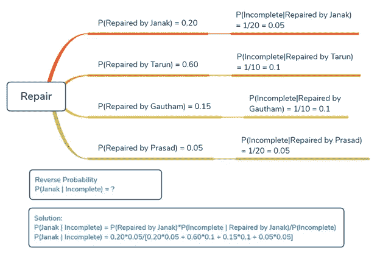
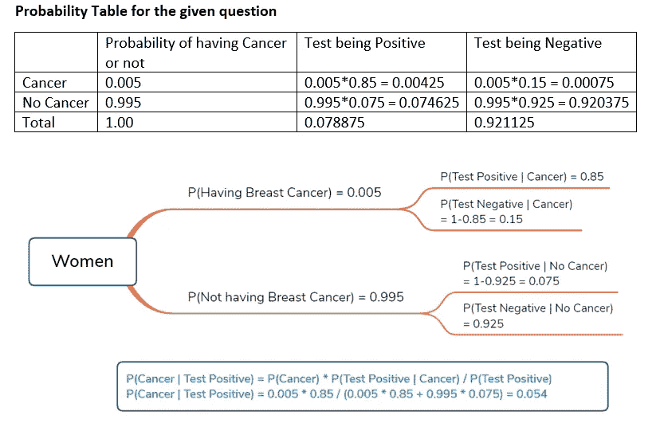
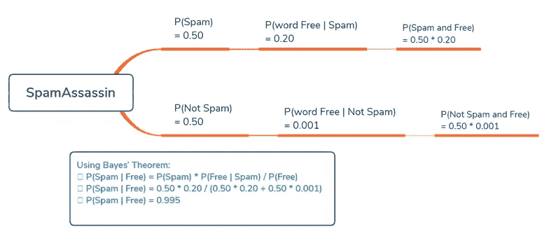

# 数据科学专业人员的贝叶斯定理及示例

> 原文：<https://towardsdatascience.com/bayes-theorem-with-example-for-data-science-professionals-55b4d52f8967?source=collection_archive---------8----------------------->

贝叶斯定理是条件概率的推广。条件概率帮助我们确定给定 B 的概率，用 P(A|B)表示。所以贝叶斯定理说，如果我们知道 P(A|B ),那么我们可以确定 P(B|A ),因为 P(A)和 P(B)是已知的。

在这篇文章中，我将专注于贝叶斯定理，假设你对条件概率有很好的理解。如果你想修改你的概念，你可以参考我之前关于[条件概率的文章，并举例](https://ashutoshtripathi.com/2019/08/15/conditional-probability-with-examples-for-data-science/)。

# 公式推导:

根据条件概率，我们知道

*   P(A|B) = P(A 和 B)/P(B)
*   P(A 和 B)= P(B)* P(A | B)———[ 1]

类似地

*   P(B|A) = P(B 和 A)/P(A) = P(A 和 B)/P(A)[按联合概率顺序不重要]
*   P(A 和 B)= P(A)* P(B | A)—-[2]

根据等式[1]和[2]，

*   P(B) * P(A|B) = P(A) * P(B|A)
*   **P(A|B) = P(A) * P(B|A) / P(B)**

**这意味着如果我们知道 P(A|B ),那么我们可以很容易地确定 P(B|A ),反之亦然。假设我们知道总概率 P(A)和 P(B)。**

**更广义的定义:**

设 A1，A2，A3… Ak 是互斥且穷尽的事件的集合，概率为 P(Ai)，I = 1，2，3…k。那么对于 P(B) > 0 的任何事件 B

P(Ai|B) = P(Ai 和 B)/P(B)= P(B | Ai)* P(Ai)/∑[P(B | Ai)* P(Ai)

下面是贝叶斯定理的树形表示。

**现在让我们解决一些例子来感受一下贝叶斯定理**。

# 示例 1

当自动化生产线出现故障时，技术人员会定期进行维修。Janak 负责维修 20%的故障，20 次维修中有 1 次是不完全维修。Tarun 为 60%的故障提供服务，10 次中有 1 次是不完全维修。为 15%的故障提供服务的 Gautham 每 10 次中有 1 次不完全修复，而为 5%的故障提供服务的 Prasad 每 20 次中有 1 次不完全修复。对于被诊断为由于初始维修不完整而导致的生产线的下一个问题，Janak 进行初始维修的可能性有多大？

# 解决方案:

首先，让我们尝试使用概率树来可视化。

# 实施例 2 临床试验

流行病学家声称，50 多岁的白人女性患乳腺癌的概率为 0.005。一项已建立的测试识别了乳腺癌患者和健康人。一种新的临床试验中的乳房 x 光检查正确检测癌症的概率为 0.85。在没有乳腺癌的女性中，阴性结果的几率为 0.925。如果一名 55 岁的高加索妇女乳腺癌检测呈阳性，那么她实际上患乳腺癌的概率是多少？

# 解决方案:

*   p(癌症)= 0.005
*   p(测试阳性|癌症)= 0.85
*   p(测试阴性|无癌症)= 0.925
*   P(癌症|测试阳性)= P(癌症)* P(测试阳性|癌症)/ P(测试阳性)

## 给定问题的概率表和树形可视化

# 示例 3

SpamAssassin 的工作原理是让用户训练系统。它在被用户标记为垃圾邮件的电子邮件中寻找单词模式。例如，它可能已经知道“免费”一词出现在 20%被标记为垃圾邮件的电子邮件中。假设 0.1%的非垃圾邮件包含“免费”一词，用户收到的所有邮件中有 50%是垃圾邮件，请找出如果“免费”一词出现在邮件中，该邮件是垃圾邮件的概率。

# 解决办法

## 给出的数据:

*   p(免费|垃圾邮件)= 0.20
*   p(免费|非垃圾邮件)= 0.001
*   P(垃圾邮件)= 0.50 => P(非垃圾邮件)= 0.50
*   p(垃圾邮件|免费)=？

## 使用贝叶斯定理:

*   P(垃圾邮件|免费)= P(垃圾邮件)* P(免费|垃圾邮件)/ P(免费)
*   p(垃圾邮件|免费)= 0.50 * 0.20/(0.50 * 0.20+0.50 * 0.001)
*   p(垃圾邮件|免费)= 0.995

## 现在使用概率树进行可视化:

这就是数据科学中的贝叶斯定理。在接下来的文章中，我将会写概率分布，这将会完成数据科学的概率系列。

数据科学概率系列之前的文章有:

*   [数据科学的概率基础知识](https://ashutoshtripathi.com/2019/08/12/probability-basics-for-data-science/)
*   [条件概率](https://ashutoshtripathi.com/2019/08/15/conditional-probability-with-examples-for-data-science/)

我希望你喜欢这篇文章。对于任何意见，请使用下面的评论部分给我回信，或者您也可以使用【https://ashutoshtripathi.com/contact/】的[直接给我写信。我会尽量回答你所有关于 DS，ML，AI 的疑问。](https://ashutoshtripathi.com/contact/)

谢谢大家！

*原载于 2019 年 8 月 20 日*[*http://ashutoshtripathi.com*](https://ashutoshtripathi.com/2019/08/20/bayes-theorem-with-example-for-data-science-professionals/)*。*