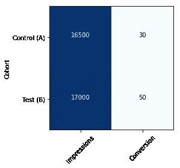
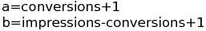
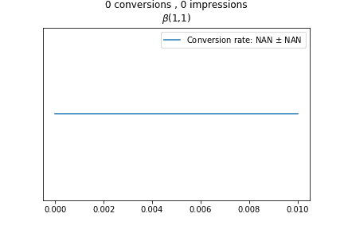
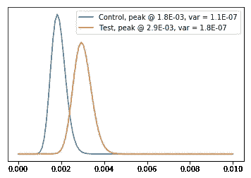
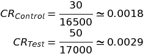
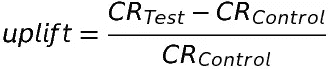
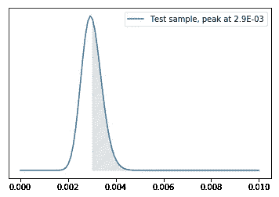
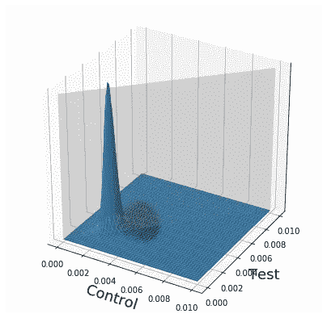
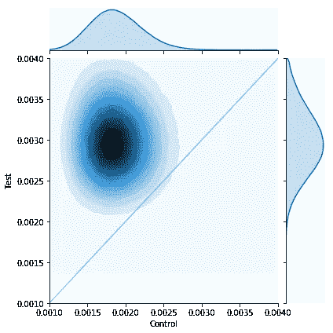

# 用 Python 进行贝叶斯 A/B 测试:简易指南

> 原文：<https://towardsdatascience.com/bayesian-a-b-testing-with-python-the-easy-guide-d638f89e0b8a?source=collection_archive---------4----------------------->

如果你登陆了这个页面，你已经知道什么是 [A/B 测试](https://en.wikipedia.org/wiki/A/B_testing)，但是也许你对如何在贝叶斯框架内分析结果有一些疑问。

在这篇文章的开始，那么，让我指出贝叶斯方法与经典的“频繁主义者”方法的实际区别:区别在于你实际上想要研究的度量的形式。对于常客来说，这是一个简单的数字，而对于贝叶斯人来说，这是一个[分布](https://en.wikipedia.org/wiki/Probability_distribution)。

虽然用分布代替数字看起来只是一个复杂的问题，但它在很多情况下非常有用，在 A/B 测试中也是如此。通过这篇文章，你会发现在实践中处理起来并不困难。事实上，只有几行代码。

**Edit 18/01/2018:该页面代码已成为与**[**Mixpanel**](http://www.mixpanel.com)**配合使用的** [**A/B 测试工具的基线。**](https://github.com/NaturalCycles/MixBABA)

# 直奔主题

我答应了一个简单的向导。因此，在这一部分中，我将只向您展示代码，在下一部分中，如果您感兴趣，您将看到隐藏在它背后的一些细节。

请注意，没有使用任何近似方法:没有马尔可夫链蒙特卡罗(MCMC)，或任何其他随机(和缓慢)过程。因此，不需要主动的编程框架。

让我们来介绍一下样本数据:我们已经运行了一个 A/B 测试来检查一个网页的转化率(CR，从现在开始)，结果在下面的表 1 中。

Table 1: The data

这是代码。你只需要安装 Scipy 和 Numba，插入你的数字，你就会得到你的结果。

和模块导入的内容，`calc_prob.py`:

根据表 1 中的数字，测试选项的性能比控制选项好得多:几乎提升了 60%,有超过 98%的可能性更好。

如你所见，这些都是赤裸裸的、不可知的结果。他们是好是坏取决于你的情况。关于阈值的更深入的考虑将在另一篇文章中讨论，但是就概率而言，任何高于 95%的值都足够好了。

很简单，对吧？现在让我们深入了解一下细节。

# 细节

在代码中，我初始化了两个[“Beta”函数](https://en.wikipedia.org/wiki/Beta_distribution)，每个选项一个，用我们在表中的数字填充它们:

这些实际上是为 A/B 测试建立数据模型的函数。为了更好地介绍它们的行为，请查看下面的动画:

Figure 1: animation of the Beta distribution for a fixed CR. The ‘X’ axis has been zoomed.

每个函数都建立在平坦的、无信息的函数之上，由β(1，1)定义。我们在这个基础上增加的信息(数据)越多，这个函数就变得越窄。

现在你大概在想:真的这么简单吗？为什么存在一个看起来完全是为模型 A/B 测试而构建的函数？

答案在于贝叶斯定理的精确性。在不深入细节的情况下，贝叶斯定理的解通常很难(如果不是不可能的话)精确求解，这就是为什么很少有近似方法被开发出来，如马尔可夫链蒙特卡罗(MCMC)。你可以在网上找到很多使用这种方法的文章。

但是 A/B 测试是一个幸运的案例，我们实际上可以基于"[共轭先验](https://en.wikipedia.org/wiki/Conjugate_prior)"的概念得到一个精确的解。当这个概念适用时，贝叶斯定理的后验函数与前一个后验函数属于同一族，因此我们可以通过迭代过程来构建最终函数。

A/B 测试是随机实验，只有两种可能的结果，“转换”或“不转换”，因此被描述为[伯努利试验](https://en.wikipedia.org/wiki/Bernoulli_trial)，贝塔分布是这种过程的共轭先验。这就是为什么我们敢用我所用的简单方法来使用它。但是如果你仍然有疑问和/或你想更深入地挖掘，你可以在[这里](https://en.wikipedia.org/wiki/Conjugate_prior#Example)查看数学细节:维基百科页面上的例子正是我们的例子。

回到我们的例子，让我给你看两个分布:

Figure 2: distributions for the two CR.

您可以注意到，两个分布的峰值与您以经典方式计算的值一致:

如前所述，不同之处在于 CR 有一个完整的概率密度函数( *PDF* )，而不是一个简单的数字。由于这一点，你可以计算，例如，CRs 上的方差(俗称“误差”)，它也显示在图中的标签上。

现在，您可以计算所谓的“提升”，即相对于控制选项，测试选项增加了多少 CR:

但是，在这一点上，你需要评估这个结果的可信度。怎么会？嗯，你可以估计一个选择比另一个更好的概率！

注意，在经典的“频率主义者”范式中，你没有办法计算这样的概率。在这种方法中，你通常会计算“ [p 值](https://en.wikipedia.org/wiki/P-value)”，然后检查它是否落在任意选择的阈值之下(“α值”，通常为 5%)，最终你可以宣布一些几乎不可能向任何经理/客户/董事会解释的事情:“在 95%的置信水平下，我们可以拒绝零假设”。然后，你必须解释这个声明与“这个假设比另一个有 95%的可能性更好”是非常不同的，这正是他们真正想从你那里听到的句子。

但是现在我们在贝叶斯世界里，我们可以这么说。事实上，我们有定义 CR 的 pdf，概率由曲线下的面积给出。实际上，这就是 PDF 的定义。

一个简单的例子:你希望测试选项的 CR 的概率大于 0.003 吗？它只是测试曲线下 0.003 和 1.0 之间的区域，在图 3 中用阴影表示。

Figure 3: The probability for the Test option CR to be greater than 3E-03.

在数学语言中，你通过在两个极限之间的曲线上积分来计算面积:0.003(我们选择的极限)和 1(硬极限)。

借助 Python，我们可以精确地计算这个积分(仍然:不需要蒙特卡罗)，这是由 [Mpmath](http://mpmath.org/) 库提供的:

在这个例子中，我们只考虑了一个分布(测试分布)，但是为了测量我们提升的可信度，我们必须考虑两个分布(控制和测试)，因此为了可视化这种情况，我们必须增加一个维度。因此，我们要测量的概率不再由面积来定义，而是由体积来定义。特别是，试验组和对照组在[联合概率分布](https://en.wikipedia.org/wiki/Joint_probability_distribution)下的体积大于对照组。让我们看看它是什么:

Figure 4: the Joint PDF of the two options. Left: 3-d visualization. Right: view from the top (zoomed). The gray plane (or line, in the 2-d) separate the zone where the Test dominate the Control.

把图 4 左边的图想象成一座山的图片，右边的图是从卫星上看到的。关注右侧的地块，您可以看到灰色线是属于测试选项(上方三角形)的土地和控制选项的土地之间的边界。在这种情况下，问题就变成了:测试比控制多了多少山？

**更新(13/05/2019)** :因为我有几个关于这个的请求，下面你可以找到重建图 4 情节的代码，对吧。这使用蒙特卡罗抽样，需要大量的点来产生一个好看的图形:

Code for creating the right plot of the Figure 4.

为了计算这个量(在图 4 的上三角中)，我在网上看到了很多帖子，这些帖子也使用了近似的方法(比如蒙特卡罗)。好吧，写它们的人不知道约翰·库克已经在 2005 年部署了一个精确的方法(第二章，这里)。模块`calc_prob.py`中的代码复制了这个公式，并且几乎完全来自最初由 [Antti Rasinen](http://ars.iki.fi/) 编写的[版本](https://gist.github.com/arsatiki/1395348/f0275f529d322d3c23e18201f26890f5a09dcb51)。

在我们的例子中，面积是 0.98，这意味着“测试”选项以 98%的概率比“控制”选项表现得更好。

让我强调一下，如果结果本质上是 50%，那么这座山是完全共享的，这意味着没有选项比另一个更好，而较小的值意味着测试选项实际上比控制选项更差。

仅此而已。

如你所见，这篇文章开头的几行代码背后的细节很深奥，而且不那么简单。但是我希望我已经清楚简单地描述了这些概念，正如我在标题中所说的。