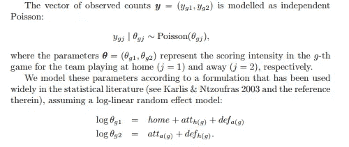
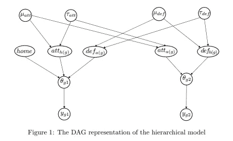

# 贝叶斯篮球:多伦多真的是 NBA 2019 赛季期间最好的球队吗？

> 原文：<https://towardsdatascience.com/bayesian-basketball-were-the-toronto-raptors-really-the-best-team-during-nba-2019-season-e524a26b43a1?source=collection_archive---------19----------------------->

## 让我们回到过去，看看我们是否能为 NBA 2019 年的冠军找到一个不同的赢家。怎么会？
通过使用贝叶斯模拟。

Photo by [Markus Spiske](https://unsplash.com/@markusspiske?utm_source=medium&utm_medium=referral) on [Unsplash](https://unsplash.com?utm_source=medium&utm_medium=referral)

*【本文灵感来源于 Baio 和 Blangiardo (2010)的作品，Daniel Weitzenfeld 的伟大博客* [*文章*](http://danielweitzenfeld.github.io/passtheroc/blog/2014/10/28/bayes-premier-league/) *，以及 Peadar Coyle 的* [*教程*](https://docs.pymc.io/notebooks/rugby_analytics.html) *关于层次模型。】*

# 介绍

贝叶斯模拟很大程度上依赖于统计分布来模拟结果，因此是一种模拟场景的工具。它的基础是贝叶斯定理。贝叶斯公式包含 4 个部分:后验、先验、似然和证据。深入每一个细节并不是本文的目标，但请记住这个过程如下:从我们认为模拟我们观察到的现象的*先验* *分布*开始(想想“扔硬币”)，我们收集数据(*可能性*，并使用该数据更新我们对*分布*的*先验*信念，并将其转化为*后验分布。*

***为什么适合我们的案例研究？***

我们想要估计每个团队的*实力*，并且能够用这些信息运行*模拟*。我们能得到的唯一信息就是分数。我们事先不知道每个队的实力(即我们说这是一个*潜在*变量)，但我们知道，如果我们有一个队的实力，我们可以选择另一个队，比较他们的实力，看看哪一个将赢得对抗。最后但同样重要的是，为了评估一支球队的实力，我们使用分数，但这些数据可能会有噪音:它可能不会揭示一支球队在特定时刻的真实实力，例如，如果它最好的球员受伤了，等等。希望贝叶斯能够帮助我们，因为贝叶斯模拟允许我们:

*   给定观测值的模型潜在变量
*   得到变量的分布，而不是点估计，如果我们想考虑不确定性，这很好
*   从获得的分布(我们现象的生成模型)中取样，以模拟新的观察结果

# 回到过去

现在你确信贝叶斯模拟是我们需要的，我们将及时后退一步，回到 2019 年 4 月 12 日。
常规赛刚刚结束，季后赛明天就要开始了。NBA 联盟的 30 支球队都打了 82 场比赛。我们需要这些数据来构建贝叶斯模型，以便评估每个团队的实力。

一旦我们掌握了每支球队的实力，我们将模拟几个季后赛场景，看看最终哪支球队获胜。准备好了吗？

# 收集数据

这些数据是从网站[https://www.basketball-reference.com](https://www.basketball-reference.com/)收集的，在那里你可以获得 2019 赛季的所有结果。我们把所有东西都存储在一个数据帧中，并确保我们只保留常规赛的比赛。

然后，我们将所有团队映射到一个唯一的 id:

# 准备模型

模型取自 Baio 和 Blangiardo(此处的论文[)。这是一个简单的对数线性模型，允许模拟任何两队对抗的比赛。它是这样工作的:](http://discovery.ucl.ac.uk/16040/1/16040.pdf)

*   对于给定的游戏，分数可以建模为 *(y1，y2)* ，其中每个 *yi* 取自泊松分布(提醒:泊松分布是一种离散值分布，用于对固定时间段内的计数事件进行建模)。
*   给定 *yi* 的每个泊松分布由比率θ(I)参数化，比率θ(I)表示团队的攻击强度和对手的防御强度的组合。
*   因此，如果 A 队进攻强，而 B 队防守弱，则θ(A)将会很大，因此从泊松(θ(A))分布获得的样本也将会很大。从而增加了 a 队的得分
*   为了确保θ为正，我们将其建模为对数线性方程。

Baio and Blangiardo paper excerpt

瞧！

# 选择先验

现在我们有了将观察到的分数与泊松相关联的模型，因此θ，我们必须对等式的*和 ***def*** 部分建模。在我们的例子中，我们认为攻击强度 ***att*** 和防御强度 ***def*** 应该平均为零。强队的价值高于零，弱队的价值低于零。
此外，我们对 ***att*** 和 ***def*** 没有*先验*信念，因此我们将使用一个正态先验，其平均值取自一个允许值接近于零的超先验(在 cour 情况下，是一个围绕零的高度偏斜的正态)。对于正态先验的标准差，我们将使用超先验，它允许标准差的小正值(在我们的例子中，它是伽玛分布)。*

*模型如下:*

**

*顶部的圆圈， *mu* 和 *tau，*是我们的超先验。这个模型被称为分层贝叶斯模型。*

*这是代码:*

**

*请注意我们是如何忽略等式中的“home”参数以及我们是如何添加“intercept”参数的。*

# *运行蒙特卡洛*

*PyMC3 使用蒙特卡罗马尔可夫链为我们的模型寻找合适的分布。解释 MCMC 已经超出了本文的范围，但是如果你想了解更多，我可以推荐 Thomas Wiecki(pymc 3 的主要贡献者之一)的这篇优秀的[文章](https://twiecki.io/blog/2015/11/10/mcmc-sampling/)。*

*运行 MCMC 采样器后，我们直观地检查我们的分布。如果给定变量的分布重叠，这是一个好现象，表明 MCMC 已经收敛到一个稳定的解。检查收敛的另一种方法是通过查看图形右侧的轨迹，看这些轨迹是否像白噪声(即趋势没有变化，幅度没有变化)。*

**

*In convergence we trust*

*看到每个变量的分布是如何重叠的了吗？当然，还有其他检查收敛的方法，其中之一是 R-hat 统计。您可以通过绘制给定参数的森林图来查看它:*

***

Teams attacks (left) and defense(right)* 

*R-hat 在所有情况下都是 1，这表明我们的算法已经收敛。根据这些图表，我们可以看到哪些球队的进攻和防守最好(**小心:符号是反着做防守的！好的防守有负分！**):*

*   *攻击:密尔沃基，金州，新奥尔良*
*   *防守:印第安纳，孟菲斯，迈阿密*

*让我们总结一下散点图(*为了更好的可读性，我颠倒了防御的符号:好的防御=正得分*):*

**

*红标:有资格进入季后赛的球队。蓝点:西部联盟；绿点:东部联盟。*

> *根据上面的图表，密尔沃基似乎有最强的进攻，总的来说防守“一般”。多伦多猛龙的攻击强度明显较低，防守强度略高。*

*现在我们有了每个队的进攻和防守强度分布，我们可以模拟游戏了！如果我从这些分布中取样，我可以计算*

*   *score _ A = sample _ 泊松(sample _ attack(A)+sample _ defense(B)+intercept _ mean)*
*   *score _ B = sample _ 泊松(sample _ attack(B)+sample _ defense(A)+intercept _ mean)*

*比较 score_A vs score_B 可以让我得到胜者！*

*代码如下:*

**

# *模拟季后赛*

*基于常规赛结果(记住，我们目前是 4 月 12 日！)，下面是我看到的:*

**

*根据这些排名，我知道第一轮季后赛将会是:*

**

*下面是一个场景的过程:*

*   *对于第一轮配置中的每场比赛，我们为每支球队计算 7x2 个样本(7 次进攻，7 次防守)，以了解 7 场比赛的获胜者(不允许平局)。我们保留 8 名获胜者。*
*   *然后我们有一个胡人配置。(还剩 8 支队伍)*
*   *对于半决赛中的每场比赛，我们为每支球队计算 7x2 个样本(7 次进攻，7 次防守)，以了解 7 场比赛的获胜者(不允许平局)。我们保留 4 个获胜者。*
*   *然后，我们有一个会议决赛配置。(还剩下 4 支队伍)*
*   *对于大会决赛中的每场比赛，我们为每支球队计算 7x2 个样本(7 次进攻，7 次防守)，以了解 7 场比赛的获胜者(不允许平局)。我们保留两个赢家。*
*   *这样我们就有了两支球队的 NBA 总决赛。*
*   *我们再次计算 7 场比赛的样本，以得出最终的赢家*

# *结果*

*下面是我们运行 1000 次季后赛模拟的结果:*

**

*Outcomes of 1000 playoffs simulations*

> *密尔沃基在超过 25%的情况下赢得冠军！超过 15%的情况下，多伦多会赢。Golden Stats 以大约 15%的胜率排名第三*

# *说明*

*常规赛期间由于分区不平衡，数据略有偏差。因此，密尔沃基很可能来自一个“弱”的分区，因此高估了进攻和防守的实力。同样，多伦多的分区在实力上更加均衡，因此被低估了。让我们比较一下密尔沃基和多伦多的分区:*

**

# *结论*

*希望你在重温 NBA 2019 季后赛时玩得开心。请随意分享对结果的任何想法，以及你将如何在我们的模型中加入“除法”效应来解释不平等的除法水平！*