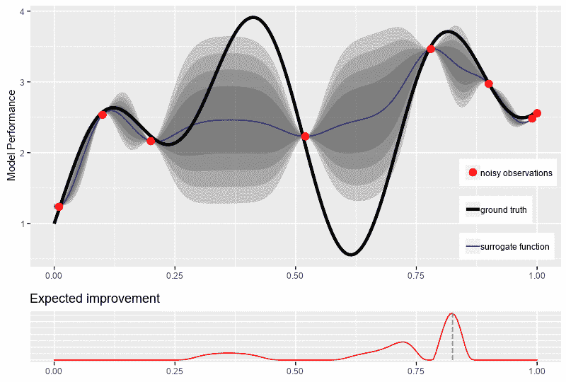

# 贝叶斯超参数优化

> 原文：<https://towardsdatascience.com/bayesian-hyperparameter-optimization-17dc5834112d?source=collection_archive---------27----------------------->

## 调整机器学习模型的明智方法

超参数是用于调整机器学习算法学习方式的旋钮、杠杆和螺钉。你可以从一个适当调整的机器学习系统中获得更高的性能。

## 行业状况

超参数在机器学习领域中最常见的使用方式是，要么盲目地使用默认值，要么使用在另一个问题上似乎很有效的超参数的某种组合，或者你在互联网上看到有人“尊敬”地使用。其他修炼者使用[网格搜索](https://en.wikipedia.org/wiki/Hyperparameter_optimization#Grid_search)或者[随机搜索](https://en.wikipedia.org/wiki/Hyperparameter_optimization#Random_search)。这些具有可大规模分发的优势。但是它们是蛮力的，并且在计算上极其昂贵。他们浪费了大量的试验，在超参数空间的愚蠢部分探索无意义的超参数组合。也没有任何保证随机跌跌撞撞地达到全局最大值。此外，网格搜索在准确性和要检查的点数方面深受维数灾难之苦。

Photo by [John Moeses Bauan](https://unsplash.com/@johnmoeses?utm_source=unsplash&utm_medium=referral&utm_content=creditCopyText) on [Unsplash](https://unsplash.com/s/photos/math?utm_source=unsplash&utm_medium=referral&utm_content=creditCopyText)

## 高斯过程来拯救

为了简单起见，让我们考虑一维贝叶斯优化。对于更高维的超参数空间来说，这个想法是一样的。假设黑色曲线是我们的基本函数，点是观察值。观察结果可能是，而且实际上是有噪声的，这意味着它们没有完美地达到潜在的“地面真相”功能。*X*-轴代表单个超参数的值，就像你的机器学习算法的学习速率。*Y*-轴是使用指标的模型性能，其中数字越大表示性能越好。

我们使用一个随机过程来创建一大堆候选函数，这样红点观测值可能就是那个函数的输出。我们假设这些函数是连续光滑的。下面 gif 中的置信界限代表了这些函数的可能值和路线。换句话说，我们从穿过(或靠近)所有红点的所有光滑连续函数集中随机抽取样本。

接下来，我们通过采用最大化预期改进的超参数组合来选择下一个要探索的候选。1D 迭代过程看起来像这样:

## 在 Python 上使用 GPU 加速的 XGBoost 实现

对于那些希望跟随 Python 代码的人，我在 Google Colab 上创建了 notebook，其中我们在 Scania 卡车气压系统数据集上使用贝叶斯优化来优化 XGBoost 超参数。然后我们将结果与随机搜索进行比较。您可以点击下面的“在 Colab 中打开”按钮，亲自尝试一下。

## 脚注

[1]平滑意味着我们使用协方差函数来确保 *X* 的邻近值对应于 *y* 的邻近值。

[2]还有其他方法，或者更恰当地说是采集函数，来选择下一个候选点。预期改进(EI)是最常见的，因为它非常高效，计算成本低，并且易于理解。