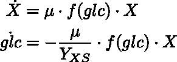
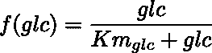
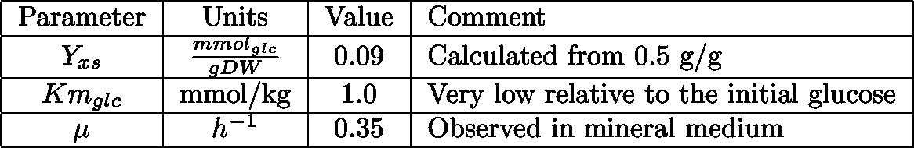
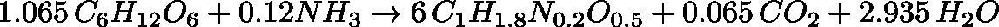
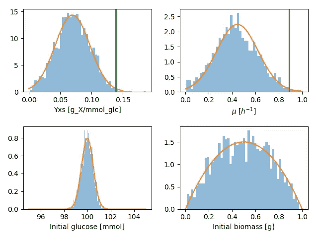
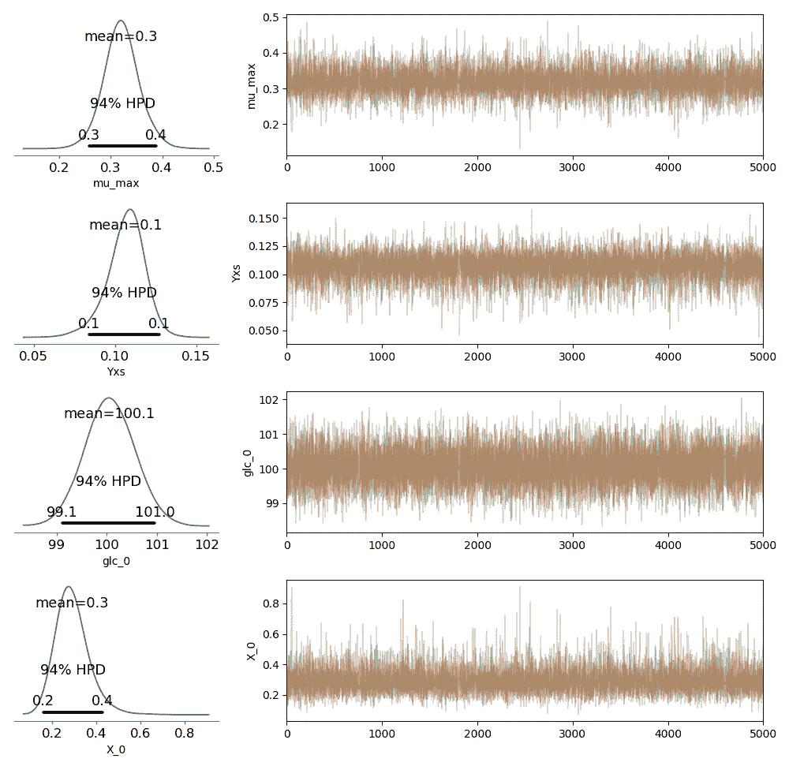
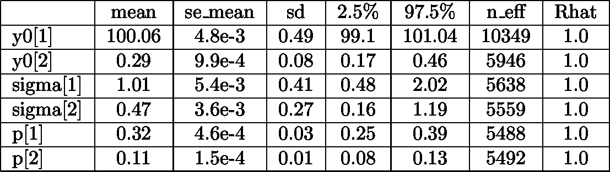
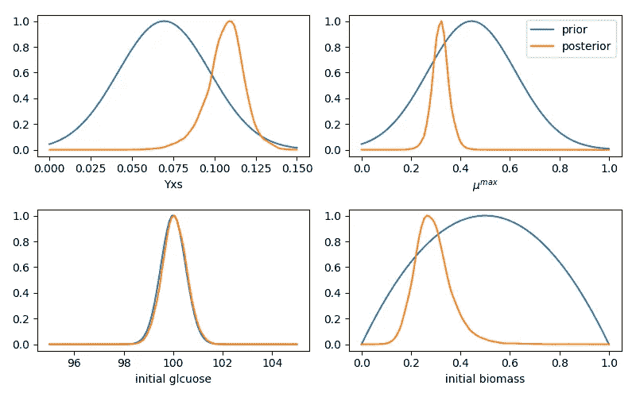
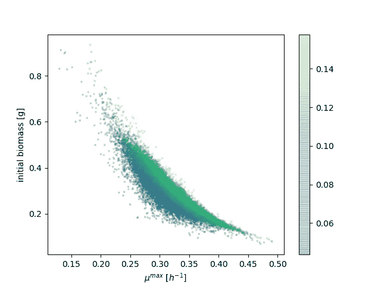
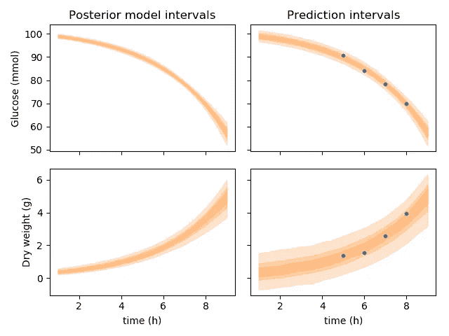

# 贝叶斯推理和微分方程

> 原文：<https://towardsdatascience.com/bayesian-inference-and-differential-equations-cb646b50f148?source=collection_archive---------9----------------------->

结合两种基本范式，从生物学实验中学到更多

生物学实验通常产生清楚地表明测量变量之间的非线性关系的观察结果，并且通常是费力的，并且提供有限数量的观察和重复。常微分方程系统提供了一种建立复杂的非线性现象的机械模型的方法。贝叶斯推理提供了一种范式来拥抱现实世界实验的不确定性，并利用我们的先验知识。生物学是复杂的，实验是困难的，但我们确实有一些成功的建模范例，对生物系统能做什么也有明确的物理约束，以及大量的定量实验文献。在这篇文章中，我展示了一个例子，说明贝叶斯数据分析和微分方程系统是如何结合在一起，从一个只有少量测量值的实验中获取最多信息的。这篇文章中使用的所有代码都可以在这里找到。

# 正在生长的酵母培养物的玩具模型

下面的玩具模型是为了模拟一个简单的实验而制作的。想象一下，你获得了几克干酵母，并想估计其生存能力。即活酵母细胞占干酵母重量的比例是多少？

您可以尝试的一个实验是，在 1 升分批发酵中接种 1 克干酵母，并在几个时间点测量葡萄糖和生物量浓度。通过这样一个实验，你对你买的酵母有什么了解？

让我们先做一个玩具模型来模拟实验。在这里，我提出了一个酵母培养物的简单模型。它由两个动态质量平衡组成，一个用于生物量，一个用于葡萄糖。请注意，这两种平衡的不同之处仅在于表达式的符号和葡萄糖平衡中 Yxs 的除法。在一个没有噪音或不确定性的世界，我们可以通过测量葡萄糖或生物量来推断系统中的所有参数。在现实世界中存在不确定性，一些变量的测量比其他变量更可信。因此，我们受益于执行冗余测量。下面是我们玩具示例的常微分方程系统:



其中 *glc* 代表以 mmol 为单位的葡萄糖， *X* 代表以 g 为单位的生物质干重， *μ* 是最大生长率*，Yxs* 是以 mmol 葡萄糖/克生物质为单位的生物质产量， *f(glc)* 是决定葡萄糖消耗速率的动力学表达式。它由以下速率定律描述:



## 参数和初始条件

模型参数是基于对在糖上有氧生长的面包酵母的测量。



我们知道初始葡萄糖量(我们制备了培养基)为 100 mmol。最初的生物量，干酵母的生存能力，是未知的，我们想推断出来。对于生成合成实验数据的模拟，我们将使用 0.2 克的初始生物质量。

## 模拟实验


Synthetic observations. The model ran with the parameters in the table above is shown in blue. Four “observations” are made by adding noise to the model output at four different times.

上图用蓝色显示了模拟我们的玩具模型的输出。在 5、6、7 和 8 小时的黑色圆圈代表我们在这个实验中进行的观察。它们是通过在当时的模拟结果中加入噪声计算出来的。下面我们将假设我们对酵母的所有了解是，当我们在含有 100 mmol 葡萄糖的培养基中接种 1 克干重时，它产生了这八个观察值(四个时间点和两个变量)。

# 贝叶斯数据分析

## 选择先验概率分布

有两个参数可以推断，葡萄糖上的生物产量，葡萄糖消耗的最大比速率；和两个初始条件。

*葡萄糖的生物产量*

葡萄糖的最大可能生物量产量由假设的情况给出，其中所有消耗的葡萄糖将被并入生物量。也就是说，没有葡萄糖会在脱羧反应中损失，也没有分解代谢来驱动生物合成。假设基本生物质成分如下:C₁H₁.₈N₀.₂O₀.₅认为氨是用作氮源，我们可以写出一个生物质合成反应:



这意味着对葡萄糖的最大生物产量( *Yxs* )为每毫摩尔葡萄糖 0.139 克干重。

*最大生物量比增长率*

以前，我们对酵母知之甚少。我们确实知道它是一种酵母，而且这种酵母比大肠杆菌生长得慢，据报道，大肠杆菌在合成培养基中的最大生长速率为 0.89 升/小时。

*初始条件*

我们知道初始葡萄糖浓度在实验误差范围内。我们期望我们的溶液在 100 毫摩尔的预期浓度的 1 或 2 毫摩尔之内。但是我们对接种培养物的活细胞数量知之甚少。我们知道我们加入了 1 克，活细胞的比例大于 0 小于 1。

## 先验概率分布



我选择使用正态概率分布来模拟所有的前科。对于这两个参数，选择平均值和标准偏差，以便我们上面计算的最大值是可能的，但不太可能。我将初始葡萄糖的先验建模为具有小标准偏差的正态分布，将初始生物量建模为对称的β分布。

# 估计后验概率分布

这里我用 Stan 来推断与观测值相符的参数分布。Stan 提供了一个内置的系统来解决 ODEs [ [link](https://mc-stan.org/docs/2_18/stan-users-guide/ode-solver-chapter.html) 。这是 Stan 型号代码:

```
functions {
    real[] myodes(
        real t,
        real[] y,
        real[] p,
        real[] x_r,
        int[] x_i
        )
        {
            real dydt[2];
            dydt[1] = -y[2] * (p[1] / p[2]) * (y[1]/1) / (1 + (y[1]/1));
            dydt[2] = (y[2] * p[1] * (y[1]/1) / (1 + (y[1]/1)));
            return dydt;
        }
}data {
    int<lower=1> N;
    int<lower=1> T;
    real y[N, 2];
    real t0;
    real t_obs[N];
    real t_sim[T];
    }transformed data {
    real x_r[0];
    int x_i[0];
}parameters {
    real<lower=0> y0[2]; // init
    vector<lower=0>[2] sigma;
    real<lower=0> p[2];
}transformed parameters {
    real y_hat[N, 2];
    y_hat = integrate_ode_rk45(myodes, y0, t0, t_obs, p, x_r, x_i);
}model {
    sigma ~ normal(0, 1);
    p[1] ~ normal(0.445, 0.178);
    p[2] ~ normal(0.0695, 0.027800000000000002);
    y0[1] ~ normal(100, 0.5);
    y0[2] ~ beta(2, 2);
    for (t in 1:N)
        y[t] ~ normal(y_hat[t], sigma);
}generated quantities {
    real y_hat_n[T, 2];
    real y_hat_sigma[T, 2];y_hat_n = integrate_ode_rk45(myodes, y0, t0, t_sim, p, x_r, x_i);
    // Add error with estimated sigma
    for (i in 1:T) {
        y_hat_sigma[i, 1] = y_hat_n[i, 1] + normal_rng(0, sigma[1]);
        y_hat_sigma[i, 2] = y_hat_n[i, 2] + normal_rng(0, sigma[2]);
        }
}
```



有几个检查来诊断我们在 MCMC 运行中获得的后验样本的代表性。首先，四个链的轨迹图(右手边的图)混合得很好，似乎探索了参数空间，而没有在不同的迭代中陷入不同的区域。由 Stan 生成的下表显示，所有参数的有效样本数(n _ eff——不相关样本数)均大于 5000，所有参数的 Gelman-Rubin 统计量均为 1.0。同样重要的是，当使用不同的种子运行模型时，密度图和高密度概率(HPD)区间几乎相同。



HPD 区间除以它们的平均值表明，初始葡萄糖(y0[1])是相当确定的(我们先前已经有了确定性)。根据 HPD 区间，我们预计活细胞占据的干酵母质量分数在 0.17 和 0.46 之间。我们开始了解这一分数，在实验和分析之前，我们只知道该分数限制在 0 和 1 之间。经过观察，我们将可能性范围缩小到初始范围的 30%。

# 比较先验分布和后验分布



除了初始葡萄糖，后验概率比先验概率更集中。我们非常确定我们的初始葡萄糖量，我们的观察似乎并不质疑这种确定性。在另外三个例子中，观察结果使我们能够更新我们的预期，它偏离了我们先前设定的范围的中间值。

## 从后面学习

后验概率分布的样本显示最大生长率( *μ* )与初始生物量之间呈负相关。后验概率也显示了最大生长率和生物量产量之间的正相关，尽管较弱。下图对初始生物量和最大生长率进行了空间编码，而生物量产量用于给点着色。



这些相关性告诉我们，在符合观察结果时，高的初始生物量可以被低的生长速率所抵消，而低的生长速率可以被高的产量所抵消。因此，有一组模型参数可以同样好地解释观察结果。

## 模型预测

从后验概率分布中获得代表性样本后，可以对模型进行前向模拟，创建模型输出的后验分布。此外，如果我们使用测量的估计方差，我们假设未来独立重复实验的预测。下图显示了模型输出(左侧)和独立重复实验(右侧)的 50%、75%和 95%可信区间。用于拟合模型的数据点显示落在 95%可信区间内，表明我们获得的数据生成模型可能确实生成了那些观察结果。



免责声明。本文所表达的观点仅属于作者，不一定属于作者的雇主。