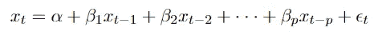
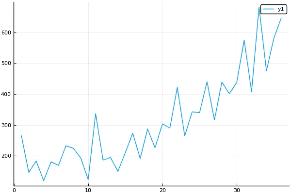
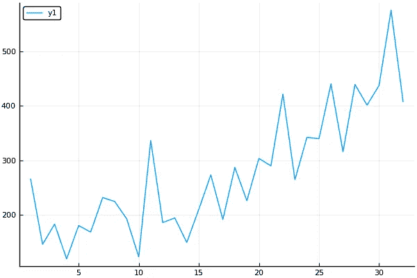
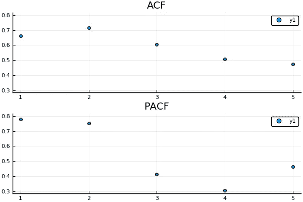
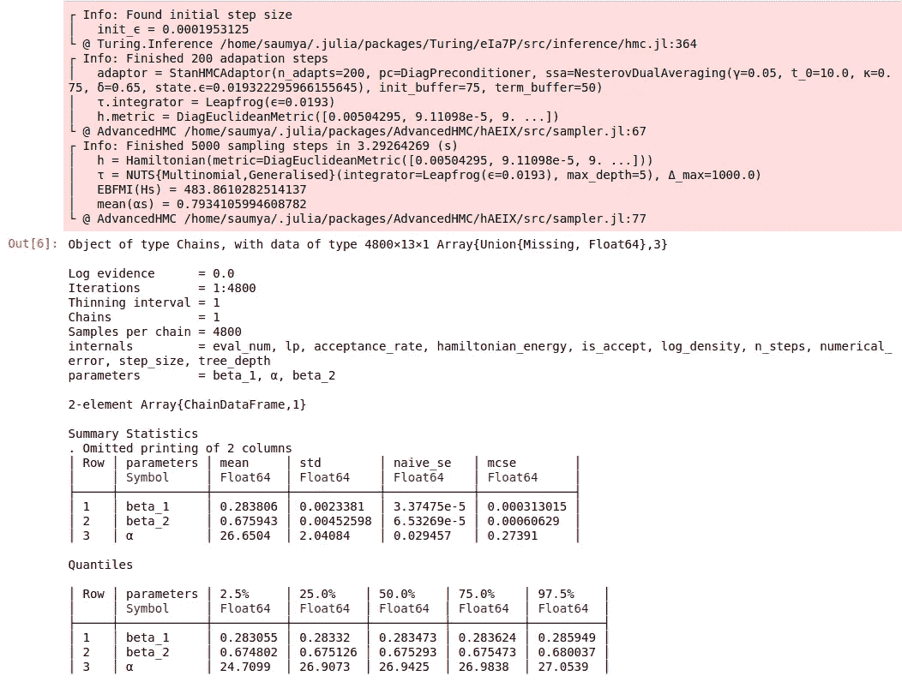
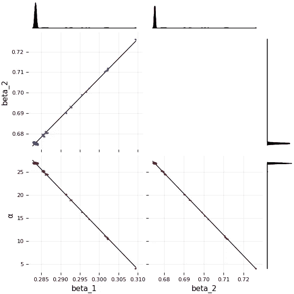
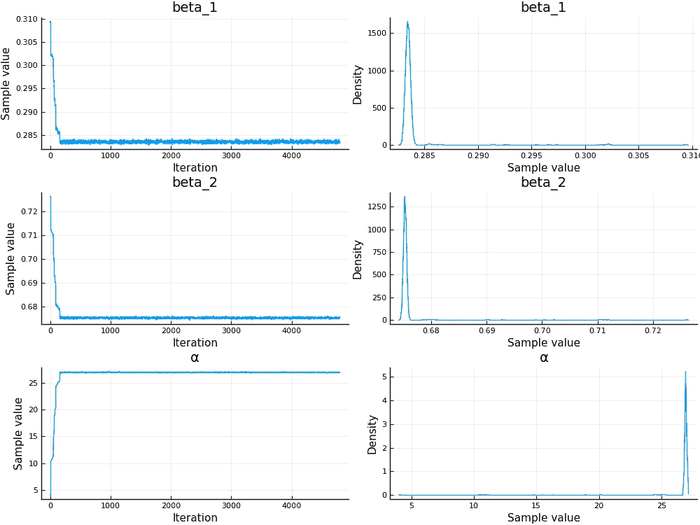
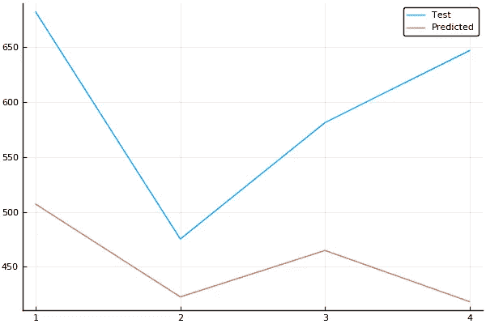

# AR(p)模型的贝叶斯推断

> 原文：<https://towardsdatascience.com/bayesian-inference-for-ar-models-73ff916101c9?source=collection_archive---------18----------------------->

## 以“贝叶斯”方式实现 AR 模型。用 Julia 写的代码，可以在这里找到(Jupyter 笔记本上的图和输出)或者在这里找到(。jl 文件)。

Example of Time Series Data; Photo by [Isaac Smith](https://unsplash.com/@isaacmsmith?utm_source=medium&utm_medium=referral) on [Unsplash](https://unsplash.com?utm_source=medium&utm_medium=referral)

你好！

单变量时间序列大致是指在每个等距有序的时间间隔上有一个值(某个期望量)的序列。对于多变量情况，在每个时刻都有一个以上的值(不同的期望量)。这篇文章主要集中在单变量时间序列，现在将被称为只是时间序列。

时间序列数据的例子包括过去几年中特定地区的月降雨量和特定城市的日最高温度。从这两个例子可以明显看出，获得给定时间序列的准确预测是非常有用的。这些预测让我们得以一窥未来，帮助拯救无数生命。

AR 模型可用于获得时间序列的预测。本文描述了使用贝叶斯推理对此类模型进行参数估计的过程。对于那些不熟悉这种技术的人，我将提供一个简短的描述。用户提供数据以及待估计参数的先验分布。顾名思义，这些先验分布是基于用户对被估计参数的先验信念。基于这些输入，给定数据，模型输出参数*的分布。这种分布称为后验分布，然后可以用于获得对未知数据的预测，在我们的情况下，这是指我们的时间序列的未来值。*

这是对贝叶斯推理的一个极其简短的描述，它并不完全符合其广泛而令人兴奋的应用。然而，这对于本文的目的来说已经足够了，尽管我强烈建议您进一步阅读这个主题。如果你现在感到困惑，不要担心。事情会越来越明朗:)。

我目前正在 Julia Season of Contributions(JSoC)2019 下向 Turing.jl 投稿，这篇文章描述了我作为 JSoC 的一部分实现的其中一个模型。图灵是一种用 Julia 编写的概率编程语言(PPL ),它使得在纸上定义模型成为一个无缝的过程。此外，它有助于从成分分布中轻松取样。

# 从 AR(p)模型开始

AR(p)模型是指具有 *p 滞后项*的自回归模型。自回归意味着变量相对于他自己过去的值线性回归。滞后参数 *p* 决定了在每个时刻使用多少过去的值。对于给定的由 *x* 表示的时间序列，我们得到 AR(p)模型的以下预测方程:

其中，ε表示白噪声。现在，有了这些基本信息，让我们来看看代码。

## 导入库

我们从导入所需的库开始。我们将使用 [Turing.jl](https://turing.ml/dev/) ，一种 Julia 中的概率编程语言。从定义模型到从后验分布中获取样本，会让整个过程变得流畅，毫不费力。

## 加载和可视化数据集

让我们首先加载数据集。我们将使用洗发水销售数据集，可以从[这里](https://machinelearningmastery.com/time-series-datasets-for-machine-learning/)下载。原始数据集归功于 Makridakis、Wheelwright 和 Hyndman (1998 年)。它包含了一种洗发水在 3 年内的月销售额。该部分的代码和绘制该数据集时获得的图形如下:

Plot of the Complete Time Series

## 分成训练和测试数据

我们使用 90:10 的训练测试分割。由于总共有 36 个观察值(3 年数据，每月一次)，我们将使用过去 32 天的数据(训练集)预测最后 4 天(测试集)。

Plot of the Training Set

## 分析 ACF 和 PACF 图

相关性是两个量(比如 A 和 B)之间的统计度量，它决定了它们的值相对于彼此的增加或减少。如果 A 随着 B 的增加而增加(反之亦然)，那么就说它们具有正相关性。例如，给定质量的物体所受的力越大，其加速度就越大。如果 A 随着 B 的减少而增加(反之亦然)，也就是说，如果两个量的变化方向相反，那么就说它们具有负相关性。

显示时间序列与其过去值的相关性的图称为自相关函数(ACF)。 *Auto* 来源于这样一个事实:我们正在计算一个序列与该序列的值的相关性。

xₜ(时间索引 *t* 的时间序列中的元素)与其滞后 xₜ ₋ ₚ之间的偏相关是在去除 xₜ和 xₜ ₋ ₚ与 xₜ ₋ ₁、xₜ ₋ ₂、…、xₜ ₋ ₍ₚ ₋ ₁₎中的每一个相关的影响后，即滞后短于 *p* 的这两个量之间的相关。显示时间序列与其过去值的偏相关的图称为偏相关函数(PACF)。

下面显示的是我们训练数据的 ACF 和 PACF 图:

ACF and PACF plots

自回归模型以 ACF 和 PACF 图中的以下观察结果为标志:

*   滞后 1 时的正自相关
*   PACF 在某个滞后 k 处突然截止。这个 k 值等于我们应该在 AR(p)模型中使用的 p 值。
*   ACF 图逐渐减少到 0

我们可以看到，我们的 ACF 和 PACF 图满足上述三点的条件。此外，我们为 AR(p)模型获得的 p 值是 *p = 2* ，因为 PACF 曲线在第二个滞后截止。我们继续定义 AR(2)模型。

## 模型定义

我们现在使用前面讨论的预测方程来定义 AR(p)模型。我们取 *p = 2* ，这是借助于 ACF 和 PACF 图得到的。我们可以用图灵的直观界面很容易地定义模型:

这里，我们假设β系数具有一致的(-1，1)先验，α系数具有正态的(0，1)先验。现在，有了模型定义，是时候对我们的后验进行采样了！

## 抽样

我们使用不掉头采样器(NUTS)采样器采样，重复 5000 次(抽取 5000 个样本)。如果您不熟悉马尔可夫链蒙特卡罗抽样，您可以将其视为一个黑盒，当提供模型定义和相关参数作为输入时，它会给出后验概率。关于在图灵中使用这个采样器和参数定义的更多信息，你可以在这里参考文档[。](https://turing.ml/dev/docs/library/#Turing.Inference.NUTS)

## 分析采样参数

运行上述代码将产生一个输出，提供关于链的基本信息和估计参数的汇总统计信息，如下所示:

只需一行代码，我们就可以得到采样参数的分布，以及它们在所有迭代中的值。

我们还可以用另一行代码查看这些采样参数的角图。

Output of: L: corner(chain), R: plot(chain)

我们现在拥有了我们之前讨论过的窥视未来所需的所有工具。我们将首先从采样链中移除预热样本。这些样本是在最初几次迭代期间在链中最初采样的，并且在我们已经获得所需的后验分布之后不再需要。然后，我们将所有采样参数的平均值作为该参数值的点估计值。

正是这些点估计值，我们将把它们代入预测方程以得到预测值。注意，为了预测前几个元素，我们将不得不使用来自训练集末尾的元素(确切地说，必须对多少个元素进行预测取决于 p 的值)。这是因为我们需要时间序列先前的滞后值来预测当前值。例如，在我们使用的 AR(2)模型中，前两个预测将使用来自训练集的值。因此，我们可以计算预测的时间序列 *s_pred* ，如下面的代码所示:

绘制预测和测试集(原始数据):

我们可以看到，在要预测的四个值中，只有一个接近，而其他三个非常不准确。一个原因可能是这个时间序列不是协方差平稳的。我们可以通过使用更复杂的 ARIMA 模型来改进这一缺点，这些模型使用差分来首先使序列平稳，然后使用自回归和移动平均项对差分序列进行建模。

这就是我关于 AR(p)模型的贝叶斯推断的文章的结论。我要感谢 [Cameron Pfiffer](http://cameron.pfiffer.org/) 在实施过程中以及在过去的几个月里提供的巨大帮助和指导。如果你对这篇文章有任何问题或疑问，请随时通过 [s](https://saumyagshah.github.io/) shah@iitk.ac.in 联系我，或者你可以在 Julia slack 上用@Saumya Shah 给我加标签。感谢阅读！:).

# 参考

[1] Jason Brownlee，*机器学习的 7 个时间序列数据集*，机器学习掌握，可从[https://machinelingmastery . com/Time-Series-Datasets-for-Machine-Learning/](https://machinelearningmastery.com/time-series-datasets-for-machine-learning/)[，](https://machinelearningmastery.com/machine-learning-with-python/,)2019 年 8 月 26 日访问。

[2]资料来源:时间序列数据库(引用:Makridakis、Wheelwright 和 Hyndman (1998 年))