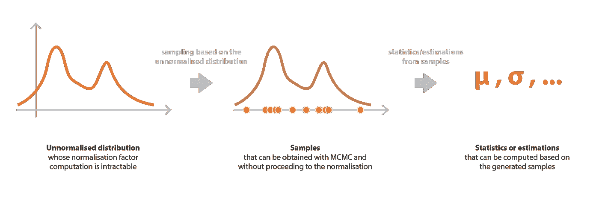
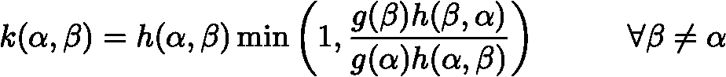

# 贝叶斯推理问题、MCMC 和变分推理

> 原文：<https://towardsdatascience.com/bayesian-inference-problem-mcmc-and-variational-inference-25a8aa9bce29?source=collection_archive---------1----------------------->

## 统计学中的贝叶斯推断问题综述。

Credit: [Free-Photos](https://pixabay.com/fr/users/free-photos-242387/?utm_source=link-attribution&utm_medium=referral&utm_campaign=image&utm_content=1030852) on [Pixabay](https://pixabay.com/)

*本帖与* [*巴蒂斯特·罗卡*](https://medium.com/u/20ad1309823a?source=post_page-----25a8aa9bce29--------------------------------) *共同撰写。*

# 介绍

贝叶斯推理是统计学中的一个主要问题，也是许多机器学习方法中遇到的问题。例如，用于分类的高斯混合模型或用于主题建模的潜在狄利克雷分配都是在拟合数据时需要解决这种问题的图形模型。

同时，可以注意到，根据模型设置(假设、维度等)，贝叶斯推理问题有时很难解决。在大型问题中，精确的解决方案确实需要大量的计算，这些计算往往变得难以处理，必须使用一些近似技术来克服这个问题，并构建快速和可扩展的系统。

在这篇文章中，我们将讨论两种主要的方法来解决贝叶斯推理问题:马尔可夫链蒙特卡罗(MCMC)，这是一种基于抽样的方法，和变分推理(VI)，这是一种基于近似的方法。

## 概述

在第一部分，我们将讨论贝叶斯推理问题，并看到一些经典的机器学习应用程序的例子，其中这个问题自然出现。然后在第二部分，我们将全面介绍 MCMC 技术来解决这一问题，并给出一些关于两个 MCMC 算法的细节:Metropolis-Hasting 和 Gibbs 抽样。最后，在第三节中，我们将引入变分推理，看看如何在一个参数化的分布族上通过优化过程得到一个近似解。

> **注。标有 a (∞)的小节非常数学化，可以跳过，不会影响对这篇文章的整体理解。还要注意，在这篇文章中，p(.)用于表示取决于上下文的概率、概率密度或概率分布。**

# 贝叶斯推理问题

在本节中，我们将介绍贝叶斯推理问题，并讨论一些计算困难，然后给出潜在狄利克雷分配的示例，这是一种主题建模的具体机器学习技术，其中会遇到该问题。

## 什么是推论？

统计推断在于**根据我们观察到的东西来了解我们没有观察到的东西**。换句话说，它是根据这个群体或这个群体的一个样本中的一些观察变量(通常是效果)得出关于群体中一些潜在变量(通常是原因)的结论如准时估计、置信区间或分布估计的过程。

特别是，**贝叶斯推断**是从贝叶斯的角度产生统计推断的过程。简而言之，贝叶斯范式是一种统计/概率范式，其中由概率分布建模的先验知识在每次记录新的观察时被更新，该新的观察的不确定性由另一个概率分布建模。支配贝叶斯范式的整个思想嵌入在所谓的贝叶斯定理中，该定理表达了更新的知识(“后验”)、先验知识(“先验”)和来自观察的知识(“可能性”)之间的关系。

一个经典的例子是参数的**贝叶斯推断。让我们假设一个模型，其中数据 x 由依赖于未知参数θ的概率分布产生。我们还假设我们有一个关于参数θ的先验知识，它可以表示为一个概率分布 p(θ)。然后，当观察到数据 x 时，我们可以使用贝叶斯定理更新关于该参数的先验知识，如下所示**

Illustration of the Bayes theorem applied to the inference of a parameter given observed data.

## 计算困难

贝叶斯定理告诉我们，后验概率的计算需要三个条件:先验、似然和证据。前两个可以很容易地表达出来，因为它们是假设模型的一部分(在许多情况下，先验和可能性是明确已知的)。然而，第三项，即归一化因子，需要计算如下

虽然在低维中计算这个积分没有太多困难，**但是在高维中它会变得难以处理**。在最后一种情况下，后验分布的精确计算实际上是不可行的，必须使用一些近似技术来解决需要知道该后验分布的问题(例如，均值计算)。

我们可以注意到，一些其他的计算困难可能产生于贝叶斯推理问题，例如，当一些变量是离散的时，组合学问题。在最常用于克服这些困难的方法中，我们找到了**马尔可夫链蒙特卡罗**和**变分推断**方法。在这篇文章的后面，我们将描述这两种方法，特别是集中在“归一化因子问题”上，但是人们应该记住，当面临与贝叶斯推理相关的其他计算困难时，这些方法也可能是宝贵的。

为了使接下来的章节更具一般性，我们可以观察到，假设 x 是给定的，因此可以作为一个参数，我们面临这样一种情况，θ的概率分布定义为一个归一化因子

在下两节描述 MCMC 和 VI 之前，我们先举一个具体的例子，用潜在的狄利克雷分配来说明机器学习中的贝叶斯推理问题。

## 例子

贝叶斯推理问题自然地出现，例如，在假设概率图形模型的机器学习方法中，并且在给定一些观察的情况下，我们想要恢复模型的潜在变量。在主题建模中，**潜在狄利克雷分配(LDA)** 方法为语料库中的文本描述定义了这样的模型。因此，给定大小为 V 的完整语料库词汇表和给定数量的主题 T，该模型假设:

*   对于每个主题，存在词汇表上的“主题-词”概率分布(假设有 Dirichlet 先验)
*   对于每个文档，存在主题上的“文档-主题”概率分布(假设另一个狄利克雷先验)
*   对文档中的每个单词进行采样，首先，我们从文档的“文档-主题”分布中采样主题，其次，我们从附加到采样主题的“主题-单词”分布中采样单词

该方法的名称来源于模型中假设的 Dirichlet 先验，其目的是推断观察到的语料库中的潜在主题以及每个文档的主题分解。即使我们不深入 LDA 的细节，我们也可以非常粗略地说，表示 w 是语料库中的单词向量，z 是与这些单词相关联的主题向量，我们希望以贝叶斯方式基于观察到的 w 来推断 z:

这里，除了归一化因子由于巨大的维度而绝对难以处理的事实之外，我们还面临着组合学的挑战(因为问题的一些变量是离散的),需要使用 MCMC 或 VI 来获得近似解。对主题建模及其具体的底层贝叶斯推理问题感兴趣的读者可以看看这篇关于 LDA 的[参考论文。](http://www.jmlr.org/papers/volume3/blei03a/blei03a.pdf)

Illustration of the Latent Dirichlet Allocation method.

# 马尔可夫链蒙特卡罗(MCMC)

正如我们之前提到的，处理贝叶斯推理问题时面临的主要困难之一来自规范化因素。在本节中，我们描述了 **MCMC 采样方法**，它构成了一个可能的解决方案来克服这个问题以及一些其他与贝叶斯推理相关的计算困难。

## 抽样方法

抽样方法的思想如下。让我们首先假设我们有一个方法(MCMC)来从一个概率分布中抽取样本，这个概率分布被定义为一个因子。然后，我们可以从该分布中获取样本(仅使用非标准化部分定义),并使用这些样本来计算各种准时统计，如均值和方差，甚至通过核密度估计来近似分布，而不是试图处理涉及后验的棘手计算。

与下一节描述的 VI 方法相反， **MCMC 方法对研究的概率分布(贝叶斯推理情况下的后验概率)不采用模型**。因此，这些方法具有较低的偏差，但具有较高的方差，这意味着大多数时候获得结果的成本更高，但也比我们从 VI 中获得的结果更准确。

为了结束这一小节，我们再次概述这样一个事实，即我们刚刚描述的这个抽样过程并不局限于后验分布的贝叶斯推断，而且更一般地说，还可以用于概率分布被定义为其归一化因子的任何情况。

Illustration of the sampling approach (MCMC).

## MCMC 的理念

在统计学中，**马尔可夫链蒙特卡罗算法旨在从给定的概率分布中生成样本**。该方法名称中的“蒙特卡罗”部分是由于采样的目的，而“马尔可夫链”部分来自我们获取这些样本的方式(我们让读者参考我们关于马尔可夫链的[介绍文章](/brief-introduction-to-markov-chains-2c8cab9c98ab))。

为了产生样本，我们的想法是建立一个马尔可夫链，它的平稳分布就是我们想要从中取样的分布。然后，我们可以从马尔可夫链中模拟一个随机的状态序列，它足够长，足以(几乎)达到稳态，然后保留一些生成的状态作为我们的样本。

在随机变量生成技术中，MCMC 是一种非常先进的方法(我们已经在关于 GANs 的[帖子中讨论了另一种方法)，它使得**从一个非常困难的概率分布中获取样本成为可能，该概率分布可能只定义到一个乘法常数**。反直觉的事实是，我们可以用 MCMC 从一个没有很好归一化的分布中获得样本，这来自于我们定义对这些归一化因子不敏感的马尔可夫链的特定方式。](/understanding-generative-adversarial-networks-gans-cd6e4651a29)

The Markov Chain Monte Carlo approach is aimed at generating samples from a difficult probability distribution that can be defined up to a factor.

## 马尔可夫链的定义

整个 MCMC 方法是基于**建立马尔可夫链的能力，该马尔可夫链的平稳分布就是我们想要从**采样的分布。为了做到这一点，Metropolis-Hasting 和 Gibbs 抽样算法都使用了马尔可夫链的一个特殊性质:可逆性。

状态空间 E 上的马尔可夫链，转移概率表示为

如果存在一个概率分布γ，使得

对于这样的马尔可夫链，我们可以很容易地证明我们有

然后，γ是一个平稳分布(如果马氏链是不可约的，它是唯一的)。

现在让我们假设我们想要采样的概率分布 **π** 只定义了一个因子

(其中 C 是未知的乘法常数)。我们可以注意到下面的等价关系成立

然后是转移概率为 k(.,.)定义来验证最后的等式将有，如预期的那样， **π** 为平稳分布。因此，我们可以定义一个马尔可夫链，它对于平稳分布有一个不能明确计算的概率分布 **π** 。

## 吉布斯采样跃迁(∞)

让我们假设我们想要定义的马尔可夫链是 D 维的，这样

**吉布斯抽样**方法基于这样的假设，即使联合概率难以处理，也可以计算出给定其他维度的单个维度的条件分布。基于这一思想，定义转移，使得在迭代 n+1 时，要访问的下一个状态由以下过程给出。

首先，我们在 X_n 的 D 维中随机选择一个整数 D。然后，在所有其他维保持固定的情况下，我们根据相应的条件概率为该维采样一个新值:

在哪里

是在给定所有其他维度的情况下，第 d 个维度的条件分布。

形式上，如果我们表示

然后可以写出转移概率

因此，局部平衡如预期的那样被验证，对于唯一重要的情况，

## 大都市的急速转变(∞)

有时，甚至吉布斯方法中的条件分布也太复杂而难以获得。在这种情况下，可以使用 **Metropolis-Hasting** 。为此，我们从定义侧跃迁概率 h(.,.)这将用于建议过渡。然后，在迭代 n+1 时，马尔可夫链要访问的下一个状态由下面的过程定义。我们首先从 h 画出一个“建议转移”x，并计算接受它的相关概率 r:

那么选择有效转换，使得

形式上，转移概率可以写成

因此，本地余额如预期的那样得到验证

## 取样过程

一旦定义了我们的马尔可夫链，我们就可以模拟一个随机的状态序列(随机初始化),并选择其中的一些状态，以获得既遵循目标分布又相互独立的样本。

首先，为了使样本(几乎)遵循目标分布，我们需要**只考虑离生成序列的开始足够远的状态，以几乎达到马尔可夫链**的稳态(理论上，稳态只是渐近达到)。因此，第一个模拟状态不可用作样本，我们将达到稳态所需的这个阶段称为**老化时间**。注意，实际上很难知道这个老化时间需要多长。

第二，为了有(几乎)独立的样本，**我们不能在老化时间**之后保持序列的所有连续状态。事实上，马尔可夫链的定义意味着两个连续状态之间的强相关性，因此我们只需要保留彼此相距足够远的状态作为样本，以被认为是几乎独立的。实际上，两个状态之间被认为几乎独立所需的**滞后**可以通过自相关函数的分析来估计(仅针对数值)。

因此，为了获得遵循目标分布的独立样本，**我们保留来自所生成序列的状态，这些状态彼此相隔一个滞后 L，并且在老化时间 B** 之后出现。因此，如果马尔可夫链的连续状态被表示为

我们只保留州作为我们的样本

MCMC sampling requires to consider both a burn-in time and a lag.

# 变分推理(六)

另一种克服与推理问题相关的计算困难的可能方法是使用**变分推理方法，该方法在于在参数化族**中寻找分布的最佳近似值。为了找到最佳近似值，我们遵循一个优化流程(针对系列参数),该流程只要求将目标分布定义为一个因子。

## 近似方法

VI 方法包括在给定的家族中寻找一些复杂目标概率分布的最佳近似。更具体地说，其思想是定义一个参数化的分布族，并对参数进行优化，以获得相对于明确定义的误差度量最接近目标的**元素。**

让我们仍然考虑定义为归一化因子 C 的概率分布 **π** :

然后，用更数学的术语来说，如果我们表示参数化的分布族

并且我们考虑两个分布 p 和 q 之间的误差度量 E(p，q ),我们搜索最佳参数使得

如果我们可以解决这个最小化问题，而不必显式归一化 **π** ，我们就可以使用 f_𝜔*作为一种近似来估计各种量，而不是处理棘手的计算。变分推理方法所隐含的最优化问题实际上被认为比直接计算(归一化、组合学等)要简单得多。

与抽样方法相反，**假设了一个模型(参数化家族)，这意味着一个偏差和一个较低的方差**。总的来说，VI 方法不如 MCMC 方法精确，但产生结果的速度快得多:这些方法更适合于大规模、非常统计的问题。

Illustration of the approximation approach (Variational Inference).

## 分布族

我们需要设置的第一件事是参数化的分布族，它定义了我们搜索最佳近似的空间。

**家庭的选择定义了一个控制方法的偏倚和复杂性的模型**。如果我们假设一个非常严格的模型(简单的家庭)，那么我们有一个高偏差，但优化过程是简单的。相反，如果我们假设一个相当自由的模型(复杂的家庭)，偏差会低得多，但优化会更困难(如果不是难以处理的话)。因此，我们必须在一个足够复杂以确保最终逼近的良好质量的族和一个足够简单以使优化过程易于处理的族之间找到正确的平衡。我们应该记住，如果族中没有一个分布接近目标分布，那么即使是最好的近似也只能给出很差的结果。

**平均场变分族**是一个概率分布族，其中所考虑的随机向量的所有分量都是独立的。这个系列的分布具有产品密度，使得每个独立的成分由产品的不同因素控制。因此，属于平均场变分族的分布具有可以写成的密度

这里我们假设一个 m 维随机变量 z，注意，即使在符号中省略了它，所有的密度 f_j 都是参数化的。因此，例如，如果每个密度 f_j 是具有均值和方差参数的高斯分布，则全局密度 f 由来自所有独立因素的一组参数来定义，并且在整个参数组上进行优化。

The choice of the family in variational inference sets both the difficulty of the optimisation process and the quality of the final approximation.

## 库尔贝克-莱布勒散度

一旦定义了这个族，一个主要的问题仍然存在:如何在这个族中找到一个给定概率分布的最佳近似(明确定义到它的归一化因子)？即使最佳近似值明显取决于我们考虑的误差测量的性质，但似乎很自然地假设**最小化问题对归一化因子不敏感，因为我们更想比较质量分布而不是质量本身**(对于概率分布必须是单一的)。

所以，现在让我们定义一下 **Kullback-Leibler (KL)** 散度，看看这个度量使问题对归一化因子不敏感。如果 p 和 q 是两个分布，KL 散度定义如下

根据这个定义，我们可以很容易地看到

对于我们的最小化问题，这意味着以下等式

因此，当选择 KL 散度作为我们的误差度量时，优化过程对乘法系数不敏感，并且我们可以在我们的参数化分布族中搜索最佳近似，而不必像预期的那样计算目标分布的痛苦的归一化因子。

最后，作为一个附带事实，我们可以通过为感兴趣的读者注意到 KL 散度是交叉熵减去熵来结束这一小节，并且在信息论中有很好的解释。

## 优化过程和直觉

一旦定义了参数族和误差测量，我们就可以初始化参数(随机或根据明确定义的策略)并进行优化。可以使用几个经典的优化技术，例如**梯度下降或坐标下降**，这将在实践中导致局部最优。

为了更好地理解这个优化过程，让我们举一个例子，回到贝叶斯推理问题的具体情况，我们假设一个后验概率如下

在这种情况下，如果我们想要使用变分推断获得这个后验的近似，我们必须解决下面的优化过程(假设定义的参数化族和 KL 散度作为误差度量)

最后一个等式有助于我们更好地理解如何鼓励近似值分配其质量。**第一项是预期对数似然**，其倾向于调整参数，以便将近似值的质量放在解释最佳观察数据的潜在变量 z 的值上。**第二项是近似值和先验分布**之间的负 KL 散度，其倾向于调整参数，以便使近似值接近先验分布。因此，这个目标函数很好地表达了通常的先验/似然平衡。

Optimisation process of the Variational Inference approach.

# 外卖食品

这篇文章的主要观点是:

*   贝叶斯推理是统计学和机器学习中的一个非常经典的问题，它依赖于众所周知的贝叶斯定理，其主要缺点是，大多数时候，在一些非常繁重的计算中
*   马尔可夫链蒙特卡罗(MCMC)方法旨在模拟来自密度的样本，这些密度可能非常复杂和/或定义到某个因子
*   MCMC 可以用在贝叶斯推理中，以便直接从后验的“非归一化部分”生成样本来处理，而不是处理棘手的计算
*   变分推断(VI)是一种近似分布的方法，使用参数的优化过程在给定的族中找到最佳近似
*   VI 优化过程对目标分布中的乘法常数不敏感，因此，该方法可用于近似仅定义到归一化因子的后验

正如已经提到的，MCMC 和 VI 方法具有不同的属性，这意味着不同的典型用例。一方面，MCMC 方法的采样过程相当繁重，但是没有偏差，因此，当期望精确的结果时，这些方法是优选的，而不考虑所花费的时间。另一方面，尽管 VI 方法中家族的选择会明显引入偏差，但它伴随着合理的优化过程，使这些方法特别适合于需要快速计算的超大规模推理问题。

MCMC 和 VI 之间的其他比较可以在优秀的[变分推断:统计学家回顾](https://arxiv.org/pdf/1601.00670.pdf)中找到，我们也强烈推荐给仅对 VI 感兴趣的读者。关于 MCMC 的进一步阅读，我们推荐这本[总论](https://pdfs.semanticscholar.org/21a9/2825dcec23c743e77451ff5b5ee6b1091651.pdf)以及这本[面向机器学习的导论](https://www.cs.ubc.ca/~arnaud/andrieu_defreitas_doucet_jordan_intromontecarlomachinelearning.pdf)。有兴趣了解更多关于应用于 LDA 的 Gibbs 抽样的读者可以参考这篇关于主题建模和 Gibbs 抽样的[教程](http://u.cs.biu.ac.il/~89-680/darling-lda.pdf)(结合这些[关于 LDA Gibbs 抽样器的讲义](http://www2.cs.uh.edu/~arjun/courses/advnlp/LDA_Derivation.pdf)进行谨慎推导)。

最后，让我们以一点调侃来结束，并提到在即将到来的帖子中，我们将讨论变分自动编码器，这是一种基于变分推理的深度学习方法…所以请保持关注！

感谢您的阅读，如果您认为值得分享，请随意分享！

巴蒂斯特·罗卡的最后一篇文章:

 [## 推荐系统简介

### 几种主要推荐算法综述。

towardsdatascience.com](/introduction-to-recommender-systems-6c66cf15ada)  [## 整体方法:装袋、助推和堆叠

### 理解集成学习的关键概念。

towardsdatascience.com](/ensemble-methods-bagging-boosting-and-stacking-c9214a10a205)