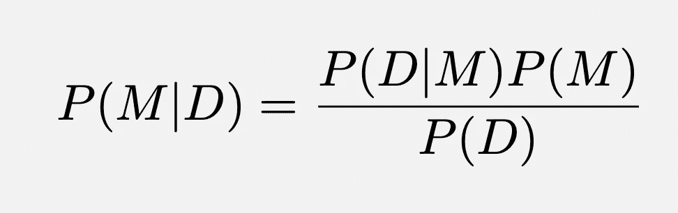
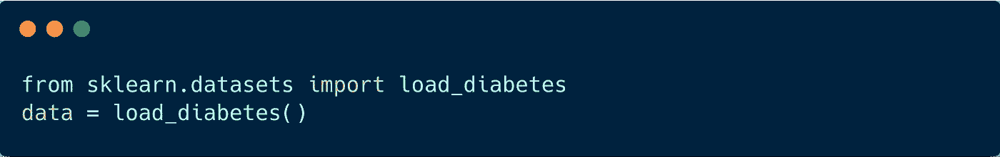
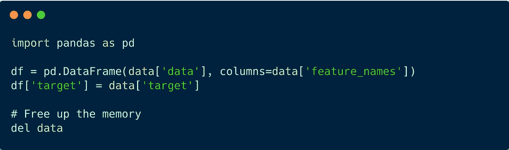
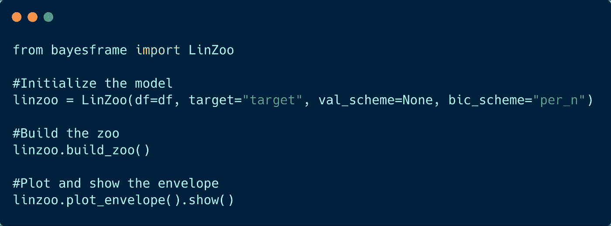
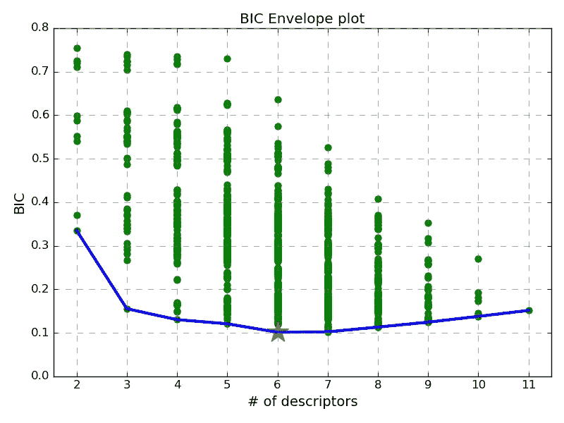
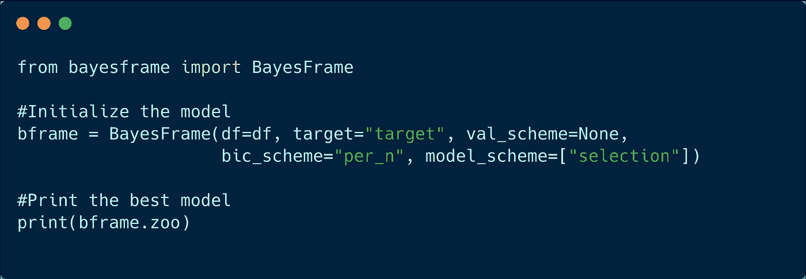
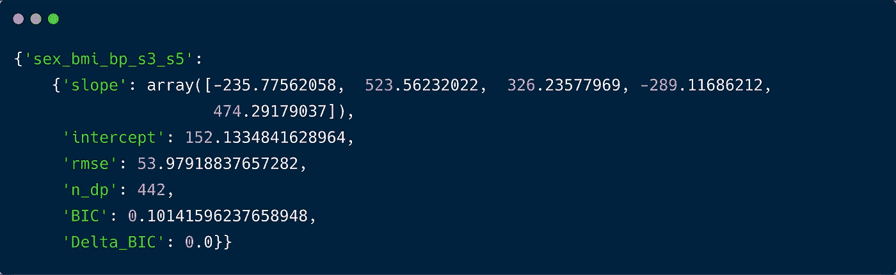

# 贝叶斯模型选择:作为一种特征约简技术

> 原文：<https://towardsdatascience.com/bayesian-model-selection-as-a-feature-reduction-technique-70d75386eabc?source=collection_archive---------15----------------------->

## 一个温和的介绍应用贝叶斯模型选择，以确定机器学习模型生成的重要特征。

Photo by [Franki Chamaki](https://unsplash.com/@franki?utm_source=unsplash&utm_medium=referral&utm_content=creditCopyText) on [Unsplash](https://unsplash.com/s/photos/data?utm_source=unsplash&utm_medium=referral&utm_content=creditCopyText)

通常，我们在构建预测性机器学习模型时面临的一个重要障碍是找到能够忠实映射描述符和预测符之间潜在关系的最佳特征子集。当我们的机器学习模型中有冗余特征时，它们不仅会增加训练时间(因为训练时间与特征向量的长度和特征的数量成正比)，还会给模型添加噪声，从而恶化机器学习性能。解决这个问题的一种方法是选择与信号具有适当相关性的描述符子集。为了实现这一目标，有几种可用特征/指纹减少工具，例如，

**自下而上的方法**在初始步骤中，根据性能指标选择最佳特性。然后迭代地添加下一个最佳特征，直到边际性能增益可以忽略。
**自上而下的方法**最初使用所有的特征，然后逐渐丢弃最差的一个，直到获得满意的折衷。
**遗传算法**特征相互融合，以产生更好的特征，但如果后代不够合适，它就会被丢弃。

所有这些技术都有其优点和缺点。我不想对它们进行任何比较，因为这超出了这篇小文章的范围。相反，在本文中，我将讨论一种不同的特征约简方法——贝叶斯模型选择。

# 贝叶斯模型选择

贝叶斯模型选择可以应用于我们有多个竞争模型并且需要选择最佳模型的情况。根据贝叶斯定理，任何模型的后验概率都可以写成:

Bayes’s Formula for the probability of a model (M) being a true model given the data (D)

这里，P(M|D)是给定数据 D 的模型 M 的后验概率，P(D|M)是模型 M 的证据，P(M)是关于模型 M 的先验知识，P(D)是归一化因子。当我们有两个竞争模型时，我们可以比较它们的后验概率，

Formula for Bayesian Model Comparison using posterior probability distribution

有了这个等式，我们可以比较两个模型，并采用具有更大模型证据的模型(当我们有无信息先验时)。在上述方程中比较模型的困难部分是模型证据的计算，这是一项非常复杂的任务。幸运的是，对于线性回归模型，有分析公式可以直接计算模型证据。在本文中，我们将使用贝叶斯信息标准(BIC)，而不是模型证据来选择最佳模型。贝叶斯信息标准与负对数边际似然成比例，这意味着具有最低 BIC 的模型可能是最大化后验预测能力的最佳模型。如果线性回归模型的残差是正态分布的，我们可以使用下面的公式来计算每个模型的 BIC，

Formula for Bayesian Information Criteria for linear regression model with normal error distribution

这个方程，通过构造，试图优化偏差-方差的权衡。第一项奖励低模型 RMSE(均方根误差),第二项惩罚模型复杂性。此外，我们拥有的数据点越多，关于模型的证据就越多。现在，这一切都归结为计算每个线性回归模型的上述公式，并选择一个最低的 BIC。

# 作为特征约简技术的贝叶斯模型选择

BMS 主要用于模型比较。但是我们也可以把它作为一个特征选择工具。如果我们为所有特征组合建立线性回归模型，那么具有最低 BIC 的模型就是包含所有相关特征的模型。有了这个想法，下面我将展示一个如何实现这个想法的例子。

让我们先加载数据:

Loading the diabetes dataset available in sklearn

现在，根据这些数据制作一个熊猫数据框架:

Organizing the data into a pandas dataframe

为了简化我们的模型选择任务，我写了一个代码来完成它，它使用 ***sklearn*** 来构建模型。运行这个例子的代码可以在我的 GitHub repo ( [贝叶斯框架](https://github.com/mamunm/BayesianFramework))中找到。

使用上面的代码，首先我们将构建模型动物园(包含所有模型的信息):

Building the linear regression zoo and plotting the model performance envelope

运行上述代码片段将在 matplotlib GUI 中显示以下图形:

Model performance envelope for all the model considered in our analysis

或者，我们可以使用以下代码直接选择最佳模型:

Selecting the best model from the zoo

它将在控制台上打印以下输出:

Model parameters of the best selected model

因此，基于我们的模型选择方法，我们确定 10 个特征中的 5 个是最重要的描述符集，它们是性别、bmi、bp、s3 和 s5。正如预期的那样，我们的模型表明性别、体重指数和血压是决定一个人患糖尿病的最重要因素，这与我们的直觉知识一致。

有了这个贝叶斯模型选择框架，我们可以很容易地减少我们的模型中的特征数量，也将有助于使模型更具可解释性。此外，它选择一个简单的线性回归模型，该模型可以用作基线模型，通过引入非线性机器学习模型来训练我们的数据，从而提高模型性能。