# 贝叶斯建模航空公司客户服务 Twitter 响应时间

> 原文：<https://towardsdatascience.com/bayesian-modeling-airlines-customer-service-twitter-response-time-74af893f02c0?source=collection_archive---------11----------------------->


Photo credit: Pixabay

## **学生的 t 分布、泊松分布、负二项分布、分层建模和回归**

[Twitter](https://twitter.com/home?lang=en) 最近在美国进行了一项研究，发现[的顾客愿意多付近 20 美元乘坐一家在六分钟内回复他们推文的航空公司。当他们的推文在 67 分钟后得到回应时，他们只会多付 2 美元乘坐那家航空公司的航班](https://blog.twitter.com/marketing/en_gb/a/en-gb/2016/customer-service-on-twitter-and-the-impact-on-brands.html)。

当我在 twitter 数据集上遇到[客户支持时，我忍不住想建模并比较航空公司客服 Twitter 响应时间。](https://www.kaggle.com/thoughtvector/customer-support-on-twitter)

我希望能够回答这样的问题:

*   数据中所有航空公司的客服 twitter 响应时间有显著差异吗？
*   周末会影响反应时间吗？
*   更长的推文需要更长的时间来回应吗？
*   哪个航空公司的客服 twitter 响应时间最短，反之亦然？

# 数据

这是一个庞大的数据集[包含了来自各行各业的数百家公司。以下数据争论过程将会完成:](https://www.kaggle.com/thoughtvector/customer-support-on-twitter)

*   得到客户的询问，以及每一行公司相应的回复。
*   将日期时间列转换为日期时间数据类型。
*   计算响应时间，精确到分钟。
*   在数据中仅选择航空公司。
*   任何超过 60 分钟的客户咨询都将被过滤掉。我们正在处理在 60 分钟内得到回应的请求。
*   创建时间属性和响应字数。

preprocessing_airline.py

# 响应时间分布

```
plt.figure(figsize=(10,5))
sns.distplot(df['response_time'], kde=False)
plt.title('Frequency of response by response time')
plt.xlabel('Response time (minutes)')
plt.ylabel('Number of responses');
```

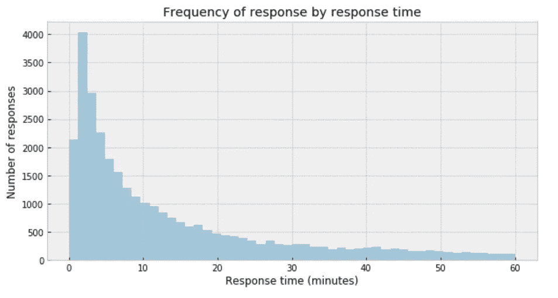

Figure 1

我的直接印象是，高斯分布不是数据的恰当描述。

# 学生的 t 分布

当处理异常值和高斯分布时，一个有用的选择是用一个[学生的 t-分布](https://en.wikipedia.org/wiki/Student%27s_t-distribution)代替高斯似然。这个分布有三个参数:平均值(𝜇)、标度(𝜎)(类似于标准差)和自由度(𝜈).)

*   将平均值均匀分布的边界设置为 0 和 60。
*   𝜎只能是正的，因此使用半正态分布。
*   将𝜈设为平均值为 1 的指数分布。

students_t_distribution

# MCMC 诊断

*   从下面的迹线图中，我们可以直观地得到𝜇的似是而非的后验值。
*   我们应该把这个结果与我们用解析方法得到的结果进行比较。

```
az.plot_trace(trace_t[:1000], var_names = ['μ']);
```

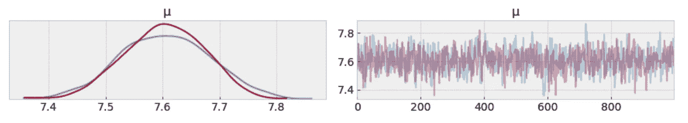

Figure 2

```
df.response_time.mean()
```

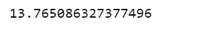

*   左图显示了为𝜇.收集的值的分布我们得到的是 7.4 到 7.8 分钟之间的𝜇的不确定性和可信值的度量。
*   显然，从与目标分布显著不同的分布中抽取的样本。

# 后验预测检查

一种可视化的方法是看模型是否能再现真实数据中观察到的模式。例如，推断平均值与实际样本平均值的接近程度:

```
ppc = pm.sample_posterior_predictive(trace_t, samples=1000, model=model_t)
_, ax = plt.subplots(figsize=(10, 5))
ax.hist([n.mean() for n in ppc['y']], bins=19, alpha=0.5)
ax.axvline(df['response_time'].mean())
ax.set(title='Posterior predictive of the mean', xlabel='mean(x)', ylabel='Frequency');
```

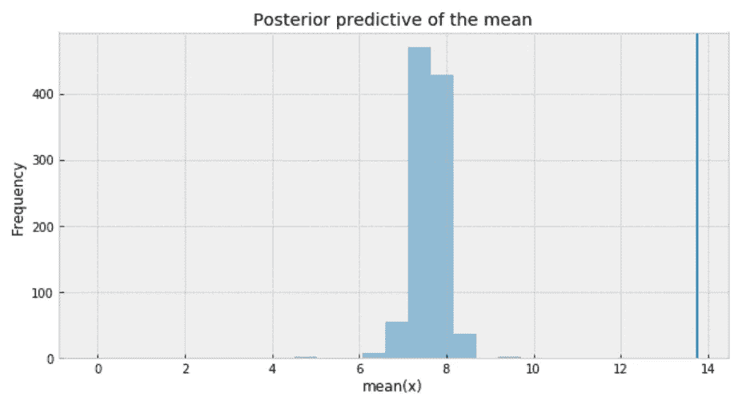

Figure 3

推断平均值与实际样本平均值相差甚远。这证实了学生的 t 分布对于我们的数据不是一个合适的选择。

# 泊松分布

[泊松分布](https://en.wikipedia.org/wiki/Poisson_distribution)一般用于描述给定数量的事件在固定的时间/空间间隔内发生的概率。因此，[泊松分布](https://en.wikipedia.org/wiki/Poisson_distribution)假设事件彼此独立发生，并以固定的时间和/或空间间隔发生。该离散分布仅使用一个值𝜇来参数化，该值对应于分布的均值和方差。

poisson.py

# MCMC 诊断

```
az.plot_trace(trace_p);
```

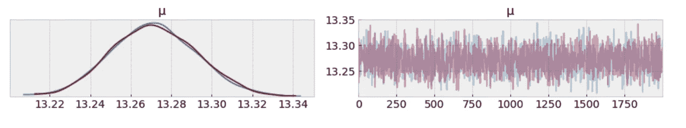

Figure 4

𝜇的不确定性和可信值的测量在 13.22 和 13.34 分钟之间。听起来已经好多了。

# 自相关

我们希望自相关随着图中 x 轴的增加而下降。因为这表明我们的样本之间的相关性很低。

```
_ = pm.autocorrplot(trace_p, var_names=['μ'])
```

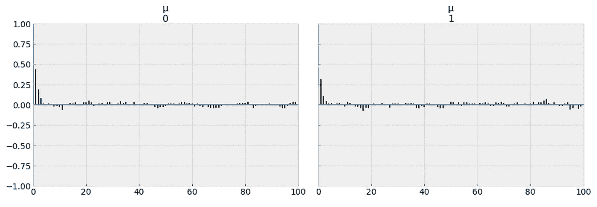

Figure 5

我们来自泊松模型的样本已经下降到低自相关值，这是一个好迹象。

# 后验预测检查

我们使用后验预测检验来“[寻找真实数据和模拟数据之间的系统性差异](https://books.google.ca/books?id=TNYhnkXQSjAC&pg=PA169&lpg=PA169&dq=look+for+systematic+discrepancies+between+real+and+simulated+data&source=bl&ots=5J5OhFxwN-&sig=ACfU3U33uqnSB5y_XJ-paRg9DRWRTQZ8lw&hl=en&sa=X&ved=2ahUKEwi6-L2o6-njAhVIB50JHZi3AqIQ6AEwAHoECAcQAQ#v=onepage&q=look%20for%20systematic%20discrepancies%20between%20real%20and%20simulated%20data&f=false)”。进行后验预测检验有多种方法，我想用各种方法来检验我的模型是否有意义。

```
y_ppc_p = pm.sample_posterior_predictive(
    trace_p, 100, model_p, random_seed=123)
y_pred_p = az.from_pymc3(trace=trace_p, posterior_predictive=y_ppc_p)
az.plot_ppc(y_pred_p, figsize=(10, 5), mean=False)
plt.xlim(0, 60);
```

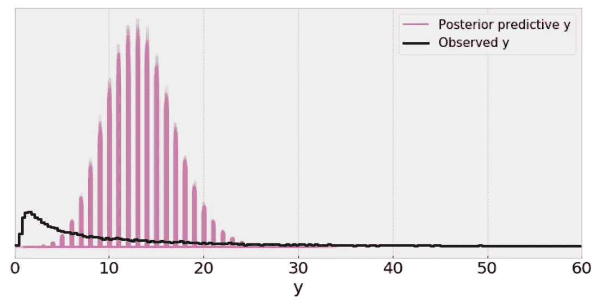

Figure 6

解释:

*   单线(黑线)是数据的[核密度估计](https://en.wikipedia.org/wiki/Kernel_density_estimation) (KDE ),许多紫色线是从 100 个后验预测样本中的每一个计算的 KDE。紫色线条反映了我们对预测数据的推断分布的不确定性。
*   从上面的图中，我不能认为一个[泊松分布](https://en.wikipedia.org/wiki/Poisson_distribution)的规模是数据标准差的一个合理的实际代理，即使在去除异常值之后。

# 后验预测检查

```
ppc = pm.sample_posterior_predictive(trace_p, samples=1000, model=model_p)
_, ax = plt.subplots(figsize=(10, 5))
ax.hist([n.mean() for n in ppc['y']], bins=19, alpha=0.5)
ax.axvline(df['response_time'].mean())
ax.set(title='Posterior predictive of the mean', xlabel='mean(x)', ylabel='Frequency');
```

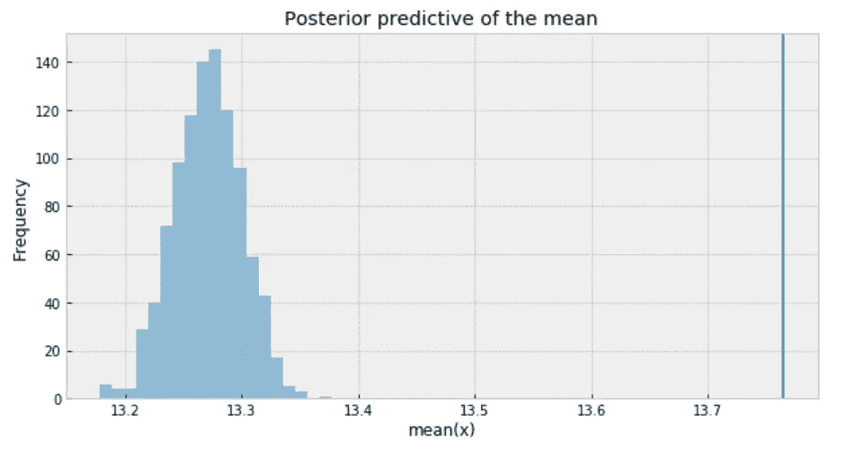

Figure 7

*   推断的均值比我们从学生的 t 分布得到的均值更接近实际样本均值。但还是有一点小差距。
*   使用泊松分布的问题是均值和方差由相同的参数描述。因此，解决这个问题的一个方法是将数据建模为一个混合的[泊松分布](https://en.wikipedia.org/wiki/Poisson_distribution)和来自伽马分布的比率，这给了我们使用[负二项分布](https://en.wikipedia.org/wiki/Negative_binomial_distribution)的理由。

# 负二项分布

[负二项分布](https://en.wikipedia.org/wiki/Negative_binomial_distribution)具有与泊松分布非常相似的特征，除了它有两个参数(𝜇和𝛼),这使得它能够独立于其均值改变其方差。

negative_binomial.py

# MCMC 诊断

```
az.plot_trace(trace_n, var_names=['μ', 'α']);
```


Figure 8

𝜇的不确定性和可信值的测量在 13.0 和 13.6 分钟之间，并且非常接近目标样本均值。

# 后验预测检查

```
y_ppc_n = pm.sample_posterior_predictive(
    trace_n, 100, model_n, random_seed=123)
y_pred_n = az.from_pymc3(trace=trace_n, posterior_predictive=y_ppc_n)
az.plot_ppc(y_pred_n, figsize=(10, 5), mean=False)
plt.xlim(0, 60);
```

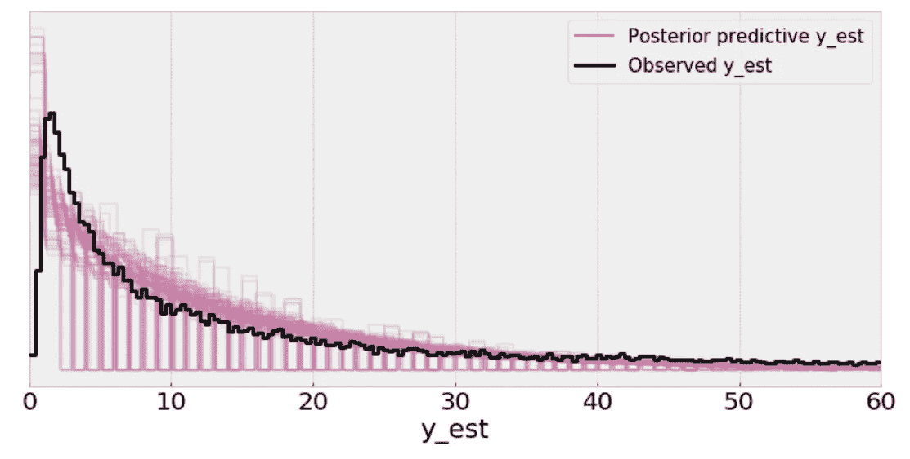

Figure 9

在我们的模型中使用[负二项分布](https://en.wikipedia.org/wiki/Negative_binomial_distribution)会产生预测样本，这些样本在分布的峰值位置及其分布方面似乎更符合数据。

# 后验预测检查

```
ppc = pm.sample_posterior_predictive(trace_n, samples=1000, model=model_n)
_, ax = plt.subplots(figsize=(10, 5))
ax.hist([n.mean() for n in ppc['y_est']], bins=19, alpha=0.5)
ax.axvline(df['response_time'].mean())
ax.set(title='Posterior predictive of the mean', xlabel='mean(x)', ylabel='Frequency');
```

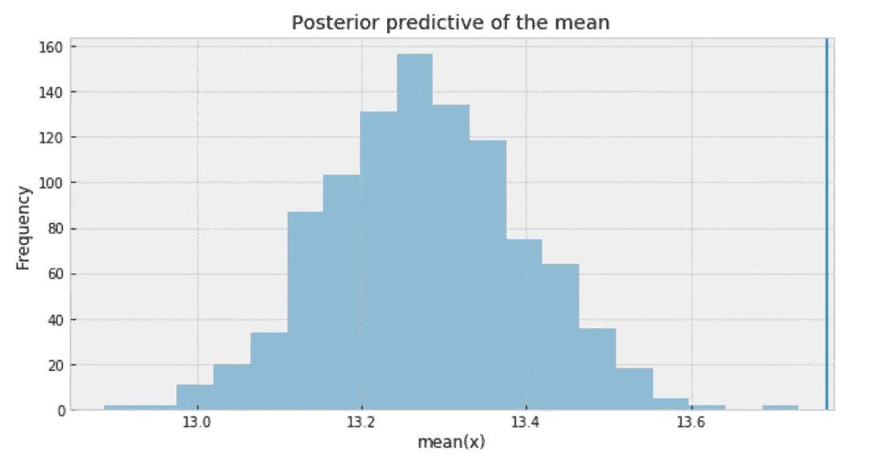

Figure 10

综上所述，以下是我们对不确定性和可信值的度量(𝜇):

*   学生 t 分布:7.4 到 7.8 分钟
*   泊松分布:13.22 到 13.34 分钟
*   负二项分布:13.0 到 13.6 分钟。

# **后验预测分布**

posterior_predictive_dist.py


Figure 11

后验预测分布有点类似于观察数据的分布，表明负二项式模型更适合基础数据。

# **分层建模的贝叶斯方法**

*   我们想把每家航空公司作为一个独立的实体来研究。我们希望建立一个模型来估计每家航空公司的响应时间，同时估计整个数据的响应时间。这种类型的模型被称为[分层模型](https://en.wikipedia.org/wiki/Bayesian_hierarchical_modeling)或[多级模型](https://en.wikipedia.org/wiki/Multilevel_model)。
*   我的直觉告诉我，不同的航空公司有不同的反应时间。例如，阿拉斯加航空公司的客户服务 twitter 响应可能比亚洲航空公司的响应更快。因此，我决定独立地为每家航空公司建模，为每家航空公司估计参数 *μ* 和 *α* 。
*   一个考虑是，一些航空公司可能比其他航空公司更少收到来自 twitter 的客户咨询。因此，与有大量客户咨询的航空公司相比，我们对有少量客户咨询的航空公司的响应时间的估计具有更高的不确定性。下图说明了每家航空公司样本量的差异。

```
plt.figure(figsize=(12,4))
sns.countplot(x="author_id_y", data=df, order = df['author_id_y'].value_counts().index)
plt.xlabel('Airline')
plt.ylabel('Number of response')
plt.title('Number of response per airline')
plt.xticks(rotation=45);
```

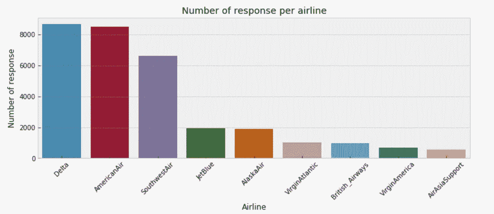

Figure 12

# **用负二项分布对各航空公司进行贝叶斯建模**

hierarchical_negative_binomial.py

# 每个航空公司的后验预测分布

posterior_pred_1.py

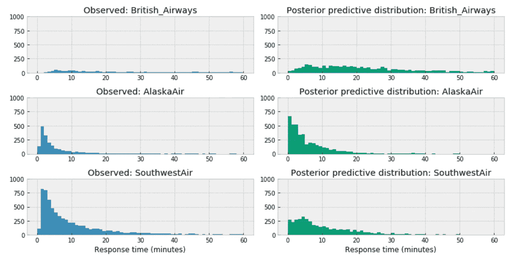

Figure 13

***观察值*** :

*   在上述三家航空公司中，英国航空公司的后验预测分布与阿拉斯加航空公司和西南航空公司相差很大。英国航空公司向右分布。
*   这可以准确地反映其客户服务 twitter 响应时间的特征，这意味着通常英国航空公司比阿拉斯加航空公司或西南航空公司需要更长的时间来响应。
*   或者由于样本量小，它可能是不完整的，因为我们从西南航空公司得到的数据比从英国航空公司得到的多得多。

posterior_pred_2.py

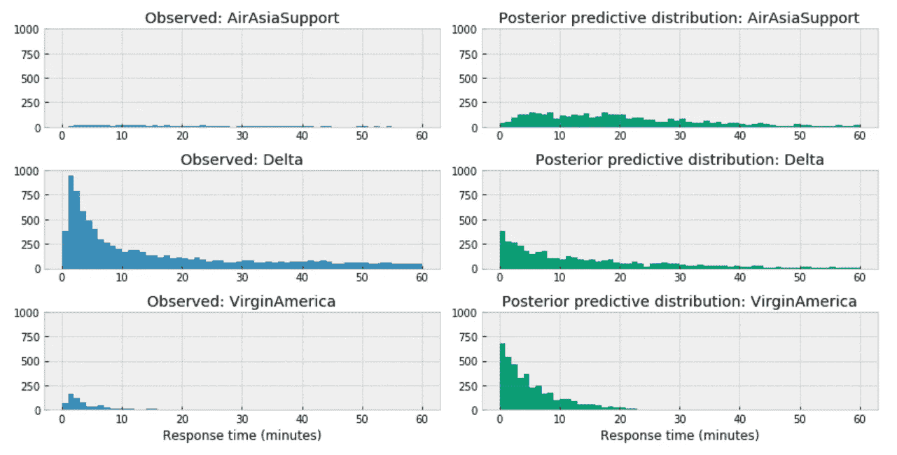

Figure 14

与此类似，在上述三家航空公司中，亚航的分布向右，这可以准确反映其客服 twitter 响应时间的特点，这意味着一般情况下，亚航比达美或弗吉尼亚航空的响应时间更长。或者可能由于样本量小而不完整。

posterior_pred_3.py

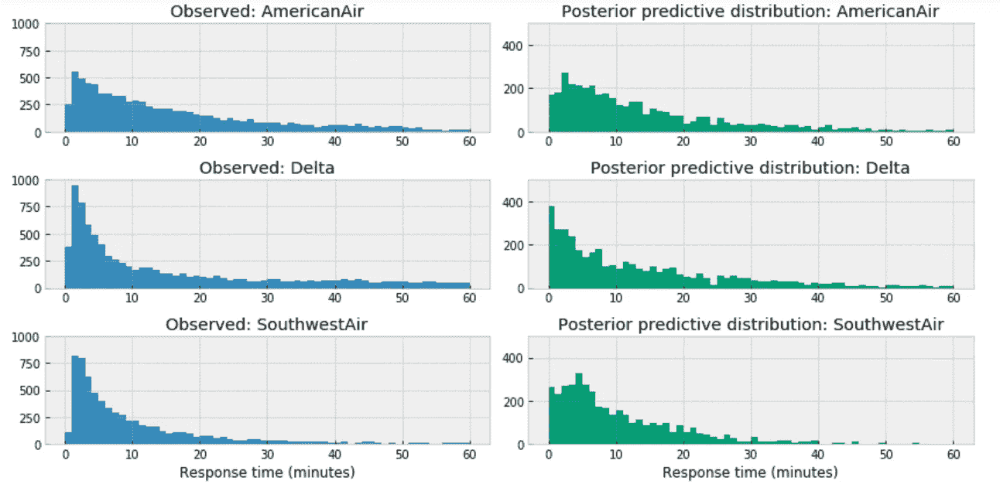

Figure 15

对于航空公司我们有相对充分的数据，例如，当我们比较美国的上述三家大型航空公司时，后验预测分布似乎没有显著变化。

# 贝叶斯分层回归

模型的变量:

```
df = df[['response_time', 'author_id_y', 'created_at_y_is_weekend', 'word_count']]
formula = 'response_time ~ ' + ' + '.join(['%s' % variable for variable in df.columns[1:]])
formula
```

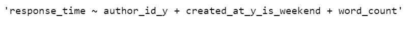

在下面的代码片段中，我们:

*   将分类变量转换为整数。
*   估计每个航空公司客户服务响应时间的基线参数值𝛽0。
*   估计数据中所有航空公司的所有其他参数。

bayesian_hl.py

# MCMC 诊断

```
az.plot_trace(trace_hr);
```

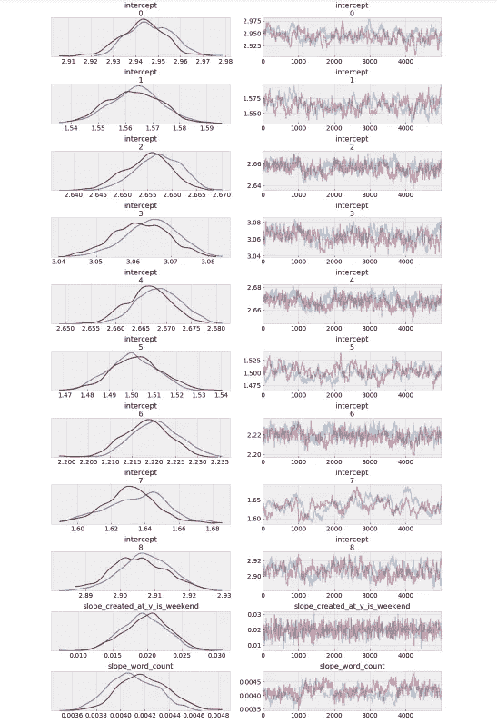

Figure 16

***观察:***

*   每个航空公司都有不同的基线响应时间，但是，其中一些非常接近。
*   如果您在周末发送请求，那么在得到响应之前，您可能会等待稍长的时间。
*   回复的字数越多，等待回复的时间就越长。

# 森林小区

```
_, ax = pm.forestplot(trace_hr, var_names=['intercept'])
ax[0].set_yticklabels(airlines.tolist());
```

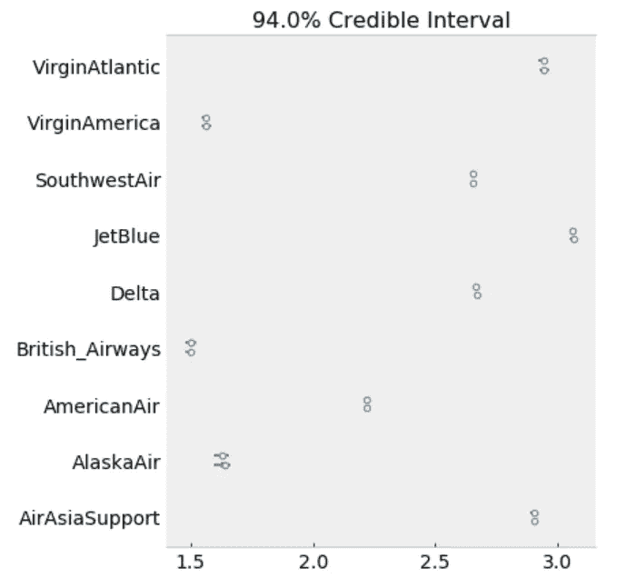

Figure 17

该模型估计每个航空公司的上述β0(截距)参数。点是每个航空公司最可能的参数值。看起来我们模型对每家航空公司的不确定性都很小。

```
ppc = pm.sample_posterior_predictive(trace_hr, samples=2000, model=model_hr)
az.r2_score(df.response_time.values, ppc['y_est'])
```


[Jupyter 笔记本](https://github.com/susanli2016/Machine-Learning-with-Python/blob/master/Bayesian%20Modeling%20Customer%20Support%20Response%20time.ipynb)可以位于 [Github](https://github.com/susanli2016/Machine-Learning-with-Python/blob/master/Bayesian%20Modeling%20Customer%20Support%20Response%20time.ipynb) 上。祝你一周工作顺利！

参考资料:

这本书:用 Python 进行贝叶斯分析

这本书:做贝叶斯数据分析

这本书:统计学再思考

【https://docs.pymc.io/notebooks/GLM-poisson-regression.html 

[https://docs . pymc . io/notebooks/hierarchical _ partial _ pooling . html](https://docs.pymc.io/notebooks/hierarchical_partial_pooling.html)

[](https://docs.pymc.io/notebooks/GLM-hierarchical.html) [## GLM:分级线性回归- PyMC3 3.6 文档

### 本教程改编自达恩·埃尔伯斯和托马斯·威奇的博客文章，名为…

docs.pymc.io](https://docs.pymc.io/notebooks/GLM-hierarchical.html) 

[https://docs . pymc . io/notebooks/GLM-负数-二项式-回归. html](https://docs.pymc.io/notebooks/GLM-negative-binomial-regression.html)

[](https://nbviewer.jupyter.org/github/markdregan/Bayesian-Modelling-in-Python/blob/master/Section%203.%20Hierarchical%20modelling.ipynb) [## nbviewer 笔记本

### 对 alpha 应用了间隔转换，并将转换后的 alpha_interval_ 添加到模型中。将区间变换应用于 mu…

nbviewer.jupyter.org](https://nbviewer.jupyter.org/github/markdregan/Bayesian-Modelling-in-Python/blob/master/Section%203.%20Hierarchical%20modelling.ipynb)  [## PyMC3 和 Theano-pymc 3.6 文档

### Theano 是一个包，它允许我们定义涉及数组操作和线性代数的函数。当我们定义一个…

docs.pymc.io](https://docs.pymc.io/PyMC3_and_Theano.html) 

[https://www . ka ggle . com/PS bots/customer-support-meets-spacy-universe](https://www.kaggle.com/psbots/customer-support-meets-spacy-universe)