# 使用 PyMC3 对福特 GoBike 乘客量进行贝叶斯建模—第一部分

> 原文：<https://towardsdatascience.com/bayesian-modeling-for-ford-gobike-ridership-with-pymc3-part-i-b905104af0df?source=collection_archive---------16----------------------->

Photo by [Andrew Gook](https://unsplash.com/@andrew_gook?utm_source=medium&utm_medium=referral) on [Unsplash](https://unsplash.com?utm_source=medium&utm_medium=referral)

自行车共享是世界各地城市交通等式的重要组成部分。在旧金山，自行车共享游戏的主要参与者之一是福特公司及其 GoBike 计划。方便的是，他们友好地发布他们的[数据](https://www.fordgobike.com/system-data)给像我这样的人研究。我想知道，根据过去的信息，是否可以很容易地预测第二天的乘客量，以确保有足够的自行车可供乘客使用？

如果我要使用 sklearn 建立一个线性回归模型，这将是一个相当简单的任务。我经常发现自己在寻找数据集，以学习机器学习中的一种新工具或技能。多年来，我一直试图找到一个借口来尝试一个概率编程包(如 [PyStan](https://pystan.readthedocs.io/en/latest/) 或[pymc 3】](https://docs.pymc.io/)，这个自行车共享数据似乎非常适合。

许多公司正在为他们的内部预测模型寻找贝叶斯推断。随着计算成本的降低，这些系统众所周知的长训练时间也减少了。值得注意的是优步发布了 [Pyro](https://eng.uber.com/pyro/) ，这是一个开源框架，看起来相当灵活且易于使用。 [Quantopian](https://www.quantopian.com/) 是 PyMC3 的常客。据我所知，Booz Allen Hamilton 和 GoDaddy 是另外两家追求这种 ML 模式的公司。

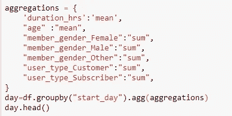

在这篇文章中，我构建了一个简单的例子，希望对 PyMC3 初学者有所启发。我下载了 2017 年—2018 年 9 月的 GoBike 数据。然后，我每天汇总数据，以收集关于乘车者详细信息(例如，平均年龄、订阅会员)、乘车时长和乘车者总数的信息。

这些贝叶斯 ML 工具的问题是，它们可能需要很长时间来训练，尤其是在海量数据上。对于这个聚合数据集，我只有 100 多行，这在笔记本电脑上很容易训练。经过一点研究，我决定学习 PyMC3 作为我的选择。看起来它有很多很棒的教程，一个充满活力的社区，和一个相当容易使用的框架。

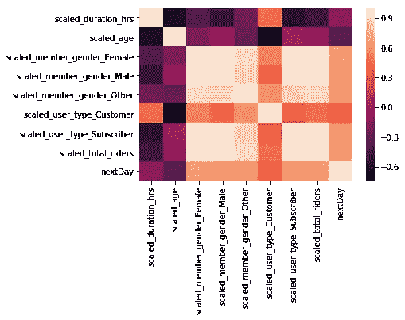

在这个说明性的例子中，我首先用一个健壮的定标器对数据进行定标，并绘制出 seaborn 关联热图，看看我们的模型是否可以学习任何模式。我们试图预测第二天*的值。*从热图中，我们可以看到变量之间的一些简单关系，
既有正的( *scaled_total_riders* )，也有负的( *scaled_duration_hrs* )。

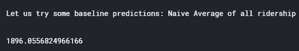

让我们做一个简单的预测，并以此为基准。如果我们只取平均每日乘车人数，并以此作为我们的预测，RMSE 会是多少？通过这种简单的方法，我们预计每天可以减少大约 1900 名乘客。

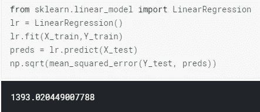

具有 sklearn 的线性模型在 RMSE 表现稍好，并且非常容易实现。这个模型是我们数据中每个变量的一系列权重，还有一个截距。我们如何解释我们的模型对每一个参数的信心？

这可能是贝叶斯魔法真正闪耀的地方。与上面的 sklearn 示例相比，它无疑需要更多的代码行、更多的思考和更长的训练时间。亲爱的读者，我向你保证，这一切都是值得的。

首先，PyMC3 在引擎盖下的 Theano 上运行。我们必须对我们的 pandas/numpy 数据做一些细微的修改，最主要的修改是通过设置一个共享张量，如下所示。

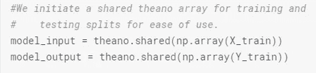

When we look to make predictions for our model, we can swap out X_train for X_test and use the same variable name.

现在我们已经建立了数据，我们需要构建我们的模型，我们通过调用 pm 来初始化它。型号()。在这个模型环境中，我们需要建立一套完整的关于先验(参数)和输出的假设。对于您的第一个模型，正态(高斯)分布是相当安全的。

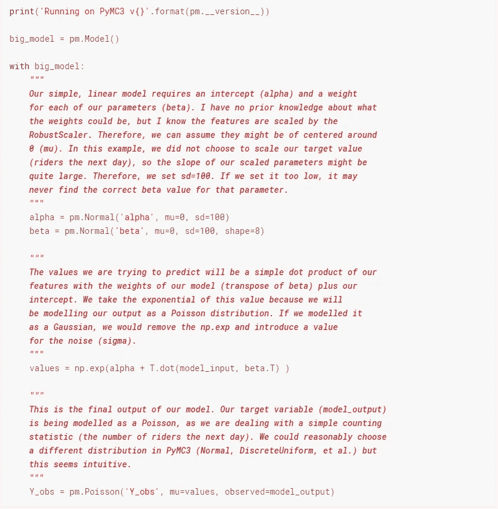

这构成了我们的模型规格。现在我们必须了解模型权重的后验分布。与 sklearn 不同，系数现在是值的分布，而不是单个点。我们对一系列可能的权重进行采样，看起来与我们的数据吻合的系数被保留在一个叫做 *trace* 的东西中。采样函数(NUTS、Metropolis、*等*)远远超出了本文的范围，但是有大量的[知识库](https://docs.pymc.io/api/inference.html#module-pymc3.sampling)描述它们。在这里，我们从模型中构建我们的跟踪:

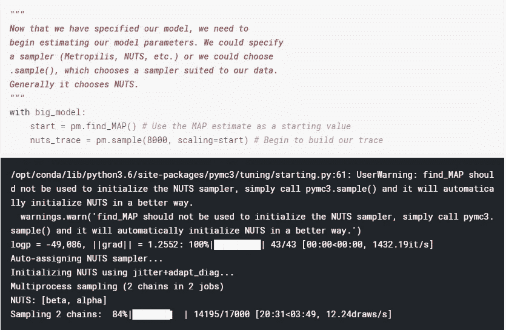

NUTS sampler 抱怨说使用 find_MAP()不是一个好主意，但是这经常在[教程](https://people.duke.edu/~ccc14/sta-663/PyMC3.html)中使用，并且似乎没有影响我的性能。

我们还可以尝试一种不同的采样器，试图逼近后验分布:

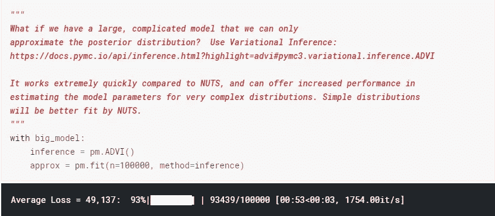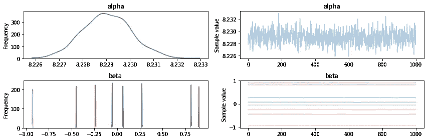

轨迹可以被绘制出来，通常看起来像这样。 *beta* 参数在分布上看起来相当受约束(左图)，并且在我们跟踪的最后 1000 个采样项目上看起来相当一致(右图)。*阿尔法*参数看起来不太确定。

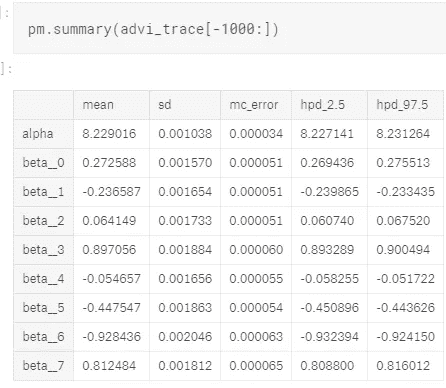

现在我们有了后验样本，我们可以做一些预测。我们通常会在 PyMC3 中观察到一个所谓的“老化”期，在此期间，我们会丢弃跟踪的前一千个样本( *trace[1000:]* )，因为这些值可能没有收敛。然后，我们从该轨迹中抽取 1000 个样本权重，计算可能的预测，并取该值的平均值作为该数据点最可能的预测。从这里，我们简单地计算 RMSE。

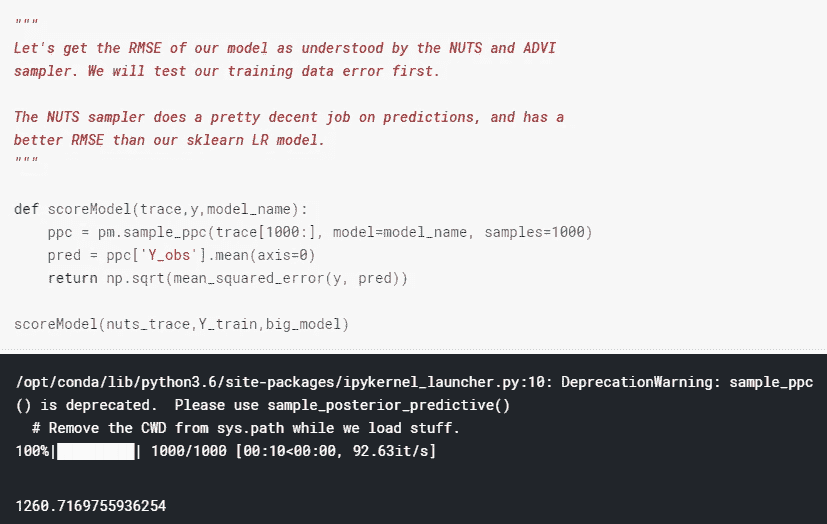

如果我们想在维持数据集上进行测试:

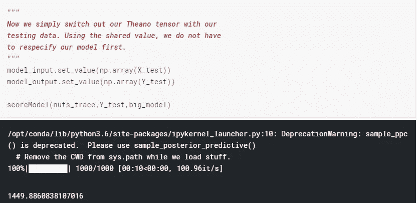

因此，我们建立的这个模型比我们的原始方法(平均乘客量)表现得更好，但比我们的 sklearn 模型稍差。在 Github repo 中包含的一个示例中，我能够通过缩放 Y 值并将其建模为正态分布变量来构建一个类似的模型，该模型优于 sklearn 模型。

进一步调整模型参数，使用不同的标度，假设更宽范围的可能β参数都可以用来降低这个例子的 RMSE。这篇文章的目的是介绍模型构建的基础知识，并提供一个可编辑的例子，你可以尝试和学习！我鼓励你在下面的评论区提供反馈。

总而言之，贝叶斯模型是有代价的。实现和编写模型肯定需要更长的时间。这需要一些贝叶斯统计的背景知识。训练时间比使用 sklearn 长几个数量级。然而，像 PyMC3 这样的工具可以为您的数据和模型工件提供更好的控制、理解和欣赏。

虽然 PyMC3 中有很多好的教程(包括它的[文档页面](https://docs.pymc.io/notebooks/getting_started.html))但是我找到的最好的资源是 Nicole Carlson 的[视频](https://www.youtube.com/watch?v=rZvro4-nFIk)。它探讨了熟悉 sklearn 的数据科学家如何构建 PyMC3 模型。细心的读者会发现我从那个视频中采用了许多例子。我还从[概率编程和黑客贝叶斯方法](https://nbviewer.jupyter.org/github/CamDavidsonPilon/Probabilistic-Programming-and-Bayesian-Methods-for-Hackers/blob/master/Prologue/Prologue.ipynb)中学到了很多，这是一个基于笔记本的免费教程，介绍使用 PyMC3 的实用贝叶斯模型。这两个资源绝对惊人。杜克大学也有一个示例网站，其中有大量数据[情况](https://people.duke.edu/~ccc14/sta-663/PyMC3.html)，我发现这些数据很有参考价值。“走向数据科学”在这一年里也发布了许多关注[贝叶斯分析](/search?q=Bayesian)的酷帖，并帮助激发了这篇帖子。

在下一篇博文中，我将说明如何构建一个分层线性模型(HLM ),这将极大地提高我们最初方法的性能。下面是一个可以派生的 Kaggle 内核和一个 Github repo，你可以克隆它来处理数据和开发你自己的 PyMC3 模型。感谢您的阅读！

 [## 逐日预测| Kaggle

### 编辑描述

www.kaggle.com](https://www.kaggle.com/franckjay/daybydaypredictions) 

[Github 回购](https://github.com/franckjay/FordGoBike)