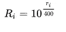
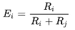
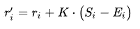
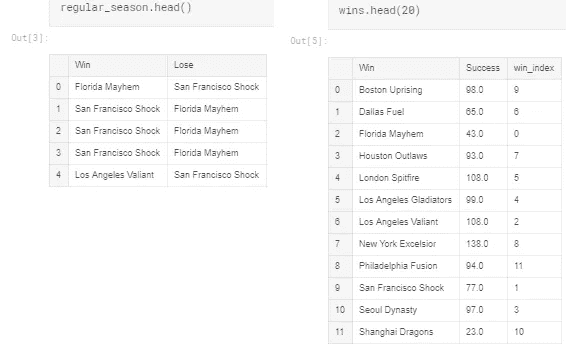
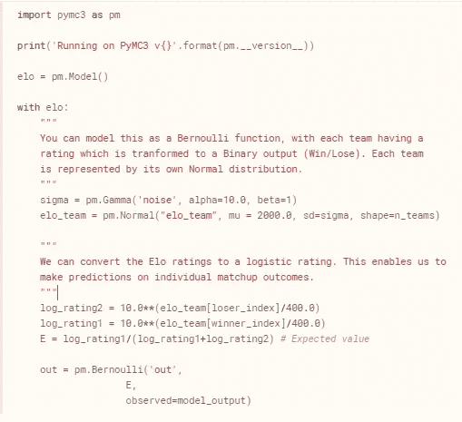
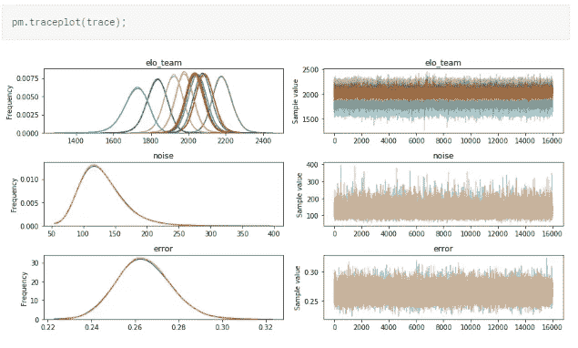
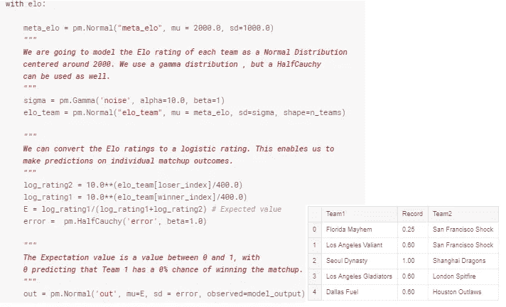
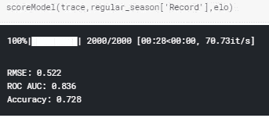
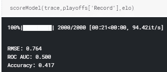
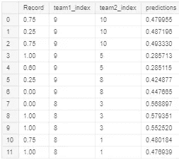

# 基于 PyMC3 的职业掩护比赛贝叶斯建模

> 原文：<https://towardsdatascience.com/bayesian-modeling-of-pro-overwatch-matches-with-pymc3-f1b7d5fc22f1?source=collection_archive---------16----------------------->

Photo by [AC De Leon](https://unsplash.com/@acfromspace?utm_source=medium&utm_medium=referral) on [Unsplash](https://unsplash.com?utm_source=medium&utm_medium=referral)

职业电子竞技变得越来越受欢迎，这个行业正在迅速发展。这些职业游戏联盟中的许多都是基于有两个团队进行比赛的游戏。*使命召唤*、*英雄联盟*、*守望相助*都是例子。虽然这些可以与传统的团队运动相媲美，但电子竞技的新颖性意味着人们对预测这一新兴行业的结果关注较少。

你如何模拟对抗性团队游戏？我最初是在阅读克里斯托弗·毕晓普(Christopher Bishop)的新机器学习[电子书](http://mbmlbook.com/TrueSkill_Inferring_the_players_skills.html)时受到启发开始这个项目的，其中有一章专门介绍了使用 [Elo](https://en.wikipedia.org/wiki/Arpad_Elo) 评级系统计算游戏中玩家的排名。对于那些熟悉国际象棋的人来说，你可能以前遇到过这个指标。我在[数据怀疑论者](http://dataskeptic.com/blog/methods/2017/calculating-an-elo-rating)上找到了一篇非常有启发性的博文。下面贴的所有方程式都是从前面提到的[怀疑论者](http://dataskeptic.com)那里借来的。

本质上，Elo 是一个框架，用一个单一的数字(R1 = 2000)来衡量一个玩家的实力。任何给定球队的预测实力由逻辑函数( *R* )表示，给定比赛的结果由单个球队的实力与其得分之和的比率表示( *E* )。

Logistic Function for player i.

Expected Outcome for player i

如果一个力量为 2000 的玩家面对一个 Elo 等级为 1000 的玩家，我们可以预测前者很有可能获胜( *E=0.9968* )。

Rating update for player i (K~32 in Chess)

在每场比赛结束时，球员的分数会根据他们的相对实力进行更新。如果被看好的玩家赢了(S_i = 1.0)，他们的分数会有一个小的正调整。如果失败者赢得了比赛，他们可以获得更大的金额，因为结果是出乎意料的。在给定的处于劣势的一方获胜的例子中，他们的分数将从 1000 变为 1031。受青睐的玩家的分数也会降低。

这和非常受欢迎的团队射手[看守](https://playoverwatch.com/en-us/)有什么关系？我想知道，有人如何能够在不求助于令人难以置信的复杂架构的情况下，对如此动态的基于团队的运动的难以置信的复杂性进行建模？我在 PyMC3 网站上看到了一个关于使用[分层正态分布](https://docs.pymc.io/notebooks/rugby_analytics.html)对职业橄榄球队进行编码的示例代码。刚刚写了一篇关于[等级模型](/hierarchical-bayesian-modeling-for-ford-gobike-ridership-with-pymc3-part-ii-23f84fb4a5e7)的博文，我想我可以尝试类似的东西！

本质上，我们将每个团队视为一个单独的实体。尽管团队由多个成员组成，每个成员都独立工作。我们将从两个方面证明这一选择:1)将一个团队建模为一个单独的等级，而不是每个单独的玩家，更容易；2)队友们在一起工作(理想情况下)，因此他们可以被建模为一个集体单位。如果两个队以前没有交手过，Elo 等级也是非常有用的。没有任何历史比赛，我们可以利用两个对手共有的团队比赛来进行预测。

[数据](https://overwatchleague.com/en-us/schedule)从守望联盟 2018 赛季刮来的。不幸的是，我们可以用来训练模型的比赛并不多。*由于 2019 赛季正在进行中，任何感兴趣的读者都可以开始将这些数据添加到模型中，看看它的表现如何！在训练我们的模型之前，必须清理和处理原始数据格式。*

Win/Loss aggregations for the regular season

我们可以用两种基本方法来表示我们的数据，这将改变我们构建模型的方式。最简单的方法是让这成为一个分类挑战。每场看守对决都包括多个回合，比赛的获胜者将获得最多回合的胜利。例如，*旧金山冲击*以 3 比 2 击败*佛罗里达大混乱*。我们可以将这表示为数据中总共 5 个记录，具有不同程度的成功和失败(0/1)。

Classification or Bernoulli trial for this simple example

我们可以如下构造我们的数据分割。对于常规赛中的每一场比赛，我们都将每一场输赢建模为一个二元目标。每个团队的 Elo 评级将根据上面列出的等式进行推断，这些等式将评级转换为伯努利试验。然后，我们将使用我们学到的评级来预测季后赛中的所有比赛。我们的 PyMC3 模型将包含一个二项式:对于给定的比赛，我们预测成功还是失败？

A sample trace of our simple model.

我们也可以用分数来表示我们的比赛。同样是一场 3 比 2 的比赛，旧金山休克队获胜，我们可以把它编码为 0.6 分。现在我们有了稍微多一点的灵活性，因为我们可以将它建模为一个回归任务，或者仍然保持它作为一个分类。这个结果也为模型提供了更多的细微差别。一场 0.8 分的胜利比一场 0.6 分的胜利对同一个对手要有利得多。

The ROC suggests the model is decent at predicting matchups

不管您的选择如何，训练误差似乎相当稳定。我们的模型能够根据他们的 Elo 分布预测哪个队会赢。当我们把这种模式应用到季后赛中会发生什么？

我们在季后赛评估中做了一些假设:

1.  常规赛结束的球队在技术、球员、策略等方面都是固定的。
2.  季后赛足够重要，不太可能发生的事件不能主导结果(少量样本)
3.  我们的常规赛在所有球队中公平分配(循环赛)

这些假设肯定会露出丑陋的嘴脸。2018 年季后赛只有 12 场，淘汰来得很快。这意味着，如果一个球队有一场相当糟糕的比赛，这不是他们真正技术的特征，他们可能没有机会挽回自己。当真正的挑战出现时，球队也可以增强实力，这是季后赛的本质。

当我们将我们的模型应用于季后赛数据时，我们得到了非常差的性能。我们的模型还不如随机猜测！这里发生了什么？

Playoff Record and the predictions

简单来说，我们有几个团队颠覆了苹果车。*费城融合*(第 9 队)击败了*波斯顿*和*纽约州*(赢了 4/5 场比赛)，尽管 Elo 评分较低。Fusion*然后输给了伦敦 Spitfire*，尽管排名比 LA Valiant* 低，但后者最终赢得了比赛。真不敢相信这就是为什么人们喜欢看体育比赛，因为你永远不知道谁会赢。*

如果你渴望尝试一些不同的贝叶斯方法来玩这样的游戏，艾伦·唐尼的书 [Think Bayes](http://www.greenteapress.com/thinkbayes/thinkbayes.pdf) 有一节是关于通过泊松过程和他们的历史得分记录来建模团队的。最近 Tuan 发表了一篇关于建立职业足球联盟投注策略的文章。

请随意通过我的 Kaggle [repo](https://www.kaggle.com/franckjay/overwatch-elo-ratings-pymc3) 下载数据和我的笔记本。我还有一个 Git [回购](https://github.com/franckjay/BayesianOverwatchElo)一些精选笔记本。请在下面留下你的评论或问题，我会尽力回答。感谢阅读！