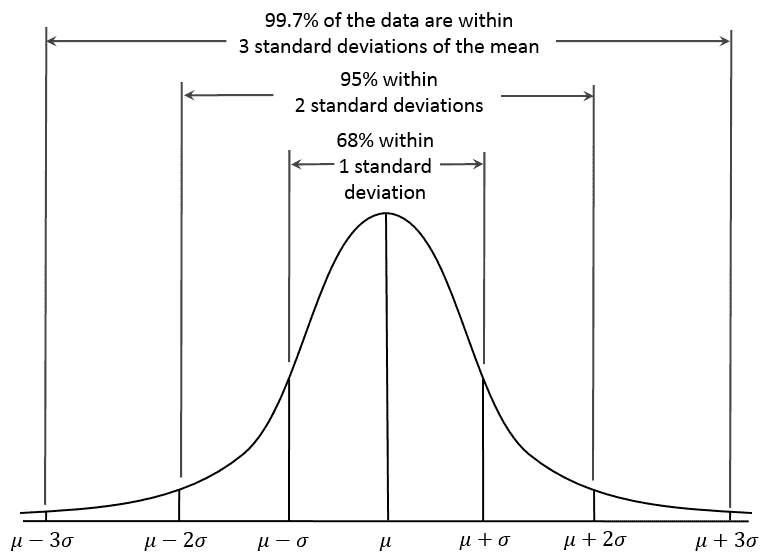
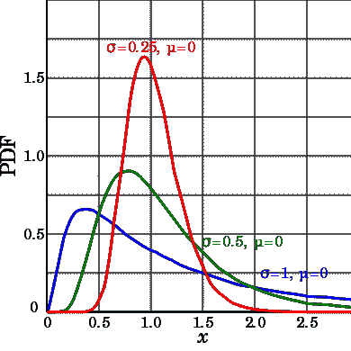
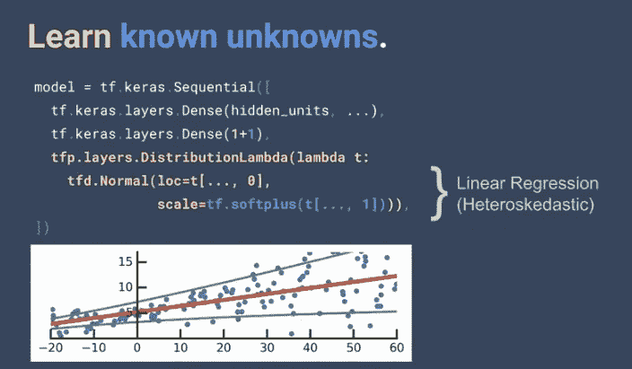
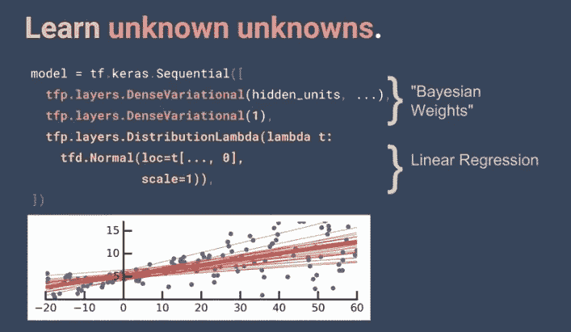
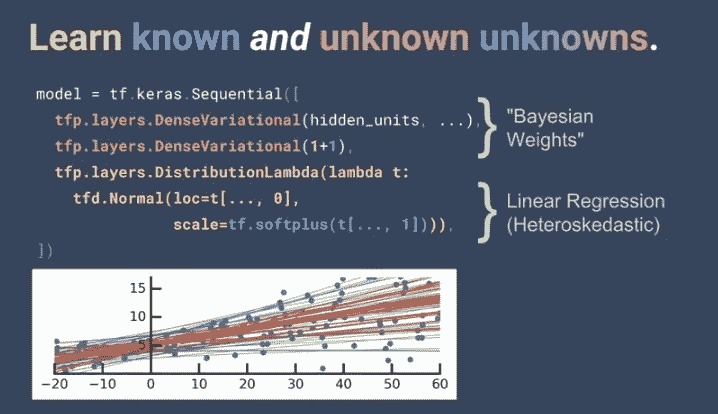
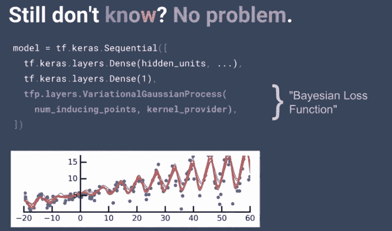

# 张量流概率中的贝叶斯神经网络:快速入门。

> 原文：<https://towardsdatascience.com/bayesian-neural-networks-in-10-mins-in-tfp-c735ec99384f?source=collection_archive---------9----------------------->

前言:贝叶斯神经网络允许我们利用不确定性，因此允许我们开发稳健的模型。因此，关于不确定性的知识是开发健壮和安全的机器学习技术的基础。在这篇文章中，我们概述了两种主要类型的不确定性，以及如何通过简单模型使用张量流概率对它们建模。我们采用贝叶斯框架，它适用于深度学习和强化学习。为了完整起见，让我们重申一下贝耶法则:后验概率是先验概率乘以可能性。

**后验，P(H|E) =(先验 P(H) *似然 P(E|H))|证据 P(E)**

其中 H 是一些假设，E 是证据。

在贝叶斯世界中，我们使用概率分布。例如，考虑我们是否使用高斯分布作为先验假设，个体概率为 P(H)。我们知道这个先验可以用一个均值和标准差来表示，因为我们知道它的概率分布函数。

我们应用 Bayes 规则，在观察到一些证据 E 后，得到后验分布 P(H|E)，这个分布可能是也可能不是高斯！假设如下图所示的[对数正态分布](https://en.wikipedia.org/wiki/Log-normal_distribution)，也可以用均值和方差及其[概率密度函数](https://en.wikipedia.org/wiki/Probability_density_function)来表示。这种使用分布的概念允许我们量化不确定性。在模型方面，假设是我们的模型，证据是我们的数据。

# 不确定性可以分为两大类:

# 任意不确定性**(又名已知未知)**

这是一种增加更多数据也无法解释的不确定性。例如，在掷硬币的随机性{H，T}中，我们知道 p=0.5 的结果将是随机的，进行更多的实验，即掷硬币不会改变这种不确定性，即每个结果/数据点具有相同的概率 0.5。

一个具体的深度学习示例是自动驾驶汽车、医学图像分割(患者在扫描仪中的移动非常常见)、金融交易/风险管理，其中生成我们的数据/观察的底层过程是随机的。来源包括不同种类的设备/传感器(包括摄像机和与之相关的问题)，或金融资产和拥有它们的交易对手，对象不同。在医学上，这些可能是不同的基因型，有不同的临床病史。这里，如果不确定性估计值很高，我们不会开诊断处方。事实上，如果医生不知道根本原因，他们可能会进行专家咨询。

任意的不确定性，不会随着样本数据集的增加而增加。因此有两种类型同方差(常数/任务相关)和异方差(变量)随机不确定性。

我发现从一个例子开始很有用(这些例子来自 Josh Dillion，他在 Tensorflow dev submit 2019 上展示了非常棒的幻灯片)。考虑 Keras 中的以下简单模型，其中我们将先验置于目标函数之上，以量化我们估计中的不确定性。注意红线是线性拟合(β),绿线是线性回归β的标准差

完整的自下而上示例也可从[获得](https://www.angioi.com/tensorflow-heteroscedasticity/)，建议阅读。

# 认知不确定性(又名未知的未知)

这是数据驱动的不确定性，主要是由于缺乏训练数据。通过将先验置于神经网络的权重 w 之上或采用大型训练数据集，采用变分/近似推理(例如贝叶斯的[反向支持)来减少认知不确定性也是可行的。](https://medium.com/@jehillparikh/bayes-by-back-prop-bbb-from-robust-neural-networks-to-unified-theory-of-brain-788fd83f0e38)

Alex Kendal 和 Yarin Gal 在他们的[博客文章](https://alexgkendall.com/computer_vision/bayesian_deep_learning_for_safe_ai/)和论文《有原则的方式》中将这些结合起来用于深度学习。它们在这些背后提供了基本的数学基础。

在我们讨论的例子中，我们假设一个 1 层隐藏网络。如果我们不知道模型或目标函数的结构会怎样？

我们可以使用高斯过程，高斯过程优先于函数！注意函数而不是变量(例如网络或目标/损失函数的权重)！下面是一个玩具示例。神经网络是一种函数估计器。我们将在另一篇文章中详细讨论这些问题。

但是通过改变我们的目标函数，我们获得了更好的数据拟合！！

希望仔细阅读这三张幻灯片可以展示贝叶斯框架的力量和它与深度学习的相关性，以及它在张量流概率中是多么容易。总结一下**的要点**

1.  我们可以应用贝叶斯原理来创建贝叶斯神经网络。
2.  在贝叶斯框架中，将先验分布置于神经网络、损失函数或两者的权重之上，我们基于证据/数据学习后验分布。这允许通过放置先验权重和目标函数，通过获得由我们的数据最佳解释的后验概率，来减少/估计建模中的不确定性。
3.  例如，可以通过放置先验过损失函数来管理任意不确定性，这将导致模型性能的改善。
4.  认知不确定性可以通过先验加权来减少
5.  高斯过程，可以允许确定最佳损失函数！
6.  这一切都归结为后验计算，需要[采样方法](https://medium.com/@jonathan_hui/machine-learning-sampling-based-inference-253285417cca)或[变分推断](https://medium.com/@jonathan_hui/machine-learning-variational-inference-273d8e6480bb)技术来近似后验分布。
7.  当前的限制是在大规模或实时生产环境中进行这项工作是后验计算。变分推理技术和/或有效的采样方法来获得后验是计算要求高的。特别是在处理具有数百万个参数的交易学习模型时。Yarin Gal 提供了一个特别见解，他认为漏失是深度模型的合适替代。推导和详细解释见 Yarin 的[博文](http://mlg.eng.cam.ac.uk/yarin/blog_3d801aa532c1ce.html)。然而，还需要做更多的工作。
8.  当前技术水平已经在[张量流概率](https://www.tensorflow.org/probability)中可用