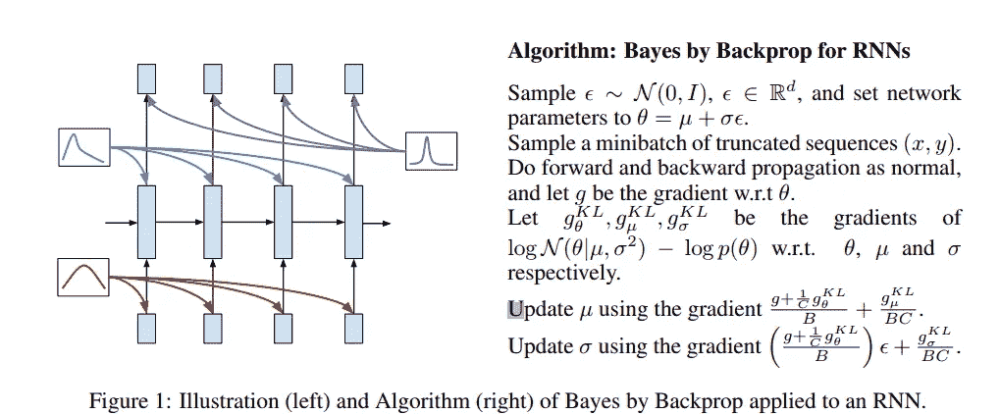
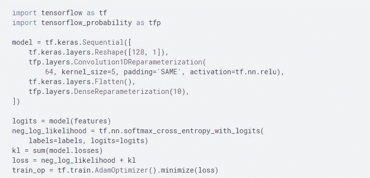
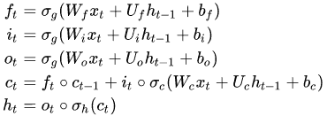
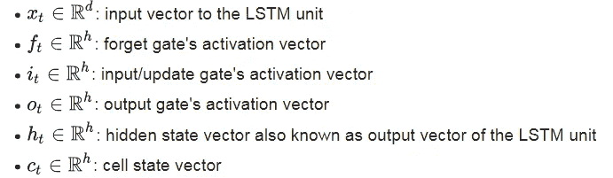
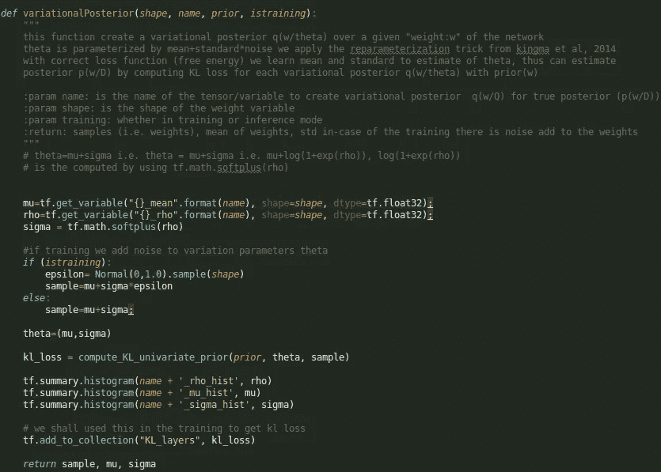
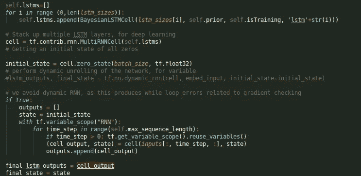
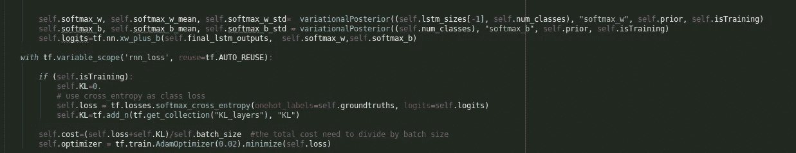

# 贝叶斯神经网络(LSTM):实现

> 原文：<https://towardsdatascience.com/bayesian-neural-networks-lstm-3616327e8b7c?source=collection_archive---------10----------------------->

贝叶斯推理允许量化不确定性，因此，能够开发[健壮的机器学习模型](https://arxiv.org/pdf/1804.11313.pdf)。在实践中，需要采用抽样方法来近似贝叶斯设置中遇到的后验分布/积分。对于实践中典型使用的大型神经网络，采样方法是计算密集型的。变分推理方法已经被发展来克服这个限制。在早先的[帖子](https://medium.com/p/788fd83f0e38/)中，我们讨论了实践的理论方面，变分推理算法，Bayes (BBB)的 Back Prop。BBB 通过设置权重先验，提供了一种减少认知不确定性的有效方法。认知不确定性通常与缺乏训练数据有关。在这篇文章中，我们考虑了 BBB 的实际应用，特别是对 LSMT 的应用。

**From** [**Fortunato et al**](https://arxiv.org/pdf/1704.02798.pdf)**, 2017**

Tensorflow probability 已经为标准层提供了一个实现，比如[密集](https://www.tensorflow.org/probability/api_docs/python/tfp/layers/DenseVariational)、[卷积](https://www.tensorflow.org/probability/api_docs/python/tfp/layers/Convolution1DReparameterization)。下面显示了一个网络模型示例，请注意，API 与 Tensorflow API 非常相似。因此，如果您需要使用这些标准图层之一，请查阅官方[文档](https://www.tensorflow.org/probability/api_docs/python/tfp/layers/)。

**LSMT:** 需要更多工作的一个例子是 LSTM。LSTM 是一类递归神经网络。Colah 的博客对此做了很好的解释。LSTM 的一步一步的 Tensorflow 实现也可以在[这里](https://medium.com/@erikhallstrm/hello-world-rnn-83cd7105b767)找到。如果你对 LSTM 的基本知识不确定，我强烈建议你在继续之前阅读它们。 [Fortunato 等人](https://arxiv.org/pdf/1704.02798.pdf)，2017 年验证了贝叶斯 LSTM。原始源代码是可用的，不幸的是，我发现它很难跟上。

**实现包含 LSTM 的这四个方程**

我们需要权重的先验和变分后验。

我们通过为每个权重指定其(均值=0，标准差=1)来使用正态/高斯先验。

通过效用函数获得每个权重“w”的变分后验概率

该函数还计算这些权重的 KL，并将其添加到张量流集合中。该功能在 [github](https://github.com/JP-MRPhys/bayesianLSTM) 上可用。

为了实现贝叶斯 LSTM，我们从 tensorflow 的基本 LSMT 类开始，并通过向权重添加变分后验来覆盖调用函数，之后我们照常计算门 f、I、o、c 和 h。这里的[非常简单明了。](https://github.com/JP-MRPhys/bayesianLSTM/blob/master/model/BayesianLSTM.py)

这确保了我们拥有一致的 tensorflow API，然后能够在此基础上构建我们的模型，例如，使用多层 LSTM 的情感分析任务。请注意，结果测量的不确定性相当简单(二元)。

这里我们定义贝叶斯 LSTM 层，并通过单元格函数执行[展开](https://colah.github.io/posts/2015-08-Understanding-LSTMs/)。这个实现的一个缺点是不能使用 tf.nn.dynamic_rnn，因为它会产生与梯度检查相关的循环错误。

然后，我们可以获得逻辑和损失，注意，我们对 [softmax 层](https://developers.google.com/machine-learning/crash-course/multi-class-neural-networks/softmax)采用变分后验概率

在训练中，我们获得了我们创建的每个变分后验概率的 KL 集合。这使我们能够计算总 KL 损失，除以批量大小以获得基于证据的下限，如 [Fortunato 等人](https://arxiv.org/pdf/1704.02798.pdf)的论文中所述。

仅此而已。其余代码只是标准数据输入和训练循环，模型保存等可以在这里找到[。](https://github.com/JP-MRPhys/bayesianLSTM)然后我们可以补充文中提到的其他方面。