# 贝叶斯噩梦。解决了！

> 原文：<https://towardsdatascience.com/bayesian-nightmare-how-to-start-loving-bayes-1622741fa960?source=collection_archive---------7----------------------->

## 通过 Python PyMC3 中的示例和代码对贝叶斯数据分析进行了温和的介绍。

在本文中，我们提供了一种温和而实用的方法来轻松使用贝叶斯机器学习。结合实例和说明，介绍了先验、生成模型、后验分布、贝叶斯定理、可信区间等贝叶斯概念。你将在使用 Python 的营销活动中应用贝叶斯方法来估计注册率。20 世纪被零假设显著性测试所主导，而 21 世纪正在变成贝叶斯(来源:JK Kruschke)。

> 如果你看完这篇文章还没有开始热爱贝叶斯，那就向拉普拉斯伸出援手吧！


credits: Sophie Madeleine

谁没听说过贝叶斯统计很难，计算速度慢，无法扩展到大数据，结果是主观的；而我们根本不需要？在接触贝叶斯技术之前，我们真的需要先学习大量的数学和经典统计学吗？为什么最流行的关于贝叶斯统计的书都有 500 多页？

> 贝叶斯噩梦是真实的还是神话？

有人曾将贝叶斯方法比作米其林星级厨师的厨房，配有高质量的厨师刀、汤锅和昂贵的煎锅；而频率主义就像你的普通厨房，有香蕉切片器和意大利面锅。人们谈论 Bayesianism 主义和 Frequentism，好像他们是两个不同的宗教。你是哪个厨师？Bayes 真的在一开始就给数据科学家增加了使用大脑的负担吗？因为 Bayesian 主义是最聪明的人的宗教？“贝叶斯”这个词到底对不对？

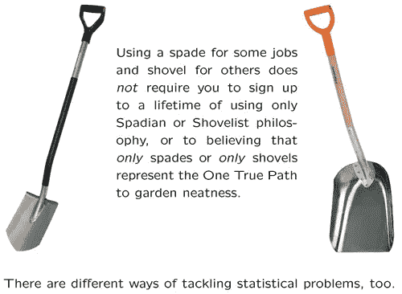

[source](http://faculty.washington.edu/kenrice/BayesIntroClassEpi2018.pdf)

# 贝叶斯数据分析的构建模块

贝叶斯方法的本质特征是在基于统计数据分析的推理中明确使用概率来量化不确定性。最近，人们越来越重视区间估计，而不是假设检验。这为贝叶斯观点提供了一个强大的驱动力，因为大多数标准置信区间的用户似乎通过常识给出了贝叶斯解释。如果需要的话，我们建议浏览下面的文章作为概率的复习。

[](/understanding-probability-finally-576d54dccdb5) [## 理解概率。终于！

### 数据科学家概率概念实用指南

towardsdatascience.com](/understanding-probability-finally-576d54dccdb5) 

数据分析的贝叶斯方法通常需要**数据**，一个**生成模型**和**先验**。在传统方法中，数据用于拟合线性回归线，例如，为了估计最适合描述线性趋势的截距和斜率。没有直接的方法来包含我们对正在估计的那些参数的**先验信念**。贝叶斯方法允许我们基于我们现实生活中的领域知识和常识，对截距和斜率进行事先的良好猜测。此外，我们还可以陈述这个猜测的不确定性。例如，我们可以说，根据经验，斜率是从具有均值μ和标准差σ的正态分布绘制的，而典型截距值将是具有均值θ 和标准差ρ的正态分布。给定描述我们先前信念的分布，我们可以使用**生成模型**生成模拟数据，如下图所示。

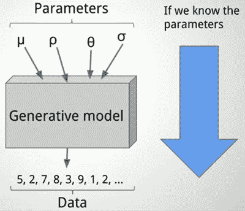

[source](https://www.datacamp.com/courses/fundamentals-of-bayesian-data-analysis-in-r)

# 用贝叶斯方法估计注册率

让我们考虑一个现实生活中的例子，我们感兴趣的是估计销售漏斗中的线索转化率:有多少网站的访问者变成了付费客户。通常情况下，营销部门会开展一项活动来吸引观众并鼓励他们注册。如果我们观察到 16 个访问者中有 6 个注册了，这是否意味着注册率 **θ** 是 6/16=38%？这个百分比有多大的不确定性，尤其是在数据量很小的情况下？贝叶斯数据分析有助于找到这些问题的答案。

## 先验信念

我们从寻找**先验**开始，这是销售部门根据经验或给定的行业现状观察到的典型注册率的信念。让我们假设，根据销售额，0%到 100%之间的任何注册率都是同样可能的。因此，我们可以将注册率的先验分布设为均匀分布。

## 样本生成

接下来，我们构建了一个**生成模型**，该模型针对之前发行的任意随机选择的注册率来模拟大量营销活动。例如，如果选择 55%作为注册率，这就像问 16 个潜在客户，其中每个客户注册的机会是 55%。因此，生成模型是参数为 16 和θ的二项式分布。我们模拟生殖模型 10 万次。每次，我们从均匀分布中抽取一个随机θ，并通过从二项分布中创建 16 个“假”客户来运行生成模型。在这个过程结束时，我们有 100，000 个样本。

## 后验分布

现在，是时候引入我们的**数据**了，它告诉我们，真正的营销活动取得了什么，这是 6/16=38%的注册率。因此，我们过滤掉模拟注册率不是 6/16 的模拟样本，只保留那些模拟注册率是 6/16 的模拟样本。下图显示了这一过程。请注意，相同的先前抽奖(例如 21%)可以从二项式分布中产生不同的注册率(例如 4/16 和 6/16)。

下图说明了贝叶斯抽样和剔除过程。

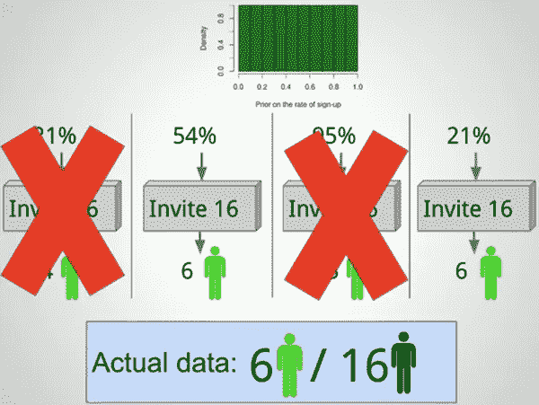

[source](https://www.datacamp.com/courses/fundamentals-of-bayesian-data-analysis-in-r)

现在，我们一方面考虑来自均匀分布的所有 100，000 次θ抽取，另一方面，我们查看在过滤掉那些没有产生 6/16 注册率的样本后保留的θ。如果我们计算两个桶中每个值的频率，那么我们最终得到下面的直方图。

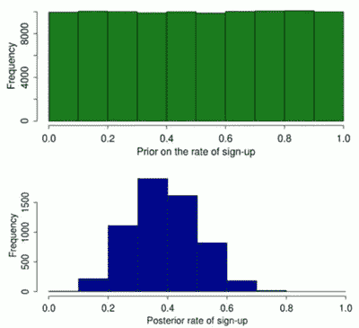

[source](https://www.datacamp.com/courses/fundamentals-of-bayesian-data-analysis-in-r)

## 结果解释

蓝色曲线显示了注册率的所谓**后验分布**。这就是我们一直在寻找的答案。正如我们所看到的，注册率是相当不确定的，我们不能 100%肯定地说它是营销部门发现的 38%。很可能在 20%-60%之间。利用后验分布，我们可以给出关于不确定性的陈述。最有可能产生我们观察到的数据的参数值将是后验分布中概率最高的注册率:38%。这也叫**最大似然估计**，是经典统计学中估计未知参数最常见的方法之一。这就是为什么贝叶斯方法可以被视为最大似然估计的扩展。我们还可以计算所有概率的均值，即**后验均值**作为注册率 39%的最佳嘉宾。通常还会计算包含后验分布中 90%概率的最短区间，称为**可信区间**，在这种情况下，可信区间介于 30%和 40%之间。因此，我们可以说，*有 90%的概率签约率在 30%到 40%之间。*

> **16 个销售线索中有 6 个注册并不总是意味着 38%的注册率！**

# 贝叶斯定理

我们是如何从先验走向后验的？我们来看一个例子，我们从均匀分布中画出θ=35%，概率为 P(35%)。为了不丢弃θ，它必须允许我们模拟与营销数据相匹配的数据。换句话说，在θ=35%的情况下，有 6 次注册的概率 P(6|35%)。通过将这两个量相乘，我们得到绘制θ=35%的概率，并模拟与我们观察到的注册率相匹配的数据。该值将与 35%的概率成比例，该概率是导致 6 个观察到的注册的最佳参数值。如果我们将该数量除以产生所有可能参数值的数据的总概率，我们得到在给定数据 P(35%|6)的情况下具有 35%注册率的确切概率。当我们对从先验分布中提取的所有注册率重复这一过程时，我们获得了绘制蓝色直方图所需的所有概率，即后验分布。下图说明了这一过程。

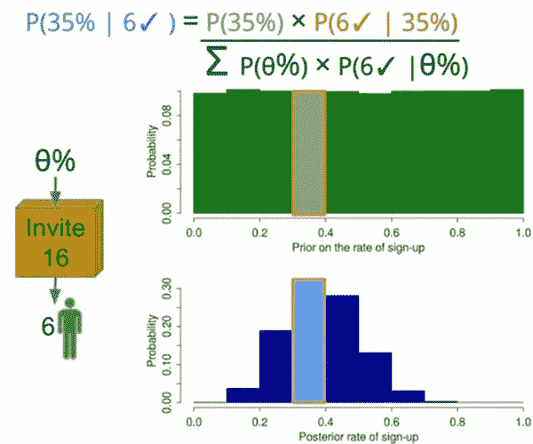

[source](https://www.datacamp.com/courses/fundamentals-of-bayesian-data-analysis-in-r)

上面的练习可以扩展到多参数θ、任何生成模型和任何数据集 d。这种概括由下面的等式说明，通常称为**贝叶斯定理。**

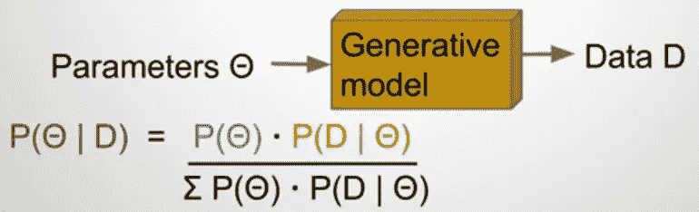

[source](https://www.datacamp.com/courses/fundamentals-of-bayesian-data-analysis-in-r)

# 缩放贝叶斯数据分析

为了说明贝叶斯数据分析的普遍性，让我们考虑营销部门实际上开展了两次活动。在第一个实验中，他们获得了 6/16 的注册人数，而第二个实验的结果是 10/16 的注册人数。此外，销售部门事先认为注册率从未超过 20%，过去一直在 5%到 15%之间。现在，我们有两个参数 *θ* 1 和θ2 以及两个生成模型。我们还得到一个不均匀的**信息先验**，我们可以用参数为 2 和 25 的 Beta 分布来表示，如下图所示。

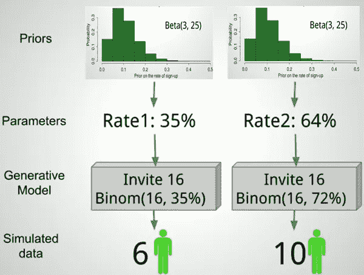

[source](https://www.datacamp.com/courses/fundamentals-of-bayesian-data-analysis-in-r)

我们现在可以从两个生成模型中抽取 100，000 个样本，保留那些匹配的营销数据，并构建两个后验分布，每个活动一个。当考虑销售人员的先验信念时，后验分布可用于得出活动有效性的结论。我们还可以通过计算两个后验分布之间的差异来比较这两个活动。


[source](http://faculty.washington.edu/kenrice/BayesIntroClassEpi2018.pdf)

# 贝叶斯线性回归

在我们对贝叶斯哲学感到更舒服之后，我们将对更扩展的[营销数据集](https://gist.github.com/michelkana/d0f01cf38e2b0e158e1244b7eaedeb17)执行贝叶斯线性回归，该数据集描述了线索转化( *y* 对时间( *x* )的关系。在下图中， *x* 表示在时间 *x=0* 推出新公司网站前后的周数，其中 *x=-10* 为推出前 10 周， *x=+10* 为推出后 10 周。 *y* 表示 *y* 正值的签约率，或者 *y* 负值的流失率。当网站失去访问者时，就会发生流失。营销感兴趣的是估计未来预期的注册率或流失率的不确定性。

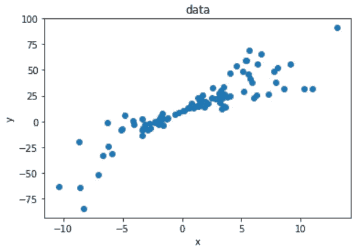

正如前面几节所介绍的，贝叶斯统计是一种将概率应用于统计问题的数学方法。它为人们提供了工具来更新他们对新数据证据的信念。贝叶斯定理描述了基于数据的事件的条件概率，以及关于事件或与事件相关的条件的先验信息或信念。贝叶斯定理可用于计算后验概率(考虑新信息后事件发生的修正概率)。通过更新先验概率来计算后验概率。先验概率是基于实验前的现有知识的结果的概率。

贝叶斯线性回归可能允许一种有用的机制来处理数据不足或分布不良的数据，就像上面图中出现的情况一样。它允许我们在参数和噪声上加上一个先验，这样在没有数据的情况下，先验就可以接管。

## 生成模型

在贝叶斯观点中，我们用概率分布来表述线性回归。响应 *y* 不被估计为单一值，而是假设从概率分布中提取。


然而，根据线性回归方程，我们认为 *y* 最可能的值如下*。*

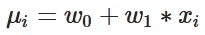

尽管 *μ* 是 *y* 的最可能值， *y* 也可能包含一些误差或噪声。因此，我们通过调整方差项 *σ* 来补偿 *y* 与 *μ* 的偏差，从而对观测值中的这种误差 *ϵ* 进行建模。

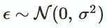

## 传道者

不仅响应是由概率分布生成的，而且模型参数也被假定来自一个分布。假设 *y* 上的噪声呈正态分布，我们还包括斜率和截距的先验信息，如下所示。

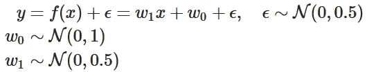

## 后验分布

模型参数的后验概率取决于训练输入和输出:

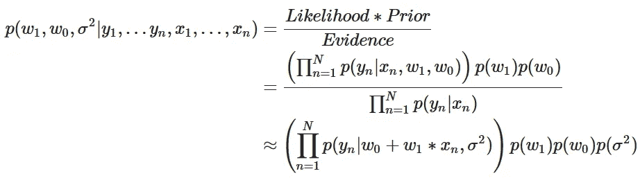

上面的等式再次反映了我们之前在一个更简单的例子中学到的贝叶斯定理。到目前为止，我们通过生成 100，000 个样本并排除那些与数据不匹配的样本来计算后验概率的特定计算方法仅在极少数情况下有效。它被称为**近似贝叶斯计算**。尽管它在概念上很简单，但对于大型数据集来说，它可能会慢得令人难以置信，而且伸缩性也很差。还有更快的方法，主要是所谓的*马尔可夫链蒙特卡罗* ( *MCMC* )算法家族。具体流行的例子包括汉密尔顿蒙特卡罗和大都会-黑斯廷斯。

下面我们使用 Python 库 [PyMC3](https://docs.pymc.io) 实现 MCMC 来寻找模型参数的后验分布。

贝叶斯模型提供了比普通最小二乘回归更多的解释机会，因为它提供了后验分布。贝叶斯线性回归将给出模型权重的后验分布，而不是模型权重的单点估计。我们可以使用这个分布来找到最可能的单个值，以及模型参数的整个可能值范围。

PyMC3 有许多用于可视化和检查模型运行的内置工具。这些让我们看到分布，并提供一定程度的不确定性的估计，这应该是任何模型的必要部分。下面我们看到所有模型参数的轨迹。轨迹图往往围绕真实参数呈正态分布，这是样本向目标分布收敛的好迹象。

```
pm.traceplot(linear_trace, figsize = (12, 12))
```

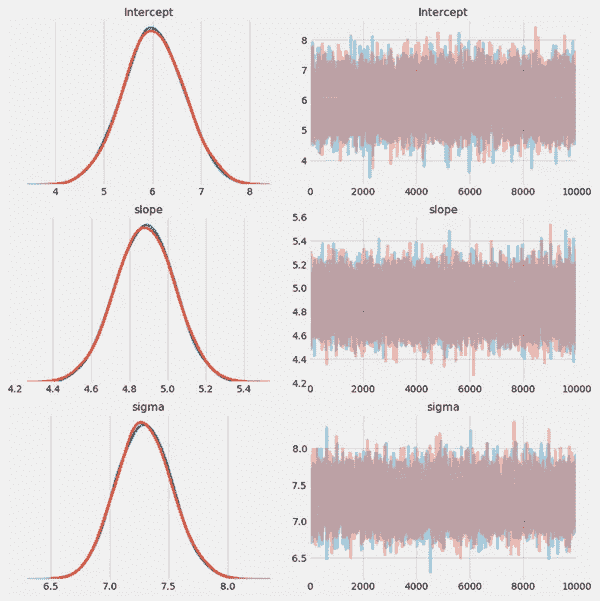

## 结果解释

模型参数的后验分布如下所示。*营销部门预计注册率(斜率)平均每年增长 4.7%。有 94%的可能性签约会以 4.4 之间的速率增加。%和未来的 5.1%。网站启动时的注册率(在第 0 周截距)在 4.6%和 7.2%之间，概率为 94%。签约率的标准差预计平均为 6.6%。*

```
pm.plot_posterior(linear_trace, figsize = (12, 10), text_size = 20);
```

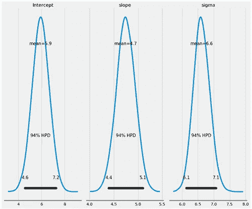

我们还可以可视化模型参数的可信区间。注册的变化率(斜率)比第 0 周的注册率具有更小的不确定性。

```
pm.forestplot(linear_trace);
```

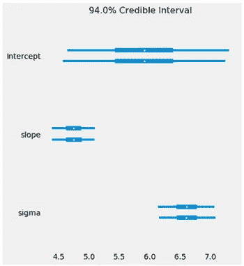

## 贝叶斯数据分析的优势

我们还可以使用模型结果生成线性回归线的预测。下图显示了从后验概率绘制的回归线的 100 个不同估计值。线的分布给出了估计中不确定性的估计。贝叶斯线性回归的好处是，它给我们一个后验分布，而不是一个单点估计的频率普通最小二乘回归(OLS)。

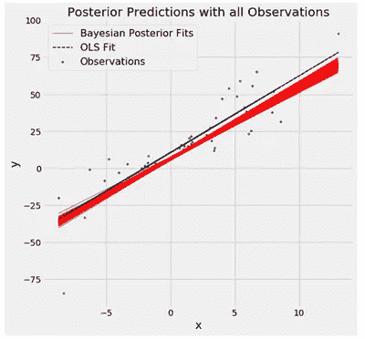

# 结论

在这篇文章中，我们对统计学和机器学习的贝叶斯方法做了一个简单的介绍。特别是，我们量化了营销活动中注册率点估计的不确定性。结合实例和说明，介绍了先验、生成模型、后验分布、贝叶斯定理、可信区间等贝叶斯概念。我们还介绍了使用贝叶斯方法的线性回归的 Python 实现，并将其与经典的普通最小二乘法进行了比较。本文对 PyMC3 提供了一些提示，pymc 3 是一个用于贝叶斯分析的简单易用的 Python 库。

不要试图在一篇文章中塞进太多内容，你可以转向书籍，比如 Andrew Gelman 等人的 [Bayesian 数据分析。艾尔。](https://books.google.cz/books/about/Bayesian_Data_Analysis_Third_Edition.html?id=ZXL6AQAAQBAJ&redir_esc=y)

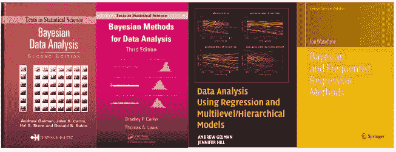

这篇文章的灵感来自[拉斯穆斯·巴斯](http://www.sumsar.net/about.html)的材料，他以非常直观的方式讲授贝叶斯数据分析。我强烈推荐他在[数据营](https://www.datacamp.com/courses/fundamentals-of-bayesian-data-analysis-in-r)关于 R 的贝叶斯数据分析基础的课程和他在 YouTube 上的[视频。](https://www.youtube.com/watch?v=3OJEae7Qb_o)

好吧，这篇文章不知何故已经激发了读者开始喜欢 Bayes。如果你仍然喜欢机器学习的非贝叶斯方法，我可以理解。在这种情况下，你会得到我下面的文章。

[](/why-deep-learning-works-289f17cab01a) [## 深度学习为什么有效:解决一个农民的问题

### 在开始是神经元:梯度下降，反向传播，回归，自动编码器，细胞神经网络…

towardsdatascience.com](/why-deep-learning-works-289f17cab01a)