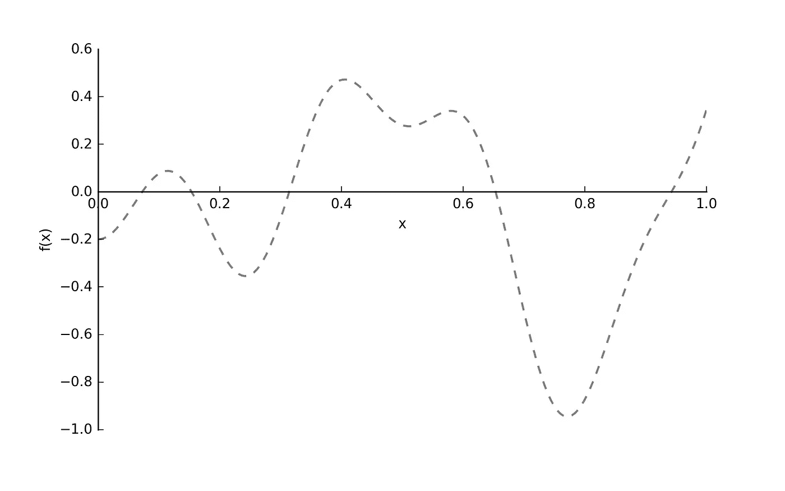
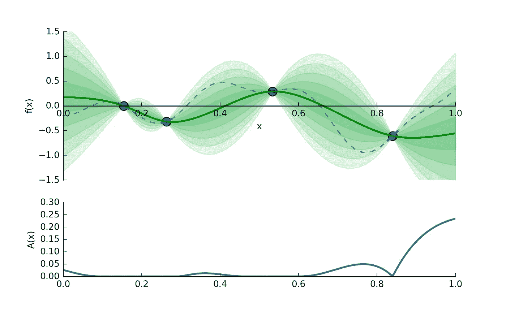
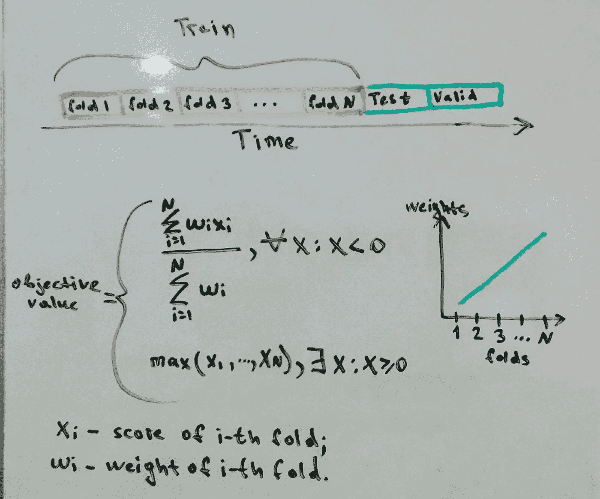
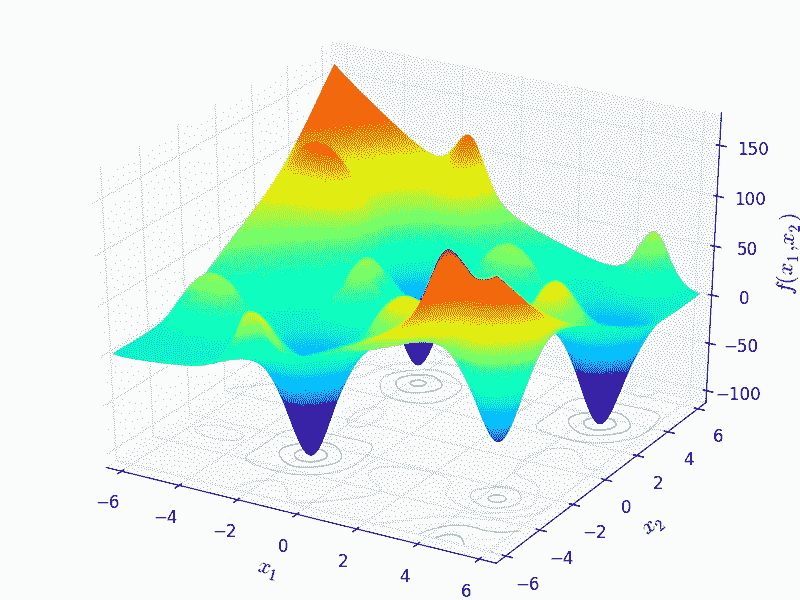
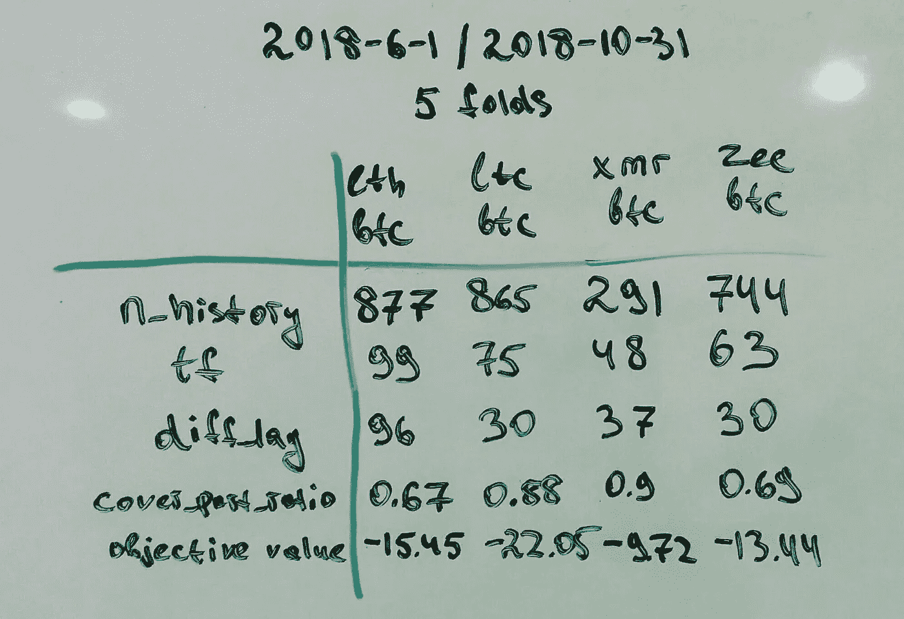
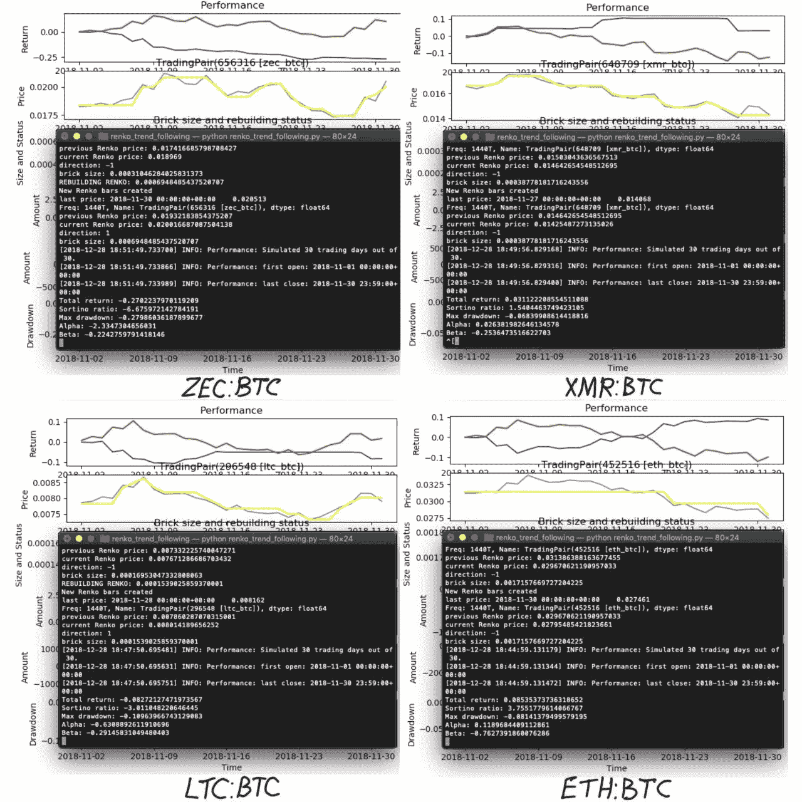
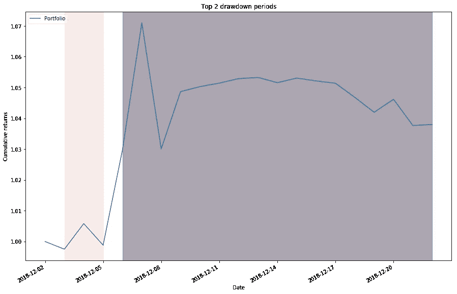
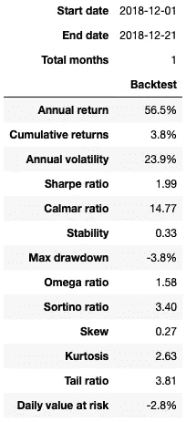
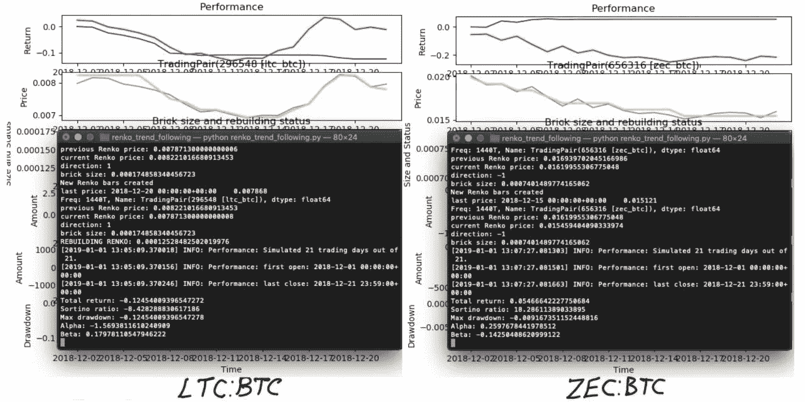
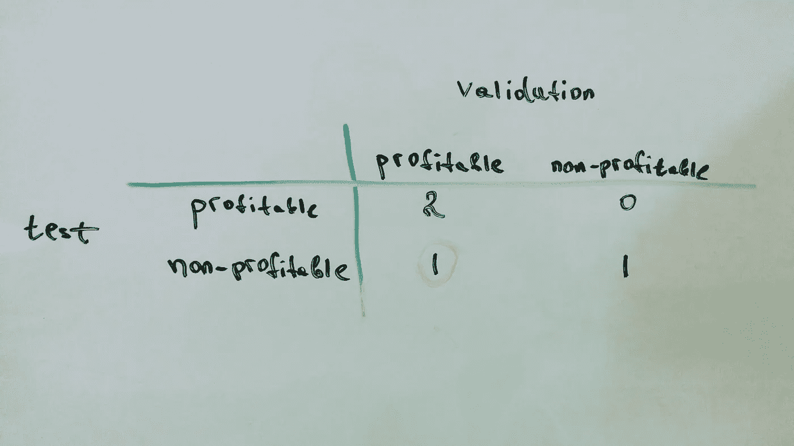

# 交易中的贝叶斯优化

> 原文：<https://towardsdatascience.com/bayesian-optimization-in-trading-77202ffed530?source=collection_archive---------13----------------------->

算法交易和机器学习有类似的问题。今天，我将展示如何应用贝叶斯优化来调整交易策略超参数。

让我们假设你用几个超参数创建了一个交易策略。这种策略在回溯测试中是有利可图的。您希望将策略部署到生产模式，但是还有一个问题:“这组参数是最优的吗？”。

通常，网格搜索方法用于搜索最佳超参数。这种方法也用于机器学习，但这需要大量的计算，通常在错误的参数空间中。

另一种方法是随机搜索，它的性能比网格搜索稍好。

我在 Quora 上找到了一个很棒的解释:

> **问题:**目标是找到某个“昂贵”函数的近似最小值。这样一个函数接受一个实值向量 **𝐱** ∈ℝ，返回一个标量，并且花费了相当长的时间。此外，没有可用的梯度计算。让我们想象一个简单的一维情况:

> 虚线暗示我们看不到这个函数——我们只能选择在某些点上对它求值。
> 
> 因为这个函数是昂贵的，假设我们有一个固定的评估预算——我们可能只评估它，比如说，10 次。
> 
> 有了这个，你如何找到最好的最小值？
> 
> **想法是这样的:**对一些输入-输出(少于 10 个)进行采样，并使用它们*用一种叫做“高斯过程”(或这里的“GP”)的东西来猜测*真正的函数。然后使用猜测函数来确定下一步在哪里求值。评估该点，将其添加到我们的输入-输出集，并再次推断猜测的函数。重复这个过程，直到你用完了你的评估预算(或者其他一些停止标准)。如果 GP 擅长猜测真实函数，我们会比随机抽样做得更好。
> 
> 为了对 GP 有一个感觉，让我们从我们昂贵的函数中抽取四个点，把它们交给 GP，让它推断函数的其余部分。可能是这样的:

> 绿色实线是我们对真实函数的猜测。每增加一个绿色条带，就是输出分布的另一个半标准差。
> 
> 所以现在问题变成了:给定所有这些有用的猜测信息，我们下一步应该检查哪一点？在回答这个问题时，我们关心两件事:
> 
> 我们应该评估我们认为会产生低产值的点。也就是说，我们应该评估绿色实线较低的点。
> 
> 我们应该检查我们不太了解的领域。因此，在上图中，检查 0.65 和 0.75 之间的某个位置比检查 0.15 和 0.25 之间的某个位置更明智，因为我们对后一个区域的情况有相当好的了解。换句话说，我们应该检查最能减少我们猜测中的方差的区域。
> 
> 平衡这两者是*勘探开发*的权衡。到目前为止，你会寻找新的地点或者开发你已经发现的金矿吗？我们用一个*获取函数*来明确我们的偏好。这是𝑥x 的一个函数，它将产生一个数字，告诉我们这两个目标实现得有多好。这个函数很便宜，所以我们可以优化它，并使用𝑥x 作为我们下一个搜索点。
> 
> 那么哪个采集函数呢？嗯，有几个选择，但我会选择*期望改善*。也就是说，评估预期改进最高的下一点。
> 
> 所以如果:
> 
> 𝜇(𝑥)μ(x)是𝑥x 函数的猜测值(绿线)。
> 
> 𝜎(𝑥)σ(x)是𝑥x 产量的标准偏差(与绿色带成比例)。
> 
> 那么我们对改善的获得/期望(称之为𝐴(𝑥)A(x))是:

> 其中φ(⋅)和 N(⋅)分别指标准正态分布的 CDF 和 PDF。准确理解这个公式并不重要——只要知道它是低𝜇(𝑥)μ(x 和高𝜎(𝑥)σ(x).的某种平衡
> 
> 要了解这是如何操作的，请查看我们之前的图表:

> 这将告诉我们检查𝑥=1，因为该点的激活度最高。
> 
> 然后重复。就是这样！就像我之前说的，如果 GP 擅长猜测真实函数，它会击败随机抽样。

这篇[文章](http://proceedings.mlr.press/v28/bergstra13.pdf)比较了机器学习中超参数调整的不同方法。它表明贝叶斯优化是一种比随机、网格搜索或手动更好的方法。

# 贝叶斯优化

Siraj Raval 的这段视频也有很好的解释:

如果你想深入这个话题，你应该阅读这篇文章。

# 实际例子

我们将考虑我之前讨论过的一个[策略](https://hackernoon.com/adaptive-trend-following-trading-strategy-based-on-renko-9248bf83554)。该策略有 4 个超参数，让我们定义所需的库:

贝叶斯优化在*hyperpt*包中实现。你可以在 Will Koehrsen 的[文章](/an-introductory-example-of-bayesian-optimization-in-python-with-hyperopt-aae40fff4ff0)中找到这个包的介绍。

通常，研究者使用回测来寻找最优超参数和样本外检验进行评估。我喜欢这种方法，但是我认为如果我们使用一些回溯测试周期(折叠)，我们可以得到一个更有意义的结果

当折叠更接近样本期外时，则折叠在最终加权分数中具有更大的权重。

此外，如果某个文件夹的性能不佳，该函数应该惩罚最终值。作为交易中的一个评分函数，你可以使用[成交比率](https://www.investopedia.com/terms/s/sortinoratio.asp)，或者任何评估策略质量的函数。就我们的目的而言，值越低越好。这意味着我们应该反转 Sortino 比率值。

在本例中，我们将使用:

*   训练(优化)步骤一个月五倍
*   一个月为测试期，三周为验证期(出样期)

测试阶段允许选择将在验证阶段进行测试的配对。

*   培训时间:2018 年 6 月 1 日至 2018 年 10 月 31 日
*   测试时间:2018 年 11 月 1 日至 2018 年 11 月 30 日
*   验证期:2018 年 12 月 1 日至 2018 年 12 月 21 日

让我们定义周期、超参数空间和一个`weighted_mean`函数。该代码允许通过`period_weights`定义不同的折叠长度。

下一步是定义运行算法和测量性能的得分函数(在本例中是 Sortino ratio)。

这个函数太长了，因为它还包含了上一篇文章中算法的嵌套函数。用于将参数从`hyperopt` 包传递到催化剂框架的替代变体是使用`os.environ` 模块。如果你知道更好的方法，请在评论中告诉我。也许来自谜项目的人会给出正确的答案。

核心是`objective`函数，通过`weighted_mean`函数衡量几个褶皱的表现，否则取最大褶皱(惩罚)。

接下来的代码运行 300 次迭代的优化。

输出如下所示:

此表包含按分数排列的试验前几名。最后一行是最佳超参数集。我使用 Bitfinex 数据为 ETH/BTC、LTC/BTC、XMR/BTC 和 ZEC 等公司进行了这个实验。

理论上可以把`objective value`在 3D 空间中可视化，像*维度 1* — *维度 2* — *目标值*，最优解具有全局最小值:

3D space of objective function

该超参数表显示了每项资产的最佳参数值:

Best hyperparameters

# 资产选择(测试步骤)

在这一步，我们应该在测试阶段为特定资产运行具有固定超参数的策略。具有正面性能的资产将被选择用于下一步(样本外测试)。

这个[代码](https://github.com/lamres/renko_trend_following_strategy_catalyst/blob/master/renko_trend_following.py)允许这样做，你只需要改变超参数并设置加密货币。

如您所见，两项资产(ETH/BTC 和 XMR/BTC)取得了积极的业绩。

Testing period performance

# 样品外测试(验证步骤)

当我们找到最佳超参数和选定的资产时，我们可以在不用于优化的时段(验证时段)运行交易算法。

让我们根据这两种资产建立一个投资组合。在 *t = 0 时，*根据其目标值(-15.45 和-9.72)的比例设置每个资产资本。

理论上，每项资产的权重可能不同。例如统一分配或其他方法。投资组合的最终权益结合了这些资产的表现。

Equity and drawdowns of portfolio

Performance of portfolio

总的来说，该策略在样本外期有积极的表现。表中展示了基本指标。

正如你在上面的图表中看到的，提取期太长了。很可能，算法无法适应之前快速增长后的下降。你可以在制定目标函数时考虑到这一点。

在测试阶段，我们从投资组合中剔除了两项资产(LTC/BTC 和 ZEC/BTC)。让我们看看这是不是一个正确的决定:

Dropped out assets

是的，这个决定是正确的。如果包括这些资产，投资组合会更糟糕。混淆矩阵看起来像这样:

Confusion matrix

如我们所见，我们没有 I 型错误。我们只从投资组合中剔除了 ZEC/BTC，但这一资产在验证阶段表现良好(第二类错误)。在这种情况下，这没有包括一些不能盈利的资产重要。

# 结论

在本文中，我们介绍了以下内容:

1.  建议优化交易策略的方法，包括培训、测试和验证步骤。
2.  公式化的*目标函数*结合了不同折叠的得分值。
3.  你可以在 [github](https://github.com/lamres/renko_trend_following_strategy_catalyst) 上探索开发的脚本。

这个例子不是最终的交易策略——给定的结果可能是随机的。需要大量的实验才能得出适合交易的结论。

如何改进这种方法:

1.  根据你的目标定义你自己的*目标*和*得分*函数。
2.  定制培训/测试/验证周期。
3.  创建一个包含大量资产的投资组合，以测试这种方法可能对你有效的假设。
4.  使用移动步行测试获得更有意义的结果。它允许模拟更接近真实交易的情况。你会得到更多的数据用于统计推断。

让我知道你对自己的交易策略使用什么优化方法。

最诚挚的问候，

[谢尔盖](http://malchevskiy.pro/)