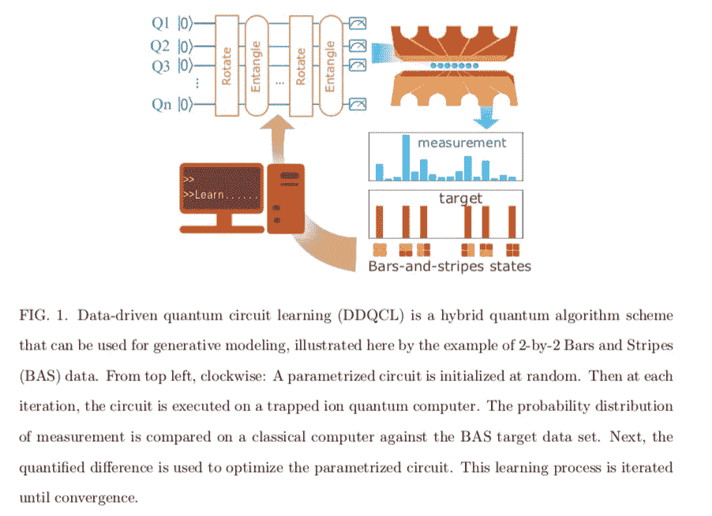
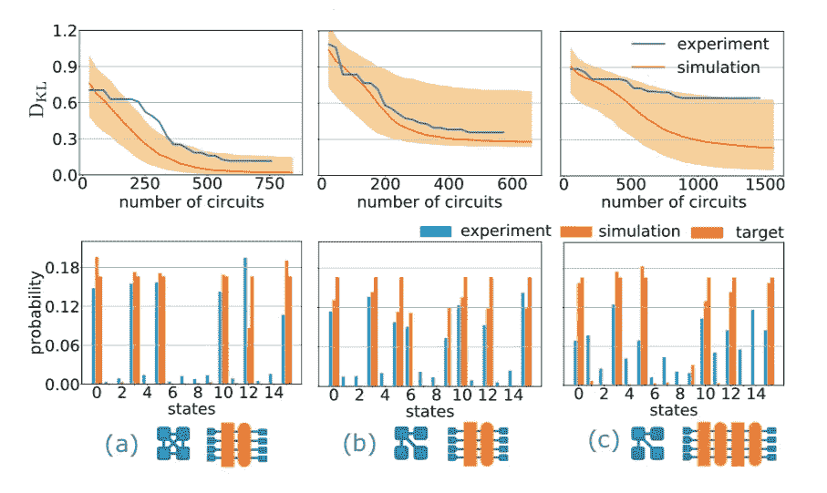
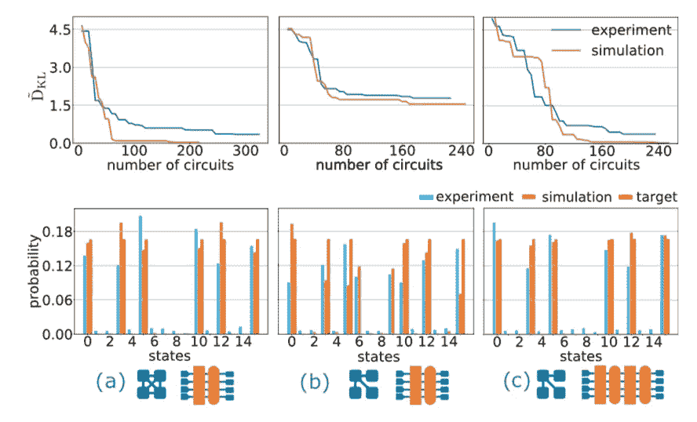
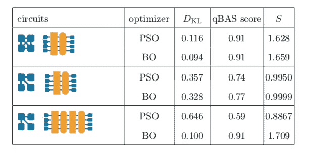

# 贝叶斯优化和量子计算

> 原文：<https://towardsdatascience.com/bayesian-optimization-quantum-computing-27a9cbbf0930?source=collection_archive---------24----------------------->

## 贝叶斯优化如何帮助量子计算成为现实

量子计算机有可能比传统计算机快得多，这将彻底改变我们目前解决许多应用程序的方式。你可以在这篇详细的[文章](https://medium.com/swlh/the-awesome-potential-of-quantum-computing-e81eb148a2e8)中找到答案，但是我们距离通用量子计算机还有几年的时间。然而，对于某些应用，贝叶斯优化可以帮助稳定量子电路，这篇文章将在提交给[科学](https://www.sciencemag.org)的[论文](https://arxiv.org/abs/1812.08862)中总结 [OPTaaS](https://www.mindfoundry.ai/optaas) 是如何做到这一点的。这篇论文背后的团队由来自马里兰大学、UCL、剑桥量子计算、思维铸造、中央康涅狄格州立大学、康涅狄格州立大学和康涅狄格州立大学的研究人员组成。

## 任务

这篇论文背后的研究人员正在一台捕获离子量子计算机上应用一种混合量子学习方案，以完成一项生成性建模任务。[生成模型](https://en.wikipedia.org/wiki/Generative_model)旨在学习数据的表示，以便使后续任务更容易。混合量子算法使用经典和量子资源来解决潜在的困难问题。研究中使用了条纹(BAS)数据集，因为它可以很容易地在包含水平条纹和垂直条纹的图像中可视化，其中每个像素代表一个 q [ubit](https://en.wikipedia.org/wiki/Qubit) 。

该实验是在一台七位全可编程的囚禁离子量子计算机中的四个量子位上进行的。量子电路被构造成多层参数化的门，这些门将被优化算法校准。下图摘自该论文，说明了该设置。

## 训练量子电路

研究人员在论文中对训练算法使用了两种优化方法:

*   粒子群优化(PSO):一种随机方案，它通过创建许多随机分布的“粒子”来协作探索地形
*   使用 [OPTaaS](https://optaas.mindfoundry.ai) 的贝叶斯优化:一种全局优化范例，可以通过构建和更新底层目标函数的代理模型来处理多参数函数的昂贵采样。

你可以在下面找到关于贝叶斯优化的更详细的文章:

 [## 高斯过程贝叶斯优化背后的直觉

### 在某些应用中，目标函数是昂贵的或难以评估的。在这些情况下，一般…

towardsdatascience.com](/the-intuitions-behind-bayesian-optimization-with-gaussian-processes-7e00fcc898a0) 

优化过程包括对于给定的一组参数，模拟经典模拟器的训练过程，而不是量子处理器。一旦确定了最佳参数，就可以在图 1 所示的离子量子计算机上运行训练程序。用于量化 BAS 分布和电路实验测量值之间差异的成本函数是原始 [Kullback-Leibler 散度](https://en.wikipedia.org/wiki/Kullback%E2%80%93Leibler_divergence)的变体，详见本文。

## 结果和展望

PSO 和 OPTaaS 的训练结果如下图所示:

Quantum circuit training results with PSO

Quantum circuit training results with OPTaaS

模拟用橙色表示，离子量子计算机结果用蓝色表示。列(a)对应于具有两层门和全对全连接的电路。列(b)和(c)分别对应于具有两层和四层并开始连接的电路。(a)、(b)和(c)分别有 14、11 和 26 个可调参数。

我们观察到，该电路能够很好地收敛，从而仅对于第一个电路产生 BAS 分布，而对于 OPTaaS，所有电路都能够收敛。根据研究人员的说法，OPTaaS 在 26 参数电路上的成功代表了迄今为止最强大的混合量子应用。

如果你想更详细地了解这项工作，请阅读[论文](https://arxiv.org/pdf/1812.08862.pdf)，你也可以从我的[个人资料](https://medium.com/@charlesbrecque)中报名参加 OPTaaS 试验。

【**更新**:我开了一家科技[公司](http://www.legislate.tech)。你可以在这里找到更多的

## 团队和资源

[Mind Foundry](http://www.mindfoundry.ai) 是牛津大学的分支机构，由斯蒂芬·罗伯茨(Stephen Roberts)和迈克尔·奥斯本(Michael Osborne)教授创立，他们在数据分析领域已经工作了 35 年。Mind Foundry 团队由 30 多名世界级的机器学习研究人员和精英软件工程师组成，其中许多人曾是牛津大学的博士后。此外，Mind Foundry 通过其分拆地位，拥有超过 30 名牛津大学机器学习博士的特权。Mind Foundry 是牛津大学的投资组合公司，其投资者包括[牛津科学创新](https://www.oxfordsciencesinnovation.com)、[牛津技术与创新基金、](http://www.oxfordtechnology.com)、[牛津大学创新基金](https://innovation.ox.ac.uk/award-details/university-oxford-isis-fund-uoif/)和 [Parkwalk Advisors](http://parkwalkadvisors.com) 。