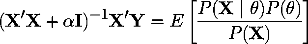
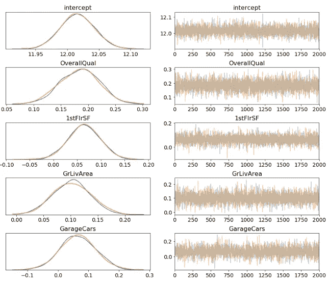
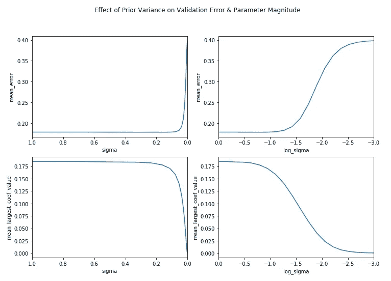
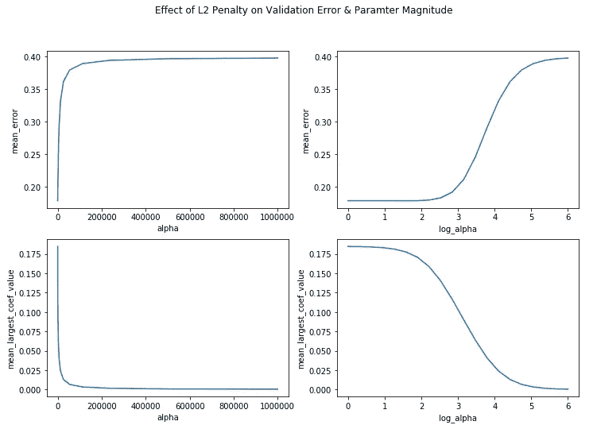

# 贝叶斯先验和正则化惩罚

> 原文：<https://towardsdatascience.com/bayesian-priors-and-regularization-penalties-6d0054d9747b?source=collection_archive---------16----------------------->

## 实证检验它们的等价性

Photo by [Erik Mclean](https://unsplash.com/@introspectivedsgn?utm_source=unsplash&utm_medium=referral&utm_content=creditCopyText) on [Unsplash](https://unsplash.com/s/photos/dice?utm_source=unsplash&utm_medium=referral&utm_content=creditCopyText)

执行机器学习的贝叶斯方法提供了几个优于其对应方的优势，特别是估计不确定性的能力和将上下文知识编码为先验分布的选项。那么，为什么它们没有得到更广泛的应用呢？

为了明确地被认为是一种升级，贝叶斯模型必须对所有流行的机器学习模型都有一个等效的理论公式，并恢复在其中观察到的那种预测性能。它们必须同样易于使用。

这些都是艰巨的挑战，有许多技术障碍需要克服。然而，我今天在这里不是为了对概率编程的状态进行哲学探讨。相反，我想花一些时间来探索贝叶斯方法的许多初学者教科书中提出的等价性:贝叶斯线性模型中系数的先验分布与正则化最小二乘回归中使用的惩罚项之间的等价性。

The equivalence we will be exploring

我发现这种二元性令人信服，因为就其本身而言，正规化似乎有点“杂乱无章”知道它可以在一个更大的框架内被理解和形式化是令人欣慰的，这是我认为值得凭经验探究的事情。

这种等价性有许多很好的理论处理方法，因此我选择通过改变正则化线性模型的调整参数来测试它，并查看最大系数的大小以及回归问题的误差是如何响应的。我用贝叶斯 GLM 做了同样的事情，调整了参数先验分布的方差。这是一次有趣的练习，我认为结果值得分享。

## 该理论

我现在想强调的是，我在这里的目的不是向那些不熟悉的人介绍贝叶斯线性模型。如果你是概率编程新手，并且有 Python 经验，我推荐[针对黑客的贝叶斯方法](https://camdavidsonpilon.github.io/Probabilistic-Programming-and-Bayesian-Methods-for-Hackers/)。无论如何，我的目标是提供另一个角度来看线性回归的两个公式是如何等价的。

然而，我将简要概述线性回归的贝叶斯观点。在此公式中，响应变量 *Y* 被视为随机变量，其平均值等于特征 *βX.* 的加权和

即*Y∞N(βX，σ)。*如果噪声项呈正态分布( *Y=βX+ϵ，*与 *ϵ∼N(0，【σ】*)*，这相当于线性回归的标准公式。*

此外，我们可以指定参数 *β* 的先验分布。常见的选择是高斯分布。如果我们将这个分布集中在 0 附近，这将表明我们期望参数很小。为该先验的标准差选择小值将对应于更紧密的分布，表明对小参数的更强的初始信念-类似于正则化最小二乘回归中的大惩罚。

A plot showing the sampled posterior distributions of some model parameters and the “trace” of the sampling.

在概率规划方法中，一个与我们感兴趣的所有随机变量(对于线性模型，系数和截距)的后验分布成比例的非标准化函数是根据贝叶斯定理从数据和先验中生成的。一种抽样算法，通常是[马尔可夫链蒙特卡罗](https://en.wikipedia.org/wiki/Markov_chain_Monte_Carlo)的某种变体，然后生成这个后验估计。我使用 [PyMC3](https://docs.pymc.io/) 来构建我的贝叶斯模型，并对其参数的分布进行采样。

## 设置

我选择用 Kaggle 上的[笔记本来进行我的小型实验。我的理由有两个:](https://www.kaggle.com/rayheberer/bayesian-priors-and-regularization-penalties)

1.  我希望其他人能够在不需要安装依赖项的情况下使用代码。
2.  我想专注于比较我的模型的行为，Kaggle 提供了干净的数据和一个简单的导入方法

一旦我知道了我想要做的比较和情节，这是一个相当简单的过程。对于那些对技术细节感兴趣的人来说，笔记本的大部分代码都放在[这个实用程序脚本](https://www.kaggle.com/rayheberer/priors-penalties-functions)中。它包含了我的实验所需的主要成分:

*   一种迭代超参数、训练模型以及报告验证错误和系数幅度的方法。
*   一个贝叶斯 GLM 的实现，带有一个 scikit-learn 风格的 API，可以插入到上面的循环中。
*   一个可以获取结果并生成线图的函数。我使用了我的文章中描述的那种模板，即以编程方式生成 matplotlib 子情节。

## 结果呢

下面是笔记本为岭(L2)回归和具有高斯先验的贝叶斯线性模型生成的图。如我们所料，使用具有适当范围的对数 x 轴，曲线非常相似。

我们到底看到了什么？首先，让我们回顾一下超参数。

*Alpha* 是控制岭回归中 L2 罚项的相对重要性的调整参数。损失函数由*L = MSE+*α*| |*|***θ***|给出，其中 *MSE* 是均方误差， ***θ*** 是系数的向量。因此，当α较大时，损耗由这一项决定，将其降至最低的最佳方法是将所有系数设为 0。

*适马*给出贝叶斯模型中系数先验分布的标准差。该先验被选择为正态(高斯)分布。如果它很小，那么我们的先验非常紧密地以零为中心，并且需要大量的证据(数据)来将参数的后验分布的质量从零移开。

知道了这些，上面的结果有意义吗？让我们看看:

*   随着调节参数α的增加，L2 惩罚模型中的最大系数趋于零。
*   因此，如果你一直只是猜测结果数据的平均值，误差会上升到你会得到的值。
*   同样的事情发生在贝叶斯模型中，因为先验的方差被设置得非常小。

尽管这两个模型背后的实现非常不同，一个依赖于优化，另一个依赖于采样，但我们在选择的两个度量中观察到几乎相同的行为。

## 结论

贝叶斯线性模型通常作为寻求学习概率编程的入门材料，包含对频率主义统计学习模型的现有理解。我相信这是有效的，因为它允许一个人在现有知识的基础上构建新知识，甚至将已经理解的东西——也许只是许多工具中的一个——放入更广泛、理论上更令人满意的框架中。

贝叶斯线性模型中选择的参数的先验分布和正则化最小二乘回归中的惩罚项之间的关系已经是众所周知的。尽管如此，我觉得我能够通过实证检验调整每个模型的超参数的效果来对这种等价性有一个更直观的理解。我希望我的小实验能为你做同样的事情，并作为现有证据的补充。