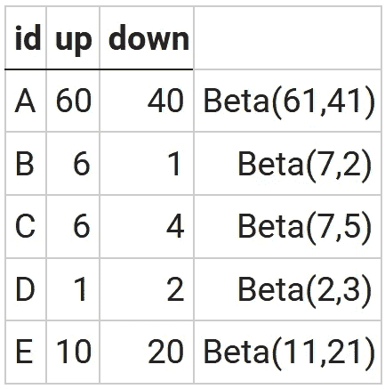
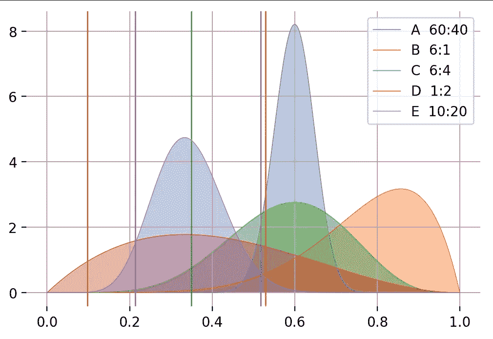
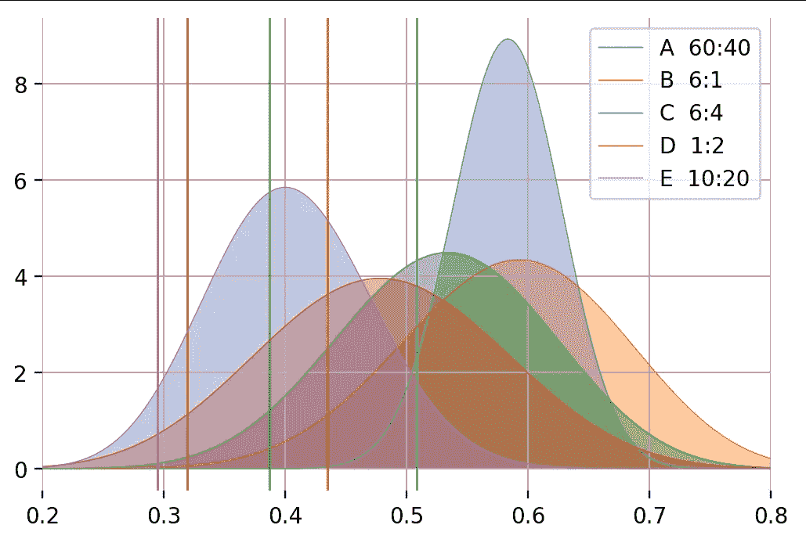

# 贝叶斯排名系统

> 原文：<https://towardsdatascience.com/bayesian-ranking-system-77818e63b57b?source=collection_archive---------9----------------------->

## 根据不同数量的回复进行排名

注意:假设您熟悉之前中提到的 [beta 发行版。](https://medium.com/@andrew.cocks_35285/bayesian-inference-in-1760-e4b5ebdafe01)

除了计算[彩票概率](https://medium.com/@andrew.cocks_35285/bayesian-inference-in-1760-e4b5ebdafe01)或[疾病可能性](https://medium.com/@andrew.cocks_35285/naive-bayes-and-disease-detection-ffefe2cc5c01)之外，贝叶斯定理还有其他应用，例如我们可以建立一个排名系统。就拿一个电影排名网站来说吧，用户在这个网站上对电影进行上/下投票。简单的排名方案，如赞成票的百分比或上下票数执行不佳。

**百分比** : 60 **上升** : 40 **下降** — vs — 6 **上升** : 4 **下降**均为 ***60%***

**上**减**下** : 100 **上** : 95 **下** vs 5 **上** : 0 **下**都是 **+5**

我们想要的是更多的投票来增加更多的信息；60 票比 6 票更有分量。让我们在贝叶斯推理中使用投票作为可能性。这是一组电影 A-E，带有向上/向下投票和计算的 beta 函数，从均匀 beta(1，1) *开始，在*之前:



然而，贝塔分布是一个 PDF，所以我们需要一些算法来转换成一个排名标量。一种方法是找到 beta 分布的最小值，这样我们就有 95%的把握认为真实值更大。这可以通过从平均值中减去一些标准偏差来实现。

> 排名=平均值+ z 值×标准差

对于正态近似值，累积密度函数 CDF 在 z 得分为-1.64 时为 5%，可以在上面的公式中使用。但是，如果您可以访问 beta 发行版本身的[反向 CDF(又名百分点函数)](https://en.wikipedia.org/wiki/Quantile_function)，您可以直接使用它:

```
rank = beta.ppf(0.05,a,b) # python
rank = BETA.INV(0.05,a,b) # Excel, Sheets
rank = qbeta(0.05,a,a) # R
```

产生以下结果:

```
B   6:1  rank: 0.53
A  60:40 rank: 0.52
C   6:4  rank: 0.35
E  10:20 rank: 0.21
D   1:2  rank: 0.10
```



Beta distributions of five ranked movies A,B,C,D,E

这将高证据 A (60:40)和低证据 C (6:4)电影分开，但总体上不是理想的排名，特别是对于 D(红色)来说，它几乎没有证据，但却获得了最差的排名。我们知道，一般的电影比非常好或非常差的电影更常见。我们更喜欢这样一个排名，它从对普通电影的假设开始，并需要证据来走向极端。我们可以将这种偏好与对普通电影有偏好的排名系统中的*优先*相结合，从 Beta(11，11)而不是 Beta(1，1)的*优先*开始。现在将需要一些投票来远离之前的*并走向极端，产生更好的总体排名:*

```
A  60:40 rank: 0.51
B   6:1  rank: 0.43
C   6:4  rank: 0.39
D   1:2  rank: 0.32
E  10:20 rank: 0.30
```



Ranking with a prior biased towards an assumption of average movies

给我们一个最终结果，显示低证据 D 曲线大致在中间，而具有明显更多负面证据的 E 曲线现在具有最低等级。

这不仅适用于向上/向下评级，您还可以通过将值分配到同步向上/向下投票中，将其扩展到基于星级的系统。

> 星星(1，2，3，4，5):向上(0，0.25，0.5，0.75，1)向下(1，0.75，0.5，0.25，0)

因此，如果三个人每人给一部电影打了 4 颗星，那么总分就是:

```
3  up  votes each of 0.75 value = 3×0.75 = 2.25
3 down votes each of 0.25 value = 3×0.25 = 0.75
Beta(3.25,1.75) # Uniform prior
Beta(13.25, 11.75) # Prior biased toward average movie assumption
```

我们已经完成了一个稳定的排名系统，该系统奖励越来越多的证据，并展示了如何将其扩展到星级系统，这都要感谢 Bayes 牧师。

如果您想亲自尝试一下，下面的 python 代码会进行排序，并为有偏差的情况绘制图表。