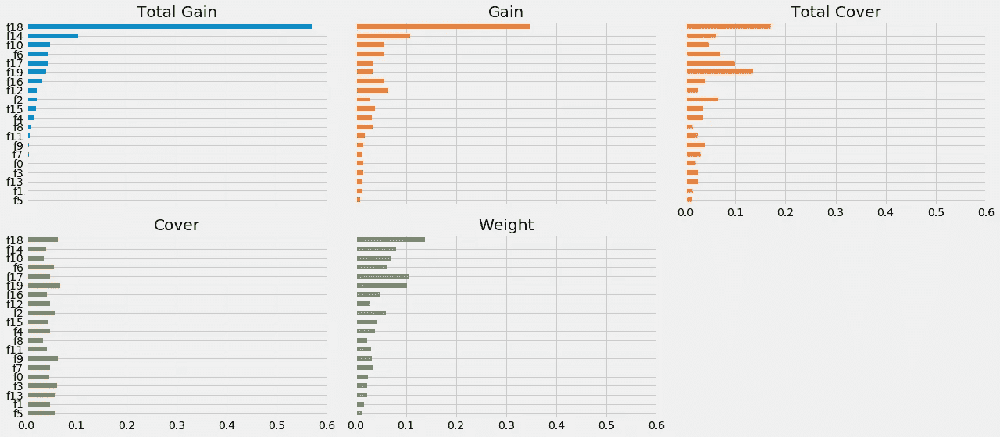

# XGBoost 中“特性重要性”的多面性

> 原文：<https://towardsdatascience.com/be-careful-when-interpreting-your-features-importance-in-xgboost-6e16132588e7?source=collection_archive---------3----------------------->

在 XGBoost 中解释特性的重要性时要小心，因为“特性重要性”的结果可能会产生误导！

这篇文章给出了一个简单的例子，说明为什么理解你的数据是非常重要的，不要盲目地使用你的特征重要性结果，因为由 XGBoost 生成的默认“特征重要性”可能不是你想要的。

The figure shows the significant difference between importance values, given to same features, by different importance metrics.

假设您正在为一个分类问题拟合一个 *XGBoost，将会产生一个重要性矩阵。重要性矩阵实际上是一个表格，第一列包括提升树中实际使用的所有特征的名称，矩阵的其他列是使用不同重要性度量计算的结果“重要性”值[ [3](https://datascience.stackexchange.com/questions/12318/how-do-i-interpret-the-output-of-xgboost-importance) ]:*

**增益**意味着相应特征对模型的相对贡献，该相对贡献是通过取每个特征对模型中每棵树的贡献来计算的。与另一个特征相比，该指标的值越高，意味着它对生成预测越重要。

**覆盖率**指标是指与该特性相关的观察的相对数量。例如，如果您有 100 个观察值、4 个特征和 3 棵树，并且假设特征 1 用于分别为树 1、树 2 和树 3 中的 10、5 和 2 个观察值决定叶节点；则该度量将该特征的覆盖率计为 10+5+2 = 17 次观察。这将针对所有 4 个功能进行计算，覆盖率将为 17，表示为所有功能覆盖率指标的百分比。

**频率(R)/权重(python)** 是表示特定特征在模型树中出现的相对次数的百分比。在上面的示例中，如果 feature1 出现在 2 个拆分中，则 tree1、tree2 和 tree3 中的每一个都有 1 个拆分和 3 个拆分；那么特征 1 的权重将是 2+1+3 = 6。特征 1 的频率计算为其权重占所有特征权重的百分比。

*增益是解释每个特征相对重要性的最相关属性。*

**增益**是一个特征给它所在的分支带来的精度提高。其思想是，在将特征 X 上的新分裂添加到分支之前，有一些错误分类的元素，在将该特征上的分裂添加之后，有两个新分支，并且这些分支中的每一个都更准确(一个分支说如果你的观察在这个分支上，那么它应该被分类为 1，而另一个分支说正好相反)。

**Coverage’**测量一个特征所涉及的观察的相对数量。”[ [3](https://datascience.stackexchange.com/questions/12318/how-do-i-interpret-the-output-of-xgboost-importance)

**为什么理解你的特征重要性结果很重要？**

假设你有一个二元特征，比如说性别，和你的目标变量高度相关。此外，您观察到在训练集中包含/删除该特性会极大地影响最终结果。如果您通过不同的衡量标准来研究此类特性的重要性，您可能会发现一些矛盾之处:

最有可能的是，与数据中的其他预测值相比，变量*性别*的可能值数量要少得多(通常只有两个:男性/女性)。因此，这种二元特征在每个树中最多可以使用一次，同时，比方说， *age(具有更多可能值)*可能会更频繁地出现在树的不同级别上。因此，这种二进制特征将基于频率/权重度量获得非常低的重要性，但是基于增益和覆盖度量获得非常高的重要性！

在 *scikit-learn* 随机森林(或 GradientBoosting)和 XGBoost 中的特征重要性计算之间的比较在 [1](https://forums.fast.ai/t/feature-importance-of-random-forest-vs-xgboost/17561) 中提供。查看 *scikit-lean* 系综的文档，权重/频率特征重要性未实现。这可能表明这种类型的特征重要性不太能表明特征对整个模型的预测贡献。

因此，在使用默认特征重要性函数(即权重/频率)得出的结果之前，花几分钟时间思考一下，确保它有意义。如果没有，也许您应该考虑探索其他可用的指标。

注意:如果您使用 python，您可以通过一行代码访问不同的可用指标:

> **# Available importance _ types =[' weight '，' gain '，' cover '，' total _ gain ']
> f = ' gain '
> xgb classifier . get _ booster()。get _ score(importance _ type = f)**

**参考文献**:

 [## 随机森林与 XGBoost 的特征重要性

### 这两种情况下的特征重要性是相同的:给定一棵树，遍历该树的所有节点，并执行以下操作…

forums.fast.ai](https://forums.fast.ai/t/feature-importance-of-random-forest-vs-xgboost/17561)  [## 为什么 python 中 feature_importance 的默认值是‘weight’，R 却用‘gain’？问题#2706…

### 我通读了文档，注意到在 R-package 部分…

github.com](https://github.com/dmlc/xgboost/issues/2706)  [## 我如何解释 XGBoost 重要性的输出？

### begingroup$感谢 Sandeep 的详细回答。我想纠正一下，保险金额是跨所有拆分计算的…

datascience.stackexchange.com](https://datascience.stackexchange.com/questions/12318/how-do-i-interpret-the-output-of-xgboost-importance)  [## 以随机森林为例解释特征的重要性

### 在许多(商业)案例中，不仅有一个准确的，而且有一个可解释的模型是同样重要的…

towardsdatascience.com](/explaining-feature-importance-by-example-of-a-random-forest-d9166011959e)