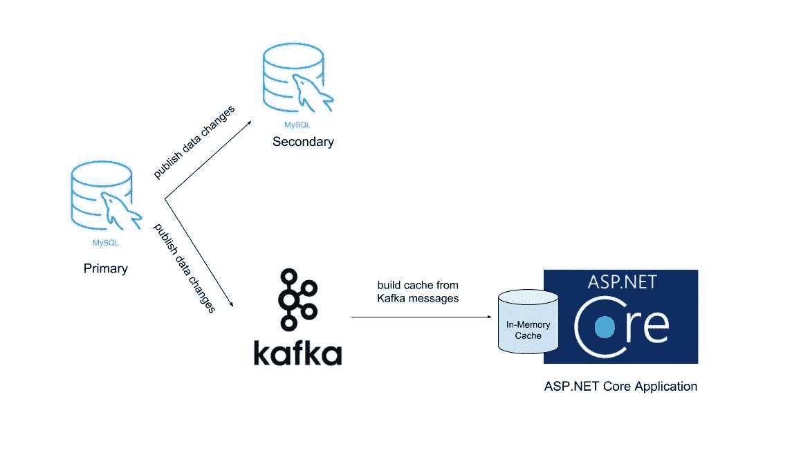
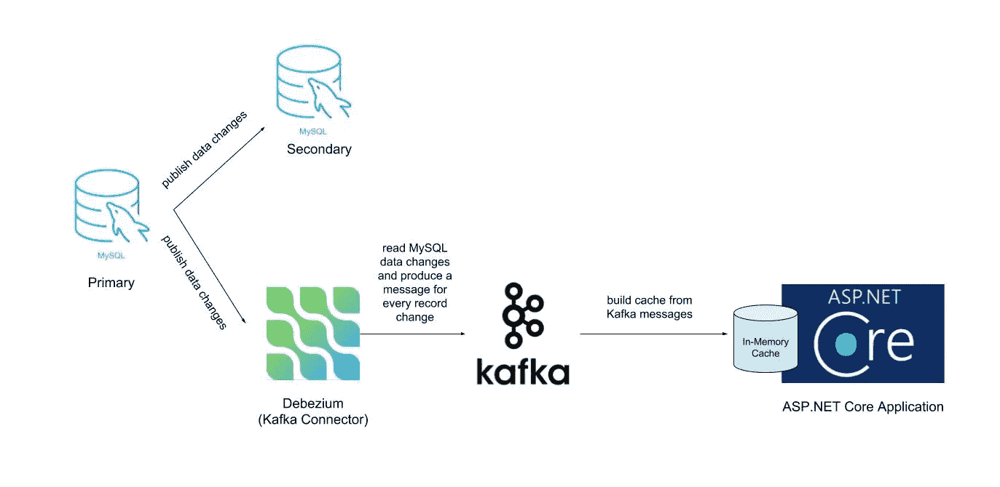

# 使用 Kafka 和 Debezium 的 ASP.NET 核心中的节拍缓存失效

> 原文：<https://towardsdatascience.com/beat-cache-invalidation-in-asp-net-core-using-kafka-and-debezium-65cd1d80554d?source=collection_archive---------7----------------------->

在构建 web 应用程序时，我们大部分时间使用缓存来存储(昂贵的)数据库查询的结果。一段时间后，由于我们的底层数据库状态发生了变化，我们希望删除或替换缓存条目。一个被称为**缓存失效**的过程。问题是*我们什么时候必须移除或替换缓存条目*？答案是每当底层数据库记录发生变化时。但是数据可能会被我们无法控制的过程所改变。

如果我们可以订阅数据库记录发生的任何更改事件(插入、更新和删除),那么我们就可以成功地实时使相关的缓存条目无效。好消息是大多数数据库都会发布它们的插入、更新和移除事件。这项功能称为变更数据捕获(CDC)。

# TL；速度三角形定位法(dead reckoning)

在本文中，我想向您展示我们如何使用 CDC 来订阅任何更改 MySQL 数据库记录的事件，并将每个事件作为单独的消息发布给 Apache Kafka。 [Debezium](https://debezium.io/) 是一个让这一切成为可能的平台。然后，我们使用这些事件在 ASP.NET 核心中构建内存缓存。我们将看到如何基于我们的实时缓存构建我们的 REST API。

这类似于复制在数据库中的工作方式。在复制中，辅助副本订阅主副本上的任何事务(更改事件),并将该事务应用于自己的数据库记录，这样，辅助数据库状态最终将等同于主数据库状态。如图所示，我们将 Kafka 集群订阅为数据库的副本，并处理更改事件以构建我们的缓存:



这种方法不仅解决了缓存失效，还解决了其他问题，如竞争条件和缓存热启动，正如 Martin Kleppmann 在他的文章[Turning the database inside-out](https://martin.kleppmann.com/2015/03/04/turning-the-database-inside-out.html)中所描述的。

这篇文章的源代码可以在 [GitHub](https://github.com/Mousavi310/kafka-cache) 中找到。

# 先决条件

*   。网络核心 2.2
*   docker 和 docker-撰写

# 启动 Docker 服务

我们将使用 Docker 设置我们的 Apache Kafka 集群、MySQL 数据库和 Debezium 连接器(我们将很快讨论它)。首先，用以下内容创建一个`docker-compose.yml`文件:

```
version: '3.1'services:mysql:
    image: mysql:5.7
    environment:
      MYSQL_ROOT_PASSWORD: 123456
      MYSQL_USER: mysql
    volumes:
      - ./my.cnf:/etc/mysql/my.cnf
    ports:
      - 3306:3306zookeeper:
    image: confluentinc/cp-zookeeper
    ports:
      - "2181:2181"
    environment:
      ZOOKEEPER_CLIENT_PORT: 2181kafka:
    image: confluentinc/cp-kafka
    depends_on:
      - zookeeper
      - mysql
    ports:
      - "9092:9092"
    environment:
      KAFKA_ZOOKEEPER_CONNECT: zookeeper:2181
      KAFKA_ADVERTISED_LISTENERS: PLAINTEXT://kafka:9092
      KAFKA_OFFSETS_TOPIC_REPLICATION_FACTOR: 1
      KAFKA_LOG_CLEANER_DELETE_RETENTION_MS: 5000
      KAFKA_BROKER_ID: 1
      KAFKA_MIN_INSYNC_REPLICAS: 1connector:
    image: debezium/connect:0.10
    ports:
      - "8083:8083"
    environment:
      GROUP_ID: 1
      CONFIG_STORAGE_TOPIC: my_connect_configs
      OFFSET_STORAGE_TOPIC: my_connect_offsets
      BOOTSTRAP_SERVERS: kafka:9092
    depends_on:
      - zookeeper
      - mysql
      - kafka
```

[my.cnf](https://github.com/Mousavi310/kafka-cache/blob/master/my.cnf) 文件启用 MySQL 的 CDC 特性。现在启动所有 docker 服务:

```
docker-compose up
```

# 创建 MySQL 数据库

打开同一路径中的另一个终端，连接到 MySQL 容器并运行 MySQL CLI:

```
docker-compose exec mysql bash -c 'mysql -u root -p$MYSQL_ROOT_PASSWORD'
```

现在我们想在 MySQL 中创建一个数据库。运行下面的脚本来创建一个名为`mystore`的数据库，一个名为`products`的表，并在`products`表中插入一个简单的记录:

```
create database mystore;
use mystore;
create table products (id int unsigned auto_increment primary key, name varchar(50), price int, creation_time datetime default current_timestamp, modification_time datetime on update current_timestamp);
insert into products(name, price) values("Red T-Shirt", 12);
```

# 创建 Debezium 连接器

现在，我们希望将 products 表中发生的所有更改都转移到 Kafka。为此，我们必须创建一个**连接器**。连接器是一个应用程序，负责将数据从数据库(或任何其他存储系统)移动到 Kafka 集群(反之亦然)。如果你不熟悉 Kafka connector，你可以阅读[合流文档](https://www.confluent.io/connectors/)。这里我们想将 MySQL 变更事件转移到 Apache Kafka 集群。Debezium 是一个 Kafka 连接器，可以从 MySQL(和其他一些数据库)中读取所有变更事件，并将它们发布到 Kafka:



Debezium 公开了一个 REST API 来创建连接器。因此，要创建一个 Debezium 连接器，打开另一个终端并运行下面的脚本(大部分配置是不言自明的，但要了解更多信息，请阅读 [Debezium MySQL 教程](https://vladmihalcea.com/how-to-extract-change-data-events-from-mysql-to-kafka-using-debezium/)):

```
curl -i -X POST -H "Accept:application/json" -H "Content-Type:application/json" localhost:8083/connectors/ -d '{ "name": "mystore-connector", "config": { "connector.class": "io.debezium.connector.mysql.MySqlConnector", "tasks.max": "1", "database.hostname": "mysql", "database.port": "3306", "database.user": "root", "database.password": "123456", "database.server.id": "223345", "database.server.name": "mysql", "database.whitelist": "mystore", "database.history.kafka.bootstrap.servers": "kafka:9092", "database.history.kafka.topic": "dbhistory.mystore",
"transforms":"unwrap","transforms.unwrap.type":"io.debezium.transforms.UnwrapFromEnvelope","transforms.unwrap.drop.tombstones":"false","key.converter": "org.apache.kafka.connect.json.JsonConverter","key.converter.schemas.enable": "false","value.converter": "org.apache.kafka.connect.json.JsonConverter","value.converter.schemas.enable": "false","include.schema.changes": "false"} }'
```

如果您收到`HTTP/1.1 201 Created`，您的连接器已经成功创建。您还可以检查连接器的状态:

```
curl localhost:8083/connectors/mystore-connector/status{
  "name": "mystore-connector",
  "connector": {
    "state": "RUNNING",
    "worker_id": "172.24.0.5:8083"
  },
  "tasks": [
    {
      "id": 0,
      "state": "RUNNING",
      "worker_id": "172.24.0.5:8083"
    }
  ],
  "type": "source"
}
```

`state`字段中的`Running`值表示您的连接器正在工作。现在让我们检查一下，任何数据库更改都将被同步到 Kafka。首先，连接到 Kafka 容器:

```
docker-compose exec kafka bash
```

并查看主题列表:

```
kafka-topics --zookeeper zookeeper:2181 --list__confluent.support.metrics
__consumer_offsets
connect-status
dbhistory.mystore
my_connect_configs
my_connect_offsets
mysql
mysql.mystore.products
```

`mysql.mystore.products`主题存储`products`表的变更事件。我们可以使用下面的脚本读取该主题中的消息(消息键由`-`分隔):

```
kafka-console-consumer --bootstrap-server kafka:9092 --from-beginning --topic mysql.mystore.products --property print.key=true --property key.separator="-"{"id":1}-{"id":1,"name":"Red T-Shirt","price":12,"creation_time":1553595845000,"modification_time":null}
```

要检查更改是否会(接近)实时同步，请在 MySQL 容器中添加另一条记录:

```
insert into products(name, price) values("Blue Hat", 5);
```

更改将立即显示在用户终端上:

```
{"id":1}-{"id":1,"name":"Red T-Shirt","price":12,"creation_time":1553595845000,"modification_time":null}
**{"id":2}-{"id":2,"name":"Blue Hat","price":5,"creation_time":1553595958000,"modification_time":null}**
```

更新“蓝帽子”记录:

```
update products set price = 17 where name = "Blue Hat";
```

发布更新事件:

```
{"id":1}-{"id":1,"name":"Red T-Shirt","price":12,"creation_time":1553595845000,"modification_time":null}
{"id":2}-{"id":2,"name":"Blue Hat","price":5,"creation_time":1553595958000,"modification_time":null}
**{"id":2}-{"id":2,"name":"Blue Hat","price":17,"creation_time":1553595958000,"modification_time":1553595986000}**
```

删除 id 为 1 的记录:

```
delete from products where id = 1;
```

具有空值的消息将被添加到主题:

```
{"id":1}-{"id":1,"name":"Red T-Shirt","price":12,"creation_time":1553595845000,"modification_time":null}
{"id":2}-{"id":2,"name":"Blue Hat","price":5,"creation_time":1553595958000,"modification_time":null}
{"id":2}-{"id":2,"name":"Blue Hat","price":17,"creation_time":1553595958000,"modification_time":1553595986000}
**{"id":1}-null**
```

空值表示记录被删除。让我们添加一个名为`description`的列:

```
alter table products add column description nvarchar(1000);
```

并更新产品记录:

```
update products set description = "Can be used for the spring!" where id = 2;
```

您将会看到，即使是模式更改也会反映在消息中:

```
{"id":1}-{"id":1,"name":"Red T-Shirt","price":12,"creation_time":1553595845000,"modification_time":null}
{"id":2}-{"id":2,"name":"Blue Hat","price":5,"creation_time":1553595958000,"modification_time":null}
{"id":2}-{"id":2,"name":"Blue Hat","price":17,"creation_time":1553595958000,"modification_time":1553595986000}
{"id":1}-null
**{"id":2}-{"id":2,"name":"Blue Hat","price":17,"creation_time":1553595958000,"modification_time":1553596044000,"description":"Can be used for the spring!"}**
```

注意，一些 RDBMSs 如 SQL Server [不会自动反映 CDC 数据中的模式变化。](https://www.mssqltips.com/sqlservertip/4096/understanding-how-dml-and-ddl-changes-impact-change-data-capture-in-sql-server/)但是 MySQL CDC 支持模式变更。

# 缓存构建器项目

`mysql.mystore.products`主题包含产品表的每次更改。为了构建我们的缓存，我们希望保留每条记录的最新值。为此，我们可以在名为`products.cache`的单独主题中保存每个产品 id 的最新值。我们还创建了一个名为*缓存构建器*的项目，它将读取`mysql.mystore.products`主题中的每条消息，并将它们生成到`products.cache` 主题中。`products.cache`主题是一个压缩的主题，这意味着每个键(在本例中为产品 id)将只包含一条消息。你可以在 [Cloudurable](http://cloudurable.com/blog/kafka-architecture-log-compaction/index.html) 和[我最近的文章](https://medium.com/@mousavi310/log-compacted-topics-in-apache-kafka-b1aa1e4665a7)中阅读更多关于压缩主题的内容。

通过在 Kafka 容器中运行以下脚本，在 Kafka 中创建一个压缩主题:

```
kafka-topics --create --zookeeper zookeeper:2181 --topic products.cache --replication-factor 1 --partitions 1 --config "cleanup.policy=compact" --config "delete.retention.ms=100"  --config "segment.ms=100" --config "min.cleanable.dirty.ratio=0.01"
```

为了从我们的应用程序连接到 Kafka broker，我们还需要将`kafka`主机名添加到`hosts`文件中(只需添加粗体行):

```
sudo vi /etc/hosts
127.0.0.1 localhost
# ...
**127.0.0.1 kafka**
```

创建一个解决方案和 CacheBuilder 项目(你可以在 [GitHub](https://github.com/Mousavi310/kafka-cache) 中看到完整的代码):

```
mkdir src
cd src/
dotnet new sln --name KafkaCache
dotnet new console -o KafkaCache.CacheBuilder
dotnet sln add KafkaCache.CacheBuilder/KafkaCache.CacheBuilder.csproj
```

并安装`Confluent.Kafka`和`Newtonsoft.Json` NuGet 包:

```
dotnet add KafkaCache.CacheBuilder/KafkaCache.CacheBuilder.csproj  package Confluent.Kafka --version 1.0.0-RC1
dotnet add KafkaCache.CacheBuilder/KafkaCache.CacheBuilder.csproj package Newtonsoft.Json --version 12.0.1
```

这里您可以看到 Program.cs 代码:

这是 ProductKey 类:

在 Program.cs 中，我们只是从`mysql.mystore.products`主题中读取消息，提取产品 id 字段并创建另一条消息，然后将其发布到`products.cache`主题。现在运行 CacheBuilder 项目(在单独的终端中):

```
dotnet run --project KafkaCache.CacheBuilder/KafkaCache.CacheBuilder.csproj
```

您可以在 Kafka 容器中查看该主题:

```
kafka-console-consumer --bootstrap-server kafka:9092 --from-beginning --topic products.cache
```

# Web API 项目

我们创建一个 Web API 项目，它将公开简单的 REST API 来获取产品的详细信息(从缓存中检索)。此外，该项目负责消费来自`products.cache`主题的缓存条目，并将它们存储在内存缓存中。运行以下脚本创建项目:

```
dotnet new webapi -o KafkaCache.Api
dotnet sln add KafkaCache.Api/KafkaCache.Api.csproj
```

安装`Confluent.Kafka`和`Newtonsoft.Json`包:

```
dotnet add KafkaCache.CacheBuilder/KafkaCache.CacheBuilder.csproj  package Confluent.Kafka --version 1.0.0-RC1
dotnet add KafkaCache.CacheBuilder/KafkaCache.CacheBuilder.csproj package Newtonsoft.Json --version 12.0.1
```

启用`Startup`类中的内存缓存:

```
services.AddMemoryCache();
```

这允许我们使用`IMemoryCache` ，它用于在 ASP.NET 内核的内存中存储和检索缓存条目。为了填充这个缓存，我们需要一个`CacheUpdater`类，负责消费来自`products.cache`主题的消息并更新我们的内存缓存:

还有`ProductItemCache`类:

注意，我们有一个负责更新缓存的 Run 方法。该方法接收一个`returnOnLastOffset`参数，该参数用于返回关于该主题的最后一条消息。如果它有`true` 值并且我们在主题/分区的末尾，我们从方法返回。这在启动过程中非常有用，因为我们希望在处理任何 REST API 请求之前预热缓存。我们现在在应用程序初始化中使用`CacheUpdater`:

如上所示，我们调用了两次`CacheUpdater.Run`方法。首先用于预热缓存，其次用于运行后台作业以连续读取`products.cache`主题并更新内存缓存。

最后，这是我们的控制器，它直接服务于来自缓存的请求:

现在运行 API 项目:

```
dotnet run --project KafkaCache.Api/KafkaCache.Api.csproj
```

并检查您的 API:

```
curl -k [https://localhost:5001/api/products/2](https://localhost:5001/api/products/2)
{"id":2,"name":"Blue Hat","price":17}
```

让我们更改 MySQL 容器中 id 为 2 的产品的价格:

```
update products set price = 56 where id = 2;
```

并再次请求您的 API:

```
curl -k [https://localhost:5001/api/products/2](https://localhost:5001/api/products/2)
{"id":2,"name":"Blue Hat","price":56}
```

如你所见，任何变化都会立即反映到我们的缓存中！

# 结论

使用 CDC，我们可以将数据库的变化近乎实时地反映到 Kafka 中。然后，我们可以通过消费卡夫卡的信息来创建内存缓存。现在我想指出这种方法的一些优点和缺点。

**优点:**

*   减轻实现缓存中的 3 个问题:缓存失效、竞争条件和热启动性能。
*   将数据库更改实时同步到缓存。
*   由于顺序 IO，缓存预热速度更快(从 Kafka 主题中读取消息)。

**缺点:**

*   更复杂:您需要实现缓存构建器，使用 Debezium 连接器，为数据库启用 CDC，并从 Kafka 集群读取事件。
*   需要监控 Kafka，连接器和缓存生成器。
*   需要更多的知识:新开发人员必须学习更多的框架。

# 参考

[https://vlamihalcea . com/how-to-extract-change-data-events-from-MySQL-to-Kafka-using-debezium/](https://vladmihalcea.com/how-to-extract-change-data-events-from-mysql-to-kafka-using-debezium/)
[https://github . com/confluent Inc/demo-scene/blob/master/ksql-workshop/ksql-workshop . adoc](https://github.com/confluentinc/demo-scene/blob/master/ksql-workshop/ksql-workshop.adoc)
[https://Martin . kleppmann . com/2015/03/04/turning-the-database-inside-out . https](https://martin.kleppmann.com/2015/03/04/turning-the-database-inside-out.html)