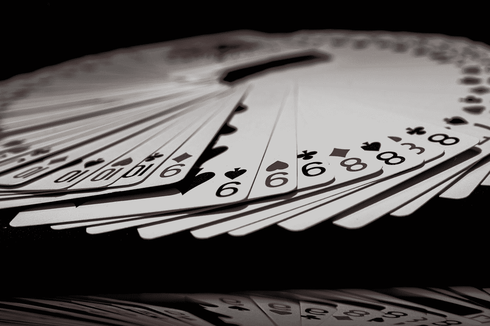
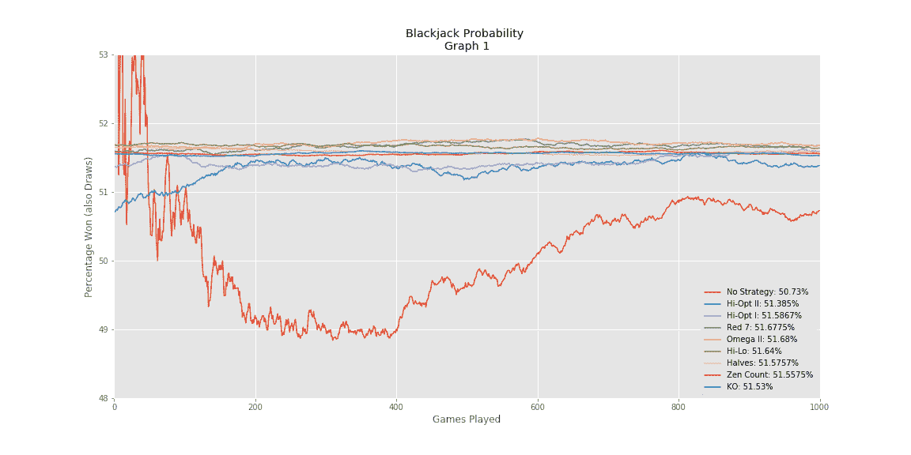
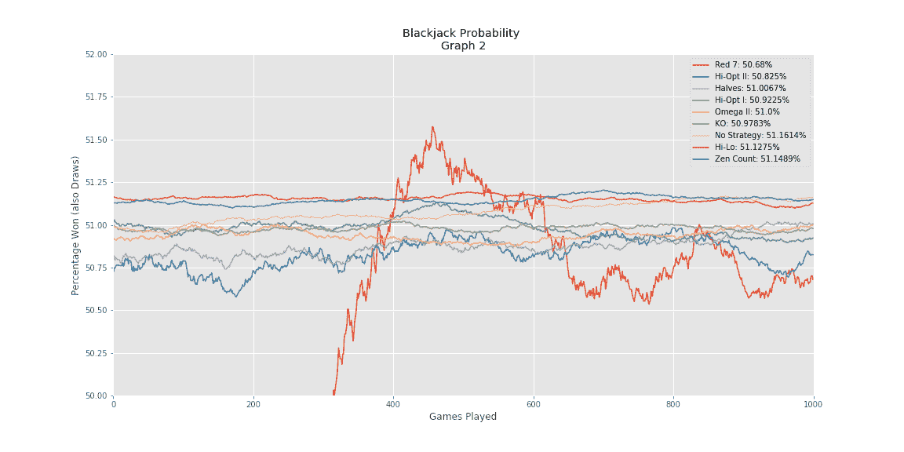
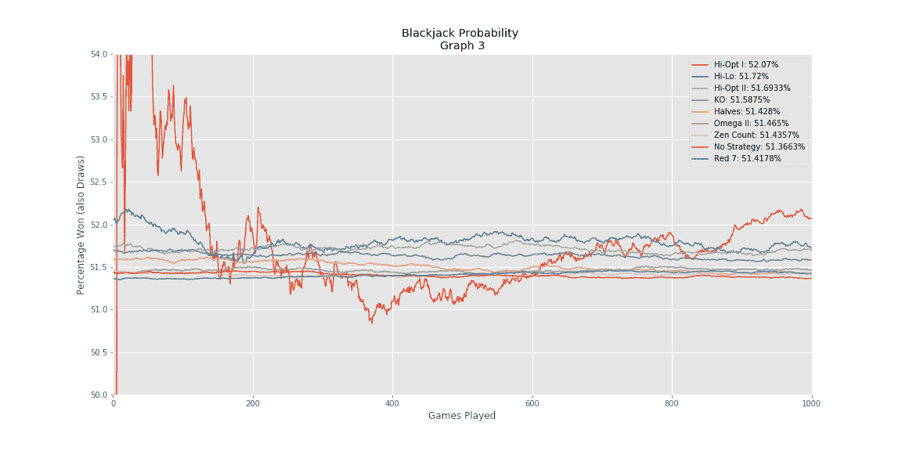

# 用 Python 编程能打败 21 点吗？

> 原文：<https://towardsdatascience.com/beating-the-dealer-with-simple-statistics-71b5e3701638?source=collection_archive---------10----------------------->

## 使用数据科学工具模拟数千种 21 点纸牌计数策略

Photo by [Jarosław Kwoczała](https://unsplash.com/@sumekler?utm_source=medium&utm_medium=referral) on [Unsplash](https://unsplash.com?utm_source=medium&utm_medium=referral)

拉克杰克是在赌场玩的最简单的游戏之一。也是最容易学的游戏之一。目标很简单；在不超过的情况下，尽可能接近 21 的值。你要么打败庄家，要么输给庄家，要么和庄家打成平手。21 点的结果非常简单。然而，这些结果的权重完全取决于你，因为你可能在一手牌中输掉很多钱。没有人想输，而在 21 点中输钱会有多痛取决于你的赌注大小。为了提高赌场或赌场的赔率，21 点玩家开发了许多算牌策略来降低他们失败的几率。

## 在 21 点中使用算牌

算牌一开始可能显得很难，但实际上相当简单。算牌的概念包括给一副牌中的每张牌赋值，例如 *+1* 、 *-1* 或 *0* 。然后，将它们加在一起，这个总值就变成了**计数**。根据**计数**是高还是低，算牌者使用这个**计数**来确定是*击中*还是*停留*。存在许多不同的算牌策略，这些策略为每张牌实现不同的值。例如，一种策略可能会将 Ace 计为 *-1* ，而另一种策略会将其计为 *0* 。除了卡的价值之外，这些策略之间还有很多不同之处，但我们无法涵盖所有这些。需要注意的是，这些算牌策略最多给玩家 0.5%的优势。对于 21 点游戏来说，这就是全部。

那么，如果我们想在我们的 21 点游戏中实施算牌策略呢？我们应该选择哪一个？嗯，我们可以做的一个选择是自己实施每个策略，去玩几次 21 点，然后记录结果。这种选择可能非常耗时，并且在实际显示策略的可能性和有效性时不准确。另一种选择可以是编码一个 21 点游戏，模拟该游戏，然后在期望的模拟次数后记录结果。为了确定最有效的算牌策略，我们将展示这个选项。

> 在这里注册一个中级会员，可以无限制地访问和支持像我这样的内容！在你的支持下，我赚了一小部分会费。谢谢！

# 用 Python 构建 21 点

让我们开始模拟 21 点的旅程，用 Python 编写全部代码。为了简洁起见，我们不会仔细检查每一行代码，但是代码的 Github 将在本文末尾提供。很有可能以前有人做过类似的事情，甚至可能做得更好，但不管怎样，让我们试一试。

首先，为了模拟一个 21 点游戏，我们需要编写一个 21 点游戏代码，其中包含所有必要的规则和规定。为了简单起见，我们将省略掉诸如*分割*、*加倍* *向下*、*投降*等选项。让我们把玩家选项限制在*击中*或*停留*。此外，由于我们衡量的是赢与输，我们可以消除下注的需要。然而，在普通的 21 点游戏中，知道下注的大小是很重要的。

## 创建函数

让我们首先构建几个函数来帮助我们的 21 点游戏正常运行:

Source: [https://gist.github.com/marcosan93/c0d0b41748bb515d7110cd3efccc165f](https://gist.github.com/marcosan93/c0d0b41748bb515d7110cd3efccc165f)

每个功能都有一个运行游戏的重要目的。为了模拟一副扑克牌的创建，我们创建了`create_deck()`函数，它结合了`random`来“洗牌”我们创建的牌列表。发一张牌在`deal_card()`中处理，它通过使用`.pop()`方法添加一张新牌，以模仿从一副牌中发一张牌。在玩家或庄家超过 21 时，`check_ace()`功能会将 ace 的值从 11 重新分配到 1。这些可能是上面提到的最值得注意的功能，但这并不意味着游戏可以在没有其他功能的情况下运行。

## 经销商职能

Source: [https://gist.github.com/marcosan93/7fc6f3c3a4de4ccc36d4405a0df8618c](https://gist.github.com/marcosan93/7fc6f3c3a4de4ccc36d4405a0df8618c)

如果玩家决定*留在*，此`dealer_turn()`功能将向庄家发牌。这个功能遵循每个 21 点庄家的规则。它会一直交易，直到庄家达到 17 到 21 之间的值，或者直到庄家破产。它最终将庄家的手牌与玩家的手牌进行比较，以确定谁赢了。

## 创建纸牌计数值

接下来，为了在游戏中算牌，我们创建了一个**熊猫数据框架**，其中包含不同的算牌策略以及每张牌的具体值:

Source: [https://gist.github.com/marcosan93/d2723710932b9d52b6c0dceda2a8dd96](https://gist.github.com/marcosan93/d2723710932b9d52b6c0dceda2a8dd96)

在这段代码中，为了创建纸牌计数值的数据帧，我们导出了数据帧的一部分供以后使用。确保这个 *pickle* 文件与 21 点代码在同一个文件夹中，以便它能够正常运行。

然后，我们添加了算牌功能，以便在游戏运行时跟踪**的计数**:

Source: [https://gist.github.com/marcosan93/ad0cb4b62f27749d06ec83d267e7fb31](https://gist.github.com/marcosan93/ad0cb4b62f27749d06ec83d267e7fb31)

这些函数跟踪整个游戏中每一轮 21 点的计数。`card_counter()`跟踪运行计数，`true_counter()`跟踪真实计数，这是玩家用来决定是否*击中*或*停留*。

## 玩 21 点

现在我们已经准备好了所有的功能，我们可以运行 21 点。代码将允许玩家输入，所以我们可以尽情地玩游戏。请随意在您自己的终端或 IDE 中测试 21 点游戏。

这个游戏有两个版本:

*   [**二十一点不算牌**](https://github.com/marcosan93/Blackjack_Simulator/blob/master/blackjack.py)
*   [**带算牌的二十一点**](https://github.com/marcosan93/Blackjack_Simulator/blob/master/Playing_Blackjack_w_Counter.py)

# 模拟 1000 场 21 点游戏

现在我们已经有了一个 21 点游戏的代码并准备好了，我们终于可以开始用不同的算牌策略模拟 21 点游戏 1000 次了。通过模拟各种不同的策略，我们可以缩小首选的算牌方法，以尽可能最好的方式使我们受益。然而，我们必须降低对每项战略的期望。我们重申，据报道，每个策略每轮都给玩家 0.5%的优势。不要期望每场比赛都赢 60%或更多。

现在让我们开始模拟。为了用我们的代码模拟 21 点游戏，我们将不得不修改我们以前的 21 点代码，以弥补玩家输入的不足。为了弥补这一点，我们将以条件的形式输入一些预编程的决策，这些决策将基于计数和其他一些类似于庄家的基本规则来做出决策。

Source: [https://gist.github.com/marcosan93/550f4643980a0b696f2cf4bf5477f770](https://gist.github.com/marcosan93/550f4643980a0b696f2cf4bf5477f770)

`player_move()`功能负责在*击中*或*停留*之间进行选择。这个函数可能需要一些调整，以更好地改善以后的结果。有了这个处理，我们可以继续模拟游戏。我们通过将玩 21 点游戏的函数输入一个循环来开始模拟，该循环将遍历一系列策略，然后用每种策略玩 1000 次游戏。我们记录了每场比赛的最后 10 轮，以捕捉每种策略的有效性，因为这些回合将有一个体面的计数，从中可以做出决定。

Source: [https://gist.github.com/marcosan93/28f84b9ba591b78e95ee08fcb8a5e8d8](https://gist.github.com/marcosan93/28f84b9ba591b78e95ee08fcb8a5e8d8)

最后，我们模拟了超过 1000 场 21 点游戏，每一种不同的策略都列在**熊猫数据框**中。我们打乱了要模拟的策略的顺序，以进一步增加随机性。此外，我们在赢的游戏中加入了和棋，因为在 21 点中和棋不会导致只和庄家对弈时输钱。现在，我们只需要把模拟结果用图表表示出来。这可以通过使用 **Matplotlib** 以线形图格式绘制每个策略的结果来完成。

Source: [https://gist.github.com/marcosan93/7185c6549128fc329337d027f4a3e16c](https://gist.github.com/marcosan93/7185c6549128fc329337d027f4a3e16c)

运行这段代码将得到下面的图形:

Probability results for each strategy

瞧啊。看起来大多数算牌策略都有相似的结果，但是它们似乎都比没有策略要好。我们为什么不再次进行模拟以确保:

看起来，无论在模拟中首先运行的是什么策略，在开始时都会产生非常不同的值。让我们再运行一次，试着平衡结果:

因此，我们的观察是正确的，我们假设无论哪种策略首先运行都会导致不稳定的不同值。但是每种策略的总体结果都非常相似。

如果您想改善或改变结果，那么您可能需要改变`player_move()`函数中的条件逻辑。

# 结束语

正如前面的图表所示，每种策略都能为经销商提供可观的优势。实施这些策略中的任何一个似乎都足以让你比赌场或赌场更有优势。在没有任何策略的情况下，也可以选择坚持一套严格的规则。这似乎也提供了一个体面的成功百分比，只要该战略是遵循没有偏差。

应该注意的是，我们不赞成赌博作为一种赚钱的方法。但是，算牌可以给你带来优势，你选择坚持哪种策略真的无关紧要。但是，要知道这些模拟是用基本的*击中*或*停留*决策完成的，其中一些策略实际上考虑了下注大小和其他因素。另外，请知道这些模拟和结果是用相对简单的 Python 方法和工具制作的。总而言之，祝那些决定使用这些策略的人好运！

[*在 Twitter 上关注我:@_Marco_Santos_*](https://twitter.com/_Marco_Santos_)

## Github:

 [## Marcos an 93/21 点 _ 模拟器

### 此时您不能执行该操作。您已使用另一个标签页或窗口登录。您已在另一个选项卡中注销，或者…

github.com](https://github.com/marcosan93/Blackjack_Simulator) 

***注来自《走向数据科学》的编辑:*** *虽然我们允许独立作者根据我们的* [*规则和指导方针*](/questions-96667b06af5) *发表文章，但我们不认可每个作者的贡献。你不应该在没有寻求专业建议的情况下依赖一个作者的作品。详见我们的* [*读者术语*](/readers-terms-b5d780a700a4) *。*