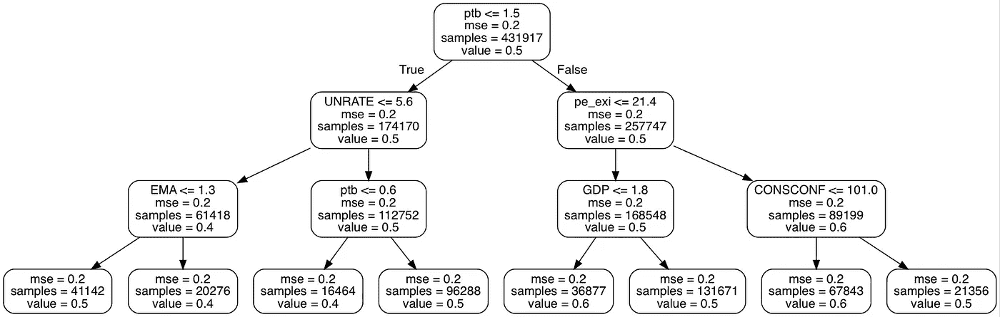
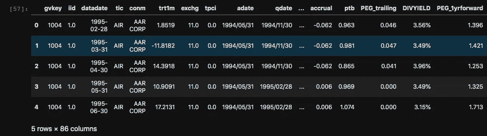
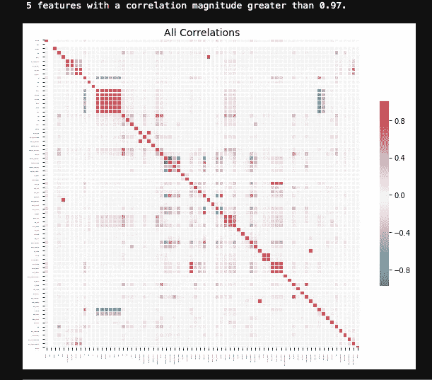
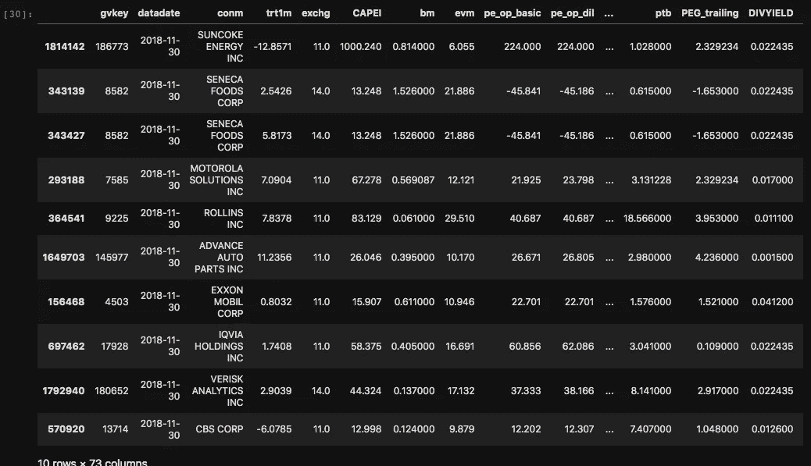
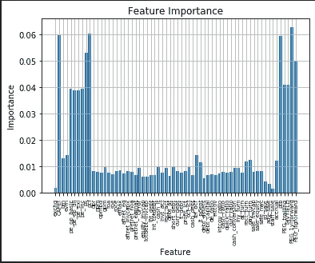
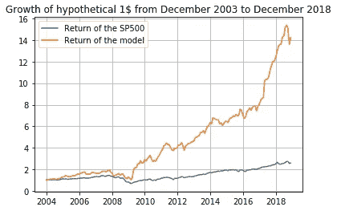

# 用机器学习打败 S&P500

> 原文：<https://towardsdatascience.com/beating-the-s-p500-using-machine-learning-c5d2f5a19211?source=collection_archive---------6----------------------->

## 使用随机森林回归在 15 年内产生 1400%的回报


*The “Fearless Girl” statue on Wall Street.* Photo by [Robert Bye](https://unsplash.com/@robertbye?utm_source=unsplash&utm_medium=referral&utm_content=creditCopyText) on [Unsplash](https://unsplash.com/s/photos/wall-street?utm_source=unsplash&utm_medium=referral&utm_content=creditCopyText).

标准普尔 500 指数是最受关注的市场指数之一，通常被用作整个美国股票市场的基准。虽然人们可以考虑投资一只复制标准普尔 500 指数的被动型基金，但许多人会转向基金经理，更喜欢投资主动型基金。不幸的是，越来越多的研究和数据表明，“跑赢市场”(跑赢基准)非常困难。你可以去[这里](https://www.cnbc.com/2017/02/27/active-fund-managers-rarely-beat-their-benchmarks-year-after-year.html)和[这里](https://www.aei.org/carpe-diem/more-evidence-that-its-very-hard-to-beat-the-market-over-time-95-of-financial-professionals-cant-do-it/)阅读更多关于这个主题的内容，伯顿·g·马尔基尔的这本优秀的书也值得推荐。**这些研究的结论之一是，在截至 2018 年 12 月的 15 年期间，美国积极管理的股票基金中有 91.62 %** **跑输了标准普尔 500 指数。**

在这篇文章中，提出了一种基于机器学习的系统方法，它能够大大超过同期的标准普尔 500。

***来自《走向数据科学》编辑的提示:*** *虽然我们允许独立作者根据我们的* [*规则和指导方针*](/questions-96667b06af5) *发表文章，但我们并不认可每个作者的贡献。你不应该在没有寻求专业建议的情况下依赖一个作者的作品。详见我们的* [*读者术语*](/readers-terms-b5d780a700a4) *。*

## 目标和方法

用 Python 编写的机器学习算法旨在预测 S&P 1500 指数中哪些公司的月度表现可能优于标准普尔 500 指数。为此，实施了基于随机森林回归的算法，将 S&P 1500 指数所有成分的财务比率作为输入。本项目中使用了以下工作流程:

1.  数据采集和准备
2.  数据清理
3.  特征选择
4.  训练和回溯测试随机森林回归器

> *请注意，本项目中使用的数据集来自专有来源(标准普尔和彭博)，因此无法公布。因此，我们将跳过本文中的步骤 1。那些通过所需订阅访问数据集的人可以参考托管在以下 Github 项目上的完整笔记本: [SP1500StockPicker](https://github.com/ThomasRochefortB/SP1500stockPicker) 。

## 随机森林集成学习方法

[随机森林方法](https://en.wikipedia.org/wiki/Random_forest)基于多个决策树。单个决策树是通过自顶向下的方法构建的，其中数据集遵循基于变量值的一系列布尔分裂，这些布尔分裂在每个节点产生最精确的分离。每个唯一的决策树都是在带有替换的训练集的不同样本上训练的(意味着样本被替换到更大的数据集中)。随机森林回归将多个决策树平均在一起以发出预测。这篇文章不会太深入这个技术的细节，但是在这些由[普拉尚特古普塔](/decision-trees-in-machine-learning-641b9c4e8052)和[乔治赛夫](/a-guide-to-decision-trees-for-machine-learning-and-data-science-fe2607241956)撰写的优秀文章中可以找到更多关于随机森林方法的信息。



An example of a tree with 3 different splits.

## 工作台

以下代码是在 Jupyter 笔记本上用 Python 写的。JupyterHub 环境用于在计算服务器上托管代码。大多数数据操作都是使用 [Pandas](https://pandas.pydata.org/) 和 [NumPy](https://numpy.org/) 库完成的。机器学习算法基于广泛的 [Scikit-learn](https://scikit-learn.org/stable/) 库。对于代码某些部分的并行化，使用了 Python 的[多重处理](https://docs.python.org/3/library/multiprocessing.html)包。最后，特征选择过程基于[特征选择器](https://github.com/WillKoehrsen/feature-selector)包。

Python 的优点之一是大量的包和库是开源的，任何人都可以使用。利用现有工具的能力来创建创新的解决方案，可以快速高效地解决问题。

## 数据清理

起始数据集由 86 个变量组成。下图简要介绍了前 5 个条目:



Head of the database.

下表显示了一些最重要的变量。其他变量都在 [Github repo](https://github.com/ThomasRochefortB/SP1500stockPicker/blob/master/variables.txt) 的“variables.txt”文件中定义。

使用下面的 *pandas* 命令，我们可以看到每个变量有多少个缺失条目:

```
dataset.isna().sum()

trt1m                5141
exchg                   0
tpci                    0
adate                 441
qdate                   0
public_date             0
CAPEI                2332
bm                   4764
evm                  1942
pe_op_basic          9984
pe_op_dil           74009
pe_exi              10594
pe_inc              10261
ps                    475

roe                  5294
roce                 3336
                    ...  
dltt_be              5698
debt_assets           532
debt_capital         5328
de_ratio              535
intcov              63530
intcov_ratio        63542
cash_ratio          56652
quick_ratio         56634
curr_ratio          56635

sprtrn                  0
win                     0
decision_date           0
SP1500                  0
Length: 86, dtype: int64
```

我们可以看到一些变量有大量的缺失条目，知道数据帧的总长度是 413 012 个条目。为了解决这个问题，采取了以下步骤来清理数据:

1.  遗漏股票月度回报的行被删除，因为我们不能交易遗漏的回报。
2.  超过 50%的行为空的变量被删除。
3.  对于缺失的财务比率，我们使用来自 *Scikit-learn* 的 SimpleImputer 包，用整个数据库的变量平均值替换缺失值。这种方法非常懒惰，会给数据增加建模错误。更合适的方法是使用每种特定股票 n 个月的平均值。尽管如此，还是使用了惰性方法，下面的代码总结了这里列举的 3 个步骤。

```
#Dropping rows with now "trt1m" values:database = database[np.isfinite(database['trt1m'])]# Dropping columns with more than 50% of the rows missing:database = database.loc[:, database.isnull().mean() < .5]#Looping through the variables to replace NaNs with the average:imp=SimpleImputer(missing_values=np.nan, strategy="mean" )
impute_columns=database.columns[database.isna().any()].tolist()for i in impute_columns:
    database[i] = imp.fit_transform(database[[i]])
```

采取了辅助步骤来完成清理过程，可以在本文结尾插入的完整笔记本中查找，或者在我的 Github 上托管。

## 特征选择

使用了来自 [WillKoehrsen](https://github.com/WillKoehrsen/feature-selector) 的包特征选择器。你可以在这里阅读他的文章[，全面了解它的功能。](/a-feature-selection-tool-for-machine-learning-in-python-b64dd23710f0)

基本上，特征选择算法将有助于识别无意义的(低重要性)和共线的特征，以便从不必要的数据变量中修剪起始数据集。移除那些共线变量将减少来自没有贡献的条目的数据集，从而加快整体机器学习过程。当试图识别变量之间的非线性关系时，这种特征选择也将有助于提高算法的泛化能力。

使用 feature_selector 包识别高度相关的要素并打印出相关矩阵非常简单:

```
fs.identify_collinear(correlation_threshold=0.975)
fs.plot_collinear(plot_all=True)
```



Correlation matrix for the different variables.

从上面的图中，我们可以看到一些特征具有高相关性(更红),并且通过该函数识别了相关性高于 0.975 的 5 个特征。

接下来，我们想要识别重要性为零的特征。这些特征将不用于分割决策树的任何节点，因此可以被移除以减少训练时间。feature_selector 包从 [LightGBM](https://lightgbm.readthedocs.io/en/latest/) 库中实现了一个渐变增强机器。该函数将对 10 次训练运行的特征重要性进行平均，以减少方差。

```
fs.identify_zero_importance (task = 'regression', eval_metric = 'auc', n_iterations = 10, early_stopping = True)1 features with zero importance after one-hot encoding.
```

低重要性特征也可以用 feature_selector 包来标识。该方法使用来自零重要性特征选择的结果来识别不需要获得 99%的总重要性的特征。

```
fs.identify_low_importance(cumulative_importance = 0.99)69 features required for cumulative importance of 0.99 after one hot encoding.
5 features do not contribute to cumulative importance of 0.99.
```

现在，我们可以从上述 3 个步骤中移除所有选定的特征，以获得最终的数据框:

```
all_to_remove = fs.check_removal()
database = database.drop(columns = all_to_remove)Total of 9 features identified for removal:
['ptpm', 'tpci', 'debt_invcap', 'debt_ebitda', 'opmad', 'aftret_equity', 'dltt_be', 'cfm', 'capital_ratio']
```

## 机器学习算法

本节介绍的机器学习算法将预测整个月最有可能跑赢 S&P500 的股票。预测将在指定月份的第一天进行。我们还希望能够在不同时期对算法进行回溯测试，以验证模型的性能。我们将定义一个名为“rfstockpicker_backtest”的函数，它将包含以下条目:

该函数的第一部分获取决策日期并标识前一个月。然后，它会创建一个范围从上个月到 7 年前的训练集。选择这个持续时间是因为我们知道过去 33 个经济周期的平均持续时间是 56 个月。目前的扩张周期已经持续了 10 年。7 年的时间让我们可以为我们的每个训练集获得大约一个完整的经济周期。测试集将是我们希望发出预测的月份。我们将使用一个基本的迭代，一个月接一个月地回溯，以便进行几个月的回溯测试。在每次迭代中实例化我们的变量可以确保没有信息及时传播回来(详细信息请参见完整代码)。

在删除用于训练和测试的非必要数据后，该函数从 [*sklearn*](https://scikit-learn.org/stable/) 库中实例化 aRandomForestRegressor 对象，并使用作为输入参数提供的树的数量(n_estimators)和可用进程(n_jobs)对其进行初始化。然后，该函数在训练集上训练算法，并在测试月对 SP1500 的每只股票发出预测。

函数的最后一部分返回各种要素的重要性，以供进一步分析。

例如，可以测试 2018 年 12 月的函数:

```
results,feature_imp,importances,train_feature_list=rfstockpicker_backtest(database,("2018-12-01"),7,1,100,24)
```

对“rfstockpicker_backtest”函数的调用将返回以下信息:

例如，假设每个月，决定买入跑赢指数几率最高的前 10 只股票。可以使用以下命令显示这些内容:

```
portfolio=results[0].nlargest(10, 'predictions')
portfolio
```



The 10 stocks with the highest probability of beating the SP500 for December 2018.

用相等的权重对这些回报率进行平均(算术平均)得出 2018 年 12 月的回报率为 **2.09%** ，相比之下，同期的 SP500 回报率为**1.79%**。

可以通过查看特征重要性来改进该模型:



虽然在该图中，许多特征被压缩在 x 轴上，但是仍然可以看出其中一些特征具有非常低的重要性。重要性低于 0.02 的要素可以使用以下命令移除:

```
df_importance = pd.DataFrame(feature_imp, columns = ['Feature', 'Importance']) 
feature_to_drop=df_importance.Feature[df_importance['Importance']<0.02]
new_db=database.drop(columns=feature_to_drop)
```

这个新数据库允许我们增加 2018 年 12 月的月度回报率，回报率为 **3.57%，**提高了 **+1.48%。**

现在让我们从 2003 年 12 月到 2018 年 12 月，对我们的模型进行 15 年的回溯测试:

```
results,feature_imp,importances,train_feature_list=rfstockpicker_backtest(new_db,("2018-12-01"),7,(12*15),100,24)
```

主迭代循环将于 2018 年 12 月开始，并在 12*15 或 180 个月的时间内回溯 1 个月，以覆盖整个回溯测试期。在 180 个月的测试期内，我们的模型获得了**+1421%****的复合回报，相比之下，实际 SP500 指数的复合回报为 **+261 %** 。**因此，该模型在 15 年期间产生了+1160%的超额回报。****

****

**Growth of 1$ over the 15 year period.**

## **结束语**

**为了简化项目，提出了三个主要假设:**

1.  **前一个月买入的每只股票都被卖出，每个月测试 10 只新股票。因此，有可能一只股票在月末被卖出，然后第二天又被买入。**
2.  **没有考虑交易成本，这将影响模型的复合回报。在测试的每个月中，有 10 只股票被买入，10 只股票被卖出。**
3.  **没有考虑股息，这也将影响模型的复合回报。**

**代码中还可以实现许多改进。其他机器学习技术和神经网络将在以后的文章中探讨。敬请期待！**

**如果你有任何意见或问题，欢迎写在下面！我会尽我所能回答他们。这篇文章的代码可以从项目的 [Github Repo 的 Jupyter 笔记本中获得。](https://github.com/ThomasRochefortB/SP1500stockPicker)**

**感谢您的宝贵时间！**