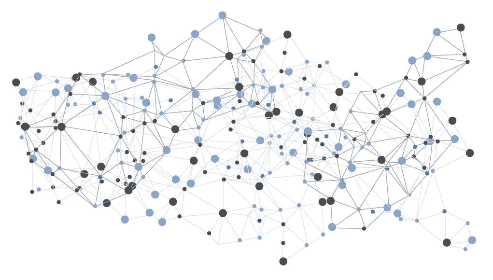
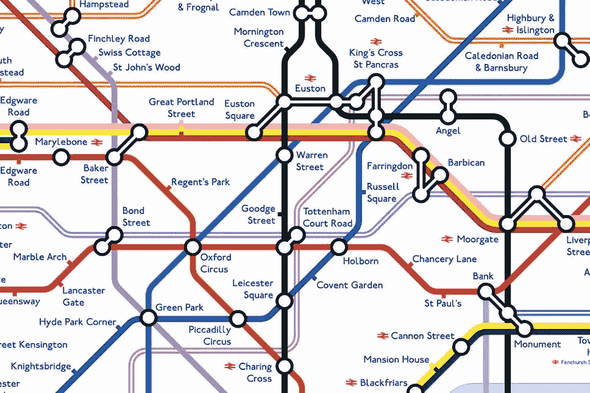
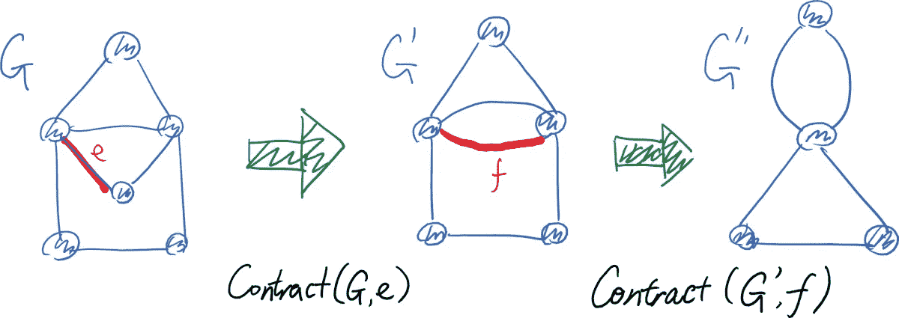

# 卡尔格算法之美:图中蒙特卡罗的随机性

> 原文：<https://towardsdatascience.com/beauty-of-kargers-algorithm-6de7e923874a?source=collection_archive---------13----------------------->

## 回到镇上的 Karger 算法(带 Python 代码)

## 分而治之！这是历史上多年来广泛使用的策略。但是怎么分呢？一般来说，最直观的方法是在系统、网络甚至人群中寻找具有最低亲和力或链接级别的片段！所以，我们开始吧！

你准备好分割切片了吗？让我们从网络开始。我们喜欢密集的网络，否则，即使只有一条边或一条线断开，网络的很大一部分也可能会瘫痪——这绝对不是我们想要的！网络中通常存在集群，即不均匀分布的段。当有效地处理这些片段或“簇”的分离时，我们寻找它们之间的边，使得边的数量最小。

[Polygon Mesh](https://conceptartempire.com/polygon-mesh/)

我们可以将同样的论点应用于其他领域，例如“图像分割”。如果你想把一幅图像分割成几个片段，最简单的方法是用低相似度，也就是最少的切割次数来断开链接。想象一个多边形网格。多边形网格是组成 3D 对象的顶点、边和面**T3 的集合。断开低相似度的图片链接可以给你不同的图片。**

还想到地下线路！这么多节点(站)和边(铁路)！如果你想把地铁系统一分为二，最少要断开多少条线路？

如你所见，有许多现实生活中的小问题。我们如何处理它们？传统算法是“最大流最小割”。它是确定性的，这意味着当我们应用这个算法时，我们 100%的时间都得到正确的最小割！没有失败概率！缺点是 100%的保证是有代价的:非常慢。运行时间最多为 O(顶点数*边数的平方，因此时间复杂度大约为 n 倍。

有许多聪明的算法，它们的运行时间非常快，为 O(n ),但在我看来，没有一个算法，即使是最优秀的算法，设计得像 Karger 的算法一样优雅，它在一个图形问题中使用“随机采样”!！

如果您熟悉快速排序算法，那么您已经知道随机抽样在排序和搜索中的有效性。90 年代初的一名博士生 David Karger 利用图问题中的随机性设计了最小割情形的随机收缩算法。作为一种蒙特卡罗算法，Krager 算法提供了一种具有一定(尽管很小)概率的解决方案，比最大流最小割算法快得多。

[*Picturing contraction of edges*](http://tcs.nju.edu.cn/wiki/index.php/高级算法 _(Fall_2019)/Min-Cut_and_Max-Cut)

假设我们有一个无向图 G = (V，E)。为了以尽可能少的切割将连通图 G 切割成两个连通子图，算法基本上使用了边的**收缩**。要实现它，应该把边两边的两个顶点拉在一起。

我们用伪代码实现算法如下:

现在问题来了:*成功的概率有多大？*

在具有 n 个顶点的图中，**Karger 算法的单次运行**给出成功概率为 1 / (n 选择 2)且运行时间为 O(n)的结果。不坏，但一个人需要幸运地在第一次运行中找到最小切割边缘。

做**多跑**可以增加成功的概率。如果我们运行卡格的算法 **n** 次，我们没有得到最小割的失败概率是 1/e .一个常数！不取决于顶点数！

但是，如果我们运行 Karger 的算法 **n ln (n)** 次，这被视为最优值，那么 **P(失败)< = 1/n** ， **P(成功)>= 1–1/n**，这意味着随着你得到越来越大的图，Karger 的算法成功的概率变得越来越好！所以，在一个有 50 个节点的图中，如果我们运行算法 10000 次左右，成功的概率是 98%！！

如此高的 98%的成功率是有代价的。运行时间是 n(顶点数)和 m(边数)的多项式，相当慢:O(n·m)。

稍加改动的版本，Karger-Stein 算法，成功概率是原算法的两倍！！

Karger 算法的 Python 代码如下:

顺便说一下，如果你想了解更多一点，我建议你观看斯坦福算法的 youtube 视频。