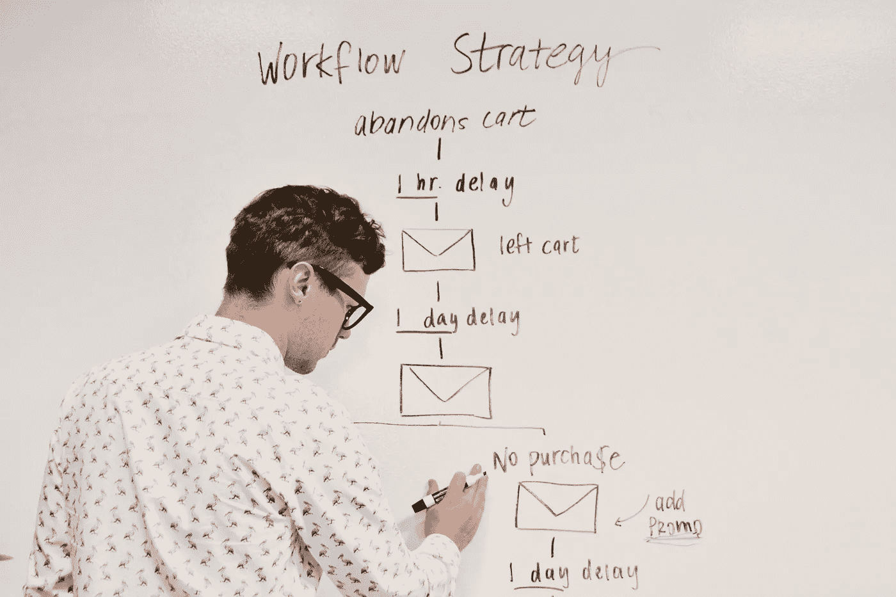

# 成为数据科学专家

> 原文：<https://towardsdatascience.com/become-a-data-science-expert-1b8dccd71526?source=collection_archive---------33----------------------->

## 了解你的领域，不断训练，展示你的技能。

[成为数据科学家](/data-science-books-you-should-read-in-2020-358f70e1d9b2)的方法是通过实施自己选择的明确指导方针，让自己成为领导者。这些指导方针的良好基础如下。

Plan, build a strategy, prioritize.

# 了解你的领域

专注于一个领域不仅能提高你的智力，还能让你在更广阔的数据科学领域有更广阔的视野。

你应该尝试从一个单一的领域到更广阔的领域来培养你的技能。从 Python 开始，进入 Django、R、Java，学习一些你舒适区之外的东西。这样，你也能更好地掌握日常使用的技巧。都是练出来的。

# 让你的模型基于数据

不要只是玩模型来适应机器学习社区使用的数字模型，你还应该建立在社区已经完成的基础上。

如果您正在寻找公式来为您领域的变量建模，如果您知道社区中所有可用的公式，任务将变得容易得多。

# 基于现有数据集构建

在这个领域，要么建立在现有的数据源上，要么建立自己的数据集。

建立在已经存在很长时间的数据上，而不是建立你自己的数据集，将为你的模型提供适当的反馈，这将有助于模型的公式化。

关注数据科学的核心优势就是围绕核心问题解决问题。数据科学为您提供了独特的机会，将您所学的知识应用到现实世界的用例问题中。通过利用现有的数据，你将能够验证你的新知识。

# 记录你的成功

记录你的成功也是必须的，因为你会经历艰难的失败并从中学习。

记录下你做过的事情和学到的东西。

这将有助于您在需要时复制您的工作。

此外，数据科学主要是关于我们所学方法的迭代开发。编码，再迭代，再编码。

你需要验证你所有的方法至少 3 次。

通过记录您的成功和失败，我们将能够回顾您的工作，并将其置于数据科学家社区的背景中。

# 在数据科学领域的成功可以建立你的可信度

要想在行业中可信，你至少需要像其他人一样做一些事情。

如果你发现数据科学市场竞争过于激烈，那么通过专注于卓越来提高你的标准，在高薪数据科学市场中一路向上。

这样你就可以从中获得成功，这也将激励其他数据科学家进行创新。

# 需要不断学习

数据科学是一个节奏非常快的行业，每一步都面临着许多不同的挑战。这使得你的生活很容易停滞或落后。

这是因为你必须不断学习才能跟上竞争。

保持较高的学习速度也是在下一个职位中保持竞争优势的必要条件。这会帮助你吸引更好的工作，提升你的品牌。

想在数据科学领域找份工作吗？[看看我的另一篇文字](/practical-guide-to-become-a-data-scientist-2483a5f83770)或者查一下这个[数据科学书籍和课程清单](http://www.datasciencerush.com)。

Data Science Job

最后，如果你想了解成为一名数据科学家意味着什么，那么看看我的书[数据科学工作:如何成为一名数据科学家](https://amzn.to/3aQVTjs)，它将指导你完成这个过程。