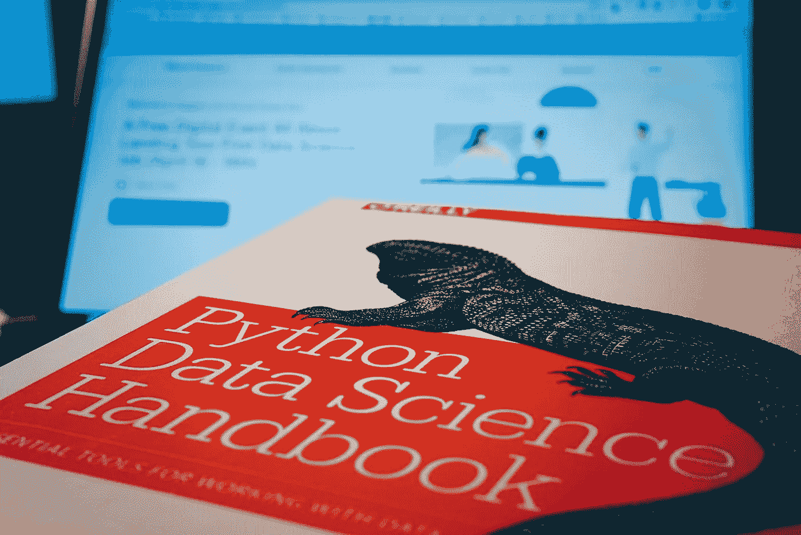
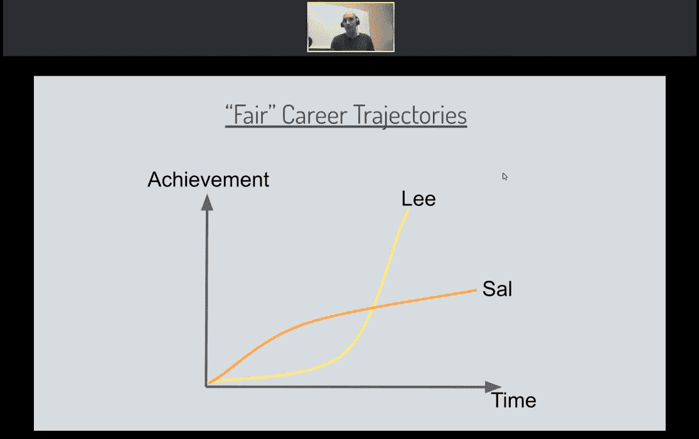
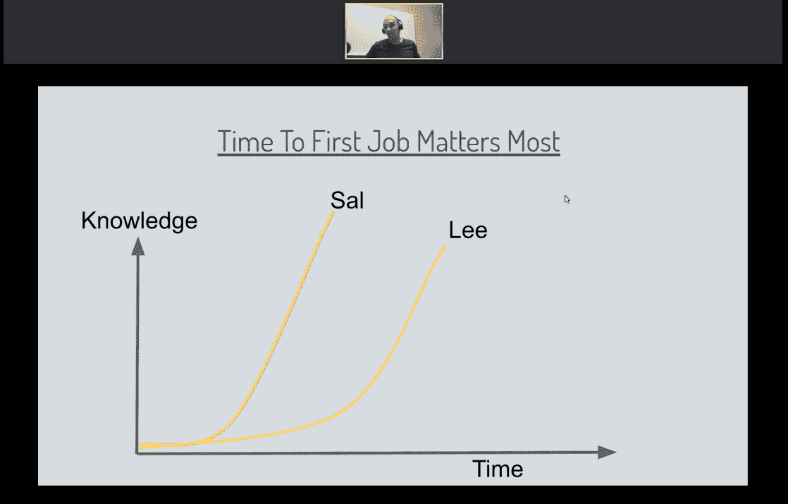

# 学习数据科学——当丹·贝克尔指出我完全错了的时候

> 原文：<https://towardsdatascience.com/becoming-a-data-scientist-when-dan-becker-pointed-out-i-had-it-all-wrong-86fb81397e8c?source=collection_archive---------4----------------------->

## Kaggle Learn 的负责人在网上研讨会上给了我一个惊喜

在你的职业生涯中，你是否有过这样的时刻，当你认为自己走在正确的道路上，当你遵循一个稳定的计划，带领你到达你想要的地方，然后有人踢你的计划的坚果，并通过 A + B 告诉你你完全错了？

这就是 [Dan Becker](https://www.kaggle.com/dansbecker) 博士、数据科学家和 Kaggle Learn 的负责人昨天在他为 [Kaggle CareerCon 2019](https://www.kaggle.com/careercon/2019) 举办的题为*的网络研讨会上对我说的，“为什么数据科学技能培养可能会阻碍你(以及你应该做些什么)。”*

# 从数字营销到数据科学

获得普通工程学位后，我带着项目管理和编程方面的技能小心翼翼地进入了就业市场。我不确定自己是否真的想花时间设计一些长达数年的甘特图，于是决定冒险进入数字营销领域。为什么选择数字营销？因为当我意识到 Google AdWords(我知道，Google Ads now)是由整天盯着宽大的统计表格看并从中获得报酬组成的时候，我就爱上了(奇怪，我知道。各得其所！).

但是经过五年的数字营销，我意识到这不适合我。这件事不会让我对去工作感到头晕目眩。这不是我可以对那些可能要求也可能没有要求的人喋喋不休的话题。

所以我决定休息一下，开始一个数据科学 MOOC，看看它是否像我想象的那么有趣。剧透一下，的确如此。因此，我决定再接再厉，在法国最古老的工程学院获得数据科学入门课程的认证。

> “我有一个计划……”

*“好的。酷毙了。现在你是数据科学家了，赖。你的故事的重点是什么？”不完全是，你这位持怀疑态度的读者。尽管我已经拿到了证书，但我还是决定继续我的职业生涯，在一家咨询机构做数据分析师。它介于我的数字营销过去和我的数据科学未来之间。有道理。这是一条稳定的道路。该认证让我对数据科学项目和 Python 编程有了稳定的基本了解，因此我可以像这样与我的销售工程师:*“Clara，我有一个 2 到 4 年的计划。我将继续在线学习 Python，同时通过成为一名数据分析师来获得数据项目方面的知识，当我对自己的 Python 技能足够自信时，我将成为一名数据科学家。”**

既然我已经说过了，我已经做了一点调整，将 2 到 4 年改为 1 到 2 年。但是，丹·贝克尔还是用世界上所有的仁慈粉碎了这个计划。

# 是时候改变策略了

> "在光谱上，有两个极端:短期的 Sal 和长期的 Lee . "

Dan 是这样解释的:进入数据科学有两种方法。

一方面，你有短期的 Sal，他们获得了找工作所需的知识，一头扎进去，然后在数据科学领域找到一份工作，边干边学。另一方面，你有一个长期的李，他不断学习，不断学习，最后得到了一份数据科学家的工作。没错，读者，就是我。而这也正是丹所说的应该是一条*【尚可】*的职业轨迹。

但让我们现实一点，萨尔更快地走上工作岗位，更快地获得实践经验(意味着李无法从教科书中获得的实用知识)，并为自己赢得了该领域的网络，这是孤独的李在他的学习隐士生活中所没有得到的。这就是实际发生的情况:

此时，我正盯着网上研讨会，很烦。*“哦，丹，你怎么敢这样粉碎我的梦想！”*但丹想到了我们，可怜的李氏兄弟看着所有参加 Youtube 直播的 sal 在评论区用虚拟手指指着我们笑。他有一个建议，对你们中的一些人来说可能很简单，但对我思考我的方法有很大的影响。

> "找到你的激情项目，为之努力，发表它，在推特上发布它."

*“好的，坚持住，丹。到目前为止，我只是设法复制了一份预先准备好的泰坦尼克号生存分析，修补了一些分类算法，并为我的认证做了一个非常成功的文本挖掘项目。你真的认为我会把我的任何工作放在那里让顶尖的数据科学家屠杀吗？”*在这一点上，我坚信 Dan 能读懂别人的心思，因为他随后解释说，是的，第一个项目可能不好，但没关系，把它们放在那里可能会吸引一些建设性的反馈，从而使下一个项目变得更好。李就是这样变成萨尔的。

> “很好，丹，很好。杰夫，是时候接受挑战了。”

*Jeff，感谢你校对这篇文章，并作为我的李的 Sal。*

# 追踪

对于这篇文章，我想将丹的回答添加到 LinkedIn 上的原始帖子中。再说一次，我非常钦佩洞察力。( *Fangirling 多，赖？*)

> Kaggle 比赛是一种很好的学习方式。尤其是因为您可以尝试一个问题，然后看看您的方法与其他人相比如何(因为许多人将他们的工作发布在容易访问的“内核笔记本”中)。但我不认为这是一条通向投资组合项目的捷径，能让你获得第一份工作(我认为这对大多数人来说是真正的转折点)。原因如下:竞赛有许多熟练的参与者。你需要取得非常好的成绩才能引起雇主的注意，而且(重复地说)大多数人都在平均水平或平均水平以下。相反，我建议找一个你感兴趣的话题，做一些数据探索。搜索相关数据，探索它，直到你能写一篇关于它的好博文(最好是在聚会上展示)。它可能是关于新闻，你的一个爱好，无论什么。让你的项目可视化(可能通过图表)，清晰地传达。见鬼，也许甚至头脑风暴一下你是否可以利用你的数字营销背景来帮助它获得更多的曝光率。但是我们的想法是做一些有创意的事情。这更有可能引起你的注意(我昨天提到的那个黄领巾把戏)，更多的读者(或 meetup 与会者)会觉得它很有趣。